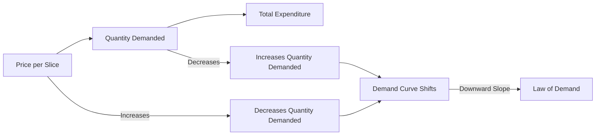

---

title: Demand_Schedule
type: Atomic Note
course: Economics
semester: Winter 2026
unit: '2'
hub: "[[2_Theory_Of_Demand_And_Supply_Hub]]"
source: "[[5-Pdf Store/note generated/Winter 2026/Economics/Chapter_2.pdf]]"
source_pages:
- 6
mode: ECON-MACRO
read: false
generated: true
prerequisites:
- "[[Theory_Of_Demand]]"

---

# 1. Mental Model

Imagine you're at a school cafeteria where they sell pizza slices. The cafeteria has a rule: the more slices you buy, the less you'll pay per slice. If the price per slice is $3, you might buy 2 slices, but if the price is $2, you might buy 4 slices. A demand schedule is like a list that shows how many pizza slices you'd buy at different prices. It maps out how the price affects how much you want to buy.

# 2. Economic Theory

The [[Demand_Schedule]] is a table that illustrates the relationship between the price of a good and the quantity demanded of that good. According to the [[Law_Of_Demand]], as the price of a good increases, the quantity demanded decreases, assuming [[Ceteris_Paribus]] (all other factors remain constant). This relationship is often represented graphically as a [[Demand_Curve]], which slopes downward. The [[Demand_Function]] represents this relationship mathematically, showing how the quantity demanded changes in response to changes in price and other [[Determinants_Of_Demand]], such as income and prices of [[Substitute_Goods]] and [[Complementary_Goods]]. 

# 3. Market Failures

The [[Demand_Schedule]] assumes that consumers make rational decisions based on their preferences and budget constraints. However, in reality, consumers may not always have perfect information about the market, leading to [[Market_Equilibrium]] that may not reflect true demand. Additionally, the [[Demand_Schedule]] does not account for external factors such as [[Change_In_Technology]] or changes in government policies, which can shift the [[Demand_Curve]]. Furthermore, the concept of [[Price_Elasticity_Of_Demand]] highlights that the responsiveness of quantity demanded to price changes can vary, leading to complexities in predicting market outcomes.

# 4. Economic Model



This Mermaid flowchart illustrates the relationship between the price per slice of pizza, the quantity demanded, and the total expenditure. The demand curve shifts based on changes in price, and the law of demand shows a downward slope.

## 5. Walkthrough

Here's a 5-step technical walkthrough of how a Demand Schedule operates in the **Natural Gas Market**:

1. **Price Discovery**: A regional utility company monitors the wholesale price of Natural Gas. Initially, the price is $5.00 per MMBtu.

2. **Quantity Mapping**: At $5.00/MMBtu, industrial consumers and power plants demand 500 million cubic feet (mmcf) per day.

3. **Price Fluctuation**: Due to a seasonal warming trend, the market price drops to $3.50/MMBtu.

4. **Observation of Response**: The utility records that at the lower price of $3.50, the quantity demanded increases to 750 mmcf per day, as power plants switch from coal to gas.

5. **Schedule Construction**: These data points are organized into a tabular **Demand Schedule**. This table is the empirical foundation used to plot the downward-sloping Demand Curve for the energy sector.

---

## 6. The Proving Grounds

```interactive-quiz
[
  {
    "id": "q1",
    "type": "mcq",
    "difficulty": "L1",
    "question": "A Demand Schedule provides the numerical data used to construct which graphical model?",
    "options": {
      "A": "The Supply Curve.",
      "B": "The Demand Curve.",
      "C": "The Production Possibilities Frontier.",
      "D": "The Income Elasticity Map."
    },
    "answer": "B",
    "explanation": "A demand schedule is a table showing the relationship between the price of a good and the quantity demanded. Plotting these points on a graph results in the demand curve."
  },
  {
    "id": "q2",
    "type": "true_false",
    "difficulty": "L2",
    "question": "In a standard Demand Schedule, as you move down the 'Price' column to lower values, the 'Quantity Demanded' values must always increase.",
    "answer": true,
    "explanation": "This follows the Law of Demand. An inverse relationship means lower prices correlate with higher quantities demanded, assuming Ceteris Paribus."
  },
  {
    "id": "q3",
    "type": "synthesis",
    "difficulty": "L3",
    "question": "Explain how an analyst would use a 'Market Demand Schedule' to identify a potential 'Shortage' if the current price is set below the equilibrium level.",
    "answer": "The analyst compares the Quantity Demanded in the schedule at that price to the Quantity Supplied. If the schedule shows a significantly higher demand at the low price than producers are willing to offer, the numerical gap identifies a shortage, which usually signals that prices will soon rise.",
    "explanation": "Synthesis requires using the schedule data as a diagnostic tool for market imbalances."
  },
  {
    "id": "q4",
    "type": "trace",
    "difficulty": "L2",
    "question": "Trace the process of converting a series of Individual Demand Schedules into a single 'Market Demand Schedule'.",
    "answer": "1) List specific price points. 2) Record the quantity demanded by each individual at each price. 3) Sum the individual quantities horizontally for each price level. 4) Create a new table with the original prices and the total summed quantities.",
    "explanation": "Tracing the aggregation process (horizontal summation) from micro-data to macro-market data."
  },
  {
    "id": "q5",
    "type": "order",
    "difficulty": "L2",
    "question": "Order the steps for creating a demand-side market analysis.",
    "steps": [
      "Define the specific good and market period",
      "Construct the Demand Schedule table",
      "Survey consumers for quantity responses at various prices",
      "Plot the Demand Curve from the schedule",
      "Validate the Law of Demand (inverse slope)"
    ],
    "answer": [
      "Define the specific good and market period",
      "Survey consumers for quantity responses at various prices",
      "Construct the Demand Schedule table",
      "Plot the Demand Curve from the schedule",
      "Validate the Law of Demand (inverse slope)"
    ],
    "explanation": "Data collection must precede table construction, which then enables graphical plotting and final verification."
  }
]
```