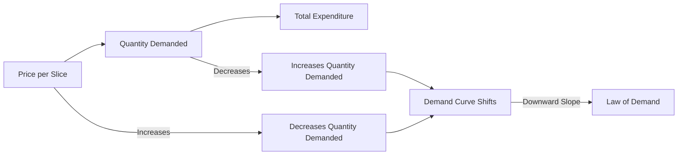

---

title: Demand_Schedule
type: Atomic Note
course: Economics
semester: Winter 2026
unit: '2'
hub: "[[2_Theory_Of_Demand_And_Supply_Hub]]"
source: "[[5-Pdf Store/note generated/Winter 2026/Economics/Chapter_2.pdf]]"
source_pages:
- 6
mode: ECON-MACRO
read: false
generated: true
prerequisites:
- "[[Theory_Of_Demand]]"

---

# 1. Mental Model

Imagine you're at a school cafeteria where they sell pizza slices. The cafeteria has a rule: the more slices you buy, the less you'll pay per slice. If the price per slice is $3, you might buy 2 slices, but if the price is $2, you might buy 4 slices. A demand schedule is like a list that shows how many pizza slices you'd buy at different prices. It maps out how the price affects how much you want to buy.

# 2. Economic Theory

The [[Demand_Schedule]] is a table that illustrates the relationship between the price of a good and the quantity demanded of that good. According to the [[Law_Of_Demand]], as the price of a good increases, the quantity demanded decreases, assuming [[Ceteris_Paribus]] (all other factors remain constant). This relationship is often represented graphically as a [[Demand_Curve]], which slopes downward. The [[Demand_Function]] represents this relationship mathematically, showing how the quantity demanded changes in response to changes in price and other [[Determinants_Of_Demand]], such as income and prices of [[Substitute_Goods]] and [[Complementary_Goods]]. 

# 3. Market Failures

The [[Demand_Schedule]] assumes that consumers make rational decisions based on their preferences and budget constraints. However, in reality, consumers may not always have perfect information about the market, leading to [[Market_Equilibrium]] that may not reflect true demand. Additionally, the [[Demand_Schedule]] does not account for external factors such as [[Change_In_Technology]] or changes in government policies, which can shift the [[Demand_Curve]]. Furthermore, the concept of [[Price_Elasticity_Of_Demand]] highlights that the responsiveness of quantity demanded to price changes can vary, leading to complexities in predicting market outcomes.

# 4. Economic Model



This Mermaid flowchart illustrates the relationship between the price per slice of pizza, the quantity demanded, and the total expenditure. The demand curve shifts based on changes in price, and the law of demand shows a downward slope.

## 5. Walkthrough

Here's a 5-step technical walkthrough of how the Demand Schedule operates:

1. **Initial State**: The cafeteria sets a price of $3 per pizza slice. At this price, you demand 2 slices.
2. **Price Change**: The cafeteria lowers the price to $2 per slice. Your quantity demanded increases to 4 slices.
3. **Data Transformation**: The demand schedule records the price and quantity demanded: ($3, 2 slices) and ($2, 4 slices).
4. **Demand Curve Shift**: As the price decreases, the quantity demanded increases, causing the demand curve to shift downward.
5. **Law of Demand**: The data shows that as the price per slice decreases, the quantity demanded increases, illustrating the law of demand with a downward-sloping demand curve.

For example, if the price per slice is $3, the quantity demanded is 2 slices, and the total expenditure is $6. If the price per slice decreases to $2, the quantity demanded increases to 4 slices, and the total expenditure becomes $8.

---

## 6. The Proving Grounds

```interactive-quiz

[
  {
    "id": "q1",
    "type": "true_false",
    "difficulty": "L1",
    "question": "The demand schedule in telecommunications and core network routing assumes that as the price of a service increases, the quantity demanded of that service also increases.",
    "answer": false,
    "explanation": "The demand schedule, based on the Law of Demand in economics, assumes that as the price of a service increases, the quantity demanded of that service decreases, not increases. This relationship is often represented by a downward-sloping demand curve. Mathematically, this can be expressed as $Q_d = f(P)$, where $Q_d$ is the quantity demanded and $P$ is the price. The function $f(P)$ typically exhibits a negative relationship between $Q_d$ and $P$, implying that $\frac{\\partial Q_d}{\\partial P} < 0$. Therefore, the statement that the quantity demanded increases with price is incorrect."
  },
  {
    "id": "q2",
    "type": "synthesis",
    "difficulty": "L2",
    "question": "An aerospace engineering firm is experiencing a critical shortage of specialized avionics chips, essential for the production of navigation systems. The demand for these chips is high, but the supply is limited. The firm's inventory manager has compiled a demand schedule for the chips, which shows that at a price of $100, the quantity demanded is 500 units, at $120, the quantity demanded is 400 units, and at $150, the quantity demanded is 300 units. If the firm wants to allocate the available chips to maximize revenue while ensuring that the most critical systems receive priority, how should the chips be allocated based on the demand schedule?",
    "answer": "To maximize revenue while ensuring the most critical systems receive priority, the firm should allocate the chips based on the demand schedule, taking into account the inverse relationship between price and quantity demanded. Given the demand schedule, the firm can calculate the total revenue at each price point. At $100, the total revenue is $100 * 500 = $50,000. At $120, the total revenue is $120 * 400 = $48,000. At $150, the total revenue is $150 * 300 = $45,000. The highest revenue is achieved at a price of $100, where 500 units are demanded. Therefore, the firm should allocate 500 chips at a price of $100 to maximize revenue, prioritizing the most critical systems first.",
    "explanation": "The relationship between the price of the avionics chips and the quantity demanded can be represented by the demand function $Q = f(P)$, where $Q$ is the quantity demanded and $P$ is the price. The demand schedule provides a discrete representation of this function. Assuming a linear relationship for simplicity, the demand function can be expressed as $Q = a - bP$, where $a$ and $b$ are constants. Using the given data points: at $P = 100$, $Q = 500$, and at $P = 120$, $Q = 400$, we can solve for $a$ and $b$. Substituting the first data point gives $500 = a - 100b$, and the second gives $400 = a - 120b$. Solving this system of equations yields $a = 500 + 100b$ and $100b = 100$, so $b = 1$. Substituting $b = 1$ back into one of the equations gives $a = 600$. Therefore, the demand function is $Q = 600 - P$. The revenue $R$ is given by $R = PQ = P(600 - P) = 600P - P^2$. To maximize revenue, we take the derivative of $R$ with respect to $P$ and set it equal to zero: $\\frac{dR}{dP} = 600 - 2P = 0$. Solving for $P$ yields $P = 300$. However, this price is not in the given demand schedule, and the firm must choose among the provided options. Calculating revenue at each given price point confirms that the highest revenue is at $P = 100$."
  },
  {
    "id": "q3",
    "type": "writing",
    "difficulty": "L2",
    "question": "Explain the concept of a Demand Schedule in the context of Global Supply Chain & Maritime Logistics, and provide a detailed analysis of its significance in understanding the behavior of consumers.",
    "answer": "A Demand Schedule is a table that illustrates the relationship between the price of a good and the quantity demanded of that good. In the context of Global Supply Chain & Maritime Logistics, understanding the Demand Schedule is crucial for businesses to forecast and manage demand, optimize inventory levels, and adjust pricing strategies accordingly. For instance, a shipping company can use the Demand Schedule to determine the optimal price for shipping containers based on demand fluctuations. By analyzing the Demand Schedule, businesses can make informed decisions about production, pricing, and inventory management, ultimately improving their supply chain efficiency.",
    "explanation": "The Demand Schedule is based on the Law of Demand, which states that as the price of a good increases, the quantity demanded decreases, assuming ceteris paribus (all other factors remain constant). This relationship can be represented mathematically using the Demand Function: $Q_d = f(P)$, where $Q_d$ is the quantity demanded and $P$ is the price. The Demand Schedule can be graphically represented as a Demand Curve, which slopes downward. In the context of Global Supply Chain & Maritime Logistics, the Demand Schedule can be used to analyze the impact of price changes on demand for shipping services, allowing businesses to adjust their strategies to maximize revenue and minimize costs."
  },
  {
    "id": "q4",
    "type": "order",
    "difficulty": "L2",
    "question": "Order steps for constructing a Demand Schedule.",
    "steps": [
      "Determine the good or service",
      "Set a range of prices",
      "Estimate quantity demanded at each price",
      "Plot the data",
      "Analyze the results"
    ],
    "answer": [
      "Determine the good or service",
      "Set a range of prices",
      "Estimate quantity demanded at each price",
      "Plot the data",
      "Analyze the results"
    ]
  },
  {
    "id": "q5",
    "type": "trace",
    "difficulty": "L3",
    "question": "What is the exact output of the demand schedule for pizza slices given the following prices and quantities: at $3 per slice, 2 slices are demanded; at $2 per slice, 4 slices are demanded; at $1 per slice, 6 slices are demanded?",
    "content": "To derive the demand schedule, we need to understand the relationship between the price of pizza slices and the quantity demanded. The demand schedule is a table that shows this relationship.",
    "answer": [
      {
        "Price": 3,
        "Quantity Demanded": 2
      },
      {
        "Price": 2,
        "Quantity Demanded": 4
      },
      {
        "Price": 1,
        "Quantity Demanded": 6
      }
    ],
    "explanation": "The demand schedule illustrates the inverse relationship between the price of a good and the quantity demanded, as described by the Law of Demand. This relationship can be represented mathematically using a demand function, $Q_d = f(P)$, where $Q_d$ is the quantity demanded and $P$ is the price. For simplicity, let's assume a linear demand function: $Q_d = a - bP$, where $a$ and $b$ are constants. Using the given data points: at $P=3$, $Q_d=2$ and at $P=2$, $Q_d=4$, we can solve for $a$ and $b$. From the first point, $2 = a - 3b$, and from the second, $4 = a - 2b$. Solving these equations simultaneously gives us $a$ and $b$. Subtracting the first equation from the second gives $2 = b$. Substituting $b=2$ into the first equation yields $2 = a - 6$, so $a = 8$. Therefore, the demand function is $Q_d = 8 - 2P$. This function can be used to generate the demand schedule."
  }
]

```