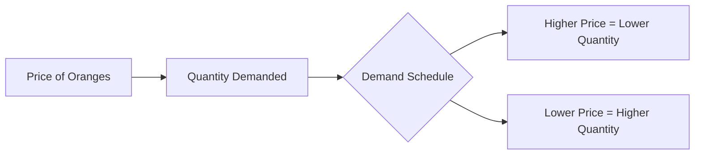

---

title: Demand_Schedule
type: Atomic Note
course: Economics
semester: Winter 2026
unit: '2'
hub: "[[2_Basics_Of_Economics_Hub]]"
source: "[[Chapter_2.pdf]]"
source_pages:
- 6
mode: ECON-MACRO
read: false
generated: true
prerequisites:
- "[[Theory_Of_Demand]]"

---

# 1. Mental Model

Imagine you really love oranges and you buy them every week. A demand schedule is like a table that shows how many oranges you're willing to buy at different prices. For example, if oranges are cheap, you might buy 5, but if they're expensive, you might only buy 1.

# 2. Economic Theory

A [[Demand_Schedule]] is a table that shows the quantity of a good or service that consumers are willing and able to buy at different price levels, ceteris [[Ceteris_Paribus]]. It is a key concept in the [[Theory_Of_Demand]] and is often used to derive the [[Demand_Curve]], which graphically represents the relationship between price and quantity demanded. The demand schedule is typically based on the [[Law_Of_Demand]], which states that as price increases, quantity demanded decreases.

## 3. Economic Model



## 4. Walkthrough

* The demand schedule starts with different price levels of oranges, for example, $1, $2, and $3 per orange.
* For each price level, the quantity of oranges that a consumer is willing to buy is determined, for instance, 5 oranges at $1, 3 oranges at $2, and 1 orange at $3.
* The schedule shows that as the price of oranges increases, the quantity demanded decreases, and vice versa.
* By plotting these points on a graph, a demand curve can be derived, which typically slopes downward from left to right.

## 5. Market Failures

The demand schedule concept may fail in cases where consumer preferences suddenly change, or external factors like income or seasonality affect demand. Additionally, the assumption of ceteris paribus (all else being equal) may not hold in real-world scenarios, leading to deviations from the expected demand schedule.

---

## 6. The Proving Grounds

```interactive-quiz

[
  {
    "id": "q1",
    "type": "true_false",
    "difficulty": "L1",
    "question": "A demand schedule shows the quantity of a good or service that consumers are willing and able to buy at a single price level.",
    "answer": false,
    "explanation": "A demand schedule actually shows the quantity of a good or service that consumers are willing and able to buy at different price levels, not at a single price level. This is because it is a table that lists various price points and the corresponding quantities demanded at each price point, assuming all other factors remain constant (ceteris paribus)."
  },
  {
    "id": "q2",
    "type": "synthesis",
    "difficulty": "L2",
    "question": "Maria, an orange enthusiast, has a demand schedule for oranges as follows: at $1/orange, she buys 5 oranges; at $2/orange, she buys 3 oranges; and at $3/orange, she buys 1 orange. If the price of oranges increases from $2 to $3, and Maria's income increases by 20%, how will her demand for oranges change, assuming ceteris paribus?",
    "answer": "Grading Rubric: \n- Define demand schedule and ceteris paribus (2 points)\n- Calculate original and new demand for oranges at $2 and $3 (2 points)\n- Analyze the effect of the price increase on demand (2 points)\n- Analyze the effect of the income increase on demand (2 points)\n- Synthesize the information to conclude the overall change in demand (2 points)\n",
    "explanation": "The demand schedule shows the quantity of oranges Maria is willing to buy at different prices. Initially, at $2/orange, she buys 3 oranges. When the price increases to $3/orange, she buys 1 orange. With a 20% increase in income, her purchasing power increases. Assuming oranges are a normal good, the increase in income will increase her demand for oranges. However, the price increase from $2 to $3 will decrease her demand. The overall effect is a decrease in demand from 3 oranges to 1 orange at the new price, but the increased income mitigates this effect slightly by increasing her willingness to buy more at the higher price than she would have without the income increase."
  },
  {
    "id": "q3",
    "type": "writing",
    "difficulty": "L3",
    "question": "Explain the concept of a demand schedule and its underlying mechanism in the context of economic theory.",
    "answer": "A demand schedule is a table that shows the quantity of a good or service that consumers are willing and able to buy at different price levels, ceteris paribus.",
    "explanation": "The demand schedule is based on the theory that as the price of a good or service increases, the quantity demanded decreases, and vice versa, assuming all other factors remain constant. This relationship is rooted in the concept of diminishing marginal utility, where consumers are less willing to buy additional units of a good as its price increases. The demand schedule is a crucial tool in economics, as it helps derive the demand curve, which graphically represents the relationship between price and quantity demanded. By analyzing the demand schedule, economists can understand how changes in price affect consumer behavior and make informed decisions about production and pricing."
  }
]

```