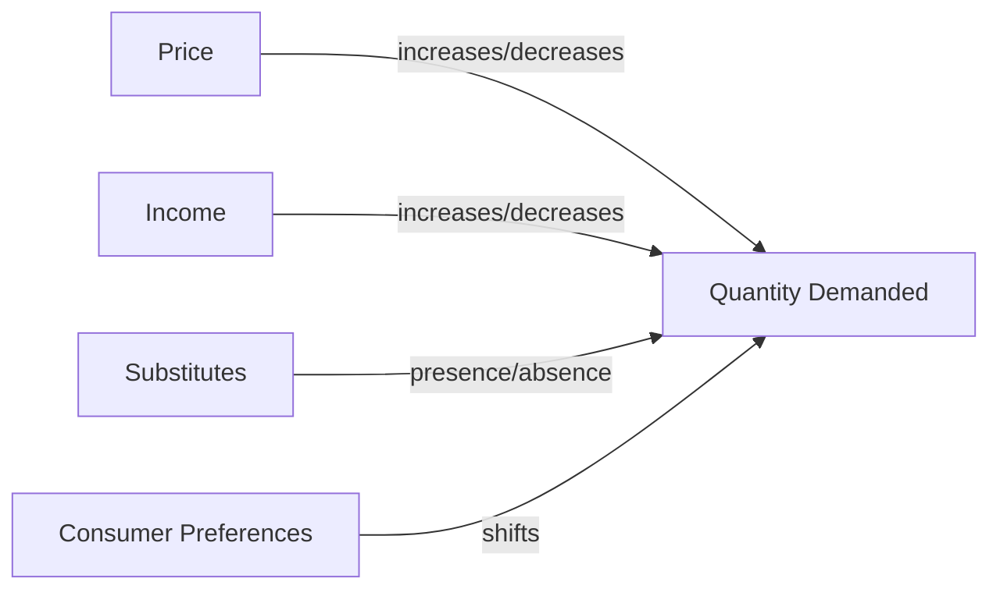

---

title: Determinants_Of_Demand
type: Atomic Note
course: Economics
semester: Winter 2026
unit: '2'
hub: "[[2_Basics_Of_Economics_Hub]]"
source: "[[Chapter_2.pdf]]"
source_pages:
- 13
mode: ECON-MACRO
read: false
generated: true
prerequisites:
- "[[Demand_Function]]"

---

# 1. Mental Model

Imagine you're at a school bake sale, and you're selling chocolate chip cookies. The number of cookies you're willing to sell depends on things like the price you're charging, how much money you have to spend, and whether someone else is selling a similar cookie nearby. If the price is too high, people might not buy as many; if you have more money to spend, you might want to buy more cookies; and if someone else is selling a similar cookie, you might sell fewer.

# 2. Economic Theory

The [[Determinants_Of_Demand]] refer to the factors that influence the quantity of a good or service that consumers are willing and able to buy at a given price level, assuming [[Ceteris_Paribus]] (all else being equal). These determinants include the price of the good itself, consumers' income, the prices of related goods, the number of consumers, and their tastes and preferences. Changes in these determinants can lead to a [[Change_In_Demand]], shifting the [[Demand_Curve]] and affecting [[Market_Equilibrium]].

## 3. Economic Model



## 4. Walkthrough

* The price of the chocolate chip cookies affects the quantity demanded: if the price increases, people may buy fewer cookies, and if it decreases, they may buy more.
* The income of the potential buyers also impacts the quantity demanded: if people have more money to spend, they may buy more cookies, and if they have less, they may buy fewer.
* The presence of substitutes, such as another seller offering similar cookies, can decrease the quantity demanded of your cookies.
* Consumer preferences, such as a change in taste or trend, can also shift the quantity demanded.

## 5. Market Failures

This concept can fail when there are external factors that affect demand, such as a sudden change in consumer preferences or an unexpected increase in income. Additionally, the assumption of a linear relationship between price and quantity demanded may not always hold, and other factors like advertising or seasonality may also influence demand. Edge cases to watch out for include ignoring the impact of substitutes or assuming that consumer preferences remain constant.

---

## 6. The Proving Grounds

```interactive-quiz

[
  {
    "id": "q1",
    "type": "true_false",
    "difficulty": "L1",
    "question": "The presence of a similar product being sold nearby is a determinant of demand that affects the quantity of a good consumers are willing to buy by changing their perception of the product's price.",
    "answer": false,
    "explanation": "The presence of a similar product being sold nearby actually affects the demand by making the product more or less attractive relative to the substitute, not by changing consumers' perception of the product's price. This is a determinant of demand related to the availability of substitutes. The price of the product and consumers' income are more direct determinants that influence the quantity demanded through the consumers' willingness and ability to pay. Therefore, the statement inaccurately describes how the presence of a similar product influences demand."
  },
  {
    "id": "q2",
    "type": "synthesis",
    "difficulty": "L2",
    "question": "A school bake sale is selling chocolate chip cookies at $2 each. The organizers have $100 to spend on cookies, and a rival bake sale selling similar cookies just opened across the hall. If the organizers want to sell 50 cookies, but the rival bake sale is selling their cookies for $1.50, how will the demand for the school bake sale's cookies be affected, and what price adjustment could they make to sell their target 50 cookies?",
    "answer": "The school bake sale's demand will decrease due to the rival's lower price. To sell 50 cookies, they could lower their price to $1.75, making their cookies more competitive.",
    "explanation": "The demand for the school bake sale's cookies is influenced by several determinants of demand. The price of $2 is a key factor; if it's perceived as too high, especially with a comparable option available for $1.50 across the hall, the quantity demanded will decrease. The $100 budget to spend is more related to the supply side or the organizers' purchasing decision rather than the demand for the cookies from buyers. The presence of a rival bake sale selling a similar product at a lower price directly affects the demand for the school bake sale's cookies. Given these conditions, if the school bake sale wants to sell 50 cookies, they must make their product more attractive. A price adjustment to $1.75 could balance the demand to meet their target of selling 50 cookies, as it makes their product more competitive compared to the rival's $1.50 price while still trying to maximize revenue."
  },
  {
    "id": "q3",
    "type": "writing",
    "difficulty": "L3",
    "question": "Explain the impact of a change in consumer income on the demand for a normal good.",
    "answer": "An increase in consumer income will lead to an increase in the demand for a normal good, as consumers have more disposable income to spend on goods and services. Conversely, a decrease in consumer income will lead to a decrease in demand. This is because normal goods are goods and services for which demand increases when income increases, and decreases when income decreases.",
    "explanation": "The underlying mechanism is that when consumer income increases, their purchasing power also increases, allowing them to buy more goods and services. For normal goods, this increased income leads to an increase in demand, as consumers are willing and able to buy more. The change in income affects the demand curve for the good, causing it to shift to the right with an increase in income and to the left with a decrease in income."
  }
]

```