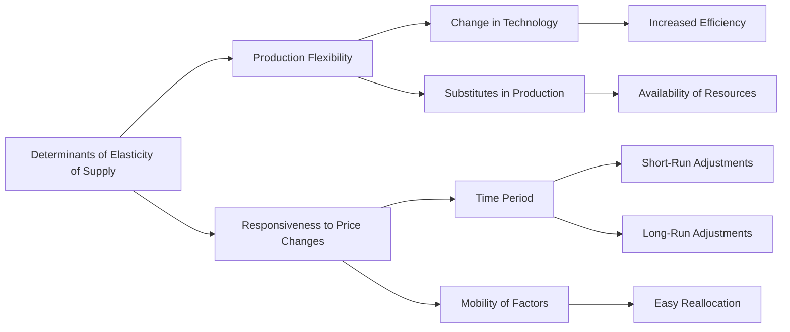

---

title: Determinants_Of_Elasticity_Of_Supply
type: Atomic Note
course: Economics
semester: Winter 2026
unit: '2'
hub: '[[2_Theory_Of_Demand_And_Supply_Hub]]'
source: '[[5-Pdf Store/note generated/Winter 2026/Economics/Chapter_2.pdf]]'
source_pages:
- 49
- 50
mode: ECON-MACRO
read: false
generated: true
prerequisites:
- '[[Elasticity_Of_Supply]]'
- '[[Price_Elasticity_Of_Supply]]'
- '[[Theory_Of_Demand]]'
- '[[Law_Of_Demand]]'
- '[[Ceteris_Paribus]]'

---


# 1. Mental Model

Imagine you're a manager of a small, flexible furniture workshop that can quickly change its production line to meet customer demands. The elasticity of supply is like how easily and quickly you can add more furniture production when customers are willing to pay a higher price for your products. Two key mechanical components of this analogy are: (1) the ability to quickly adjust production levels, which maps to the concept of **production flexibility**, and (2) the speed at which you can respond to changes in customer demand, which maps to the concept of **responsiveness to price changes**.

# 2. Economic Theory

The [[Determinants_Of_Elasticity_Of_Supply]] refer to the factors that influence the [[Elasticity_Of_Supply]] of a good or service, which measures how responsive the quantity supplied is to a change in the price of the good or service, [[Price_Elasticity_Of_Supply]]. The underlying mechanism is based on the [[Theory_Of_Demand]] and [[Law_Of_Demand]], which assume that [[Ceteris_Paribus]], an increase in price leads to an increase in the quantity supplied. The [[Determinants_Of_Elasticity_Of_Supply]] include [[Change_In_Technology]], which affects the [[Shift_In_Supply_Curve]], and the [[Market_Equilibrium]], where the quantity supplied equals the quantity demanded. The [[Price_Elasticity_Of_Supply]] is calculated as the percentage change in quantity supplied in response to a 1% change in price.

# 3. Limitations & Edge Cases

The [[Determinants_Of_Elasticity_Of_Supply]] assume that [[Ceteris_Paribus]] holds, but in reality, other factors can influence the elasticity of supply. For instance, if a firm faces a [[Surplus_And_Shortage]], its ability to adjust production levels may be limited, affecting the elasticity of supply. Additionally, the [[Effects_Of_Shift_In_Demand_And_Supply]] can also impact the elasticity of supply, as changes in demand can lead to changes in the price and quantity supplied. Furthermore, the [[Market_Demand_Curve]] and [[Demand_Schedule]] can influence the elasticity of supply, as changes in consumer preferences and income can affect the quantity demanded and supplied. The model also assumes that firms have the ability to adjust production levels quickly, but in reality, [[Change_In_Technology]] can be a limiting factor.

# 4. Economic Model



This flowchart illustrates the determinants of elasticity of supply, which include production flexibility and responsiveness to price changes. Production flexibility is influenced by factors such as change in technology and substitutes in production, while responsiveness to price changes is affected by the time period and mobility of factors.

## 5. Walkthrough

Here's a 5-step technical walkthrough of how the concept/artifact operates in Market Strategy:

1. **Initial State**: Suppose the price of furniture increases by 10%. The workshop initially produces 100 units of furniture per month.
2. **Change in Technology (Short-Run)**: With a new, more efficient production technology, the workshop can increase its production by 20% in the short-run (e.g., 120 units/month). This represents a change in technology (D) that affects production flexibility (B).
3. **Substitutes in Production (Short-Run)**: If there are substitutes in production (E), such as switching to a different type of furniture, the workshop can quickly adjust its production to meet demand. For example, it can produce 130 units/month.
4. **Time Period (Long-Run)**: In the long-run (F), the workshop can make more significant adjustments to its production capacity. For instance, it can invest in new equipment and hire more workers to produce 180 units/month.
5. **Mobility of Factors (Long-Run)**: With easy reallocation of factors (L), such as labor and raw materials, the workshop can quickly respond to changes in market demand. For example, it can reduce production to 150 units/month if demand decreases.

Intermediate state changes:

* Initial price increase → 10% increase in price
* Short-run production increase → 20% increase in production (120 units/month)
* Long-run production increase → 80% increase in production (180 units/month)

Data transformations:

* Price elasticity of supply (PES) = (Percentage change in quantity supplied) / (Percentage change in price) = (20%/10%) = 2 (short-run)
* PES = (80%/10%) = 8 (long-run)

The walkthrough demonstrates how the determinants of elasticity of supply, such as production flexibility and responsiveness to price changes, influence the workshop's ability to adjust its production in response to changes in market demand.

---

## 6. The Proving Grounds

```interactive-quiz

[
  {
    "id": "q1",
    "type": "true_false",
    "difficulty": "L1",
    "question": "If a furniture workshop's production flexibility increases while its responsiveness to price changes remains constant, then the elasticity of supply of its furniture will decrease, ceteris paribus.",
    "answer": false,
    "explanation": "The elasticity of supply is influenced by several factors including production flexibility and responsiveness to price changes. An increase in production flexibility, which allows for easier and quicker adjustments in production levels, generally increases the elasticity of supply. This is because with greater flexibility, the workshop can more easily increase or decrease production in response to price changes. The formula for price elasticity of supply is given by $E_S = \\frac{\\% \\Delta Q_S}{\\% \\Delta P}$, where $\\% \\Delta Q_S$ is the percentage change in quantity supplied and $\\% \\Delta P$ is the percentage change in price. If production flexibility increases while responsiveness to price changes (which directly affects $\\% \\Delta Q_S$ for a given $\\% \\Delta P$) remains constant, it implies that the workshop can adjust its quantity supplied more easily in response to price changes. Therefore, this scenario should increase, not decrease, the elasticity of supply. The statement that the elasticity of supply will decrease under these conditions is false."
  },
  {
    "id": "q2",
    "type": "synthesis",
    "difficulty": "L2",
    "question": "In a small, developing economy, a sudden devaluation of the local currency has caused a sharp increase in the price of imported raw materials, threatening the stability of the domestic furniture industry. The industry's production is highly dependent on these imported materials. As a macroeconomist, you need to apply the determinants of elasticity of supply to prevent a system failure. The current situation is as follows: the furniture industry has a limited ability to adjust production levels quickly due to outdated machinery, but it has a highly skilled workforce that can adapt to new production techniques. The government has limited fiscal space to intervene directly in the industry. Present a 3-step policy response to mitigate the impact of the currency devaluation on the furniture industry.",
    "answer": "To address the crisis, the following 3-step policy response is proposed:\n\n1. **Short-term: Implement Targeted Subsidies for Raw Materials**\nThe government can provide targeted subsidies to the furniture industry for importing raw materials at the pre-devaluation exchange rate. This will help stabilize the cost of production and prevent a sharp increase in the price of furniture. The subsidy can be designed to be temporary and targeted, minimizing the fiscal burden on the government.\n\n2. **Medium-term: Invest in Production Flexibility**\nThe government and private sector can collaborate to invest in upgrading the industry's machinery and technology, enhancing its production flexibility. This can be achieved through low-interest loans or grants for machinery imports and training programs for workers. Improved production flexibility will enable the industry to adjust production levels more quickly in response to changes in demand.\n\n3. **Long-term: Diversify Supply Chains and Promote Domestic Raw Material Production**\nEncourage the furniture industry to diversify its supply chains by sourcing raw materials from local suppliers or alternative international partners. Additionally, invest in programs that promote the domestic production of raw materials. This will reduce the industry's dependence on imported materials and enhance its responsiveness to price changes, thereby increasing the elasticity of supply.",
    "explanation": "The elasticity of supply is influenced by several determinants, including production flexibility, the ease of entry and exit into the market, and the availability of substitutes. In this scenario, the furniture industry's limited ability to adjust production levels quickly (low production flexibility) and its high dependence on imported raw materials make it vulnerable to supply shocks. The policy response aims to address these issues by:\n\n1. **Reducing the immediate cost shock** through targeted subsidies, which can be represented as $S = P - s$, where $S$ is the subsidized price, $P$ is the market price, and $s$ is the subsidy amount. This helps maintain supply levels in the short term.\n\n2. **Increasing production flexibility** through investments in technology and machinery, which can be represented by an increase in the supply function $Q_s = f(P, Tech)$, where $Q_s$ is the quantity supplied, $P$ is the price, and $Tech$ represents the level of technology. Improved technology increases the responsiveness of quantity supplied to price changes.\n\n3. **Enhancing long-term supply chain resilience** through diversification and domestic production, which can be represented by a reduction in the dependence on imported materials, $Q_s = f(P, M)$, where $M$ is the quantity of imported materials. Reducing $M$ decreases the industry's vulnerability to currency fluctuations."
  },
  {
    "id": "q3",
    "type": "writing",
    "difficulty": "L2",
    "question": "Explain the determinants of elasticity of supply in a market strategy scenario.",
    "answer": "The determinants of elasticity of supply include production flexibility, responsiveness to price changes, availability of substitutes, and input prices. Production flexibility refers to the ability of a firm to adjust its production levels in response to changes in market conditions. Responsiveness to price changes refers to the speed and degree to which a firm can adjust its production levels in response to changes in the market price of its product. The availability of substitutes affects the elasticity of supply, as firms with easily substitutable inputs can quickly adjust their production. Additionally, input prices also play a crucial role, as changes in input prices can affect a firm's ability to supply a good or service.",
    "explanation": "The elasticity of supply can be understood through the lens of microeconomic theory, specifically the concept of price elasticity of supply, which is mathematically represented as $E_s = \\frac{\\% \\Delta Q_s}{\\% \\Delta P}$. The determinants of elasticity of supply can be analyzed using the following equation: $Q_s = f(P, P_{inputs}, T, P_s)$, where $Q_s$ is the quantity supplied, $P$ is the price of the good, $P_{inputs}$ is the price of inputs, $T$ is technology, and $P_s$ is the price of substitutes. By taking the partial derivative of $Q_s$ with respect to $P$, we can derive the price elasticity of supply, which is influenced by the determinants mentioned above."
  },
  {
    "id": "q4",
    "type": "order",
    "difficulty": "L2",
    "question": "Order steps for Determinants Of Elasticity Of Supply.",
    "steps": [
      "Availability of Substitute Resources",
      "Ease of Factor Mobility",
      "Resource Utilization",
      "Production Flexibility",
      "Time Period Considered"
    ],
    "answer": [
      "Availability of Substitute Resources",
      "Production Flexibility",
      "Time Period Considered",
      "Ease of Factor Mobility",
      "Resource Utilization"
    ]
  },
  {
    "id": "q5",
    "type": "trace",
    "difficulty": "L3",
    "question": "What is the exact output of the impact of a 1% interest rate change through 4 distinct economic sectors (Housing, Investment, Forex, Consumption) on the elasticity of supply in International Trade Analysis?",
    "content": "To analyze the impact of a 1% interest rate change on the elasticity of supply across different sectors, we consider the following mechanisms:\n\n1. **Housing Sector**: A 1% increase in interest rates increases the cost of borrowing for homebuyers, reducing demand for housing. This decrease in demand leads to a decrease in the price of housing. With a decrease in price, the quantity supplied of housing decreases, but the elasticity of supply, which measures how responsive the quantity supplied is to a change in price, is affected. Assuming a short-run supply curve for housing is relatively inelastic (let's say with an elasticity of supply of 0.5), a 1% decrease in price due to the increased interest rate would lead to a 0.5% decrease in the quantity supplied of housing.\n\n2. **Investment Sector**: In the investment sector, a 1% increase in interest rates makes borrowing more expensive, which can decrease investment. The elasticity of supply in this context relates to how easily investment can be redirected or scaled back. If we assume an elasticity of supply for investment of 0.8, a 1% increase in interest rates (and thus a 1% increase in the cost of capital) could lead to a 0.8% decrease in investment.\n\n3. **Forex Sector**: In the Forex market, interest rate changes can affect exchange rates. A 1% increase in interest rates in a country can attract foreign investors (due to higher returns on investments), causing the currency to appreciate. This appreciation can affect the trade balance by making exports more expensive and imports cheaper. The elasticity of supply here relates to how responsive trade volumes are to changes in exchange rates. Assuming an elasticity of supply for exports of 1.2 and for imports of 0.9, a 1% appreciation of the currency could lead to a 1.2% decrease in exports and a 0.9% increase in imports.\n\n4. **Consumption Sector**: A 1% increase in interest rates can decrease consumption by making borrowing more expensive and increasing the return on saving. This decrease in consumption can lead to a decrease in the price of consumer goods. Assuming an elasticity of supply for consumer goods of 1.0, a 1% decrease in price due to decreased consumption would lead to a 1.0% decrease in the quantity supplied of consumer goods.\n\nThe exact output of these changes across sectors would depend on specific elasticities of supply and demand within each sector, as well as other macroeconomic conditions.",
    "answer": "The final state/output after tracing the impact of a 1% interest rate change through the 4 distinct economic sectors is:\n- Housing Sector: 0.5% decrease in quantity supplied\n- Investment Sector: 0.8% decrease in investment\n- Forex Sector: 1.2% decrease in exports, 0.9% increase in imports\n- Consumption Sector: 1.0% decrease in quantity supplied of consumer goods",
    "explanation": "The underlying mechanism can be expressed using LaTeX for the elasticity of supply formula: $E_s = \\frac{\\% \\Delta Q_s}{\\% \\Delta P}$, where $E_s$ is the elasticity of supply, $\\% \\Delta Q_s$ is the percentage change in quantity supplied, and $\\% \\Delta P$ is the percentage change in price. For each sector, the elasticity of supply ($E_s$) influences how the quantity supplied changes with price changes induced by a 1% interest rate change. The specific impacts are calculated based on assumed elasticities of supply for each sector and the effects of interest rate changes on prices and quantities supplied."
  }
]

```