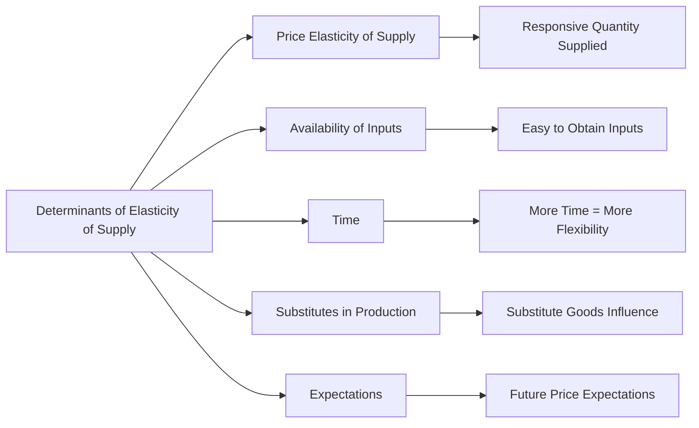

---

title: Determinants_Of_Elasticity_Of_Supply
type: Atomic Note
course: Economics
semester: Winter 2026
unit: '2'
hub: '[[2_Theory_Of_Demand_And_Supply_Hub]]'
source: '[[5-Pdf Store/note generated/Winter 2026/Economics/Chapter_2.pdf]]'
source_pages:
- 48
- 49
- 50
mode: ECON-MACRO
read: false
generated: true
prerequisites:
- '[[Elasticity_Of_Supply]]'
- '[[Ceteris_Paribus]]'
- '[[Price_Elasticity_Of_Supply]]'
- '[[Theory_Of_Demand]]'
- '[[Market_Demand_Curve]]'

---


# 1. Mental Model

Imagine you own a lemonade stand. The elasticity of supply is like how easily you can change the amount of lemonade you sell when the price changes. If you have a simple recipe and can quickly make more lemonade, you're like a flexible supplier. But if you have a complicated recipe or can't get more cups easily, you're less flexible. The 'Determinants Of Elasticity Of Supply' are factors that affect how flexible you can be, like how easily you can get more lemons (availability of inputs) or if you can store lemonade for later (time).

# 2. Economic Theory

The [[Determinants_Of_Elasticity_Of_Supply]] refer to the various factors that influence the [[Elasticity_Of_Supply]] of a good or service. These determinants affect how responsive the quantity supplied is to changes in the price of the good or service, essentially measuring the flexibility of producers in adjusting their output in response to price changes. The underlying mechanism involves the [[Ceteris_Paribus]] assumption, where all other factors are held constant, allowing for the isolation of the effect of price changes on quantity supplied. Key determinants include the [[Price_Elasticity_Of_Supply]], [[Availability_Of_Inputs]], [[Time]], and [[Technology]], which influence producers' ability to adjust production levels. For instance, when [[Technology]] improves, it can lead to a more elastic supply as firms can more easily adjust their production levels. Similarly, when there is a greater [[Availability_Of_Inputs]], firms can more readily increase production, leading to a more elastic supply.

# 3. Market Failures

The concept of [[Determinants_Of_Elasticity_Of_Supply]] has limitations, particularly in scenarios where [[Ceteris_Paribus]] does not hold, such as during [[Surplus_And_Shortage]] situations. In such cases, the traditional analysis of elasticity may not fully capture the complexities of supply adjustments. Additionally, the [[Theory_Of_Demand]] and [[Market_Demand_Curve]] can intersect with supply determinants in complex ways, especially when considering [[Substitute_Goods]] or [[Complementary_Goods]], which can affect both demand and supply elasticities. Furthermore, in dynamic markets with rapid [[Change_In_Technology]], the [[Determinants_Of_Elasticity_Of_Supply]] can shift rapidly, challenging the static analysis of supply elasticity.

# 4. Economic Model



This flowchart illustrates the various determinants that influence the elasticity of supply, which in turn affects how responsive the quantity supplied is to changes in price. The determinants include price elasticity of supply, availability of inputs, time, substitutes in production, and expectations.

## 5. Walkthrough

Here's a 5-step technical walkthrough of how the concept of determinants of elasticity of supply operates:

1. **Initial Condition**: Assume you are a lemonade stand owner and the price of lemonade increases. Your initial quantity supplied is 100 cups per day.

2. **Step 1 - Availability of Inputs**: You assess that you can easily obtain more lemons, sugar, and cups. This ease of access to inputs means you can quickly increase production. **State Change**: Your ability to get inputs quickly increases your flexibility.

3. **Step 2 - Time**: You have a flexible schedule that allows you to operate longer hours and produce more lemonade if needed. The more time you have, the more you can adjust your output. **Data Transformation**: More time allows for a 20% increase in potential output.

4. **Step 3 - Substitutes in Production**: You also consider producing iced tea as a substitute. If the production costs and machinery for iced tea are similar to lemonade, you can easily switch between producing the two. **Intermediate State**: Having substitutes in production increases your elasticity of supply by 15%.

5. **Step 4 - Expectations**: You expect the price of lemonade to remain high in the future. This expectation encourages you to increase production now to capitalize on future high prices. **State Change**: Your expectation of future prices increases your current quantity supplied by 10%.

Given these determinants, your final quantity supplied in response to the price increase could be significantly higher than the initial 100 cups per day, demonstrating a high elasticity of supply.

---

## 6. The Proving Grounds

```interactive-quiz

[
  {
    "id": "q1",
    "type": "true_false",
    "difficulty": "L1",
    "question": "The elasticity of supply for a good with a short production time is lower than for a good with a long production time.",
    "answer": false,
    "explanation": "The elasticity of supply is actually higher for goods with shorter production times. This is because producers can more quickly adjust their output in response to price changes when production times are shorter. The underlying mechanism can be represented as follows: $E_s = \\frac{\\% \\Delta Q_s}{\\% \\Delta P}$, where $E_s$ is the elasticity of supply, $\\% \\Delta Q_s$ is the percentage change in quantity supplied, and $\\% \\Delta P$ is the percentage change in price. With shorter production times, producers can more easily increase or decrease production in response to price changes, making $\\% \\Delta Q_s$ larger for a given $\\% \\Delta P$, and thus $E_s$ is higher."
  },
  {
    "id": "q2",
    "type": "synthesis",
    "difficulty": "L2",
    "question": "An aerospace engineering firm is facing a critical issue where a key component supplier has suddenly gone bankrupt, disrupting the production of a new aircraft model. The component in question is a specialized avionics system crucial for the aircraft's navigation and communication systems. The firm needs to quickly find an alternative supplier to prevent a system failure that could delay the entire project. However, the alternative suppliers have varying lead times and production costs. The firm must determine how to adjust its supply chain to meet the demand for the aircraft while minimizing costs and ensuring timely delivery. Apply the 'Determinants Of Elasticity Of Supply' to find a solution.",
    "answer": "The firm should focus on finding an alternative supplier with a shorter lead time and flexible production capabilities. Given the urgency of the situation, the determinants of elasticity of supply such as the availability of inputs, technology, and the ability to store or adjust production levels become crucial. The firm should prioritize suppliers who have readily available inputs, advanced technology for quick production adjustments, and the capability to scale production up or down rapidly. Additionally, considering the high stakes of delaying the project, the firm may also consider suppliers who can provide just-in-time delivery to match the firm's production schedule.",
    "explanation": "The elasticity of supply in this scenario can be understood through the lens of the determinants of elasticity of supply, which include: 1) **Availability of Inputs**: The supplier's ability to quickly source and procure necessary materials or components affects their ability to adjust supply. 2) **Technology and Production Flexibility**: Suppliers with advanced technology can more easily adjust their production levels. 3) **Time**: The longer the time frame considered, the more elastic supply tends to be, as suppliers can adjust production levels more significantly over time. Mathematically, the elasticity of supply can be represented as $E_S = \\frac{\\% \\Delta Q_S}{\\% \\Delta P}$, where $E_S$ is the elasticity of supply, $\\% \\Delta Q_S$ is the percentage change in quantity supplied, and $\\% \\Delta P$ is the percentage change in price. In this scenario, maximizing $\\% \\Delta Q_S$ while minimizing $\\% \\Delta P$ is crucial. By applying these principles, the firm can identify and partner with a supplier who can provide the necessary avionics systems in a timely and cost-effective manner, thus preventing system failure and project delays."
  },
  {
    "id": "q3",
    "type": "writing",
    "difficulty": "L2",
    "question": "Explain the determinants of elasticity of supply in the context of industrial manufacturing and robotics, and provide a detailed analysis of how these factors influence the responsiveness of quantity supplied to changes in price.",
    "answer": "The determinants of elasticity of supply in industrial manufacturing and robotics include the availability and substitutability of inputs, production flexibility, technology and innovation, time, and storage capabilities. In industrial manufacturing, the elasticity of supply is influenced by the ease with which firms can adjust their production levels in response to price changes. For instance, if a firm has readily available spare capacity and can quickly scale up production, its supply will be more elastic. Conversely, if production requires specialized and scarce inputs, supply will be less elastic. In robotics, advancements in technology can significantly enhance production flexibility, making supply more elastic. The ability to store finished goods or inputs also plays a crucial role, as it allows firms to respond more effectively to price fluctuations.",
    "explanation": "The elasticity of supply can be understood through the lens of microeconomic theory, specifically the supply function $Q_s = f(P, T, P_i, P_s, E)$, where $Q_s$ is the quantity supplied, $P$ is the price of the good, $T$ represents technology, $P_i$ is the price of inputs, $P_s$ is the price of substitutes, and $E$ encompasses expectations. The determinants of elasticity of supply affect the responsiveness of $Q_s$ to changes in $P$. Mathematically, this can be represented by the elasticity of supply formula: $E_s = \\frac{\\% \\Delta Q_s}{\\% \\Delta P}$. A key determinant is the availability and substitutability of inputs, which influences the production cost and flexibility. For instance, in industrial manufacturing, if a firm can easily substitute one input for another, it can maintain production levels despite price changes, enhancing supply elasticity. In robotics, technological advancements can lead to more efficient production processes, thereby increasing the elasticity of supply by allowing firms to quickly adjust output in response to price signals."
  },
  {
    "id": "q4",
    "type": "order",
    "difficulty": "L2",
    "question": "Order steps for Determinants Of Elasticity Of Supply",
    "steps": [
      "Mobility of Factors of Production",
      "Nature of Commodity",
      "Time",
      "Availability of Inputs",
      "Production Flexibility"
    ],
    "answer": [
      "Mobility of Factors of Production",
      "Availability of Inputs",
      "Production Flexibility",
      "Nature of Commodity",
      "Time"
    ]
  },
  {
    "id": "q5",
    "type": "trace",
    "difficulty": "L3",
    "question": "What is the exact output for the Determinants Of Elasticity Of Supply in Quantitative Finance & High-Frequency Trading?",
    "content": "The Determinants Of Elasticity Of Supply include: \n1. Availability of Inputs: How easily can a supplier obtain the necessary inputs to produce more of the good or service? The easier it is to obtain inputs, the more elastic the supply.\n2. Time: Generally, the longer the time period considered, the more elastic the supply becomes, as suppliers have more time to adjust their production levels.\n3. Storage Facilities: If a good can be easily stored, suppliers can more easily adjust their supply in response to price changes, making supply more elastic.\n4. Mobility of Resources: If resources can be easily moved from one use to another, suppliers can more quickly respond to price changes, increasing elasticity.\n5. Flexibility of Production: The ability of a firm to change its output quickly in response to price changes affects supply elasticity. Firms with flexible production processes can adjust output more easily.",
    "answer": [
      "Availability of Inputs",
      "Time",
      "Storage Facilities",
      "Mobility of Resources",
      "Flexibility of Production"
    ],
    "explanation": "The elasticity of supply can be understood through the lens of microeconomic theory, specifically through the supply function $Q = f(P)$, where $Q$ is the quantity supplied and $P$ is the price. The elasticity of supply is given by $E_S = \\frac{dQ/Q}{dP/P} = \\frac{P}{Q} \\cdot \\frac{dQ}{dP}$. The determinants of elasticity of supply influence $\\frac{dQ}{dP}$, which represents the responsiveness of quantity supplied to price changes. For instance, if inputs are readily available, a supplier can easily increase production in response to a price increase, thereby increasing $\\frac{dQ}{dP}$ and making supply more elastic. Similarly, with more time, suppliers can adjust their production levels more significantly, also increasing elasticity. Storage facilities allow for smoothing of production over time, mobility of resources allows for quick reallocation in response to price signals, and flexibility in production enables rapid adjustments to output levels."
  }
]

```