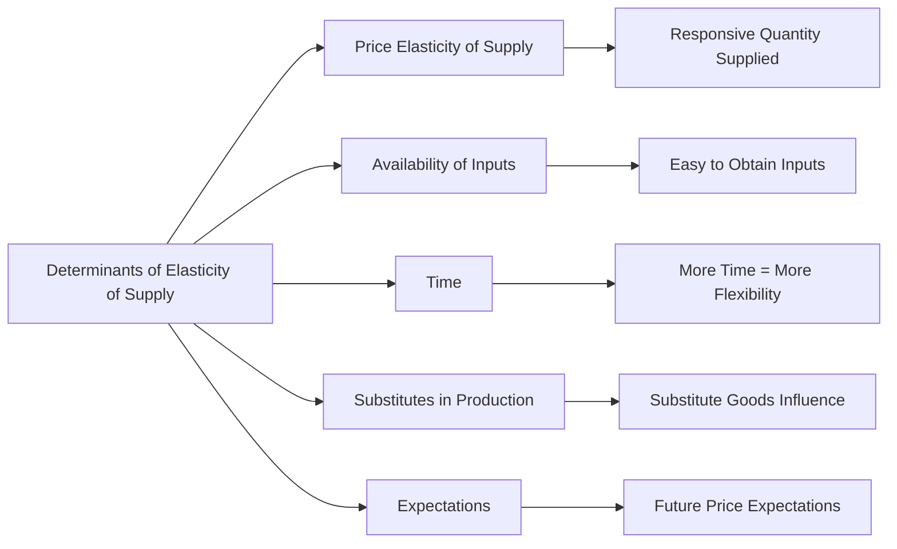

---

title: Determinants_Of_Elasticity_Of_Supply
type: Atomic Note
course: Economics
semester: Winter 2026
unit: '2'
hub: '[[2_Theory_Of_Demand_And_Supply_Hub]]'
source: '[[5-Pdf Store/note generated/Winter 2026/Economics/Chapter_2.pdf]]'
source_pages:
- 48
- 49
- 50
mode: ECON-MACRO
read: false
generated: true
prerequisites:
- '[[Elasticity_Of_Supply]]'
- '[[Ceteris_Paribus]]'
- '[[Price_Elasticity_Of_Supply]]'
- '[[Theory_Of_Demand]]'
- '[[Market_Demand_Curve]]'

---


# 1. Mental Model

Imagine you own a lemonade stand. The elasticity of supply is like how easily you can change the amount of lemonade you sell when the price changes. If you have a simple recipe and can quickly make more lemonade, you're like a flexible supplier. But if you have a complicated recipe or can't get more cups easily, you're less flexible. The 'Determinants Of Elasticity Of Supply' are factors that affect how flexible you can be, like how easily you can get more lemons (availability of inputs) or if you can store lemonade for later (time).

# 2. Economic Theory

The [[Determinants_Of_Elasticity_Of_Supply]] refer to the various factors that influence the [[Elasticity_Of_Supply]] of a good or service. These determinants affect how responsive the quantity supplied is to changes in the price of the good or service, essentially measuring the flexibility of producers in adjusting their output in response to price changes. The underlying mechanism involves the [[Ceteris_Paribus]] assumption, where all other factors are held constant, allowing for the isolation of the effect of price changes on quantity supplied. Key determinants include the [[Price_Elasticity_Of_Supply]], [[Availability_Of_Inputs]], [[Time]], and [[Technology]], which influence producers' ability to adjust production levels. For instance, when [[Technology]] improves, it can lead to a more elastic supply as firms can more easily adjust their production levels. Similarly, when there is a greater [[Availability_Of_Inputs]], firms can more readily increase production, leading to a more elastic supply.

# 3. Market Failures

The concept of [[Determinants_Of_Elasticity_Of_Supply]] has limitations, particularly in scenarios where [[Ceteris_Paribus]] does not hold, such as during [[Surplus_And_Shortage]] situations. In such cases, the traditional analysis of elasticity may not fully capture the complexities of supply adjustments. Additionally, the [[Theory_Of_Demand]] and [[Market_Demand_Curve]] can intersect with supply determinants in complex ways, especially when considering [[Substitute_Goods]] or [[Complementary_Goods]], which can affect both demand and supply elasticities. Furthermore, in dynamic markets with rapid [[Change_In_Technology]], the [[Determinants_Of_Elasticity_Of_Supply]] can shift rapidly, challenging the static analysis of supply elasticity.

# 4. Economic Model



This flowchart illustrates the various determinants that influence the elasticity of supply, which in turn affects how responsive the quantity supplied is to changes in price. The determinants include price elasticity of supply, availability of inputs, time, substitutes in production, and expectations.

## 5. Walkthrough

Here's a 5-step technical walkthrough of how the **Determinants of Elasticity of Supply** operate in the **Semiconductor Industry**:

1. **Market Trigger**: Global demand for AI chips surges, causing the market price per unit to triple.

2. **Availability of Inputs**: Semiconductor fabrication requires high-purity silicon and specialized lithography machines. These inputs have extremely long lead times (12-18 months). This **limited availability** makes the supply highly **inelastic** in the short run.

3. **Production Lag (Time)**: Building a new 'Fab' (factory) costs billions and takes years. In the **Market Period** (immediate), supply is perfectly inelastic (vertical). In the **Short Run**, existing factories can work overtime, slightly increasing supply. Only in the **Long Run** can new capacity be built to make supply elastic.

4. **Resource Mobility**: The engineers and equipment used for making mobile chips are not easily pivoted to making high-end GPUs. This low **factor mobility** further restricts supply responsiveness.

5. **Inventory and Storage**: Unlike perishable goods, chips can be stored. However, during a shortage, inventories are depleted to zero. If inventory levels were high, supply would be more elastic as firms could release stock immediately in response to the price hike.

---

## 6. The Proving Grounds

```interactive-quiz
[
  {
    "id": "q1",
    "type": "mcq",
    "difficulty": "L1",
    "question": "Which time period is characterized by a **perfectly inelastic** supply curve where producers cannot adjust quantity at all?",
    "options": {
      "A": "The Long Run.",
      "B": "The Short Run.",
      "C": "The Market Period (Immediate Run).",
      "D": "The Secular Trend."
    },
    "answer": "C",
    "explanation": "In the Market Period, supply is fixed because production takes time. No matter how much the price rises, the quantity available for sale today cannot be increased instantly."
  },
  {
    "id": "q2",
    "type": "true_false",
    "difficulty": "L2",
    "question": "If a manufacturing process can easily switch between producing 'Good A' and 'Good B' (High Factor Mobility), the price elasticity of supply for Good A will be relatively elastic.",
    "answer": true,
    "explanation": "Factor mobility allows firms to respond quickly to price changes by reallocating resources from less profitable goods to more profitable ones."
  },
  {
    "id": "q3",
    "type": "synthesis",
    "difficulty": "L3",
    "question": "Compare the elasticity of supply for Fresh Strawberries versus Stainless Steel. Which is more elastic and why, considering 'Perishability' and 'Storage'?",
    "answer": "Stainless steel is more elastic. It can be stored indefinitely in warehouses and released to the market when prices rise. Fresh strawberries are highly perishable and cannot be stored easily; once harvested, they must be sold regardless of price, making supply relatively inelastic.",
    "explanation": "Synthesis requires evaluating specific determinants (storage/perishability) across different industries."
  },
  {
    "id": "q4",
    "type": "trace",
    "difficulty": "L2",
    "question": "Trace the impact of an improvement in 'Production Technology' on the Price Elasticity of Supply ($E_s$).",
    "answer": "1) New technology reduces production bottlenecks. 2) Marginal costs of increasing output fall. 3) Firms can now ramp up production more quickly in response to price signals. 4) The $E_s$ coefficient increases (Supply becomes more elastic).",
    "explanation": "Tracing how technological efficiency translates into greater supply-side flexibility."
  },
  {
    "id": "q5",
    "type": "order",
    "difficulty": "L2",
    "question": "Order the time periods from **Least Elastic** to **Most Elastic** supply.",
    "steps": [
      "Short Run (Fixed capital, variable labor)",
      "Market Period (Immediate response)",
      "Long Run (All factors are variable)"
    ],
    "answer": [
      "Market Period (Immediate response)",
      "Short Run (Fixed capital, variable labor)",
      "Long Run (All factors are variable)"
    ],
    "explanation": "Elasticity increases over time as firms gain more flexibility to adjust all factors of production (including factory size and technology)."
  }
]
```