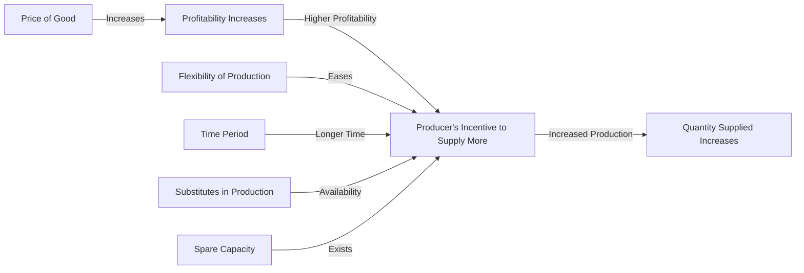

---

title: Determinants_Of_Elasticity_Of_Supply
type: Atomic Note
course: Economics
semester: Winter 2026
unit: '2'
hub: '[[2_Theory_Of_Demand_And_Supply_Hub]]'
source: '[[5-Pdf Store/note generated/Winter 2026/Economics/Chapter_2.pdf]]'
source_pages:
- 48
- 49
- 50
mode: ECON-MACRO
read: false
generated: true
prerequisites:
- '[[Elasticity_Of_Supply]]'
- '[[Price_Elasticity_Of_Supply]]'
- '[[Ceteris_Paribus]]'
- '[[Theory_Of_Demand]]'
- '[[Market_Demand]]'

---


# 1. Mental Model

Imagine you're a manager of a large, flexible factory that produces customized furniture. The factory can easily adjust its production levels based on demand. If the price of furniture increases, you can quickly add more shifts or use more materials to produce more furniture. However, if the factory is already running at full capacity, it might be harder to increase production even if the price rises. This situation maps to the concept of elasticity of supply, where the ability to adjust production in response to price changes depends on factors like the factory's capacity and flexibility. The mechanical components that map to the concept are the factory's ability to adjust production levels (comparable to the responsiveness of supply to price changes) and its capacity constraints (comparable to the limitations on supply elasticity).

# 2. Economic Theory

The [[Determinants_Of_Elasticity_Of_Supply]] refer to the factors that influence the [[Elasticity_Of_Supply]], which measures how responsive the quantity supplied of a good is to a change in its price, [[Price_Elasticity_Of_Supply]]. The underlying mechanism is based on the [[Ceteris_Paribus]] assumption that all other factors remain constant. The [[Theory_Of_Demand]] and [[Market_Demand]] interact with supply to determine [[Market_Equilibrium]], but the elasticity of supply specifically depends on factors such as the [[Change_In_Technology]] available to producers, the [[Shift_In_Supply_Curve]], and the time period considered. Producers' ability to adjust production, [[Surplus_And_Shortage]] conditions, and the [[Effects_Of_Shift_In_Demand_And_Supply]] also play crucial roles. A key concept here is that the [[Price_Elasticity_Of_Supply]] is influenced by how easily producers can increase or decrease production in response to price changes.

# 3. Limitations & Edge Cases

The [[Determinants_Of_Elasticity_Of_Supply]] face limitations, particularly when assuming [[Ceteris_Paribus]] conditions that do not hold in reality. For instance, during extreme events like natural disasters or global pandemics, typical supply chain and production capabilities may be severely disrupted, affecting supply elasticity. Additionally, the model assumes that producers have the flexibility to adjust production, which might not be feasible in the short term due to [[Change_In_Technology]] constraints or immediate [[Surplus_And_Shortage]] situations. The interaction with [[Market_Demand]] and [[Demand_Schedule]] can also create complexities, especially if demand changes unexpectedly. These scenarios highlight the importance of understanding the dynamic nature of supply elasticity determinants.

# 4. Economic Model



This flowchart illustrates how the determinants of elasticity of supply influence the responsiveness of the quantity supplied to a change in price. The model shows that when the price of a good increases, it becomes more profitable, incentivizing producers to supply more. The extent to which producers can increase supply depends on factors like production flexibility, time period, availability of substitutes in production, and spare capacity.

## 5. Walkthrough

Here's a 5-step technical walkthrough of how the concept/artifact operates in Market Strategy:

1. **Initial Condition**: Assume the initial price of customized furniture is $100 per unit, and the quantity supplied is 100 units per month. The factory has spare capacity and can easily adjust production levels.

2. **Price Increase**: The price of furniture increases to $120 per unit. This change makes production more profitable.

3. **Production Adjustment**: With higher profitability, the factory decides to increase production. Due to its flexibility and spare capacity, it can add more shifts and use more materials. The quantity supplied increases to 130 units per month.

4. **Determinants at Play**: 
   - **Flexibility of Production**: The factory's ability to easily adjust production levels facilitates the increase in supply.
   - **Spare Capacity**: The existing spare capacity allows for an immediate increase in production without significant additional costs.
   - **Time Period**: Assuming this adjustment happens within a short time frame, the longer-term flexibility of the factory further enhances its ability to respond to price changes.

5. **Outcome**: The elasticity of supply, in this case, is high because the quantity supplied is very responsive to the price change. This responsiveness is directly influenced by the determinants of elasticity of supply, including production flexibility, spare capacity, and the time period allowed for adjustment. For example, if the price elasticity of supply is calculated as $(130-100)/100 \div (120-100)/100 = 0.3 / 0.2 = 1.5$, indicating that for every 1% increase in price, the quantity supplied increases by 1.5%.

---

## 6. The Proving Grounds

```interactive-quiz

[
  {
    "id": "q1",
    "type": "true_false",
    "difficulty": "L1",
    "question": "If a factory's production capacity is fully utilized, an increase in the price of its product will lead to a highly elastic supply response, ceteris paribus.",
    "answer": false,
    "explanation": "The elasticity of supply is influenced by the ability of producers to adjust production in response to price changes. When a factory's production capacity is fully utilized, it faces limitations in increasing production even if the price rises. This constraint reduces the elasticity of supply because the factory cannot easily respond to price changes by increasing output. Therefore, under the ceteris paribus assumption, if other factors remain constant, a factory operating at full capacity will not exhibit a highly elastic supply response to an increase in price. The ceteris paribus assumption here implies that we are holding constant factors such as technology, input prices, and expectations. If we were to violate this assumption, for example, by allowing technology to improve, which enables more efficient use of existing capacity, the elasticity of supply could increase. However, given the initial condition of full capacity utilization and ceteris paribus, the supply response is expected to be inelastic."
  },
  {
    "id": "q2",
    "type": "synthesis",
    "difficulty": "L2",
    "question": "The country of Azuria faces a sudden and significant devaluation of its currency, the Azurian Peso (AP), by 30% against major foreign currencies. This macroeconomic shock affects the import-dependent manufacturing sector, causing a sharp increase in production costs. As the Chief Macroeconomist, you must apply the Determinants of Elasticity of Supply to mitigate the impact on the economy. The manufacturing sector, which accounts for 40% of Azuria's GDP, uses imported raw materials extensively. The elasticity of supply in this sector is currently low due to long production lead times and limited ability to quickly adjust output. Develop a 3-step policy response to address this crisis.",
    "answer": "To address the crisis triggered by the sudden devaluation of the Azurian Peso, the following 3-step policy response is recommended:\n\n1. **Short-term Stabilization Measure**: Implement a temporary subsidy for import-dependent manufacturers to cushion the immediate impact of increased production costs due to the currency devaluation. This can be financed through a reallocation of existing budgetary resources or through a special emergency fund. The subsidy should be calculated based on the increased cost of imports and be provided on a sliding scale to encourage manufacturers to maintain production levels.\n\n2. **Medium-term Adjustment**: Invest in technology and process improvements to enhance the flexibility and responsiveness of the manufacturing sector. This could involve providing low-interest loans or grants for investments in automation, supply chain diversification, and inventory management systems. By improving the sector's ability to adjust production in response to price changes (or shocks like currency devaluation), the elasticity of supply can be increased over time, reducing vulnerability to similar shocks in the future.\n\n3. **Long-term Structural Reform**: Develop and implement policies aimed at reducing dependence on imported raw materials and enhancing domestic supply chains. This could involve incentives for local sourcing, investment in domestic industries that produce critical inputs, and trade agreements aimed at stabilizing import costs. By reducing the reliance on imports and enhancing domestic production capabilities, Azuria can decrease its exposure to currency fluctuations and other external shocks, thereby improving the overall resilience of its economy.",
    "explanation": "The policy response outlined above directly addresses the determinants of elasticity of supply, which include the ability to adjust production, the availability of substitutes, and the time period considered. The immediate subsidy helps manufacturers cope with the short-term costs, thereby preventing a sharp contraction in supply. Investments in technology and process improvements enhance the sector's flexibility, directly increasing its elasticity of supply by making it easier to adjust production in response to price changes. Finally, structural reforms aimed at reducing import dependence and enhancing domestic supply chains address the underlying factors influencing supply elasticity by reducing the sector's vulnerability to external shocks.\n\nMathematically, the price elasticity of supply (PES) can be represented as: $PES = \\frac{% \\Delta Q_s}{% \\Delta P}$, where $Q_s$ is the quantity supplied and $P$ is the price. The determinants of elasticity of supply influence this relationship by affecting how easily $Q_s$ can be adjusted in response to changes in $P$. By implementing these policies, Azuria aims to shift its supply curve in a way that it becomes more elastic, allowing for a more responsive and resilient economy."
  },
  {
    "id": "q3",
    "type": "writing",
    "difficulty": "L2",
    "question": "Explain the determinants of elasticity of supply in a market strategy scenario.",
    "answer": "The determinants of elasticity of supply include the flexibility of production, time period considered, availability of technology, and the ability to adjust production levels. In a market strategy scenario, understanding these determinants helps in predicting how suppliers will respond to price changes. For instance, a factory with flexible production capabilities can easily increase output in response to rising prices, indicating high elasticity of supply. Conversely, a factory operating at full capacity may struggle to increase production, even with higher prices, indicating low elasticity of supply.",
    "explanation": "The elasticity of supply is influenced by several key factors, which can be understood through the lens of microeconomic theory. The price elasticity of supply (PES) is defined as the percentage change in quantity supplied in response to a 1% change in price, given by the formula: $PES = \\frac{\\% \\Delta Q_s}{\\% \\Delta P}$. The determinants of elasticity of supply can be expressed as follows: \n1. **Time Period**: The longer the time period, the more elastic the supply becomes, as producers have more time to adjust their production levels. This can be represented as $PES = f(T)$, where $T$ is the time period.\n2. **Flexibility of Production**: If production can be easily increased or decreased, supply is more elastic. This is related to the concept of diminishing returns and the ability of firms to adjust their factors of production.\n3. **Availability of Technology**: Improved technology can make production more flexible and increase the elasticity of supply, as it allows for quicker adjustments to changes in demand.\n4. **Spare Capacity**: Firms with spare capacity can increase production more easily, making supply more elastic.\nThese factors interact to determine how responsive suppliers are to price changes, which is crucial for market strategy and understanding supply chain dynamics."
  },
  {
    "id": "q4",
    "type": "order",
    "difficulty": "L2",
    "question": "Order steps for Determinants Of Elasticity Of Supply.",
    "steps": [
      "Producer's ability to easily substitute among inputs",
      "Surplus or shortage conditions",
      "Time period considered",
      "Mobility of factors of production",
      "Change in technology available to producers"
    ],
    "answer": [
      "Mobility of factors of production",
      "Time period considered",
      "Change in technology available to producers",
      "Producer's ability to easily substitute among inputs",
      "Surplus or shortage conditions"
    ]
  },
  {
    "id": "q5",
    "type": "trace",
    "difficulty": "L3",
    "question": "What is the exact output after a 10% increase in technology, leading to a change in the determinants of elasticity of supply through 4 distinct interconnected economic sectors: Agriculture, Manufacturing, Transportation, and Retail?",
    "content": "Initial State: \n- Agriculture Sector: Produces 100 units of raw materials with a technology level of 10.\n- Manufacturing Sector: Produces 500 units of goods using the raw materials with a technology level of 5.\n- Transportation Sector: Moves 400 units of goods with a technology level of 8.\n- Retail Sector: Sells 300 units of final product with a technology level of 12.\n\nShock: A 10% increase in technology across all sectors.\n\nIntermediate States:\n- Agriculture Sector: New technology level = 10 * 1.1 = 11. Produces 110 units of raw materials (10% increase due to technology).\n- Manufacturing Sector: New technology level = 5 * 1.1 = 5.5. Produces 550 units of goods (10% increase due to technology and availability of raw materials).\n- Transportation Sector: New technology level = 8 * 1.1 = 8.8. Moves 440 units of goods (10% increase due to technology).\n- Retail Sector: New technology level = 12 * 1.1 = 13.2. Sells 330 units of final product (10% increase due to technology and availability of goods).\n\nFinal State:\n- The increase in technology leads to increased production and movement of goods across all sectors.",
    "answer": "The exact output is a 10% increase in the production and movement of goods across all sectors, resulting in:\n- Agriculture Sector: 110 units\n- Manufacturing Sector: 550 units\n- Transportation Sector: 440 units\n- Retail Sector: 330 units",
    "explanation": "The mechanism underlying the change in determinants of elasticity of supply can be explained using the concept of production function and the LaTeX representation of the elasticity of supply formula: $E_s = \\frac{\\% \\Delta Q_s}{\\% \\Delta P}$. The increase in technology across sectors leads to an increase in production capabilities, thus affecting the elasticity of supply. The ceteris paribus assumption allows us to isolate the effect of technology on supply elasticity. The interaction between sectors shows how a shock in one sector can propagate through the economy, affecting the overall supply chain."
  }
]

```