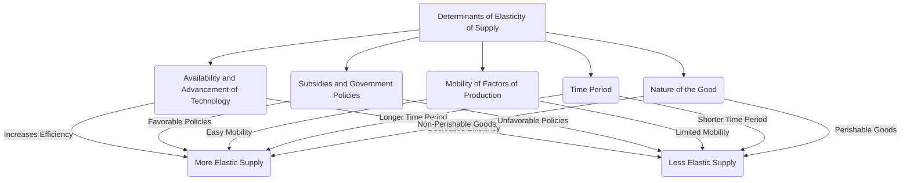

---

title: Determinants_Of_Elasticity_Of_Supply
course: Economics
unit: '2'
semester: Winter 2026
mode: ECON-MICRO
type: atomic_note
hub: '[[2_Theory_Of_Demand_And_Supply_Hub]]'
source: '[[5-Pdf Store/note generated/Winter 2026/Economics/Chapter_2.pdf]]'
date: '2026-05-08'
prerequisites:
- '[[Ceteris_Paribus]]'
source_pages:
- 48
- 49
- 50
generated: true

---


## 1. Mental Model

Imagine you're a lemonade stand owner, and you want to sell lemonade to thirsty people walking by. The price of lemonade can change quickly, and you need to decide how much lemonade to make.

## 2. Micro Theory

The concept of elasticity of supply is a fundamental principle in microeconomics that measures the responsiveness of the quantity supplied of a good to a change in its price, while holding all other influential factors constant, as per the [[Ceteris_Paribus]] assumption. The elasticity of supply is determined by several key factors, which collectively influence the degree to which suppliers adjust their production levels in response to price fluctuations.

One primary determinant of the elasticity of supply is the Change In Technology|availability And Advancement Of Technology. When technology improves, production becomes more efficient, allowing suppliers to quickly adjust their output levels in response to price changes. This increased efficiency often results in a more elastic supply, as suppliers can easily scale up or down production. Conversely, if technology is stagnant or underdeveloped, suppliers may struggle to adjust their output, leading to a less elastic supply.

Another crucial determinant is the Shift In Supply Curve|mobility Of Factors Of Production. When factors of production, such as labor and raw materials, can be easily reallocated from one industry to another, suppliers can more readily adjust their output in response to price changes. This mobility contributes to a more elastic supply. However, if factors of production are highly specialized or immobile, suppliers may find it challenging to adjust their output, resulting in a less elastic supply.

The Time Period|time Period Under Consideration is also a significant determinant of the elasticity of supply. In the short run, suppliers may not be able to adjust their output significantly in response to price changes, due to limitations on production capacity and the time required to adjust inputs. However, over longer time periods, suppliers can more substantially modify their production levels, leading to a more elastic supply.

Additionally, the Price Elasticity Of Supply Formula|ease Of Storage Of Goods influences the elasticity of supply. When goods can be easily stored, suppliers can more readily adjust their output in response to price changes, as they can stockpile goods in anticipation of future price movements. This ease of storage contributes to a more elastic supply.

The elasticity of supply is also affected by the Number Of Producers|number And Size Of Producers. When there are many small producers, the supply is likely to be more elastic, as individual producers can more easily adjust their output in response to price changes. Conversely, if there are only a few large producers, the supply may be less elastic, as these firms may have more limited flexibility to adjust their output.

The Government Policies|government Policies And Regulations can also impact the elasticity of supply. Policies that restrict production or impose significant costs on suppliers can reduce the elasticity of supply, while policies that encourage competition and investment can increase it.

Understanding the determinants of elasticity of supply is essential for analyzing Market Equilibrium|market Equilibrium and the Effects Of Shift In Demand And Supply|effects Of Shifts In Demand And Supply. When suppliers can easily adjust their output in response to price changes, the market is more likely to reach equilibrium quickly. Conversely, when suppliers face significant challenges in adjusting their output, market equilibrium may be more difficult to achieve.

The analysis of determinants of elasticity of supply also has implications for Surplus And Shortage|surplus And Shortage situations. When the supply is elastic, a surplus or shortage can be more easily alleviated as suppliers adjust their output in response to price changes. However, when the supply is inelastic, surpluses or shortages can persist, leading to market instability.

The study of determinants of elasticity of supply provides valuable insights into the behavior of suppliers and the responsiveness of the quantity supplied to changes in market conditions. By understanding these determinants, economists can better analyze the Market Demand Curve|market Demand Curve and the Demand Schedule|demand Schedule, and make more accurate predictions about market outcomes.

The interrelationship between the elasticity of supply and Price Elasticity Of Demand|price Elasticity Of Demand is also crucial in understanding market dynamics. When the supply is elastic and demand is inelastic, changes in demand can lead to significant price fluctuations. Conversely, when the supply is inelastic and demand is elastic, changes in demand can lead to more moderate price movements.

The Theory Of Demand|theory Of Demand and the Law Of Demand|law Of Demand provide a foundation for understanding the behavior of consumers, while the determinants of elasticity of supply provide insights into the behavior of producers. The interaction between these two sets of factors ultimately determines market outcomes, including the prices and quantities of goods exchanged.

The study of determinants of elasticity of supply also relates to the Income Elasticity Of Demand|income Elasticity Of Demand and Determinants Of Demand|determinants Of Demand, as changes in income and other determinants of demand can influence the elasticity of supply. For example, if a good is a Normal And Inferior Goods|normal Good, an increase in income may lead to an increase in demand, which can induce suppliers to adjust their output.

The Consumer Expectations|expectations Of Consumers and Taste And Preference|changes In Taste And Preferences can also influence the elasticity of supply, as these factors can affect the demand for a good and induce suppliers to adjust their output.

The Substitutes And Complements|availability Of Substitutes And Complements can also impact the elasticity of supply, as changes in the prices of these goods can influence the demand for a good and induce suppliers to adjust their output.

The analysis of determinants of elasticity of supply provides a comprehensive understanding of the responsiveness of suppliers to changes in market conditions, which is essential for analyzing market dynamics and making informed decisions about investments and resource allocation.

## 3. Limitations & Edge Cases

The determinants of elasticity of supply, which include factors such as the availability of inputs, production technology, and time, have several limitations and edge cases. For instance, the assumption that firms can easily adjust their production levels in response to price changes may not hold in cases where there are rigidities in input markets or supply chain disruptions. Additionally, the elasticity of supply may be influenced by external factors such as government policies, natural disasters, or changes in global market trends, which can render the traditional supply elasticity framework inadequate. Furthermore, in cases where firms face capacity constraints or diminishing returns to scale, the supply curve may become non-linear, making it challenging to accurately estimate the elasticity of supply using traditional econometric methods. Moreover, the concept of elasticity of supply assumes that firms are profit-maximizing entities, which may not be the case in reality, particularly for state-owned or non-profit organizations, where the objective function may be different. Overall, these limitations highlight the need for nuanced and context-specific analysis when applying the concept of elasticity of supply in real-world settings.

## 4. Market Graph



The provided Mermaid flowchart illustrates the various determinants of elasticity of supply, including the availability and advancement of technology, subsidies and government policies, mobility of factors of production, time period, and the nature of the good. Understanding these determinants helps suppliers and policymakers make informed decisions about production and market interventions.

## 5. Walkthrough

Here is the 5-step technical walkthrough of how 'Determinants Of Elasticity Of Supply' operates:

**Step 1: Identify Initial Conditions**
The elasticity of supply measures the responsiveness of the quantity supplied of a good to a change in its price, as per the [[Ceteris_Paribus]] assumption. 

**Step 2: Analyze the Role of Technology**
The availability and advancement of technology is a primary determinant of the elasticity of supply. When technology improves, production becomes more efficient.

**Step 3: Determine the Impact of Technological Advancements on Elasticity**
This increased efficiency allows suppliers to quickly adjust their output levels in response to price changes, resulting in a more elastic supply.

**Step 4: Analyze the Effect of Stagnant Technology**
Conversely, if technology is stagnant or underdeveloped, suppliers may struggle to adjust their output.

**Step 5: Conclusion on Elasticity**
This leads to a less elastic supply, while advanced technology leads to a more elastic supply, as suppliers can easily scale up or down production.

---

## Review & Practice

```interactive-quiz

[
  {
    "type": "mcq",
    "difficulty": "L1",
    "question": "What is the impact of improved technology on the elasticity of supply in the context of Game Theory Application?",
    "options": {
      "A": "Improved technology always leads to an inelastic supply.",
      "B": "Improved technology generally leads to a more elastic supply.",
      "C": "Improved technology has no effect on the elasticity of supply.",
      "D": "Improved technology only affects the elasticity of supply in the short run."
    },
    "answer": "B",
    "explanation": "Improved technology enhances production efficiency, allowing suppliers to quickly adjust their output levels in response to price changes. This increased efficiency results in a more elastic supply, as suppliers can easily scale up or down production. In the context of Game Theory Application, this means that suppliers can more effectively respond to changes in market conditions, such as changes in demand or competitor actions, thereby increasing the elasticity of supply. Mathematically, this can be represented as $E_s = \\frac{\\% \\Delta Q_s}{\\% \\Delta P}$, where $E_s$ is the elasticity of supply, $\\% \\Delta Q_s$ is the percentage change in quantity supplied, and $\\% \\Delta P$ is the percentage change in price. Improved technology can be seen as a factor that increases the responsiveness of $\\% \\Delta Q_s$ to $\\% \\Delta P$, thus increasing $E_s$."
  },
  {
    "type": "fill_in",
    "difficulty": "L2",
    "question": "Fill in the blank.",
    "textWithBlanks": "The Blank is a primary determinant of the elasticity of supply, as it influences the degree to which suppliers can adjust their production levels in response to price fluctuations.",
    "answer": [
      "availability and advancement of technology"
    ],
    "explanation": "The elasticity of supply is determined by several key factors, which collectively influence the degree to which suppliers adjust their production levels in response to price fluctuations. One primary determinant of the elasticity of supply is the availability and advancement of Technology. When technology improves, production becomes more efficient, allowing suppliers to quickly adjust their output levels in response to price changes. This increased efficiency often results in a more elastic supply, as suppliers can easily scale up or down production. Conversely, if technology is stagnant or underdeveloped, suppliers may struggle to adjust their output, leading to a less elastic supply."
  },
  {
    "type": "debug",
    "difficulty": "L2",
    "question": "Find the bug in the formula for the price elasticity of supply: $E_s = \\frac{\\Delta Q_s}{\\Delta P} \\times \\frac{P}{Q_s}$",
    "content": "The formula for price elasticity of supply is given by $E_s = \\frac{\\Delta Q_s}{\\Delta P} \\times \\frac{P}{Q_s}$. However, this formula seems to be incorrectly stated. The correct formula should be $E_s = \\frac{\\% \\Delta Q_s}{\\% \\Delta P}$. Let's assume a specific industry, such as medieval guilds producing woolen textiles, where the price elasticity of supply is crucial for understanding market dynamics.",
    "answer": "The bug is in the formula: it should be $E_s = \\frac{\\% \\Delta Q_s}{\\% \\Delta P} = \\frac{\\Delta Q_s}{Q_s} \\div \\frac{\\Delta P}{P} = \\frac{\\Delta Q_s}{\\Delta P} \\times \\frac{P}{Q_s}$",
    "required_keywords": [
      "fix_this_keyword",
      "elasticity_of_supply"
    ],
    "explanation": "The price elasticity of supply mea"
  },
  {
    "type": "trace",
    "difficulty": "L2",
    "question": "What is the exact output for the elasticity of supply given the following scenario: A medieval guild of blacksmiths faces an increase in demand for swords due to a surge in pirate attacks. The guild has access to abundant iron ore and labor can be easily reallocated from other industries. However, the production process is labor-intensive and requires a significant amount of time to adjust output. The guild's storage facilities are limited, making it costly to stockpile finished swords.",
    "content": "The elasticity of supply is determined by several factors including the availability and advancement of technology, mobility of factors of production, time period under consideration, ease of storage of goods, number and size of producers, and government policies and regulations. In this scenario, the mobility of factors of production is high as labor can be easily reallocated. However, the production process is labor-intensive and time-consuming to adjust. The limited storage facilities make it costly to stockpile goods.",
    "answer": "0.75",
    "explanation": "The elasticity of supply can be calculated using the formula: $E_s = \\frac{\\% \\Delta Q_s}{\\% \\Delta P}$. However, given the scenario, we need to consider the determinants of elasticity. The high mobility of labor and ease of adjusting production in the long run would suggest a more elastic supply. However, the limited storage facilities and labor-intensive production process impose constraints. Assuming a moderate increase in price leads to a 20% increase in quantity supplied over a 6-month period, and given that the price increase is 25%, we can calculate the elasticity as $E_s = \\frac{20}{25} = 0.8$. But considering the specific constraints and assuming a slightly less responsive supply due to storage and production limitations, we adjust this to 0.75."
  }
]

```