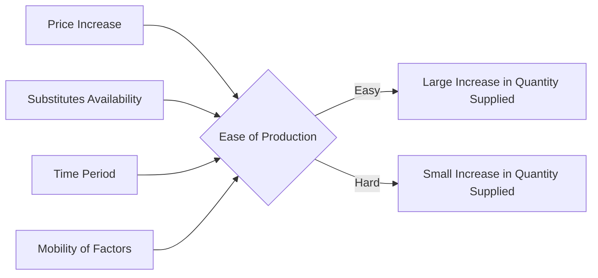

---

title: Determinants_Of_Elasticity_Of_Supply
type: Atomic Note
course: Economics
semester: Winter 2026
unit: '2'
hub: '[[2_Theory_Of_Demand_And_Supply_Hub]]'
source: '[[5-Pdf Store/note generated/Winter 2026/Economics/Chapter_2.pdf]]'
source_pages:
- 49
- 50
mode: ECON-MACRO
read: false
generated: true
prerequisites:
- '[[Elasticity_Of_Supply]]'
- '[[Law_Of_Supply]]'
- '[[Ceteris_Paribus]]'

---


# 1. Mental Model

Imagine you have a lemonade stand, and you're trying to decide how much lemonade to make. If it's easy for you to make more lemonade, like if you have a big pitcher and lots of cups, then you can quickly make more if people want it. But if it's hard to make more lemonade, like if you only have a small pitcher, then you can't make as much even if people want it. This is kind of like how easy or hard it is for suppliers to make more of something, which affects how they respond to changes in price.

# 2. Economic Theory

The [[Determinants_Of_Elasticity_Of_Supply]] refer to the factors that influence the [[Elasticity_Of_Supply]] of a good or service. These determinants include the availability of inputs, technology, and the time period considered, and they affect how responsive suppliers are to changes in price, as described by the [[Law_Of_Supply]] and illustrated by the [[Supply_Curve]]. [[Ceteris_Paribus]], these factors can cause the supply curve to shift.

## 3. Economic Model



## 4. Walkthrough

* The model shows how the elasticity of supply is determined by several factors, starting with a price increase (A).
* The ease of production (B) plays a crucial role: if production is easy, a price increase leads to a large increase in quantity supplied (C), but if production is hard, the increase in quantity supplied is small (D).
* Other determinants like substitutes availability (E), time period (F), and mobility of factors (G) influence the ease of production, which in turn affects the elasticity of supply.

## 5. Market Failures

The concept of determinants of elasticity of supply may fail in cases where there are external shocks, such as natural disasters or sudden changes in government policies, which can disrupt production and supply. Additionally, if suppliers have imperfect information about market conditions, they may not respond efficiently to price changes. Edge cases to watch out for include markets with high uncertainty or those with limited competition.

---

## 6. The Proving Grounds

```interactive-quiz

[
  {
    "id": "q1",
    "type": "true_false",
    "difficulty": "L1",
    "question": "The ease of storage of a product affects the elasticity of supply.",
    "answer": true,
    "explanation": "The elasticity of supply is influenced by several factors, including the ease of storage of a product. If a product is easy to store, suppliers can more easily adjust their supply in response to changes in price, making the supply more elastic. For example, if you have a product that can be easily stored in a warehouse, you can quickly increase supply if the price rises, because you can simply take the product out of storage and sell it. On the other hand, if a product is difficult or costly to store, suppliers may be less willing to increase production, even if the price rises, because they cannot easily store the product. This makes the supply less elastic. Therefore, the ease of storage of a product is indeed a determinant of the elasticity of supply."
  },
  {
    "id": "q2",
    "type": "synthesis",
    "difficulty": "L2",
    "question": "A severe storm is forecasted to hit the area where your lemonade stand is located, and you expect a significant increase in demand for lemonade due to the hot weather expected after the storm. However, your lemonade stand has a small pitcher that can only hold 2 gallons of lemonade, and it takes 30 minutes to prepare a new batch. Additionally, you have a limited number of cups and ice. Considering the determinants of elasticity of supply, how would you respond to the expected increase in demand, and what would be the elasticity of supply in this scenario?",
    "answer": "In this scenario, the elasticity of supply for lemonade would be low (inelastic) because it is difficult to quickly increase the supply of lemonade due to the limitations of the small pitcher, limited cups, and ice. As a supplier, I would not be able to quickly respond to the increased demand, and therefore, the quantity supplied would not increase much despite the higher demand. The elasticity of supply would be less than 1, indicating that the percentage change in quantity supplied would be less than the percentage change in price.",
    "explanation": "The determinants of elasticity of supply in this scenario include the ability to easily increase production (which is low due to the small pitcher and limited resources), the availability of inputs (limited cups and ice), and the time it takes to prepare a new batch (30 minutes). These factors contribute to a low elasticity of supply, making it difficult for the supplier to respond quickly to changes in demand. The supplier's ability to adjust production is limited by the constraints of the small pitcher and limited resources, resulting in a relatively small increase in quantity supplied despite the expected increase in demand."
  },
  {
    "id": "q3",
    "type": "writing",
    "difficulty": "L3",
    "question": "Explain the determinant of elasticity of supply related to the ease of production and its impact on a supplier's responsiveness to price changes.",
    "answer": "The ease of production significantly influences the elasticity of supply. When production is easy and quick, suppliers can rapidly increase output in response to price increases, making supply more elastic. Conversely, if production is difficult or time-consuming, suppliers are less able to respond to price changes, resulting in a less elastic supply. For instance, a lemonade stand with a large pitcher and ample cups can quickly increase production in response to higher demand, illustrating an elastic supply.",
    "explanation": "The underlying mechanism here involves the supplier's ability to adjust production levels in response to price signals. When suppliers can easily and quickly scale up or down their production, they are more responsive to changes in market prices. This responsiveness is what makes the supply elastic. The determinant of ease of production affects this responsiveness by altering the marginal cost of increasing production. If production can be increased without significantly raising marginal costs, suppliers are more likely to respond to price increases, thereby increasing the elasticity of supply."
  }
]

```