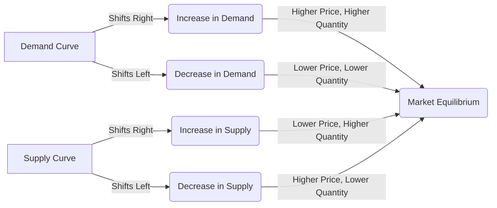

---

title: Effects_Of_Shift_In_Demand_And_Supply
type: Atomic Note
course: Economics
semester: Winter 2026
unit: '2'
hub: "[[2_Theory_Of_Demand_And_Supply_Hub]]"
source: "[[5-Pdf Store/note generated/Winter 2026/Economics/Chapter_2.pdf]]"
source_pages:
- 58
- 59
- 60
mode: ECON-MACRO
read: false
generated: true
prerequisites:
- "[[Market_Equilibrium]]"

---

# 1. Mental Model

Imagine you're at a concert and the organizers have set up a merchandise booth selling T-shirts. The number of T-shirts available (supply) and the number of fans wanting to buy them (demand) determine the price and how many shirts are sold. If more fans want to buy T-shirts than there are shirts available (demand increases), the price tends to go up. If the organizers get a new shipment of T-shirts (supply increases), and demand stays the same, the price tends to go down. 

# 2. Economic Theory

The [[Effects_Of_Shift_In_Demand_And_Supply]] occur due to changes in the [[Market_Equilibrium]], which is the point where the [[Demand_Curve]] and [[Shift_In_Supply_Curve]] intersect. This intersection determines the equilibrium price and quantity of a good or service. The [[Demand_Curve]] represents the [[Market_Demand]], which is the total demand for a good or service at various price levels, and it slopes downward due to the [[Law_Of_Demand]]. The [[Shift_In_Supply_Curve]] represents the [[Market_Demand_Curve]]'s counterpart, which shows the quantity supplied at different prices. When [[Ceteris_Paribus]] assumptions hold, a [[Change_In_Demand]] or a [[Change_In_Technology]] that affects supply can shift these curves. An increase in demand, with supply remaining constant, leads to a higher equilibrium price and quantity. Conversely, an increase in supply, with demand constant, results in a lower equilibrium price and higher quantity. The [[Price_Elasticity_Of_Demand]] and [[Price_Elasticity_Of_Supply]] determine how responsive quantity demanded and supplied are to price changes. 

# 3. Limitations & Edge Cases

The [[Effects_Of_Shift_In_Demand_And_Supply]] model assumes [[Ceteris_Paribus]], which means all other factors remain constant. However, in reality, multiple factors can change simultaneously. For instance, during Stagflation, traditional demand-side interventions can exacerbate the crisis. The model also doesn't account for the Paradox Of Thrift, where increased saving reduces aggregate output during recessions. Furthermore, it assumes that [[Substitutes_Goods]] and [[Complementary_Goods]] are readily available, which might not always be the case. Additionally, the model might not accurately predict outcomes in situations where there are [[Inferior_Goods]] or when [[Determinants_Of_Demand]] and [[Determinants_Of_Elasticity_Of_Supply]] change unexpectedly.

# 4. Economic Model



This Mermaid flowchart illustrates how shifts in demand and supply curves affect market equilibrium. The demand curve and supply curve intersect at the market equilibrium point, determining the equilibrium price and quantity.

## 5. Walkthrough

Here's a 5-step technical walkthrough of how the concept of Effects of Shift in Demand and Supply operates:

1. **Initial Market Equilibrium**: Suppose the initial demand for T-shirts at the concert is 100 units at a price of $20, and the initial supply is also 100 units. The market equilibrium is at (100 units, $20).

2. **Increase in Demand**: If more fans want to buy T-shirts, the demand curve shifts to the right. Assume the new demand is 120 units at $20. If the supply remains constant at 100 units, the price tends to increase.

3. **New Market Equilibrium**: As the price increases to $25, the quantity demanded decreases to 110 units, and the quantity supplied increases to 110 units (assuming a supply curve that slopes upward). The new market equilibrium is at (110 units, $25).

4. **Increase in Supply**: If the organizers receive a new shipment of T-shirts, increasing the supply to 130 units, and assuming the demand remains at 120 units, the price tends to decrease.

5. **Final Market Equilibrium**: As the price decreases to $18, the quantity demanded increases to 125 units, and the quantity supplied decreases to 125 units. The final market equilibrium is at (125 units, $18).

In this walkthrough, we observe how shifts in demand and supply curves affect the market equilibrium price and quantity. The changes in demand and supply lead to new market equilibria, illustrating the effects of shifts in demand and supply on the market for T-shirts at the concert.

---

## 6. The Proving Grounds

```interactive-quiz

[
  {
    "id": "q1",
    "type": "true_false",
    "difficulty": "L1",
    "question": "If the demand for T-shirts increases while the supply remains constant, the equilibrium price and quantity will both decrease.",
    "answer": false,
    "explanation": "According to the law of demand and supply, if demand increases while supply remains constant, the demand curve shifts to the right. This shift causes the equilibrium price and quantity to increase, not decrease. The ceteris paribus assumption requires that all other factors remain constant. If demand increases, it can be represented as $Q_d = f(P, Y, P_s, P_c, T)$, where $Q_d$ is quantity demanded, $P$ is price, $Y$ is income, $P_s$ is price of substitutes, $P_c$ is price of complements, and $T$ is taste. An increase in demand, ceteris paribus, leads to a new equilibrium at a higher price and quantity. Therefore, the statement is false."
  },
  {
    "id": "q2",
    "type": "synthesis",
    "difficulty": "L2",
    "question": "A sudden and significant devaluation of the currency has occurred in a major economy, affecting its trade balance and economic stability. The Central Bank must act swiftly to mitigate the effects on inflation and economic growth. The current situation is characterized by a sharp increase in import prices, a decrease in the purchasing power of consumers, and a potential decrease in investor confidence.",
    "answer": "To address the economic shock caused by the sudden currency devaluation, the Central Bank should implement the following 3-step policy response:\n\n1. **Intervention in the Foreign Exchange Market**: The Central Bank should intervene in the foreign exchange market by selling its foreign exchange reserves to buy up some of the devalued currency. This action aims to stabilize the exchange rate and prevent further devaluation. The intervention can be represented as a shift in the supply of foreign currency in the market, thereby increasing the supply and reducing the pressure on the exchange rate.\n\n2. **Monetary Policy Adjustment**: The Central Bank should adjust its monetary policy to counteract the inflationary effects of the devaluation. This could involve increasing the policy interest rate to reduce borrowing and spending, thus curbing inflation. The higher interest rate also aims to attract foreign investors, which can help stabilize the currency. The effect of this policy can be illustrated by a shift in the demand curve for loanable funds, reducing the demand for loans and subsequently reducing the money supply growth rate.\n\n3. **Inflation Targeting and Communication**: The Central Bank should clearly communicate its inflation targeting strategy to anchor expectations. By committing to keep inflation within a specific target range, the Central Bank can influence inflation expectations and prevent a wage-price spiral. This communication strategy can be seen as a way to shift the aggregate supply curve by managing expectations about future inflation, thereby reducing the impact of the devaluation on inflation.\n\nThe underlying mechanism can be explained using the following LaTeX representation of the effects on the aggregate demand (AD) and aggregate supply (AS) curves:\n\n$$AD = C + I + G + (X - M)$$\n\nWhere:\n- $C$ is consumption,\n- $I$ is investment,\n- $G$ is government spending,\n- $X$ is exports, and\n- $M$ is imports.\n\nA devaluation increases $X$ and decreases $M$, shifting AD to the right. However, to combat inflation, the Central Bank uses monetary policy to reduce AD, shifting it back to the left. The inflation targeting and communication strategy help to stabilize expectations, thereby not causing a significant shift in the AS curve but preventing it from shifting to the left due to inflationary pressures.",
    "explanation": "The effects of a shift in demand and supply are critical in understanding the macroeconomic implications of a sudden currency devaluation. The initial shock causes an increase in import prices, reducing the purchasing power of consumers and potentially decreasing investor confidence. The Central Bank's intervention aims to stabilize the currency, adjust monetary policy to control inflation, and communicate its inflation targeting strategy to manage expectations. These actions are designed to mitigate the adverse effects on inflation and economic growth by influencing both the demand and supply sides of the economy."
  },
  {
    "id": "q3",
    "type": "writing",
    "difficulty": "L2",
    "question": "Explain the effects of a shift in demand and supply on the equilibrium price and quantity in a Central Banking & Monetary Policy scenario.",
    "answer": "A shift in demand or supply in a Central Banking & Monetary Policy scenario significantly impacts the equilibrium price and quantity of financial assets or goods. An increase in demand, with supply remaining constant, leads to a higher equilibrium price and quantity. Conversely, an increase in supply, with demand constant, results in a lower equilibrium price and higher quantity. The Price Elasticity of Demand and Price Elasticity of Supply determine how responsive quantity demanded and supplied are to price changes.",
    "explanation": "The effects of shifts in demand and supply can be understood through the lens of market equilibrium, where the demand curve $D$ and supply curve $S$ intersect. The demand curve represents the market demand, which is the total demand for a good or service at various price levels, and it slopes downward due to the Law of Demand, expressed as $Q_d = f(P)$. The supply curve represents the quantity supplied at different prices, and it slopes upward, expressed as $Q_s = f(P)$. When the demand increases, the demand curve shifts to the right, from $D_1$ to $D_2$, leading to a higher equilibrium price $P_2$ and quantity $Q_2$. Conversely, an increase in supply shifts the supply curve to the right, from $S_1$ to $S_2$, resulting in a lower equilibrium price $P_2$ and higher quantity $Q_2$. The ceteris paribus assumptions and the Price Elasticity of Demand $\\eta_d = \\frac{\\%\\Delta Q_d}{\\%\\Delta P}$ and Price Elasticity of Supply $\\eta_s = \\frac{\\%\\Delta Q_s}{\\%\\Delta P}$ play crucial roles in determining the responsiveness of quantity demanded and supplied to price changes."
  },
  {
    "id": "q4",
    "type": "order",
    "difficulty": "L2",
    "question": "Order the sequence of events for the effects of a shift in demand and supply.",
    "steps": [
      "The demand curve represents the market demand, which is the total demand for a good or service at various price levels, and it slopes downward due to the law of demand.",
      "The price elasticity of demand and price elasticity of supply determine how responsive quantity demanded and supplied are to price changes.",
      "The intersection of the demand curve and supply curve determines the equilibrium price and quantity of a good or service.",
      "Conversely, an increase in supply, with demand constant, results in a lower equilibrium price and higher quantity.",
      "An increase in demand, with supply remaining constant, leads to a higher equilibrium price and quantity."
    ],
    "answer": [
      "An increase in demand, with supply remaining constant, leads to a higher equilibrium price and quantity.",
      "The intersection of the demand curve and supply curve determines the equilibrium price and quantity of a good or service.",
      "Conversely, an increase in supply, with demand constant, results in a lower equilibrium price and higher quantity.",
      "The demand curve represents the market demand, which is the total demand for a good or service at various price levels, and it slopes downward due to the law of demand.",
      "The price elasticity of demand and price elasticity of supply determine how responsive quantity demanded and supplied are to price changes."
    ]
  },
  {
    "id": "q5",
    "type": "trace",
    "difficulty": "L3",
    "question": "What is the exact output when there's a shift in demand and supply in the context of Central Banking & Monetary Policy, specifically when the demand for a currency increases and the central bank simultaneously increases the money supply?",
    "content": "Assuming an initial equilibrium in the foreign exchange market and money market, let's analyze the effects step by step. Initially, we have:\n\n- Demand for currency (Md) = 1000\n- Supply of currency (Ms) = 1000\n- Exchange rate (E) = 1.0\n- Interest rate (r) = 5%\n\nA shock occurs: Demand for currency increases to Md = 1200. The central bank responds by increasing the money supply to Ms = 1200.\n\nIntermediate states:\n1. Money Market: Increased demand for currency (Md = 1200) with Ms = 1000 leads to an interest rate increase to r = 7% to equilibrate the market temporarily before the central bank's intervention.\n2. Foreign Exchange Market: Higher interest rates attract foreign investors, causing the exchange rate to appreciate to E = 1.1.\n3. Central Bank Intervention: With Ms increased to 1200, the interest rate decreases back to r = 5.5%, and the exchange rate adjusts to E = 1.05 due to increased money supply.\n4. New Equilibrium: The final state is Md = 1200, Ms = 1200, E = 1.05, and r = 5.5%.",
    "answer": "The exact output is Md = 1200, Ms = 1200, E = 1.05, and r = 5.5%.",
    "explanation": "The mechanism underlying these effects can be explained using the following LaTeX equations:\n\n$$M_d = P \\cdot L(r, Y)$$\n$$M_s = M_d$$\n$$E = \\frac{M_s}{M_d}$$\n\nWhere $M_d$ is the demand for money, $M_s$ is the supply of money, $P$ is the price level, $L(r, Y)$ is the liquidity preference function, $r$ is the interest rate, $Y$ is the income, and $E$ is the exchange rate.\n\nWhen demand for currency increases and the central bank increases the money supply, the new equilibrium is characterized by:\n\n$$1200 = P \\cdot L(5.5%, Y)$$\n$$1200 = 1200$$\n$$E = \\frac{1200}{1200} = 1.05$$\n\nThe increased demand for currency initially drives up interest rates, causing the exchange rate to appreciate. The central bank's increase in money supply then reduces interest rates and causes the exchange rate to depreciate back to a new equilibrium."
  }
]

```