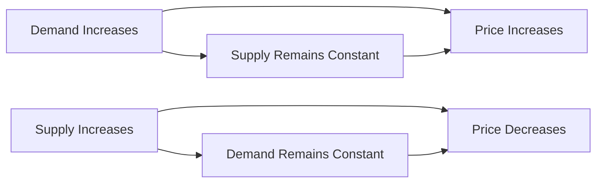

---

title: Effects_Of_Shift_In_Demand_And_Supply
type: Atomic Note
course: Economics
semester: Winter 2026
unit: '2'
hub: "[[2_Basics_Of_Economics_Hub]]"
source: "[[Chapter_2.pdf]]"
source_pages:
- 58
- 59
mode: ECON-MACRO
read: false
generated: true
prerequisites:
- "[[Market_Equilibrium]]"

---

# 1. Mental Model

Imagine you're at a school bake sale. If suddenly, everyone wants to buy more cupcakes because they're your favorite, but the number of cupcakes available doesn't change, the price will go up. But if the bakers can make more cupcakes, the price might not go up as much. This shows how changes in how much people want something (demand) and how much is available (supply) can affect the price.

# 2. Economic Theory

The [[Effects_Of_Shift_In_Demand_And_Supply]] refer to the changes in [[Market_Equilibrium]] that occur when there is a shift in the [[Demand_Curve]] or the [[Supply_Schedule]], or both. A shift in demand or supply, assuming [[Ceteris_Paribus]], will lead to a new equilibrium price and quantity, which can result in a [[Surplus_And_Shortage]] in the market. The magnitude of the change in price and quantity depends on the [[Price_Elasticity_Of_Demand]] and [[Price_Elasticity_Of_Supply]].

# 3. Economic Model



## 4. Walkthrough

* The demand for a product increases, but the supply remains constant, leading to a shortage and an increase in price.
* If the demand remains constant, but the supply of a product increases, it leads to a surplus and a decrease in price.
* For example, at a school bake sale, if everyone wants to buy more cupcakes (demand increases) but the bakers can't make more (supply remains constant), the price of cupcakes will go up.
* Conversely, if the bakers can make more cupcakes (supply increases) and the demand remains the same, the price of cupcakes will go down.

## 5. Market Failures

This concept can fail when there are external factors that affect demand or supply, such as government interventions or changes in consumer preferences. Additionally, if the market is not perfectly competitive, firms may have pricing power, leading to inefficiencies. Edge cases to watch out for include situations where demand or supply is highly inelastic, leading to large price changes.

---

## 6. The Proving Grounds

```interactive-quiz

[
  {
    "id": "q1",
    "type": "true_false",
    "difficulty": "L1",
    "question": "A shift in demand alone will always lead to a change in the equilibrium price, regardless of the supply curve's elasticity.",
    "answer": false,
    "explanation": "When there is a shift in demand, the effect on the equilibrium price depends on the elasticity of the supply curve. If the supply curve is perfectly elastic, a shift in demand will lead to a change in the equilibrium quantity, but the price will remain constant. However, if the supply curve is perfectly inelastic, a shift in demand will lead to a change in the equilibrium price, but the quantity will remain constant. Therefore, it's not accurate to say that a shift in demand alone will always lead to a change in the equilibrium price, as the response depends on the characteristics of the supply curve."
  },
  {
    "id": "q2",
    "type": "synthesis",
    "difficulty": "L2",
    "question": "The school's annual music festival is approaching, and suddenly, there is a surge in demand for portable music players. However, a severe storm has damaged the manufacturing plant of the only supplier of these players, reducing the supply by 30%. The school's music club, which is the main buyer of these players, has to decide how to procure them. If the music club was initially planning to buy 100 players at $50 each, but the demand has increased to 150 players due to the festival, and the supplier can only provide 70 players due to the damage, how should the music club proceed to meet the demand?",
    "answer": "The music club should first prioritize procuring the 70 available players from the supplier at the original price of $50 each. To meet the remaining demand of 80 players (150 - 70), the club could consider alternative suppliers or negotiate with the current supplier for potential alternatives such as backordering or expedited shipping at an additional cost. If no alternatives are available, the club may need to consider renting or purchasing alternative music equipment. However, given the scenario's constraints, a feasible approach would be to look for other suppliers or second-hand markets. Assuming they find another supplier who can provide the remaining 80 players at $60 each, the total cost would be (70 * $50) + (80 * $60) = $3500 + $4800 = $8300.",
    "explanation": "The surge in demand for portable music players due to the music festival, coupled with a reduction in supply caused by the storm damage to the manufacturing plant, illustrates a classic case of a shift in demand and supply curves. Initially, the demand curve shifts to the right (increased demand), while the supply curve shifts to the left (reduced supply). This dual shift leads to a change in the market equilibrium. The initial equilibrium price and quantity were $50 and 100 units, respectively. With the reduced supply (70 units) and increased demand (150 units), there's a shortage of 80 units. The music club's decision-making process involves understanding these shifts and their impact on price and availability. By procuring from the existing supplier and then seeking alternative sources for the remaining demand, the club is effectively trying to mitigate the effects of these shifts on the market equilibrium."
  },
  {
    "id": "q3",
    "type": "writing",
    "difficulty": "L3",
    "question": "Explain how a shift in demand affects market equilibrium when the supply curve remains constant,",
    "answer": "A shift in demand, with a constant supply curve, leads to a change in market equilibrium, where the new equilibrium price and quantity are determined by the intersection of the shifted demand curve and the original supply curve. If demand increases, the equilibrium price and quantity will rise, and if demand decreases, they will fall.",
    "explanation": "When demand shifts, it alters the point at which the supply and demand curves intersect, thus changing the market equilibrium. The supply curve's position remains unchanged, but the increased or decreased willingness of consumers to pay affects the equilibrium price and quantity. For instance, an increase in demand causes consumers to be willing to pay a higher price, driving up the equilibrium price and quantity, while a decrease in demand has the opposite effect."
  }
]

```