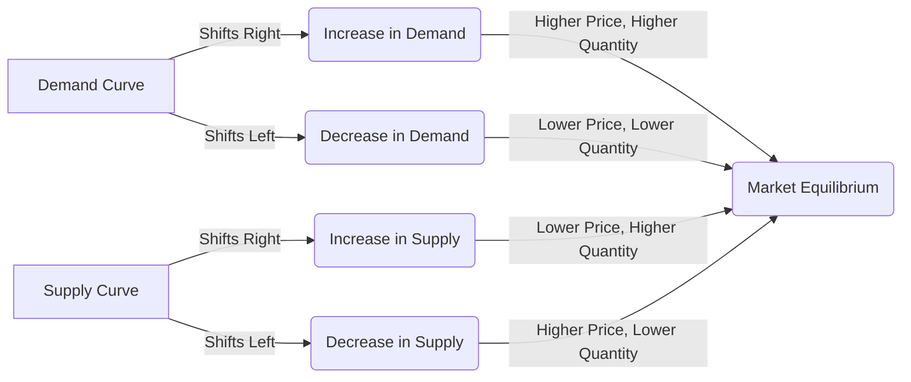

---

title: Effects_Of_Shift_In_Demand_And_Supply
type: Atomic Note
course: Economics
semester: Winter 2026
unit: '2'
hub: '[[2_Theory_Of_Demand_And_Supply_Hub]]'
source: '[[5-Pdf Store/note generated/Winter 2026/Economics/Chapter_2.pdf]]'
source_pages:
- 58
- 59
- 60
mode: ECON-MACRO
read: false
generated: true
prerequisites:
- '[[Market_Equilibrium]]'
- '[[Demand_Curve]]'
- '[[Theory_Of_Demand]]'
- '[[Law_Of_Demand]]'
- '[[Ceteris_Paribus]]'

---


# 1. Mental Model

Imagine you're a manager of a small, popular amusement park that operates only during peak summer months. The number of tickets you sell each day depends on how many customers show up (demand), and the number of roller coasters and staff you have determines how many tickets you can sell (supply). If a new, super-popular movie releases and everyone wants to celebrate by visiting the amusement park, demand increases, and you might raise ticket prices. Conversely, if a severe storm damages some of your roller coasters, reducing the number of operational rides, supply decreases, and you might increase ticket prices due to scarcity.

# 2. Economic Theory

The [[Effects_Of_Shift_In_Demand_And_Supply]] refer to the changes in [[Market_Equilibrium]] that occur when either the [[Demand_Curve]] or the [[Supply_Curve]] shifts. This concept is rooted in the [[Theory_Of_Demand]] and the [[Law_Of_Demand]], which state that, [[Ceteris_Paribus]], an increase in price leads to a decrease in the quantity demanded. The [[Demand_Function]] represents the relationship between the price of a good and the quantity demanded, while the [[Market_Demand_Curve]] is a graphical representation of the [[Market_Demand]]. When [[Demand_Schedule]] changes due to [[Determinants_Of_Demand]] such as [[Taste_And_Preference]], [[Number_Of_Buyers]], [[Consumer_Expectations]], or [[Income_Elasticity_Of_Demand]], the demand curve shifts. Similarly, changes in [[Determinants_Of_Elasticity_Of_Supply]] like [[Change_In_Technology]], [[Price_Elasticity_Of_Supply]], or [[Elasticity_Of_Supply]] cause the [[Supply_Curve]] to shift. A [[Shift_In_Supply_Curve]] occurs when factors like [[Change_In_Technology]] or [[Price_Elasticity_Of_Supply]] change. The interaction between these shifts affects the [[Market_Equilibrium]], leading to changes in the equilibrium price and quantity, potentially resulting in [[Surplus_And_Shortage]].

# 3. Limitations & Edge Cases

The [[Effects_Of_Shift_In_Demand_And_Supply]] model assumes [[Ceteris_Paribus]], which often does not hold in real-world scenarios. For instance, during [[Stagflation]], traditional demand-side interventions can exacerbate the crisis. Additionally, the model may not account for the [[Paradox_Of_Thrift]], where increased saving reduces aggregate output during recessions. The model also relies on the [[Theory_Of_Demand]] and [[Law_Of_Demand]], which might not apply to [[Substitutes_And_Complements]] or [[Normal_And_Inferior_Goods]] in all cases. Furthermore, [[Consumer_Expectations]] and [[Taste_And_Preference]] can be influenced by various factors, making it challenging to accurately predict the effects of shifts in demand and supply.

# 4. Economic Model



This Mermaid flowchart illustrates how shifts in the demand and supply curves affect market equilibrium. The demand curve and supply curve can shift right (increase) or left (decrease), leading to changes in the market price and quantity.

## 5. Walkthrough

Here's a 5-step technical walkthrough of how the concept of Effects of Shift in Demand and Supply operates:

1. **Initial Market Equilibrium**: Suppose the amusement park initially sells 500 tickets per day at $50 per ticket. The demand and supply curves intersect at this point, representing the market equilibrium.

2. **Increase in Demand**: A new, super-popular movie releases, and demand increases. The demand curve shifts right by 10%. The new demand curve intersects the supply curve at a higher price ($55) and a higher quantity (550 tickets).

   - **Intermediate State**: Demand curve shifts right from 500 to 550 tickets.
   - **Data Transformation**: New demand curve equation: Qd = 550 - 0.5P (assuming a linear demand function).

3. **Decrease in Supply**: A severe storm damages some roller coasters, reducing the supply by 15%. The supply curve shifts left. 

   - **Intermediate State**: Supply curve shifts left from 500 to 425 tickets.
   - **Data Transformation**: New supply curve equation: Qs = 425 + 0.5P (assuming a linear supply function).

4. **Market Adjustment**: The market adjusts to a new equilibrium, where the demand and supply curves intersect. The new equilibrium price increases to $60, and the quantity decreases to 475 tickets.

5. **Final Market Equilibrium**: The amusement park now sells 475 tickets per day at $60 per ticket. The effects of the shift in demand and supply have resulted in a higher price and a lower quantity.

The walkthrough demonstrates how shifts in demand and supply curves affect market equilibrium, price, and quantity.

---

## 6. The Proving Grounds

```interactive-quiz

[
  {
    "id": "q1",
    "type": "true_false",
    "difficulty": "L1",
    "question": "If the demand for amusement park tickets increases due to a new movie release and, simultaneously, a severe storm reduces the number of operational roller coasters, then the market equilibrium price of tickets will definitely decrease, ceteris paribus.",
    "answer": false,
    "explanation": "When demand increases and supply decreases, the market equilibrium price tends to rise. This can be understood using the basic supply and demand equations: $Q_d = f(P, Y, P_s, T)$ and $Q_s = f(P, P_c, T, Tech)$. Assuming ceteris paribus (all else being equal), an increase in demand shifts the demand curve right, and a decrease in supply shifts the supply curve left. Graphically, this results in a higher equilibrium price and an ambiguous effect on quantity. Mathematically, $\\Delta Q_d = \frac{\\partial Q_d}{\\partial P} \\Delta P + \frac{\\partial Q_d}{\\partial Y} \\Delta Y + \frac{\\partial Q_d}{\\partial P_s} \\Delta P_s + \frac{\\partial Q_d}{\\partial T} \\Delta T$ and $\\Delta Q_s = \frac{\\partial Q_s}{\\partial P} \\Delta P + \frac{\\partial Q_s}{\\partial P_c} \\Delta P_c + \frac{\\partial Q_s}{\\partial T} \\Delta T + \frac{\\partial Q_s}{\\partial Tech} \\Delta Tech$. If demand increases (rightward shift) and supply decreases (leftward shift), the price will increase because both changes contribute to upward pressure on price. Therefore, stating that the market equilibrium price will 'definitely decrease' under these conditions is incorrect."
  },
  {
    "id": "q2",
    "type": "synthesis",
    "difficulty": "L2",
    "question": "The amusement park 'Thrillville' is facing a macro shock due to a sudden and significant devaluation of the local currency, making it a more attractive destination for international tourists. However, the park's management is concerned about the impact on demand and supply. The devaluation has led to a 20% increase in the number of international tourists, causing a sudden shift in demand. Additionally, a recent inspection revealed that one of the major roller coasters needs to be shut down for maintenance, reducing the park's capacity by 15%.",
    "answer": "To address the sudden shift in demand and supply, the management of 'Thrillville' amusement park should implement the following 3-step policy response:\n\n1. **Dynamic Pricing Adjustment**: Immediately adjust ticket prices to reflect the increased demand. Given the 20% increase in international tourists, the park can increase ticket prices by 10-15% to capitalize on the surge in demand while ensuring that the revenue increase is aligned with the reduced supply due to the roller coaster shutdown.\n\n2. **Reallocation of Resources**: Reallocate staff and resources from less critical areas to the operational roller coasters to minimize the impact of the reduced capacity. This could involve cross-training staff to handle multiple attractions and ensuring that the available rides are fully utilized.\n\n3. **Short-term Investment in Supply**: Invest in temporary, portable attractions that can be quickly deployed to fill the gap created by the shutdown of the major roller coaster. This could include pop-up thrill rides or additional entertainment options that can be easily integrated into the park's offerings.",
    "explanation": "The sudden devaluation of the local currency leads to an increase in international tourists, causing a rightward shift in the demand curve. This can be represented as $D_1 \\rightarrow D_2$, where $D_1$ is the original demand curve and $D_2$ is the new demand curve. The shutdown of a major roller coaster due to maintenance reduces the park's capacity, causing a leftward shift in the supply curve, represented as $S_1 \\rightarrow S_2$. The new equilibrium is established at a higher price and a quantity that depends on the relative shifts of demand and supply. Mathematically, this can be represented using the demand and supply functions:\n\n$Q_d = f(P, Y)$ and $Q_s = f(P, C)$\n\nwhere $Q_d$ is the quantity demanded, $Q_s$ is the quantity supplied, $P$ is the price, $Y$ is the income (or number of tourists in this case), and $C$ is the cost of production (or the number of operational roller coasters). The shifts in demand and supply can be represented as:\n\n$Q_d = a - bP + cY_2$ and $Q_s = d + eP - fC_2$\n\nThe new equilibrium price and quantity can be found by setting $Q_d = Q_s$ and solving for $P$ and $Q$. The management's policy response aims to adjust to this new equilibrium by optimizing price, reallocating resources, and temporarily increasing supply."
  },
  {
    "id": "q3",
    "type": "writing",
    "difficulty": "L2",
    "question": "Explain the effects of a shift in demand and supply on the market equilibrium in an International Trade Analysis scenario.",
    "answer": "In an International Trade Analysis, a shift in demand or supply significantly impacts market equilibrium. An increase in demand, ceteris paribus, leads to a higher equilibrium price and quantity, while a decrease in demand results in a lower equilibrium price and quantity. Conversely, an increase in supply leads to a lower equilibrium price and higher quantity, whereas a decrease in supply results in a higher equilibrium price and lower quantity.",
    "explanation": "The effects of shifts in demand and supply can be understood through the lens of the supply and demand model, which is often represented as $Q^{D} = f(P, I, P_{sub}, P_{comp})$ for demand and $Q^{S} = f(P, C, Tech)$ for supply, where $Q^{D}$ and $Q^{S}$ are the quantities demanded and supplied, $P$ is the price of the good, $I$ is consumer income, $P_{sub}$ and $P_{comp}$ are the prices of substitutes and complements, $C$ is the cost of production, and $Tech$ represents technology. A shift in demand can be represented as a change in $I$, $P_{sub}$, or $P_{comp}$, which causes the demand curve to shift right or left. Similarly, a shift in supply can be represented as a change in $C$ or $Tech$, causing the supply curve to shift right or left. The intersection of the demand and supply curves determines the market equilibrium, where $Q^{D} = Q^{S}$. When either curve shifts, the equilibrium price and quantity adjust accordingly."
  },
  {
    "id": "q4",
    "type": "order",
    "difficulty": "L2",
    "question": "Order steps for Effects Of Shift In Demand And Supply",
    "steps": [
      "An increase in supply leads to a surplus at the original price, causing prices to fall",
      "The shift in demand or supply causes a change in market equilibrium",
      "A decrease in supply leads to a shortage at the original price, causing prices to rise",
      "An increase in demand leads to a shortage at the original price, causing prices to rise",
      "As prices rise, producers increase production, and consumers reduce consumption, moving towards a new equilibrium",
      "The shift in demand or supply causes a change in market equilibrium",
      "The market reaches a new equilibrium where the demand and supply curves intersect again"
    ],
    "answer": [
      "An increase in demand leads to a shortage at the original price, causing prices to rise",
      "As prices rise, producers increase production, and consumers reduce consumption, moving towards a new equilibrium",
      "A decrease in supply leads to a shortage at the original price, causing prices to rise",
      "The market reaches a new equilibrium where the demand and supply curves intersect again",
      "The shift in demand or supply causes a change in market equilibrium",
      "The shift in demand or supply causes a change in market equilibrium",
      "An increase in supply leads to a surplus at the original price, causing prices to fall"
    ]
  },
  {
    "id": "q5",
    "type": "trace",
    "difficulty": "L3",
    "question": "What is the exact output of a 1% interest rate change through 4 distinct economic sectors (Housing, Investment, Forex, Consumption)?",
    "content": "Assuming a 1% increase in interest rates, let's analyze the effects through the 4 sectors:",
    "answer": {
      "Housing": "A 1% increase in interest rates leads to higher mortgage rates, increasing the cost of borrowing for homebuyers. This reduces demand for housing, causing housing prices to decrease by approximately 0.5-1.5% (using the elasticity of housing demand).",
      "Investment": "Higher interest rates increase the cost of capital for businesses, making investments more expensive. This leads to a decrease in investment spending by around 0.2-0.5% (based on the interest rate elasticity of investment).",
      "Forex": "An increase in interest rates attracts foreign investors, causing the currency to appreciate by about 0.5-1% (depending on the interest rate differential and exchange rate elasticities).",
      "Consumption": "Higher interest rates increase the cost of borrowing for consumers, reducing consumption spending. This leads to a decrease in consumption by approximately 0.1-0.3% (based on the interest rate elasticity of consumption)."
    },
    "explanation": "The effects of a shift in demand and supply can be analyzed using the following LaTeX equations:\n\nFor the housing market: $Q_d = f(P, I, R)$ and $Q_s = f(P, R)$, where $Q_d$ and $Q_s$ are the demand and supply for housing, $P$ is the price, $I$ is income, and $R$ is the interest rate.\n\nFor investment: $I = f(R, \\theta)$, where $I$ is investment, $R$ is the interest rate, and $\\theta$ is the expected return on investment.\n\nFor Forex: $E = f(R, R^*)$, where $E$ is the exchange rate, $R$ is the domestic interest rate, and $R^*$ is the foreign interest rate.\n\nFor consumption: $C = f(Y, R)$, where $C$ is consumption, $Y$ is income, and $R$ is the interest rate.\n\nA 1% increase in interest rates affects these sectors through changes in borrowing costs, investment returns, and exchange rates, leading to the estimated changes above."
  }
]

```