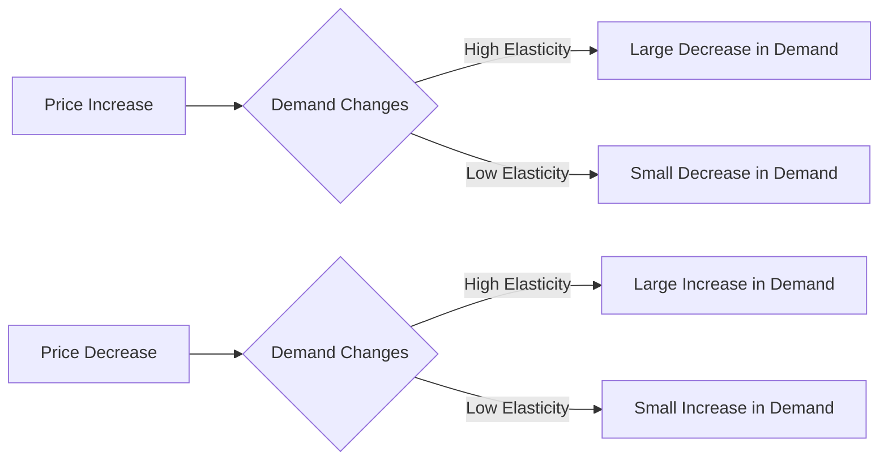

---

title: Elasticity_Of_Demand
type: Atomic Note
course: Economics
semester: Winter 2026
unit: '2'
hub: "[[2_Basics_Of_Economics_Hub]]"
source: "[[Chapter_2.pdf]]"
source_pages:
- 23
mode: ECON-MACRO
read: false
generated: true
prerequisites:
- "[[Demand_Function]]"

---

## 1. Mental Model

Imagine you really love buying your favorite video games, and they're usually priced at $60. One day, the store increases the price to $80. If you still buy the game but start to think twice about it, or look for cheaper alternatives, that means you are somewhat sensitive to the price change. But if the price drops to $40, and you buy even more games, that shows you're really responsive to price changes. This idea of how much you react to price changes is what economists call "elasticity of demand".

## 2. Economic Theory

[[Elasticity_Of_Demand]] refers to the responsiveness of the quantity demanded of a good to a change in its price or other influential factors. It is typically measured by the [[Price_Elasticity_Of_Demand]], which calculates the percentage change in quantity demanded in response to a 1% change in price, assuming [[Ceteris_Paribus]] (all else being equal). The elasticity of demand can be influenced by several factors including [[Determinants_Of_Demand]].

# 3. Economic Model



## 4. Walkthrough

* The flowchart starts with a price increase or decrease, which affects the demand for a product.
* The demand change is then evaluated based on the elasticity of demand, which determines the responsiveness of consumers to price changes.
* If the elasticity is high, a small price change leads to a large change in demand (e.g., a price increase leads to a large decrease in demand).
* If the elasticity is low, a small price change leads to a small change in demand (e.g., a price increase leads to a small decrease in demand).

## 5. Market Failures

The concept of elasticity of demand may fail in certain market situations, such as when there are no close substitutes for a product, or when consumers have limited information about prices. Additionally, external factors like changes in consumer preferences or income can also affect the elasticity of demand, leading to potential pitfalls in predicting demand responses to price changes.

---

## 6. The Proving Grounds

```interactive-quiz

[
  {
    "id": "q1",
    "type": "true_false",
    "difficulty": "L1",
    "question": "The elasticity of demand for a good is the same at all price levels.",
    "answer": false,
    "explanation": "The elasticity of demand measures how responsive the quantity demanded of a good is to a change in its price or other influential factors. It is not necessarily the same at all price levels because the responsiveness can vary depending on the initial price point and the range within which the price changes. For example, if the price of a video game increases from $60 to $80, you might start to think twice about buying it. However, if the price drops from $60 to $40, you might buy more games. This indicates that elasticity can change at different price levels due to changes in consumer behavior and the availability of substitutes."
  },
  {
    "id": "q2",
    "type": "synthesis",
    "difficulty": "L2",
    "question": "A luxury car brand, 'Speedster', usually sells its flagship model, 'Turbo', for $120,000. However, due to a surge in demand for eco-friendly vehicles, the brand's competitor, 'GreenRide', launches a similar luxury electric car for $90,000. In response, 'Speedster' decides to lower the price of 'Turbo' to $100,000. Meanwhile, a popular video game, 'RacingFrenzy', which is often bundled with the purchase of 'Turbo', sees its price increase from $60 to $80 due to a new game engine update. As a result, some customers start to look for alternative games. Analyze the elasticity of demand for 'Turbo' and 'RacingFrenzy' based on these scenarios.",
    "answer": "The demand for 'Turbo' is elastic because the price reduction from $120,000 to $100,000 in response to competition likely increases sales volume significantly, showing a high responsiveness to price changes. On the other hand, the demand for 'RacingFrenzy' is elastic as well because the price increase from $60 to $80 causes customers to look for alternative games, indicating a noticeable change in purchasing behavior in response to the price change.",
    "explanation": "The elasticity of demand measures how much the quantity demanded of a good responds to changes in the price of that good or related goods. For 'Turbo', the initial price of $120,000 and the competitor's similar product priced at $90,000 create a scenario where 'Speedster' must adjust its pricing strategy to remain competitive. By lowering the price to $100,000, 'Speedster' demonstrates an understanding that its customers are sensitive to price changes, especially when alternatives are available. This action suggests that the demand for 'Turbo' is elastic. For 'RacingFrenzy', the price increase leads customers to consider alternative games, which indicates that the demand for 'RacingFrenzy' is also elastic. This elasticity is due to customers' responsiveness to the price change, seeking cheaper options or substitutes."
  },
  {
    "id": "q3",
    "type": "writing",
    "difficulty": "L3",
    "question": "Explain the concept of elasticity of demand and its underlying mechanism deeply.",
    "answer": "Elasticity of demand refers to the responsiveness of the quantity demanded of a good to a change in its price or other influential factors, measured by the elasticity coefficient which is the percentage change in quantity demanded in response to a 1% change in price. A high elasticity indicates that the quantity demanded is very sensitive to price changes, while a low elasticity indicates that the quantity demanded is relatively insensitive to price changes. This concept helps businesses and policymakers understand how changes in market conditions will affect sales and revenue. The elasticity of demand can be influenced by factors such as the availability of substitutes, income level, and the proportion of income spent on the good.",
    "explanation": "The underlying mechanism of elasticity of demand is based on the law of demand, which states that as the price of a good increases, the quantity demanded decreases, and vice versa. The elasticity coefficient is calculated as the ratio of the percentage change in quantity demanded to the percentage change in price. This coefficient can be used to classify goods into elastic and inelastic categories. Elastic goods have an elasticity coefficient greater than 1, meaning that a small price change leads to a large change in quantity demanded. Inelastic goods have an elasticity coefficient less than 1, meaning that a large price change leads to a small change in quantity demanded. Understanding the elasticity of demand is crucial for businesses to make informed decisions about pricing and production, and for policymakers to design effective economic policies."
  }
]

```