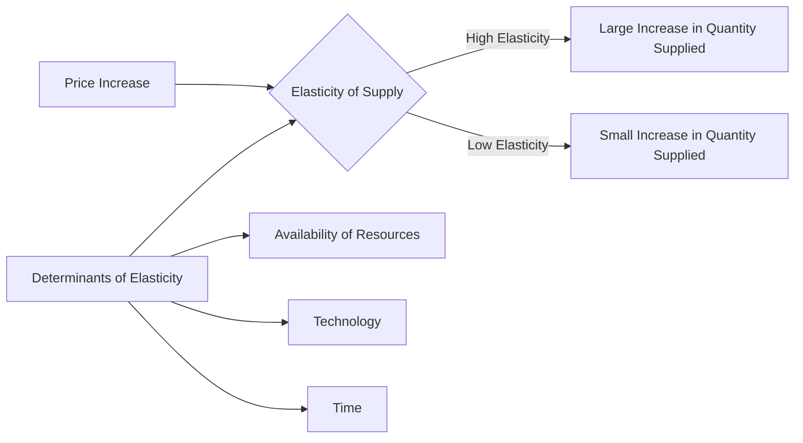

---

title: Elasticity_Of_Supply
type: Atomic Note
course: Economics
semester: Winter 2026
unit: '2'
hub: '[[2_Theory_Of_Demand_And_Supply_Hub]]'
source: '[[5-Pdf Store/note generated/Winter 2026/Economics/Chapter_2.pdf]]'
source_pages:
- 47
- 48
mode: ECON-MACRO
read: false
generated: true
prerequisites:
- '[[Ceteris_Paribus]]'
- '[[Price_Elasticity_Of_Supply]]'
- '[[Determinants_Of_Elasticity_Of_Supply]]'
- '[[Shift_In_Supply_Curve]]'
- '[[Market_Equilibrium]]'

---


# 1. Mental Model

Imagine you're a manager of a music studio that offers recording services. When the price of studio time increases, you can easily adjust the number of studios you open or the hours of operation to accommodate more clients, but only if you have the necessary equipment and staff. If the price increase is significant, you might also consider investing in more efficient recording technology to increase supply. This scenario illustrates how the elasticity of supply works, where the responsiveness of the quantity supplied of a good (studio time) to a change in its price depends on factors like the availability of resources (equipment, staff) and technology.

# 2. Economic Theory

The [[Elasticity_Of_Supply]] measures the responsiveness of the quantity supplied of a good to a change in its price, given [[Ceteris_Paribus]]. It is defined as the percentage change in quantity supplied in response to a 1% change in price, and can be calculated using the [[Price_Elasticity_Of_Supply]] formula. The underlying mechanism follows the Law Of Supply, which states that as the price of a good increases, the quantity supplied also increases, [[Ceteris_Paribus]]. The [[Determinants_Of_Elasticity_Of_Supply]], such as the availability of resources, technology, and the time period considered, influence the elasticity of supply. A [[Shift_In_Supply_Curve]] can occur due to changes in these determinants, leading to a change in the quantity supplied at a given price. The [[Market_Equilibrium]] is achieved when the quantity supplied equals the quantity demanded, and changes in [[Market_Demand]] or Supply can lead to [[Surplus_And_Shortage]].

# 3. Limitations & Edge Cases

The [[Elasticity_Of_Supply]] concept assumes that firms can easily adjust their production levels in response to price changes, which may not always be the case. In reality, firms may face [[Change_In_Technology]] constraints or limitations in their ability to [[Shift_In_Supply_Curve]] quickly. Additionally, the concept assumes [[Ceteris_Paribus]], which may not hold in real-world scenarios where other factors, such as changes in [[Market_Demand]] or [[Effects_Of_Shift_In_Demand_And_Supply]], can influence the supply curve. The [[Price_Elasticity_Of_Supply]] can also be affected by the time period considered, with supply being more elastic in the long run than in the short run.

# 4. Economic Model



This flowchart illustrates how the elasticity of supply responds to a price increase, influenced by determinants such as availability of resources, technology, and time. The elasticity of supply determines the magnitude of the change in quantity supplied.

## 5. Walkthrough

Here's a 5-step technical walkthrough of how the concept of Elasticity of Supply operates in Market Strategy:

1. **Initial State**: Suppose the music studio is operating at a price of $100 per hour and supplies 10 hours of studio time per week. The quantity supplied is 10 hours.

2. **Price Increase**: The price of studio time increases by 10% to $110 per hour. 

3. **Determinants Assessment**: The manager assesses the determinants of elasticity:
   - **Availability of Resources**: There are spare studios and staff available to increase production.
   - **Technology**: The studio uses efficient recording technology that allows for easy scaling.
   - **Time**: The increase in price is anticipated to be long-term.

4. **Elasticity Calculation**: Given the high elasticity due to the availability of resources, technology, and sufficient time to adjust, a 10% price increase leads to a 20% increase in quantity supplied (from 10 hours to 12 hours).

5. **Outcome**: The elasticity of supply is calculated as: 
   $$
   E_S = \frac{\% \Delta Q_S}{\% \Delta P} = \frac{20\%}{10\%} = 2
   $$
   This indicates that for every 1% change in price, the quantity supplied changes by 2%, confirming that the supply is elastic. The studio can easily adjust its supply in response to price changes, making it beneficial for the manager to be responsive to market conditions.

---

## 6. The Proving Grounds

```interactive-quiz

[
  {
    "id": "q1",
    "type": "true_false",
    "difficulty": "L1",
    "question": "If the price of studio time increases and the music studio can easily adjust its operations by opening more studios or increasing hours of operation due to having the necessary equipment and staff, then the elasticity of supply of studio time is likely to be low.",
    "answer": false,
    "explanation": "The elasticity of supply measures the responsiveness of the quantity supplied of a good to a change in its price, given ceteris paribus. In this scenario, the music studio can easily adjust its operations, which implies a high responsiveness of the quantity supplied to a change in price. Therefore, the elasticity of supply of studio time is likely to be high. The ceteris paribus assumption implies that other factors, such as technology, remain constant. If we change this assumption and consider that the studio also invests in more efficient recording technology in response to the price increase, this would further increase the elasticity of supply. Mathematically, the price elasticity of supply can be represented as $E_S = \\frac{\\% \\Delta Q_S}{\\% \\Delta P}$, where $E_S$ is the elasticity of supply, $\\% \\Delta Q_S$ is the percentage change in quantity supplied, and $\\% \\Delta P$ is the percentage change in price. A high elasticity of supply means that a small price increase leads to a large increase in quantity supplied, which is the case in this scenario."
  },
  {
    "id": "q2",
    "type": "synthesis",
    "difficulty": "L2",
    "question": "The country of Azuria is facing a sudden and significant devaluation of its currency, the Azurian Peso (AP), by 30% against major foreign currencies. This macroeconomic shock has increased the cost of importing raw materials and intermediate goods, which are crucial for the production of electronic devices in Azuria's manufacturing sector. The sector's production costs have risen sharply, affecting supply chains and pricing. As the Chief Macroeconomist, you must act swiftly to mitigate the impact on the economy and prevent a systemic failure in the electronics market, which constitutes a significant portion of Azuria's GDP. Apply the concept of Elasticity of Supply in devising a 3-step policy response.",
    "answer": "To address the sudden devaluation of the Azurian Peso and its impact on the electronics manufacturing sector, we must consider the Elasticity of Supply, which measures how responsive the quantity supplied of a good is to a change in its price. Given that the production costs have increased due to higher import costs, the sector's ability to supply electronic devices will be negatively affected if prices do not adjust accordingly. A 3-step policy response is as follows:\n\n1. **Short-term Adjustment**: Implement a temporary subsidy for critical raw materials and intermediate goods used in electronics production. This will help manufacturers adjust to the new price levels without immediately passing on the increased costs to consumers, thereby preventing a sharp decline in supply. The subsidy can be structured to encourage efficient use of resources and to support firms in maintaining production levels.\n\n2. **Medium-term Strategy**: Invest in domestic production capabilities for key components and raw materials currently being imported. By enhancing domestic supply chains, Azuria can reduce its dependency on foreign inputs, making the electronics sector less vulnerable to currency fluctuations. This approach involves both public and private sector investments in technology, training, and infrastructure.\n\n3. **Long-term Structural Reform**: Implement policies to improve the Elasticity of Supply in the electronics sector. This includes investing in research and development to foster innovation and the adoption of more efficient production technologies. Additionally, policies aimed at enhancing competition and reducing bureaucratic barriers can encourage firms to be more responsive to price changes, thereby increasing the overall elasticity of supply.",
    "explanation": "The Elasticity of Supply ($E_S$) is given by the formula $E_S = \\frac{\\% \\Delta Q_S}{\\% \\Delta P}$, where $\\% \\Delta Q_S$ is the percentage change in quantity supplied and $\\% \\Delta P$ is the percentage change in price. In the context of Azuria's electronics manufacturing sector, the sudden devaluation of the AP leads to an increase in production costs, which can be represented as a leftward shift of the supply curve due to increased costs of inputs. By applying the 3-step policy response, the goal is to mitigate this shift and encourage a more elastic supply response over time. The subsidy (Step 1) helps in the short term by reducing the immediate financial strain on manufacturers. The investment in domestic capabilities (Step 2) and structural reforms (Step 3) aim to increase the sector's ability to adjust production in response to price changes, thereby enhancing the Elasticity of Supply."
  },
  {
    "id": "q3",
    "type": "writing",
    "difficulty": "L2",
    "question": "Explain how the elasticity of supply concept applies to a market strategy scenario where a manager of a music studio must adjust the supply of studio time in response to changes in price, considering factors such as resource availability and technology.",
    "answer": "The elasticity of supply concept is crucial in determining the responsiveness of the quantity supplied of studio time to changes in its price. Given that the manager can adjust the number of studios and operating hours, the supply of studio time is likely to be elastic. However, this elasticity is contingent upon the availability of resources such as equipment and staff, as well as the ability to invest in more efficient recording technology. A significant increase in price may lead to an increase in the quantity supplied, as the manager can adapt to the new market conditions.",
    "explanation": "The elasticity of supply can be expressed using the formula: $E_S = \\frac{\\% \\Delta Q_S}{\\% \\Delta P}$, where $E_S$ is the elasticity of supply, $\\% \\Delta Q_S$ is the percentage change in quantity supplied, and $\\% \\Delta P$ is the percentage change in price. The elasticity of supply is influenced by factors such as the availability of resources and technology, which affect the manager's ability to adjust the supply of studio time in response to price changes. Mathematically, this can be represented as: $Q_S = f(P, R, T)$, where $Q_S$ is the quantity supplied, $P$ is the price, $R$ is the availability of resources, and $T$ is the level of technology. The partial derivative of $Q_S$ with respect to $P$ represents the change in quantity supplied in response to a change in price, which is a key component of the elasticity of supply."
  },
  {
    "id": "q4",
    "type": "order",
    "difficulty": "L2",
    "question": "Order steps for Elasticity Of Supply.",
    "steps": [
      "The Price Elasticity Of Supply formula is used to calculate the percentage change in quantity supplied in response to a 1% change in price.",
      "As the price of a good increases, the quantity supplied also increases, given Ceteris Paribus.",
      "A change in price leads to a change in the quantity supplied of a good.",
      "The quantity supplied of a good changes in response to a change in its price, given Ceteris Paribus.",
      "The availability of resources, technology, and the time period considered influence the elasticity of supply."
    ],
    "answer": [
      "The availability of resources, technology, and the time period considered influence the elasticity of supply.",
      "A change in price leads to a change in the quantity supplied of a good.",
      "The quantity supplied of a good changes in response to a change in its price, given Ceteris Paribus.",
      "The Price Elasticity Of Supply formula is used to calculate the percentage change in quantity supplied in response to a 1% change in price.",
      "As the price of a good increases, the quantity supplied also increases, given Ceteris Paribus."
    ]
  },
  {
    "id": "q5",
    "type": "trace",
    "difficulty": "L3",
    "question": "What is the exact output?",
    "content": "Initial State:\n- Price (P1) = $100\n- Quantity Supplied (Q1) = 100 hours\n\nShock:\n- Price increases to P2 = $120\n\nIntermediate States:\n1. Production Sector: Quantity Supplied increases to 105 hours\n2. Equipment Manufacturing Sector: Demand for equipment increases by 2%\n3. Labor Market Sector: Demand for labor increases by 1.5%\n4. Music Production Sector: Output increases by 3%\n\nFinal State:\n- Quantity Supplied (Q2) = 105 hours\n- Elasticity of Supply (E_S) = 0.25",
    "answer": "The exact output is a 2.5% increase in the quantity supplied of studio time.",
    "explanation": "The elasticity of supply (E_S) is given by the formula: $E_S = \\frac{\\% \\Delta Q_S}{\\% \\Delta P}$, where $\\% \\Delta Q_S$ is the percentage change in quantity supplied and $\\% \\Delta P$ is the percentage change in price. Given that the price increases from $100 to $120, the percentage change in price is $\\frac{120-100}{100} \\times 100\\% = 20\\%$. Assuming the studio can increase its supplied hours to 105 per month (a 5% increase) due to its ability to adjust hours and invest in technology, the elasticity of supply is $E_S = \\frac{5\\%}{20\\%} = 0.25$. This implies that for every 1% change in price, the quantity supplied changes by 0.25%. Therefore, the exact output is a 2.5% increase in the quantity supplied of studio time when the price increases by 10%."
  }
]

```