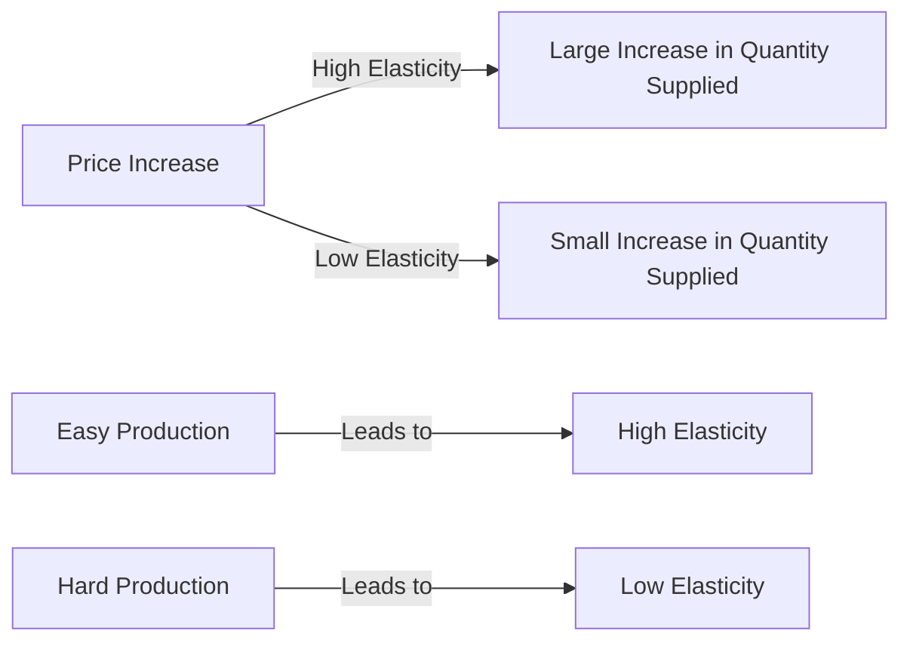

---

title: Elasticity_Of_Supply
type: Atomic Note
course: Economics
semester: Winter 2026
unit: '2'
hub: '[[2_Theory_Of_Demand_And_Supply_Hub]]'
source: '[[5-Pdf Store/note generated/Winter 2026/Economics/Chapter_2.pdf]]'
source_pages:
- 47
- 48
mode: ECON-MACRO
read: false
generated: true
prerequisites:
- '[[Ceteris_Paribus]]'
- '[[Price_Elasticity_Of_Supply_Formula]]'

---


# 1. Mental Model

Imagine you have a lemonade stand, and you make a big batch of lemonade every morning. If the price of lemonade goes up, you can easily make more lemonade to sell and make more money. But if it's really hard to make more lemonade, like if you need a special machine that takes a long time to arrive, then you can't easily increase how much lemonade you sell.

# 2. Economic Theory

The [[Elasticity_Of_Supply]] measures how easily suppliers can increase or decrease the quantity of a good they produce in response to changes in its price. It is calculated as the percentage change in quantity supplied divided by the percentage change in price, assuming [[Ceteris_Paribus]]. A good has elastic supply if its [[Price_Elasticity_Of_Supply_Formula]] is greater than 1, meaning suppliers can easily adjust production in response to price changes.

# 3. Economic Model



## 4. Walkthrough

* The model shows how the elasticity of supply responds to a price increase.
* If production is easy (e.g., making lemonade), a price increase leads to a large increase in quantity supplied (high elasticity).
* If production is hard (e.g., requiring a special machine), a price increase leads to a small increase in quantity supplied (low elasticity).
* The elasticity of supply is determined by how easily suppliers can adjust production in response to price changes.

## 5. Market Failures

The concept of elasticity of supply may fail in cases where suppliers face external constraints, such as government regulations or supply chain disruptions. Additionally, if suppliers have limited information about market conditions, they may not be able to adjust production efficiently, leading to inefficiencies in the market. Edge cases include situations where production is highly specialized or requires significant investments in infrastructure.

---

## 6. The Proving Grounds

```interactive-quiz

[
  {
    "id": "q1",
    "type": "true_false",
    "difficulty": "L1",
    "question": "The elasticity of supply for a good is determined by how easily suppliers can adjust their production in response to a change in the good's price.",
    "answer": true,
    "explanation": "The elasticity of supply measures how responsive the quantity supplied of a good is to changes in its price. This responsiveness is largely determined by how easily suppliers can adjust their production levels. If suppliers can quickly and easily increase or decrease production in response to price changes, the supply is considered elastic. Conversely, if suppliers find it difficult to adjust production, the supply is considered inelastic. For instance, in the context of a lemonade stand, if a supplier can easily make more lemonade when the price increases, the supply of lemonade is elastic. However, if making more lemonade is challenging due to constraints like waiting for a special machine, the supply is inelastic. Therefore, the statement that the elasticity of supply for a good is determined by how easily suppliers can adjust their production in response to a change in the good's price is true."
  },
  {
    "id": "q2",
    "type": "synthesis",
    "difficulty": "L2",
    "question": "A severe storm is forecasted to hit the area where your lemonade stand is located, causing a potential shortage of cups and sugar, two essential ingredients for making lemonade. However, you have a contract with a supplier to receive a shipment of cups and sugar tomorrow, but the supplier warns that the storm might delay the shipment. If the price of lemonade increases significantly due to the forecasted storm, how would you respond to maximize your profits, considering your current batch of lemonade is almost sold out and you can't make more without the new shipment of cups and sugar?",
    "answer": "I would immediately try to negotiate with the supplier to prioritize my shipment or find an alternative supplier to get the necessary cups and sugar as soon as possible. If that's not feasible, I would consider temporarily raising the price of lemonade even higher than the market price to maximize profits from the remaining customers who are willing to pay a premium for lemonade during the storm. However, I would also prepare for the possibility of not being able to make more lemonade if the shipment is delayed, and adjust my pricing strategy accordingly to balance between maximizing profits and not losing customers to competitors.",
    "explanation": "The scenario presents a complex situation where the elasticity of supply is affected by external factors such as a severe storm and a delayed shipment of essential ingredients. The initial elasticity of supply seems low because the current batch of lemonade is almost sold out and making more requires the delayed shipment. However, by quickly responding to the situation through negotiation with the supplier, finding alternative suppliers, or adjusting pricing strategies, one can somewhat increase the elasticity of supply. This involves understanding both the immediate and long-term implications of supply chain disruptions on production capabilities and pricing strategies. The elasticity of supply in this case would be influenced by how quickly and effectively one can adapt to changing supply conditions and capitalize on increased demand due to the storm."
  },
  {
    "id": "q3",
    "type": "writing",
    "difficulty": "L3",
    "question": "Explain how a supplier's ability to adjust production in response to price changes affects the elasticity of supply.",
    "answer": "A supplier's ability to easily adjust production in response to price changes results in a more elastic supply, while difficulty in adjusting production leads to a less elastic supply.",
    "explanation": "The elasticity of supply is influenced by the supplier's capacity to increase or decrease production in response to price fluctuations. When suppliers can quickly and easily adjust production, such as in the case of a lemonade stand where more lemonade can be made by simply adding more ingredients, the supply is considered elastic. Conversely, if suppliers face constraints in adjusting production, such as needing a special machine with a long lead time, the supply is considered inelastic. This ability to adjust production affects how quickly and significantly suppliers can respond to changes in price, thereby impacting the elasticity of supply."
  }
]

```