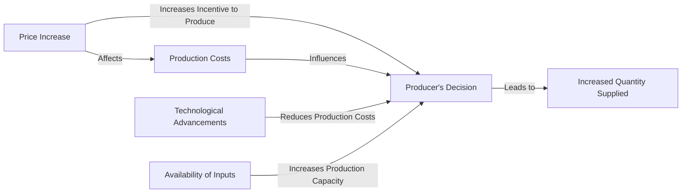

---

title: Elasticity_Of_Supply
type: Atomic Note
course: Economics
semester: Winter 2026
unit: '2'
hub: '[[2_Theory_Of_Demand_And_Supply_Hub]]'
source: '[[5-Pdf Store/note generated/Winter 2026/Economics/Chapter_2.pdf]]'
source_pages:
- 47
mode: ECON-MACRO
read: false
generated: true
prerequisites:
- '[[Ceteris_Paribus]]'
- '[[Price_Elasticity_Of_Supply]]'
- '[[Determinants_Of_Elasticity_Of_Supply]]'
- '[[Shift_In_Supply_Curve]]'

---


# 1. Mental Model

Imagine you have a lemonade stand. The amount of lemonade you can supply depends on how much lemon juice, sugar, and water you have. If the price of lemonade increases, you might be able to make more lemonade by buying more ingredients. The elasticity of supply is like measuring how easily you can make more lemonade when the price increases. It's about how quickly you can change the amount of lemonade you supply when the price changes.

# 2. Economic Theory

The elasticity of supply is a fundamental concept in economics that measures the responsiveness of the quantity supplied of a good to a change in its price, while [[Ceteris_Paribus]] holds other factors constant. It is defined as the percentage change in quantity supplied in response to a 1% change in price, and can be calculated using the formula: $$E_S = \frac{\% \Delta Q_S}{\% \Delta P}$$. The [[Price_Elasticity_Of_Supply]] can be elastic, unit elastic, or inelastic, depending on whether the percentage change in quantity supplied is greater than, equal to, or less than the percentage change in price. The [[Determinants_Of_Elasticity_Of_Supply]], such as the availability of inputs, technology, and time, influence the elasticity of supply. A supply curve [[Shift_In_Supply_Curve]] can result from changes in these determinants, affecting the [[Market_Equilibrium]].

# 3. Market Failures

The elasticity of supply concept has limitations, particularly when considering [[Market_Equilibrium]] disruptions. For instance, during a severe drought, the supply of agricultural products may be severely constrained, making it difficult for suppliers to respond to price changes, even if the price increases significantly. This situation highlights the importance of considering [[Surplus_And_Shortage]] and the [[Effects_Of_Shift_In_Demand_And_Supply]] on market outcomes. Additionally, the assumption of [[Ceteris_Paribus]] may not hold in real-world scenarios, where multiple factors can influence supply simultaneously, leading to complexities in predicting supply responses to price changes. Furthermore, the elasticity of supply may not be constant over time, as suppliers may adjust their production capacity and technology in response to changing market conditions, affecting the [[Price_Elasticity_Of_Supply]].

# 4. Economic Model



This Mermaid flowchart illustrates the elasticity of supply concept. It shows how a price increase affects producers' decisions to supply more of a good, influenced by factors such as production costs, technological advancements, and availability of inputs.

## 5. Walkthrough

Here's a 5-step technical walkthrough of how the concept of elasticity of supply operates:

1. **Initial State**: Suppose a lemonade stand initially supplies 100 cups of lemonade per day at a price of $1 per cup. The producer's cost of production is $0.50 per cup.

2. **Price Increase**: The price of lemonade increases to $1.50 per cup. This 50% price increase gives the producer an incentive to produce more.

3. **Producer's Decision**: With the higher price, the producer decides to increase production. Assuming technological advancements allow for more efficient production, the cost per cup decreases to $0.40.

4. **Increased Quantity Supplied**: The producer increases the quantity supplied to 150 cups per day, taking advantage of the higher price and improved production efficiency.

5. **Elasticity Calculation**: The percentage change in quantity supplied is 50% (($$\frac{150-100}{100}$$ * 100), and the percentage change in price is 50% (($$\frac{1.50-1}{1}$$ * 100). Using the elasticity of supply formula: $$E_S = \frac{\% \Delta Q_S}{\% \Delta P} = \frac{50}{50} = 1$$, which indicates unit elasticity.

The elasticity of supply measures how responsive the quantity supplied is to a change in price, influenced by factors such as production costs, technology, and input availability.

---

## 6. The Proving Grounds

```interactive-quiz

[
  {
    "id": "q1",
    "type": "true_false",
    "difficulty": "L1",
    "question": "A supply chain disruption that causes a significant delay in the delivery of raw materials will increase the elasticity of supply for a manufacturer that relies on those materials.",
    "answer": false,
    "explanation": "When a supply chain disruption causes a significant delay in the delivery of raw materials, it reduces the ability of a manufacturer to quickly respond to changes in price by increasing the quantity supplied. This situation leads to a decrease in the elasticity of supply. The elasticity of supply $$E_S = \frac{\\% \\Delta Q_S}{\\% \\Delta P}$$ measures how responsive the quantity supplied is to a change in price. If a manufacturer cannot easily increase production due to delays in receiving raw materials, the percentage change in quantity supplied $$\\% \\Delta Q_S$$ will be smaller for any given percentage change in price $$\\% \\Delta P$$. Therefore, the elasticity of supply decreases, making the supply less elastic, not more elastic."
  },
  {
    "id": "q2",
    "type": "synthesis",
    "difficulty": "L2",
    "question": "The bioinformatics lab is facing a critical shortage of genomic sequencing machines, leading to a backlog of samples to be processed. The lab receives a large grant to increase its capacity, but the suppliers of sequencing machines can't deliver them quickly enough. The lab director wants to know how responsive the suppliers are to changes in price. If the price of sequencing machines increases by 10%, and the suppliers increase their production by 15%, what is the elasticity of supply?",
    "answer": "1.5",
    "explanation": "The elasticity of supply is calculated using the formula: $$E_S = \\frac{\\% \\Delta Q_S}{\\% \\Delta P}$$. Given that the percentage change in quantity supplied ($\\% \\Delta Q_S$) is 15% and the percentage change in price ($\\% \\Delta P$) is 10%, we can substitute these values into the formula: $$E_S = \\frac{15}{10} = 1.5$$. This means that for every 1% change in price, the quantity supplied changes by 1.5%. Since the elasticity of supply is greater than 1, the supply is elastic."
  },
  {
    "id": "q3",
    "type": "writing",
    "difficulty": "L2",
    "question": "Explain the concept of Elasticity Of Supply in a Quantitative Finance & High-Frequency Trading scenario, and provide a precise definition using the formula.",
    "answer": "The elasticity of supply measures the responsiveness of the quantity supplied of a financial instrument to a change in its price. In Quantitative Finance & High-Frequency Trading, this concept is crucial in understanding how quickly suppliers can adjust their quantities in response to price fluctuations. The elasticity of supply is defined as the percentage change in quantity supplied in response to a 1% change in price, calculated using the formula: $$E_S = \frac{\\% \\Delta Q_S}{\\% \\Delta P}$$.",
    "explanation": "The elasticity of supply, denoted as $E_S$, is a dimensionless quantity that gauges the sensitivity of the quantity supplied, $Q_S$, to changes in the price, $P$, of a financial instrument. Mathematically, it is expressed as: $$E_S = \frac{\\% \\Delta Q_S}{\\% \\Delta P} = \frac{\\Delta Q_S / Q_S}{\\Delta P / P} = \frac{P}{Q_S} \\cdot \frac{\\Delta Q_S}{\\Delta P}$$. In the context of Quantitative Finance & High-Frequency Trading, a high elasticity of supply indicates that suppliers can quickly adjust their quantities in response to price changes, whereas a low elasticity of supply implies that suppliers are less responsive to price fluctuations."
  },
  {
    "id": "q4",
    "type": "order",
    "difficulty": "L2",
    "question": "Order steps for Elasticity Of Supply",
    "steps": [
      "Calculate the percentage change in quantity supplied",
      "Calculate the percentage change in price",
      "Apply the elasticity of supply formula"
    ],
    "answer": [
      "Calculate the percentage change in price",
      "Calculate the percentage change in quantity supplied",
      "Apply the elasticity of supply formula"
    ]
  },
  {
    "id": "q5",
    "type": "trace",
    "difficulty": "L3",
    "question": "What is the exact output for the elasticity of supply given a 10% increase in price and a resulting 20% increase in quantity supplied?",
    "content": "The elasticity of supply is a measure of how responsive the quantity supplied of a good is to changes in its price. It is calculated using the formula: $E_S = \\frac{\\% \\Delta Q_S}{\\% \\Delta P}$.",
    "answer": "2",
    "explanation": "Given a 10% increase in price ($\\% \\Delta P = 10$) and a resulting 20% increase in quantity supplied ($\\% \\Delta Q_S = 20$), we can substitute these values into the elasticity of supply formula: $E_S = \\frac{20}{10} = 2$. This means that for every 1% change in price, the quantity supplied changes by 2%.",
    "explanation_latex": "The elasticity of supply can be expressed as $E_S = \\frac{\\frac{Q_{S2} - Q_{S1}}{Q_{S1}}}{\\frac{P_2 - P_1}{P_1}}$. For a 10% increase in price and a 20% increase in quantity supplied, $E_S = \\frac{0.20}{0.10} = 2$."
  }
]

```