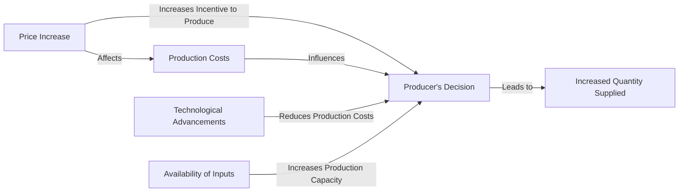

---

title: Elasticity_Of_Supply
type: Atomic Note
course: Economics
semester: Winter 2026
unit: '2'
hub: '[[2_Theory_Of_Demand_And_Supply_Hub]]'
source: '[[5-Pdf Store/note generated/Winter 2026/Economics/Chapter_2.pdf]]'
source_pages:
- 47
mode: ECON-MACRO
read: false
generated: true
prerequisites:
- '[[Ceteris_Paribus]]'
- '[[Price_Elasticity_Of_Supply]]'
- '[[Determinants_Of_Elasticity_Of_Supply]]'
- '[[Shift_In_Supply_Curve]]'

---


# 1. Mental Model

Imagine you have a lemonade stand. The amount of lemonade you can supply depends on how much lemon juice, sugar, and water you have. If the price of lemonade increases, you might be able to make more lemonade by buying more ingredients. The elasticity of supply is like measuring how easily you can make more lemonade when the price increases. It's about how quickly you can change the amount of lemonade you supply when the price changes.

# 2. Economic Theory

The elasticity of supply is a fundamental concept in economics that measures the responsiveness of the quantity supplied of a good to a change in its price, while [[Ceteris_Paribus]] holds other factors constant. It is defined as the percentage change in quantity supplied in response to a 1% change in price, and can be calculated using the formula: $$E_S = \frac{\% \Delta Q_S}{\% \Delta P}$$. The [[Price_Elasticity_Of_Supply]] can be elastic, unit elastic, or inelastic, depending on whether the percentage change in quantity supplied is greater than, equal to, or less than the percentage change in price. The [[Determinants_Of_Elasticity_Of_Supply]], such as the availability of inputs, technology, and time, influence the elasticity of supply. A supply curve [[Shift_In_Supply_Curve]] can result from changes in these determinants, affecting the [[Market_Equilibrium]].

# 3. Market Failures

The elasticity of supply concept has limitations, particularly when considering [[Market_Equilibrium]] disruptions. For instance, during a severe drought, the supply of agricultural products may be severely constrained, making it difficult for suppliers to respond to price changes, even if the price increases significantly. This situation highlights the importance of considering [[Surplus_And_Shortage]] and the [[Effects_Of_Shift_In_Demand_And_Supply]] on market outcomes. Additionally, the assumption of [[Ceteris_Paribus]] may not hold in real-world scenarios, where multiple factors can influence supply simultaneously, leading to complexities in predicting supply responses to price changes. Furthermore, the elasticity of supply may not be constant over time, as suppliers may adjust their production capacity and technology in response to changing market conditions, affecting the [[Price_Elasticity_Of_Supply]].

# 4. Economic Model



This Mermaid flowchart illustrates the elasticity of supply concept. It shows how a price increase affects producers' decisions to supply more of a good, influenced by factors such as production costs, technological advancements, and availability of inputs.

## 5. Walkthrough

Here's a 5-step technical walkthrough of how the **Elasticity of Supply** operates in the **EV Battery Market**:

1. **Market Signal**: The price of Lithium-Ion batteries rises from $100/kWh to $150/kWh (a 50% increase) due to a global supply shortage.

2. **Short-Run Constraints**: Manufacturers want to supply more, but their factories are already at 95% capacity. They can only increase output by 10% through overtime.

3. **Elasticity Calculation (SR)**: The Price Elasticity of Supply in the short run is $E_s = \frac{10\%}{50\%} = 0.2$. This indicates that supply is **inelastic** ($E_s < 1$).

4. **Long-Run Response**: Over the next 24 months, manufacturers invest in new 'Gigafactories'. Once these are operational, they can increase total output by 200% at the new $150 price level.

5. **Elasticity Calculation (LR)**: The long-run elasticity is $E_s = \frac{200\%}{50\%} = 4.0$. This indicates that supply has become highly **elastic** ($E_s > 1$) once the time-determinant allowed for capital expansion.

---

## 6. The Proving Grounds

```interactive-quiz
[
  {
    "id": "q1",
    "type": "mcq",
    "difficulty": "L1",
    "question": "If the Price Elasticity of Supply ($E_s$) is exactly 1.0, the supply is classified as:",
    "options": {
      "A": "Perfectly Elastic.",
      "B": "Inelastic.",
      "C": "Unit Elastic.",
      "D": "Perfectly Inelastic."
    },
    "answer": "C",
    "explanation": "Unit elasticity occurs when the percentage change in quantity supplied exactly equals the percentage change in price, resulting in a coefficient of 1.0."
  },
  {
    "id": "q2",
    "type": "true_false",
    "difficulty": "L2",
    "question": "A vertical supply curve represents a Price Elasticity of Supply that is equal to infinity.",
    "answer": false,
    "explanation": "A vertical curve represents 'Perfectly Inelastic' supply ($E_s = 0$). An elasticity of infinity is represented by a horizontal supply curve ('Perfectly Elastic')."
  },
  {
    "id": "q3",
    "type": "synthesis",
    "difficulty": "L3",
    "question": "An economy faces a sudden hyper-inflation where all prices double. If the quantity supplied of a good remains unchanged despite the price doubling, what can you conclude about the supply's elasticity and the production environment?",
    "answer": "The supply is perfectly inelastic ($E_s = 0$). This suggests an absolute physical constraint on production (e.g., land, rare resources, or reached maximum capacity) where price incentives cannot stimulate further output in the current period.",
    "explanation": "Synthesis requires interpreting a zero-response to a massive price signal as a structural capacity limit."
  },
  {
    "id": "q4",
    "type": "trace",
    "difficulty": "L2",
    "question": "Trace the impact on $E_s$ if the government provides a subsidy that reduces the 'Lead Time' for importing key manufacturing equipment.",
    "answer": "1) Lead time for capital expansion falls. 2) Producers can adjust capacity more quickly to price changes. 3) The time-determinant of elasticity is shortened. 4) The supply curve rotates to become flatter (more elastic).",
    "explanation": "Tracing how a policy change (subsidy/deregulation) affects the technical determinants of supply responsiveness."
  },
  {
    "id": "q5",
    "type": "order",
    "difficulty": "L2",
    "question": "Order these goods from **Lowest $E_s$ (Most Inelastic)** to **Highest $E_s$ (Most Elastic)**.",
    "steps": [
      "Custom-built Supercomputers (High tech, specialized labor)",
      "Digital Software Copies (Infinite replicability, low cost)",
      "Raw Agricultural Land (Fixed total supply)"
    ],
    "answer": [
      "Raw Agricultural Land (Fixed total supply)",
      "Custom-built Supercomputers (High tech, specialized labor)",
      "Digital Software Copies (Infinite replicability, low cost)"
    ],
    "explanation": "Land is perfectly inelastic ($E_s=0$). Supercomputers have lags. Software has nearly infinite elasticity as quantity can be increased at near-zero marginal cost."
  }
]
```