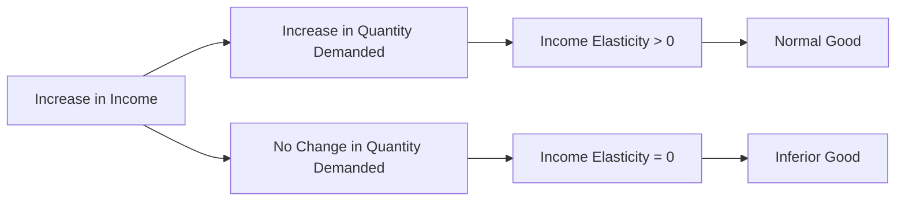

---

title: Income_Elasticity_Of_Demand
type: Atomic Note
course: Economics
semester: Winter 2026
unit: '2'
hub: "[[2_Basics_Of_Economics_Hub]]"
source: "[[Chapter_2.pdf]]"
source_pages:
- 33
mode: ECON-MACRO
read: false
generated: true
prerequisites:
- "[[Price_Elasticity_Of_Demand]]"

---

# 1. Mental Model

Imagine you love buying new video games, and your parents give you a $20 allowance each week. If they increase your allowance to $30, you might buy more games or even start buying game accessories. This shows that when you have more money, you might buy more of something you enjoy.

# 2. Economic Theory

The [[Income_Elasticity_Of_Demand]] measures how much the quantity demanded of a good responds to a change in consumers' income, assuming [[Ceteris_Paribus]]. It is calculated as the percentage change in quantity demanded divided by the percentage change in income. For example, an [[Income_Elasticity_Of_Demand]] of 0.8 means that a 1% increase in income leads to a 0.8% increase in quantity demanded, as seen in this case where εd = 0.8.

# 3. Economic Model



## 4. Walkthrough

* The model starts with an increase in income (A), which can lead to an increase in the quantity demanded of a good (B) or no change in the quantity demanded (C).
* If the quantity demanded increases, the income elasticity of demand is greater than 0 (D), indicating that the good is a normal good (F).
* If there's no change in quantity demanded, the income elasticity of demand is 0 (E), which could indicate an inferior good (G) if quantity demanded decreases with increasing income.
* The model illustrates how income elasticity of demand categorizes goods based on consumer response to income changes.

## 5. Market Failures

The concept of income elasticity of demand may fail in cases where consumer behavior is irrational or influenced by external factors not accounted for in the model. Common pitfalls include ignoring the impact of substitutes or complements on demand and assuming that income changes are the sole determinant of demand. Additionally, the model may not hold in scenarios with significant income inequality or during economic crises.

---

## 6. The Proving Grounds

```interactive-quiz

[
  {
    "id": "q1",
    "type": "true_false",
    "difficulty": "L1",
    "question": "The income elasticity of demand for a good is calculated as the percentage change in quantity supplied divided by the percentage change in income.",
    "answer": false,
    "explanation": "The income elasticity of demand measures how much the quantity demanded of a good responds to a change in consumers' income. It is calculated as the percentage change in quantity demanded divided by the percentage change in income, not quantity supplied. This concept is crucial in understanding how changes in income affect the demand for various goods and services. The correct formula directly relates to demand, not supply."
  },
  {
    "id": "q2",
    "type": "synthesis",
    "difficulty": "L2",
    "question": "Maria's family owns a small, local organic food store. The store sells fresh produce, nuts, and seeds. Maria's family has noticed that as the local neighborhood's average income increases, the demand for organic food products also increases, but at a slower rate than the income growth. They are trying to predict how a 20% increase in neighborhood income will affect their sales. Historically, a 10% increase in income led to a 5% increase in sales of organic produce. However, the store is considering introducing a new line of premium, specialty organic products that are more expensive. How can Maria's family use the concept of income elasticity of demand to make an informed decision about pricing and inventory for both their existing products and the new premium line?",
    "answer": "A grading rubric: 1. Understand the concept of income elasticity of demand (IED) and its formula: IED = (% change in quantity demanded) / (% change in income). 2. Calculate the IED for the existing organic produce: IED = (5% / 10%) = 0.5. 3. Analyze the IED value: Since IED < 1, the existing organic produce is an income inelastic good. 4. Predict the effect of a 20% income increase on existing product sales: If IED = 0.5, then a 20% increase in income will lead to a 10% increase in quantity demanded. 5. Consider the new premium line: If the premium line is more expensive and likely to have a higher IED, it may be more sensitive to income changes. 6. Decision-making: For the existing products, a 10% increase in sales might not justify significant changes. However, for the premium line, the family should be cautious about pricing and inventory, as demand may fluctuate more with income changes.",
    "explanation": "The income elasticity of demand (IED) measures how the quantity demanded of a good responds to changes in consumers' income. It is crucial for businesses to understand IED to predict sales and make informed decisions about pricing and inventory. In this scenario, Maria's family has observed that as the neighborhood's average income increases, the demand for their organic food products also increases, but at a slower rate. This indicates that their existing products have an IED of 0.5, making them income inelastic. For the new premium line, if it is more expensive and likely to attract more affluent customers, its IED might be higher, making it more sensitive to changes in income. By understanding these dynamics, Maria's family can better plan their business strategy, ensuring they meet demand without overstocking or understocking, especially with the introduction of the new premium products."
  },
  {
    "id": "q3",
    "type": "writing",
    "difficulty": "L3",
    "question": "Explain the concept of Income Elasticity Of Demand and its underlying mechanism deeply.",
    "answer": "The Income Elasticity Of Demand measures how much the quantity demanded of a good responds to a change in consumers' income. It is calculated as the percentage change in quantity demanded divided by the percentage change in income. A higher income elasticity indicates that the quantity demanded of a good is more responsive to changes in income.",
    "explanation": "The underlying mechanism of Income Elasticity Of Demand lies in the fact that as consumers' income increases, their purchasing power also increases, leading to a potential increase in the quantity demanded of a good. This is because consumers have more disposable income to spend on goods and services, making them more likely to buy more of a good they enjoy or try new ones. For instance, using the provided context, if a consumer's income increases from $20 to $30, they may buy more video games or start buying game accessories, illustrating a high income elasticity of demand for video games."
  }
]

```