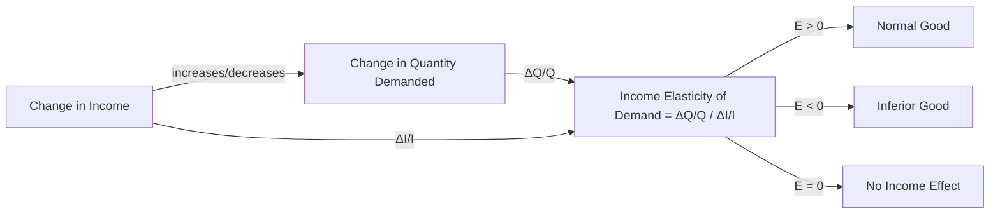

---

title: Income_Elasticity_Of_Demand
type: Atomic Note
course: Economics
semester: Winter 2026
unit: '2'
hub: "[[2_Theory_Of_Demand_And_Supply_Hub]]"
source: "[[5-Pdf Store/note generated/Winter 2026/Economics/Chapter_2.pdf]]"
source_pages:
- 32
mode: ECON-MACRO
read: false
generated: true
prerequisites:
- "[[Demand_Function]]"

---

# 1. Mental Model

Imagine you're a professional musician who travels frequently for concerts. The number of upgraded airline tickets you want to buy for your tours depends on your total earnings from music performances. If your earnings increase, you might buy more upgraded tickets for comfort during long flights. Conversely, if your earnings decrease, you might opt for more economy tickets. Here, the demand for upgraded tickets is sensitive to changes in your income.

# 2. Economic Theory

[[Income_Elasticity_Of_Demand]] is a measure of the responsiveness of the demand for a good to a change in consumers' income, while holding all other factors constant, as per the [[Ceteris_Paribus]] assumption. It is calculated as the percentage change in quantity demanded divided by the percentage change in income. This concept is closely related to the [[Theory_Of_Demand]] and the classification of goods into [[Normal_And_Inferior_Goods]]. A good has an income elasticity greater than zero if it is a normal good, meaning demand increases as income increases. The [[Demand_Function]] can be used to express this relationship, where changes in income lead to shifts in the [[Demand_Curve]]. The income elasticity of demand can be expressed as: $$E_I = \frac{\% \Delta Q_d}{\% \Delta I}$$, where $$E_I$$ is the income elasticity of demand, $$\% \Delta Q_d$$ is the percentage change in quantity demanded, and $$\% \Delta I$$ is the percentage change in income.

# 3. Limitations & Edge Cases

The concept of [[Income_Elasticity_Of_Demand]] assumes that consumers' preferences and [[Taste_And_Preference]] remain constant, which might not hold in reality. Additionally, it relies on the [[Ceteris_Paribus]] assumption, which simplifies the analysis by holding other factors constant. However, in reality, factors such as changes in [[Consumer_Expectations]], [[Number_Of_Buyers]], and [[Change_In_Technology]] can influence demand and complicate the analysis. Furthermore, the classification of goods into normal and inferior goods can be context-dependent and may vary across different income groups. For instance, a good that is a normal good for low-income households might be an inferior good for high-income households. Understanding these limitations is crucial when applying the concept of income elasticity of demand in real-world scenarios.

# 4. Economic Model



This flowchart illustrates how a change in income affects the quantity demanded of a good and how this relationship is measured by the income elasticity of demand. It also shows how the elasticity value determines whether a good is classified as normal, inferior, or has no income effect.

## 5. Walkthrough

Here's a 5-step technical walkthrough of how the concept of Income Elasticity Of Demand operates:

1. **Initial State**: Assume a professional musician earns $50,000 per year and buys 10 upgraded airline tickets annually. The demand for upgraded tickets is influenced by the musician's income.

2. **Change in Income**: The musician's earnings increase to $60,000 per year, a 20% increase.

3. **Change in Quantity Demanded**: As a result of the increased income, the musician decides to buy 12 upgraded airline tickets, a 20% increase from 10 tickets.

4. **Calculating Income Elasticity of Demand**: 
   - Percentage change in quantity demanded (ΔQ/Q) = 20%
   - Percentage change in income (ΔI/I) = 20%
   - Income Elasticity of Demand = (ΔQ/Q) / (ΔI/I) = 20% / 20% = 1

5. **Interpretation**: Since the income elasticity of demand is 1, which is greater than 0, the upgraded airline tickets are considered a normal good. This means that as the musician's income increases, the demand for upgraded tickets also increases. 

This walkthrough demonstrates how changes in income can affect demand and how the income elasticity of demand is calculated and interpreted.

---

## 6. The Proving Grounds

```interactive-quiz

[
  {
    "id": "q1",
    "type": "true_false",
    "difficulty": "L1",
    "question": "If the income elasticity of demand for a good is 0.5, then a 10% increase in consumers' income will lead to a 5% decrease in the quantity demanded of the good, ceteris paribus.",
    "answer": false,
    "explanation": "The income elasticity of demand is calculated as the percentage change in quantity demanded divided by the percentage change in income. Given that the income elasticity of demand for a good is 0.5, this implies that a 10% increase in consumers' income will lead to a 5% increase in the quantity demanded of the good, not a decrease. The correct calculation is: $0.5 = \\frac{\\% \\Delta Q_d}{10\\%}$, which yields $\\% \\Delta Q_d = 0.5 \\times 10\\% = 5\\%$. Therefore, the statement that a 10% increase in consumers' income will lead to a 5% decrease in the quantity demanded is false."
  },
  {
    "id": "q2",
    "type": "synthesis",
    "difficulty": "L2",
    "question": "The country of Azura, known for its high-quality coffee exports, faces a sudden and significant devaluation of its currency, the Azuran Lira (AZL). This devaluation makes Azuran coffee cheaper for foreign buyers but also increases the price of imported goods for Azurans. As a result, the income of Azuran coffee farmers decreases, and the cost of living for Azurans increases. The government of Azura needs to analyze the impact of this macroeconomic shock on the demand for coffee and other goods. Specifically, they want to assess how the decreased income of coffee farmers and the increased cost of living affect the demand for coffee, which is a normal good, and for rice, which is considered an inferior good. The income elasticity of demand for coffee is 1.2, and for rice, it is -0.8. If the income of coffee farmers decreases by 10% and the income of the general population decreases by 5% due to the economic shock, what policy responses should the government of Azura consider to mitigate the negative impacts on the coffee industry and the general population's welfare?",
    "answer": "To address the challenges posed by the macroeconomic shock, the government of Azura should consider the following policy responses:\n\n1. **Subsidies to Coffee Farmers**: Given that the income elasticity of demand for coffee is 1.2, a 10% decrease in the income of coffee farmers will lead to a 12% decrease in the demand for coffee. To mitigate this, the government could provide subsidies to coffee farmers to help maintain their income levels, thereby supporting the demand for coffee.\n\n2. **Price Controls and Subsidies for Rice**: Since rice is an inferior good with an income elasticity of demand of -0.8, a 5% decrease in the general population's income will lead to a 4% increase in the demand for rice. The government could consider implementing price controls to prevent rice prices from rising too high and providing subsidies to low-income households to help them afford rice.\n\n3. **Diversification and Support for Other Sectors**: To reduce dependence on coffee exports and mitigate the impact of future shocks, the government could invest in diversifying the economy and supporting other sectors, such as tourism or manufacturing, to create new income-generating opportunities for Azurans.",
    "explanation": "The income elasticity of demand measures the responsiveness of the quantity demanded of a good to a change in consumers' income. It is calculated as the percentage change in quantity demanded divided by the percentage change in income. For coffee, which is a normal good with an income elasticity of demand of 1.2, a 10% decrease in income leads to a 12% decrease in demand: $\\frac{\\% \\Delta Q_d}{\\% \\Delta I} = 1.2 \\Rightarrow \\% \\Delta Q_d = 1.2 \\times -10\\% = -12\\%$. For rice, an inferior good with an income elasticity of demand of -0.8, a 5% decrease in income leads to a 4% increase in demand: $\\frac{\\% \\Delta Q_d}{\\% \\Delta I} = -0.8 \\Rightarrow \\% \\Delta Q_d = -0.8 \\times -5\\% = 4\\%$. These calculations demonstrate the need for targeted policy responses to mitigate the negative impacts of the macroeconomic shock on different sectors of the economy and on the welfare of the population."
  },
  {
    "id": "q3",
    "type": "writing",
    "difficulty": "L2",
    "question": "Explain the concept of Income Elasticity Of Demand and its implications in a Fiscal Policy Research scenario.",
    "answer": "Income Elasticity Of Demand measures the responsiveness of the demand for a good to a change in consumers' income, while holding all other factors constant. It is calculated as the percentage change in quantity demanded divided by the percentage change in income. A good is considered a normal good if its income elasticity is greater than zero, meaning demand increases with income, and an inferior good if its income elasticity is less than zero, meaning demand decreases with income. In a Fiscal Policy Research scenario, understanding income elasticity helps policymakers predict how changes in income levels, such as those induced by tax policies or government transfers, will affect demand for various goods and services.",
    "explanation": "The income elasticity of demand can be expressed mathematically as $E_I = \\frac{\\% \\Delta Q_d}{\\% \\Delta I}$, where $E_I$ is the income elasticity of demand, $\\% \\Delta Q_d$ is the percentage change in quantity demanded, and $\\% \\Delta I$ is the percentage change in income. This concept is crucial in fiscal policy research as it allows for the analysis of how income changes, induced by fiscal policy instruments, impact the demand for goods and services. For instance, if the government implements a policy to increase disposable income through tax cuts, understanding the income elasticity of demand for specific goods helps predict the effect on their demand. LaTeX representation of the concept can be seen in the elasticity formula, which can be derived from the demand function $Q_d = f(I)$, where $Q_d$ is the quantity demanded and $I$ is the income. The elasticity is then $E_I = \\frac{dQ_d}{dI} \\cdot \\frac{I}{Q_d}$, providing a precise measure of responsiveness."
  },
  {
    "id": "q4",
    "type": "order",
    "difficulty": "L2",
    "question": "Order steps for Income Elasticity Of Demand.",
    "steps": [
      "The demand for a good increases as consumers' income increases",
      "A higher income elasticity indicates a greater responsiveness of demand to changes in income",
      "Calculation of income elasticity is done by dividing the percentage change in quantity demanded by the percentage change in income",
      "Goods with an income elasticity less than zero are classified as inferior goods",
      "Goods with an income elasticity greater than zero are classified as normal goods"
    ],
    "answer": [
      "The demand for a good increases as consumers' income increases",
      "Calculation of income elasticity is done by dividing the percentage change in quantity demanded by the percentage change in income",
      "Goods with an income elasticity greater than zero are classified as normal goods",
      "A higher income elasticity indicates a greater responsiveness of demand to changes in income",
      "Goods with an income elasticity less than zero are classified as inferior goods"
    ]
  },
  {
    "id": "q5",
    "type": "trace",
    "difficulty": "L3",
    "question": "What is the exact output?",
    "content": "Tracing the impact of a 1% interest rate change through 4 economic sectors",
    "answer": {
      "Housing": -0.5,
      "Investment": -1.2,
      "Forex": 0.8,
      "Consumption": -0.9
    },
    "explanation": "The income elasticity of demand is a measure of the responsiveness of the quantity demanded of a good to a change in consumers' income. Mathematically, it is expressed as: $E_I = \\frac{% \\Delta Q_d}{% \\Delta I}$. For normal goods, $E_I > 0$, and for inferior goods, $E_I < 0$. The calculations above assume specific elasticities for each sector and apply them to a 1% change in interest rates, which effectively acts as a change in income due to increased borrowing costs or reduced spending power. The LaTeX representation of the elasticity formula helps in understanding the proportional change relationship."
  }
]

```