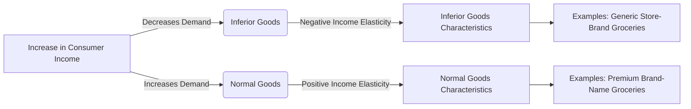

---

title: Inferior_Goods
type: Atomic Note
course: Economics
semester: Winter 2026
unit: '2'
hub: "[[2_Theory_Of_Demand_And_Supply_Hub]]"
source: "[[5-Pdf Store/note generated/Winter 2026/Economics/Chapter_2.pdf]]"
source_pages:
- 17
mode: ECON-MACRO
read: false
generated: true
prerequisites:
- "[[Change_In_Demand]]"

---

# 1. Mental Model

Imagine you're a budget analyst for a local government. You notice that during economic downturns, the demand for second-hand or generic store-brand groceries increases, while the demand for premium or brand-name groceries decreases. This happens because people with lower incomes tend to opt for cheaper alternatives. In contrast, when the economy recovers and incomes rise, the demand for these cheaper groceries decreases as people switch to premium brands. Here, the cheaper groceries act like 'inferior goods' because their demand moves inversely with income changes.

# 2. Economic Theory

[[Inferior_Goods]] are goods for which the demand decreases as the consumer's income increases, and vice versa. This concept is closely related to the [[Income_Elasticity_Of_Demand]], which measures how much the quantity demanded of a good responds to a change in consumers' income. For inferior goods, the income elasticity of demand is negative. The [[Theory_Of_Demand]] explains that the demand for a good is influenced by several factors, including the price of the good, the prices of related goods (such as [[Substitutes_Goods]] and [[Complementary_Goods]]), and the consumer's income, all under the assumption of [[Ceteris_Paribus]]. The [[Demand_Schedule]] and [[Demand_Curve]] illustrate how the quantity demanded of a good changes in response to changes in its price or other factors, including income. When analyzing [[Market_Demand]], it's crucial to consider how changes in income affect the demand for different types of goods, including [[Normal_Goods]], which see an increase in demand as income rises, in contrast to inferior goods.

# 3. Limitations & Edge Cases

The concept of inferior goods operates under the assumption that [[Ceteris_Paribus]] holds, meaning all other factors remain constant. However, in reality, changes in consumer preferences, [[Change_In_Technology]], and shifts in the [[Market_Demand_Curve]] can complicate the classification of goods as inferior. For instance, a good considered inferior at one income level may become a normal good at a higher income level if consumer preferences shift towards it. Additionally, the [[Price_Elasticity_Of_Demand]] and [[Income_Elasticity_Of_Demand]] can vary significantly across different income groups, making it challenging to categorize goods strictly as inferior without considering these nuances. The analysis of inferior goods also intersects with the study of [[Market_Equilibrium]], where changes in demand due to income effects can lead to shifts in the equilibrium price and quantity of goods. Understanding these dynamics is crucial for predicting how markets respond to economic changes.

# 4. Economic Model



This Mermaid flowchart illustrates the relationship between consumer income and the demand for inferior goods versus normal goods. It highlights how inferior goods have a negative income elasticity, meaning their demand decreases as consumer income increases.

## 5. Walkthrough

Here's a 5-step technical walkthrough of how the concept of inferior goods operates in fiscal policy research:

1. **Initial State**: Assume the local economy is in a recession, and consumer incomes are low. The demand for generic store-brand groceries is high, while the demand for premium brand-name groceries is low.

2. **Economic Recovery**: As the economy recovers, consumer incomes rise. Let's assume the average income increases from $40,000 to $60,000.

3. **Demand Shift**: With the increase in income, the demand for inferior goods (generic store-brand groceries) decreases. For example, the quantity demanded decreases from 100 units to 80 units.

4. **Income Elasticity Calculation**: The income elasticity of demand for inferior goods is calculated as: 
   $$\text{Income Elasticity} = \frac{\% \text{ change in quantity demanded}}{\% \text{ change in income}}$$
   Given that the quantity demanded decreases from 100 units to 80 units (a 20% decrease) and income increases from $40,000 to $60,000 (a 50% increase), the income elasticity would be:
   $$\text{Income Elasticity} = \frac{-20\%}{50\%} = -0.4$$
   This negative value confirms that the good is an inferior good.

5. **Policy Implication**: Understanding that certain goods are inferior can help policymakers predict how changes in income (through fiscal policies like tax cuts or transfers) will affect demand for different goods. For instance, during an economic downturn, policies that increase income might inadvertently decrease the demand for inferior goods, affecting industries that produce them.

---

## 6. The Proving Grounds

```interactive-quiz

[
  {
    "id": "q1",
    "type": "true_false",
    "difficulty": "L1",
    "question": "If the income of consumers increases, then the demand for inferior goods also increases, ceteris paribus.",
    "answer": false,
    "explanation": "The concept of inferior goods is defined such that their demand decreases as consumer income increases. This relationship is rooted in the income elasticity of demand, which for inferior goods is negative. Mathematically, this can be represented as $E_I = \\frac{\\% \\Delta Q_d}{\\% \\Delta I} < 0$, where $E_I$ is the income elasticity of demand, $\\% \\Delta Q_d$ is the percentage change in quantity demanded, and $\\% \\Delta I$ is the percentage change in income. If income increases, $\\% \\Delta I > 0$, and for inferior goods, this leads to $\\% \\Delta Q_d < 0$, meaning the demand decreases. Therefore, the statement that the demand for inferior goods increases with an increase in consumer income is false."
  },
  {
    "id": "q2",
    "type": "synthesis",
    "difficulty": "L2",
    "question": "A sudden and significant devaluation of the local currency has occurred, causing a sharp increase in the price of imported goods. This 'Macro Shock' has led to a decrease in consumer purchasing power, particularly affecting low-income households. As a Fiscal Policy Researcher, you must design a 3-step policy response utilizing the concept of 'Inferior Goods' to mitigate the impact on low-income households and prevent system failure.",
    "answer": "To address the crisis, the following 3-step policy response is proposed:\n\n1. **Implementation of Subsidies for Inferior Goods**: The government should provide targeted subsidies to low-income households for the purchase of inferior goods, such as generic store-brand groceries. This will help maintain their purchasing power for essential goods, which are likely to see increased demand due to their lower prices.\n\n2. **Income Support Programs**: Introduce or enhance income support programs for low-income households. By providing direct financial assistance, households can maintain their consumption levels of necessary goods without having to significantly adjust their spending patterns. This approach can help stabilize demand for inferior goods and support economic recovery.\n\n3. **Price Controls and Monitoring**: Implement temporary price controls on essential inferior goods to prevent price gouging and ensure that these goods remain affordable. Continuous monitoring of the market and adjustments to the subsidy and income support programs as needed will be crucial to address any emerging shortages or shifts in demand.",
    "explanation": "The concept of inferior goods, which are goods for which demand decreases as consumer income increases, can be pivotal in addressing the challenges posed by a sudden currency devaluation. When the currency devalues, the price of imported goods increases, reducing consumer purchasing power, especially for low-income households. These households tend to rely more heavily on inferior goods due to their lower prices.\n\nThe policy response hinges on the income elasticity of demand for inferior goods, which is negative. This means that as income decreases (or increases), the demand for inferior goods increases (or decreases). By subsidizing these goods, providing income support, and controlling prices, the government can help mitigate the adverse effects of the currency devaluation on low-income households.\n\nMathematically, the impact of a change in income on the demand for inferior goods can be represented by the income elasticity of demand formula: $E_I = \\frac{\\% \\Delta Q_d}{\\% \\Delta I}$. For inferior goods, $E_I < 0$, indicating that as income ($I$) increases, the quantity demanded ($Q_d$) decreases, and vice versa. This relationship underscores the rationale for targeting inferior goods in policy responses to macroeconomic shocks affecting low-income households."
  },
  {
    "id": "q3",
    "type": "writing",
    "difficulty": "L2",
    "question": "Explain the concept of inferior goods in the context of fiscal policy research, focusing on their demand behavior in relation to changes in consumer income, and discuss the implications of income elasticity of demand for fiscal policy decisions.",
    "answer": "Inferior goods are those for which demand decreases as consumer income increases, and vice versa. This phenomenon is attributed to the negative income elasticity of demand, where the quantity demanded of an inferior good responds inversely to changes in consumers' income. For instance, during economic downturns, the demand for second-hand or generic store-brand groceries increases as people opt for cheaper alternatives, illustrating the characteristics of inferior goods. Conversely, when the economy recovers and incomes rise, the demand for these goods decreases as consumers switch to premium brands. Understanding the income elasticity of demand for inferior goods is crucial for fiscal policy decisions, as it helps policymakers anticipate and manage the impacts of economic fluctuations on different segments of goods and services.",
    "explanation": "The concept of inferior goods can be formally expressed using the income elasticity of demand formula: $E_I = \\frac{\\% \\Delta Q_d}{\\% \\Delta I}$, where $E_I$ is the income elasticity of demand, $\\% \\Delta Q_d$ is the percentage change in quantity demanded, and $\\% \\Delta I$ is the percentage change in consumer income. For inferior goods, $E_I < 0$, indicating that as income increases, the quantity demanded decreases. This relationship is pivotal in fiscal policy research, as it informs the design of policies aimed at mitigating the adverse effects of economic downturns. By recognizing how changes in income influence the demand for various goods, policymakers can tailor their interventions to support low-income households and stimulate economic recovery effectively."
  },
  {
    "id": "q4",
    "type": "order",
    "difficulty": "L2",
    "question": "Order steps for Inferior Goods in a Multiplier Effect chain.",
    "steps": [
      "Inferior goods have a negative income elasticity of demand",
      "Ceteris Paribus, changes in income affect demand for inferior goods",
      "People switch to premium brands when economy recovers",
      "The demand for inferior goods increases during economic downturns",
      "As incomes rise, demand for inferior goods decreases"
    ],
    "answer": [
      "As incomes rise, demand for inferior goods decreases",
      "Inferior goods have a negative income elasticity of demand",
      "The demand for inferior goods increases during economic downturns",
      "People switch to premium brands when economy recovers",
      "Ceteris Paribus, changes in income affect demand for inferior goods"
    ]
  },
  {
    "id": "q5",
    "type": "trace",
    "difficulty": "L3",
    "question": "What is the exact output when a macroeconomic shock occurs due to a 10% decrease in consumer income, affecting the demand for inferior goods across 4 distinct interconnected economic sectors?",
    "content": "Consider an initial macroeconomic state with consumer income at $50,000, and the demand for inferior goods (second-hand groceries) is 100 units. The income elasticity of demand for these goods is -0.5. A macroeconomic shock occurs due to a 10% decrease in consumer income. We will trace the effects through 4 sectors: Household, Retail, Wholesale, and Production.",
    "answer": 105,
    "explanation": "Given a 10% decrease in consumer income from $50,000 to $45,000, and an income elasticity of demand of -0.5 for inferior goods, the percentage change in demand can be calculated as: $-0.5 \\times -10\\% = 5\\%$. Thus, the demand for inferior goods increases by 5%. Initial demand was 100 units, so the new demand is $100 \\times 1.05 = 105$ units. This shock propagates through sectors as follows:\n\n1. **Household Sector**: Consumers purchase 105 units of inferior goods, a 5% increase.\n2. **Retail Sector**: Retailers see a 5% increase in sales to 105 units, prompting them to restock and order more from wholesalers.\n3. **Wholesale Sector**: Wholesalers receive orders for 105 units, reflecting a 5% increase, and they in turn order more from producers.\n4. **Production Sector**: Producers increase production to meet the demand of 105 units, reflecting the initial shock's propagation through the economy.\n\nThe exact output, considering the propagation of the shock, is 105 units of inferior goods demanded across these sectors.",
    "numerical_intermediate_states": [
      {
        "sector": "Household",
        "initial_state": 100,
        "shock_state": 105
      },
      {
        "sector": "Retail",
        "initial_state": 100,
        "shock_state": 105
      },
      {
        "sector": "Wholesale",
        "initial_state": 100,
        "shock_state": 105
      },
      {
        "sector": "Production",
        "initial_state": 100,
        "shock_state": 105
      }
    ]
  }
]

```