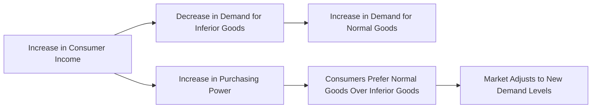

---

title: Inferior_Goods
type: Atomic Note
course: Economics
semester: Winter 2026
unit: '2'
hub: "[[2_Theory_Of_Demand_And_Supply_Hub]]"
source: "[[5-Pdf Store/note generated/Winter 2026/Economics/Chapter_2.pdf]]"
source_pages:
- 17
mode: ECON-MACRO
read: false
generated: true
prerequisites:
- "[[Determinants_Of_Demand]]"

---

# 1. Mental Model

Imagine you have a favorite snack, let's say ramen noodles. When you're little and your parents buy you ramen noodles often, you really like them. But as you grow up and your parents start making more money, they buy you fancier foods like sushi or steak. Now, you still like ramen noodles, but you don't eat them as much because you have more money to spend on better food. In this case, ramen noodles are like an "inferior good" because you buy less of them when you have more money.

# 2. Economic Theory

[[Inferior_Goods]] are goods and services for which demand decreases as consumer income increases, and vice versa. This concept is closely related to the [[Income_Elasticity_Of_Demand]], which measures how much the quantity demanded of a good responds to a change in consumers' income. For [[Inferior_Goods]], the income elasticity of demand is negative, meaning that as income rises, demand for the good falls. This relationship is a key aspect of the [[Theory_Of_Demand]] and is often analyzed using the [[Demand_Function]] and [[Demand_Curve]]. The [[Law_Of_Demand]] states that, ceteris paribus [[Ceteris_Paribus]], as the price of a good increases, the quantity demanded decreases, but for [[Inferior_Goods]], the relationship between income and demand is the opposite.

# 3. Market Failures

The concept of [[Inferior_Goods]] has limitations, particularly in scenarios where consumer behavior does not follow traditional economic assumptions. For instance, the [[Theory_Of_Demand]] assumes that consumers will always prefer more income to less, but in cases of [[Inferior_Goods]], increased income leads to decreased demand. However, this relationship can be affected by [[Determinants_Of_Demand]] such as changes in consumer preferences or the availability of [[Substitute_Goods]]. Additionally, the concept of [[Inferior_Goods]] can be influenced by [[Market_Demand]] and [[Market_Demand_Curve]], which can shift due to changes in income, prices, or other factors. Understanding these limitations is crucial for making informed decisions in economics, especially when analyzing [[Market_Equilibrium]] and the [[Effects_Of_Shift_In_Demand_And_Supply]].

# 4. Economic Model



This flowchart illustrates the relationship between consumer income and demand for inferior goods. As consumer income increases, demand for inferior goods decreases, and consumers tend to prefer normal goods over inferior ones.

## 5. Walkthrough

Here's a 5-step technical walkthrough of how the concept of inferior goods operates:

1. **Initial State**: A consumer has a weekly income of $500 and buys 10 packs of ramen noodles (inferior good) and 5 pizzas (normal good) per month.
2. **Increase in Income**: The consumer's income increases to $750 per week. As a result, their purchasing power increases, and they can afford to buy more goods.
3. **Change in Demand**: With the increased income, the consumer decides to buy only 5 packs of ramen noodles (inferior good) per month, but increases their pizza purchases to 8 per month (normal good). This shows that as income rises, demand for inferior goods (ramen noodles) falls.
4. **Market Adjustment**: The market adjusts to the new demand levels. Ramen noodle manufacturers may see a decrease in sales, while pizza manufacturers see an increase in demand.
5. **New Equilibrium**: The consumer reaches a new equilibrium, where they buy 5 packs of ramen noodles and 8 pizzas per month, reflecting their changed preferences in response to increased income.

---

## 6. The Proving Grounds

```interactive-quiz

[
  {
    "id": "q1",
    "type": "true_false",
    "difficulty": "L1",
    "question": "In the context of bioinformatics and genomic sequencing, the demand for inferior goods such as low-cost DNA sequencing technologies increases as researcher income or funding increases.",
    "answer": false,
    "explanation": "The concept of inferior goods in economics suggests that as consumer income increases, the demand for these goods decreases. In the context of bioinformatics and genomic sequencing, if low-cost DNA sequencing technologies are considered inferior goods, then as researcher income or funding increases, the demand for these low-cost technologies would actually decrease, not increase. This is because researchers with more funding would likely opt for more advanced, higher-quality sequencing technologies. Therefore, the statement is false. Mathematically, this can be represented using the income elasticity of demand formula: $E_I = \frac{\\% \\Delta Q_d}{\\% \\Delta I}$, where $E_I < 0$ for inferior goods, indicating that as income $I$ increases, the quantity demanded $Q_d$ decreases."
  },
  {
    "id": "q2",
    "type": "synthesis",
    "difficulty": "L2",
    "question": "In a bioinformatics lab, a critical genomic sequencing pipeline is on the verge of failure due to a sudden shortage of high-quality sequencing reagents. The lab has limited budget and can't afford to purchase more expensive, high-quality reagents. What type of goods should the lab consider using as a temporary substitute to prevent system failure, and how would the demand for these goods change if the lab's budget increases in the future?",
    "answer": "The lab should consider using inferior goods, specifically lower-quality sequencing reagents that are cheaper but still functional. These could be reagents with slightly lower purity or older batches that have not been used yet. As the lab's budget increases in the future, the demand for these inferior goods would decrease, as they would be able to afford better quality reagents.",
    "explanation": "In the context of microeconomics, inferior goods are those for which demand decreases as consumer income increases. In this scenario, the lab is facing a shortage of high-quality sequencing reagents and has a limited budget. By using lower-quality reagents as a temporary substitute, the lab can prevent system failure. The demand for these inferior goods is expected to decrease as the lab's budget increases in the future, allowing them to switch to higher-quality reagents. This relationship can be represented by the income elasticity of demand, which is negative for inferior goods: $E_I = \\frac{\\% \\Delta Q_d}{\\% \\Delta I} < 0$, where $E_I$ is the income elasticity of demand, $\\% \\Delta Q_d$ is the percentage change in quantity demanded, and $\\% \\Delta I$ is the percentage change in income. As income increases, the quantity demanded of inferior goods decreases, illustrating the concept of inferior goods in the context of bioinformatics and genomic sequencing."
  },
  {
    "id": "q3",
    "type": "writing",
    "difficulty": "L2",
    "question": "Explain the concept of inferior goods in the context of bioinformatics and genomic sequencing, and provide an example.",
    "answer": "In bioinformatics and genomic sequencing, inferior goods refer to services or products for which demand decreases as funding or income increases. For instance, a researcher may rely on free, open-source bioinformatics tools when funding is limited. However, as funding increases, they may switch to more advanced, commercial software, reducing demand for the free tools. This concept is closely related to the income elasticity of demand, which measures how much the quantity demanded of a good responds to a change in consumers' income.",
    "explanation": "The relationship between inferior goods and income can be represented by the income elasticity of demand, which is mathematically expressed as $E_I = \\frac{\\% \\Delta Q_d}{\\% \\Delta I}$. For inferior goods, $E_I < 0$, indicating that as income $I$ rises, demand $Q_d$ for the good falls. In the context of bioinformatics and genomic sequencing, this means that as funding increases, the demand for inferior goods, such as free but limited bioinformatics tools, decreases."
  },
  {
    "id": "q4",
    "type": "order",
    "difficulty": "L2",
    "question": "What is the causal chain for Inferior Goods?",
    "steps": [
      "Consumers' income increases",
      "Demand for inferior goods decreases",
      "Income elasticity of demand is negative",
      "Quantity demanded of inferior goods falls",
      "Consumers substitute inferior goods with superior goods"
    ],
    "answer": [
      "Consumers' income increases",
      "Demand for inferior goods decreases",
      "Income elasticity of demand is negative",
      "Quantity demanded of inferior goods falls"
    ]
  },
  {
    "id": "q5",
    "type": "trace",
    "difficulty": "L3",
    "question": "What is the exact output for Inferior Goods in Telecommunications & Core Network Routing?",
    "content": "In the context of Telecommunications & Core Network Routing, inferior goods refer to services or products for which demand decreases as consumer income increases. For instance, consider a scenario where a telecommunications company offers a basic, low-cost internet plan. As consumers' incomes rise, they may opt for more premium, high-speed plans, reducing the demand for the basic plan. This situation can be modeled using the income elasticity of demand formula: $E_I = \\frac{\\% \\Delta Q_d}{\\% \\Delta I}$, where $E_I$ is the income elasticity, $\\% \\Delta Q_d$ is the percentage change in quantity demanded, and $\\% \\Delta I$ is the percentage change in income. For inferior goods, $E_I < 0$.",
    "answer": "The demand for inferior goods in Telecommunications & Core Network Routing decreases as consumer income increases. A classic example is the shift from basic, low-cost internet plans to more premium services as income rises.",
    "explanation": "Mathematically, the concept of inferior goods in telecommunications can be represented by the income elasticity of demand formula: $E_I = \\frac{\\% \\Delta Q_d}{\\% \\Delta I}$. For inferior goods, $E_I < 0$, indicating that as income ($I$) increases, the quantity demanded ($Q_d$) of the inferior good decreases. In the context of core network routing, this might imply that as network users' incomes rise, they may opt for more advanced, premium routing services, thereby reducing the demand for basic routing services."
  }
]

```