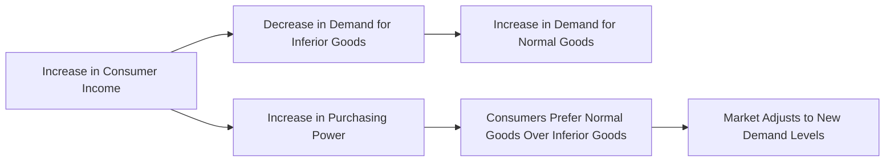

---

title: Inferior_Goods
type: Atomic Note
course: Economics
semester: Winter 2026
unit: '2'
hub: "[[2_Theory_Of_Demand_And_Supply_Hub]]"
source: "[[5-Pdf Store/note generated/Winter 2026/Economics/Chapter_2.pdf]]"
source_pages:
- 17
mode: ECON-MACRO
read: false
generated: true
prerequisites:
- "[[Determinants_Of_Demand]]"

---

# 1. Mental Model

Imagine you have a favorite snack, let's say ramen noodles. When you're little and your parents buy you ramen noodles often, you really like them. But as you grow up and your parents start making more money, they buy you fancier foods like sushi or steak. Now, you still like ramen noodles, but you don't eat them as much because you have more money to spend on better food. In this case, ramen noodles are like an "inferior good" because you buy less of them when you have more money.

# 2. Economic Theory

[[Inferior_Goods]] are goods and services for which demand decreases as consumer income increases, and vice versa. This concept is closely related to the [[Income_Elasticity_Of_Demand]], which measures how much the quantity demanded of a good responds to a change in consumers' income. For [[Inferior_Goods]], the income elasticity of demand is negative, meaning that as income rises, demand for the good falls. This relationship is a key aspect of the [[Theory_Of_Demand]] and is often analyzed using the [[Demand_Function]] and [[Demand_Curve]]. The [[Law_Of_Demand]] states that, ceteris paribus [[Ceteris_Paribus]], as the price of a good increases, the quantity demanded decreases, but for [[Inferior_Goods]], the relationship between income and demand is the opposite.

# 3. Market Failures

The concept of [[Inferior_Goods]] has limitations, particularly in scenarios where consumer behavior does not follow traditional economic assumptions. For instance, the [[Theory_Of_Demand]] assumes that consumers will always prefer more income to less, but in cases of [[Inferior_Goods]], increased income leads to decreased demand. However, this relationship can be affected by [[Determinants_Of_Demand]] such as changes in consumer preferences or the availability of [[Substitute_Goods]]. Additionally, the concept of [[Inferior_Goods]] can be influenced by [[Market_Demand]] and [[Market_Demand_Curve]], which can shift due to changes in income, prices, or other factors. Understanding these limitations is crucial for making informed decisions in economics, especially when analyzing [[Market_Equilibrium]] and the [[Effects_Of_Shift_In_Demand_And_Supply]].

# 4. Economic Model



This flowchart illustrates the relationship between consumer income and demand for inferior goods. As consumer income increases, demand for inferior goods decreases, and consumers tend to prefer normal goods over inferior ones.

## 5. Walkthrough

Here's a 5-step technical walkthrough of how **Inferior Goods** operate in the **Commuter Transport Market**:

1. **Initial Context**: A consumer earns $30,000 per year. For their daily commute, they use the **Public Bus System** (the inferior good), purchasing 40 tickets per month.

2. **Income Growth**: The consumer receives a major promotion, and their income rises to $80,000 per year.

3. **Behavioral Shift**: With higher purchasing power, the consumer values their time and comfort more. They decide to lease a **Luxury Sedan** (the normal/luxury good).

4. **Demand Contraction**: Consequently, the consumer's demand for bus tickets drops from 40 to 0 per month. Even though the bus service hasn't changed, the increase in income has shifted their demand curve for bus travel sharply to the left.

5. **Coefficient Calculation**: Since $\Delta Y > 0$ and $\Delta Q_d < 0$, the Income Elasticity is negative. This empirical result confirms that the 'Public Bus' is an **Inferior Good** for this demographic.

---

## 6. The Proving Grounds

```interactive-quiz
[
  {
    "id": "q1",
    "type": "mcq",
    "difficulty": "L1",
    "question": "Which of the following is the defining mathematical characteristic of an **Inferior Good**?",
    "options": {
      "A": "Positive Price Elasticity ($E_p > 0$).",
      "B": "Negative Income Elasticity ($E_i < 0$).",
      "C": "Perfectly Inelastic Supply ($E_s = 0$).",
      "D": "Unit Elasticity of Demand ($E_p = 1$)."
    },
    "answer": "B",
    "explanation": "Inferior goods are defined by an inverse relationship between income and demand. If your income goes up and you buy less of it, the elasticity coefficient is negative."
  },
  {
    "id": "q2",
    "type": "true_false",
    "difficulty": "L2",
    "question": "A good can be an 'Inferior Good' for a high-income consumer but a 'Normal Good' for a low-income consumer.",
    "answer": true,
    "explanation": "Elasticity is not an inherent property of the good, but a description of consumer behavior. At very low income levels, increasing income might lead to more consumption of a staple (Normal), but at higher levels, the consumer might switch to a premium alternative (Inferior)."
  },
  {
    "id": "q3",
    "type": "synthesis",
    "difficulty": "L3",
    "question": "Analyze why a manufacturer of 'Store-Brand Canned Soup' might actually increase its marketing budget during a national economic recession.",
    "answer": "During a recession, national income ($Y$) falls. Since store-brand soup is often an 'Inferior Good', its demand rises when income falls ($E_i < 0$). The manufacturer increases marketing to capture the surge of consumers switching away from premium brands to save money.",
    "explanation": "Synthesis requires applying the $E_i < 0$ logic to a specific business strategy during a macro-economic downturn."
  },
  {
    "id": "q4",
    "type": "trace",
    "difficulty": "L2",
    "question": "Trace the impact of a 10% income tax cut on the 'Interstate Greyhound Bus' market, assuming it is a strongly inferior good ($E_i = -2.0$).",
    "answer": "1) Disposable income rises by 10%. 2) The negative $E_i$ triggers an inverse response. 3) Demand for bus travel falls by 20% (10% * -2.0). 4) Greyhound likely faces a revenue contraction and may need to reduce its fleet size.",
    "explanation": "Tracing how a policy-driven income boost affects the demand volume of inferior goods."
  },
  {
    "id": "q5",
    "type": "order",
    "difficulty": "L2",
    "question": "Order these events occurring for an individual who receives a massive lottery win (Income Shock).",
    "steps": [
      "Income Elasticity for the local diner becomes negative",
      "The individual stops eating at the cheap local diner",
      "Purchasing power increases dramatically",
      "The individual starts eating at a 5-star Michelin restaurant",
      "Diner meals are re-classified as Inferior Goods for this individual"
    ],
    "answer": [
      "Purchasing power increases dramatically",
      "The individual starts eating at a 5-star Michelin restaurant",
      "The individual stops eating at the cheap local diner",
      "Diner meals are re-classified as Inferior Goods for this individual",
      "Income Elasticity for the local diner becomes negative"
    ],
    "explanation": "The behavioral change (substitution) occurs first, which then allows for the economic re-classification based on the observed data."
  }
]
```