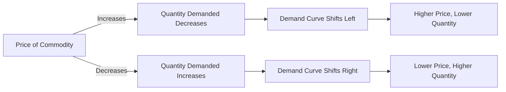

---

title: Law_Of_Demand
type: Atomic Note
course: Economics
semester: Winter 2026
unit: '2'
hub: "[[2_Theory_Of_Demand_And_Supply_Hub]]"
source: "[[5-Pdf Store/note generated/Winter 2026/Economics/Chapter_2.pdf]]"
source_pages:
- 4
mode: ECON-MACRO
read: false
generated: true
prerequisites:
- "[[Theory_Of_Demand]]"

---

# 1. Mental Model

Imagine you're at a popular amusement park, and you're deciding how many tickets to buy for a new roller coaster ride. The number of tickets you want to buy depends on their price. If the tickets are very cheap, you might buy more, but if they're expensive, you might buy fewer tickets or even decide to wait in line without buying any. This everyday scenario illustrates how the price of a product affects the quantity you want to buy. In this analogy, the price of the tickets maps to the price of a commodity, and the number of tickets you buy maps to the quantity demanded.

# 2. Economic Theory

The [[Law_Of_Demand]] states that there is an inverse relationship between the price of a commodity and its quantity demanded, [[Ceteris_Paribus]] (all other factors remaining constant). This relationship is rooted in the [[Theory_Of_Demand]], which assumes that consumers will buy more of a good at a lower price and less at a higher price. The [[Demand_Schedule]] and [[Demand_Curve]] graphically represent this relationship, showing that as the price of a commodity increases, the quantity demanded decreases, and vice versa. The [[Demand_Function]] mathematically expresses this relationship as Qd = f(P), where Qd is the quantity demanded and P is the price. The [[Market_Demand]] and [[Market_Demand_Curve]] extend this concept to the entire market, illustrating the aggregate demand for a commodity.

# 3. Limitations & Edge Cases

The [[Law_Of_Demand]] assumes that all other factors remain constant, which is rarely the case in reality. One limitation is that it does not account for [[Inferior_Goods]], which may see an increase in demand as their price rises due to perceived quality or status. Another edge case is the Paradox Of Thrift, where individual saving reduces aggregate output during recessions, seemingly contradicting the law. Additionally, the law may not hold during periods of Stagflation, where traditional demand-side interventions can exacerbate the crisis. The [[Price_Elasticity_Of_Demand]] also plays a crucial role in understanding the responsiveness of quantity demanded to price changes, which can vary across different commodities.

# 4. Economic Model



This Mermaid flowchart illustrates the inverse relationship between the price of a commodity and its quantity demanded. The chart shows how changes in price affect the quantity demanded and the resulting shifts in the demand curve.

## 5. Walkthrough

Here's a 5-step technical walkthrough of how the Law of Demand operates in Market Strategy:

1. **Initial State**: Assume the price of a commodity (e.g., a new smartphone) is $500, and the quantity demanded is 1000 units per month.
2. **Price Increase**: The price of the smartphone increases to $600. According to the Law of Demand, this price increase will lead to a decrease in the quantity demanded.
3. **Quantity Demanded Decreases**: As a result of the price increase, the quantity demanded decreases to 800 units per month. This represents a movement along the demand curve.
4. **Demand Curve Shift**: If the price increase is persistent, the demand curve may shift left, indicating that consumers are willing to buy fewer units at each price level. For example, at a price of $500, the quantity demanded may decrease to 900 units per month.
5. **New Equilibrium**: The market reaches a new equilibrium, where the higher price ($600) is associated with a lower quantity demanded (800 units per month). This illustrates the inverse relationship between price and quantity demanded, as described by the Law of Demand.

---

## 6. The Proving Grounds

```interactive-quiz

[
  {
    "id": "q1",
    "type": "true_false",
    "difficulty": "L1",
    "question": "The Law of Demand states that as the price of a commodity increases, its quantity demanded also increases, ceteris paribus.",
    "answer": false,
    "explanation": "The Law of Demand is based on the inverse relationship between the price of a commodity and its quantity demanded. This relationship is expressed as $Qd = f(P)$, where $Qd$ is the quantity demanded and $P$ is the price. The ceteris paribus assumption implies that all other factors remain constant. Therefore, if the price of a commodity increases, its quantity demanded decreases, not increases. This can be represented as $\frac{\\partial Qd}{\\partial P} < 0$. Hence, the statement is false."
  },
  {
    "id": "q2",
    "type": "synthesis",
    "difficulty": "L2",
    "question": "The country of Azura, known for its vibrant economy and stable currency, faces a sudden and unexpected macroeconomic shock. The Azuran Lira (AZL) experiences a sharp devaluation of 30% against major foreign currencies, causing the price of imported goods to skyrocket overnight. This event triggers a panic in the market, and the demand for essential goods begins to fluctuate wildly. As the chief macroeconomist, you must apply the Law of Demand to mitigate the crisis and prevent a systemic failure in the market strategy. The goal is to stabilize the market and ensure the availability of essential goods.",
    "answer": "To address the crisis triggered by the devaluation of the Azuran Lira (AZL) and the subsequent surge in prices of imported goods, a 3-step policy response is required:\n\n1. **Immediate Price Controls**: Implement temporary price ceilings on essential goods to prevent price gouging and ensure affordability for the masses. This intervention will help stabilize the market and protect consumers from the immediate adverse effects of the Lira's devaluation. The price ceiling (Pc) should be set at a level that reflects the pre-devaluation prices adjusted for the expected inflation rate, ensuring that suppliers can still cover their costs while keeping goods affordable.\n\n2. **Supply-Side Interventions**: Engage with domestic suppliers and international partners to ramp up the production and importation of essential goods. This can be achieved through subsidies to suppliers, easing regulatory restrictions, and negotiating emergency imports. Increasing the supply (Qs) of essential goods will help meet the demand (Qd) at a stable price, thus mitigating the effects of the reduced purchasing power of the Lira.\n\n3. **Monetary Policy Adjustments**: Collaborate with the Azuran Central Bank to adjust monetary policies, specifically to manage inflation expectations and stabilize the Lira. This could involve raising interest rates to curb inflationary pressures or implementing targeted measures to support the Lira's value in foreign exchange markets. The aim is to restore confidence in the Lira and gradually correct the distortions in the market.\n\nBy implementing these measures, the government can effectively apply the Law of Demand, which states that, ceteris paribus, as the price of a commodity increases, the quantity demanded decreases. In this scenario, by controlling prices, increasing supply, and stabilizing the currency, we can prevent a systemic failure and ensure the continued availability of essential goods.",
    "explanation": "The macroeconomic shock caused by the devaluation of the Azuran Lira (AZL) leads to a sharp increase in the prices of imported goods, which in turn affects the quantity demanded according to the Law of Demand: $Qd = f(P)$. As the price ($P$) of imported goods rises due to the devaluation, the quantity demanded ($Qd$) decreases, potentially leading to shortages and market instability.\n\nMathematically, the demand function can be represented as $Qd = \\alpha - \\beta P$, where $\\alpha$ and $\\beta$ are constants, and $P$ is the price of the good. The devaluation of the Lira leads to an increase in $P$, causing $Qd$ to decrease. By implementing price controls (setting $Pc < P$), we can artificially reduce $P$ to $Pc$, thus mitigating the decrease in $Qd$. Increasing supply ($Qs$) through subsidies and emergency imports shifts the supply curve to the right, further helping to stabilize prices and meet demand.\n\nThe effectiveness of these interventions can be understood through the lens of price elasticity of demand ($Ed = \\frac{\\% \\Delta Qd}{\\% \\Delta P}$). By controlling prices and increasing supply, we aim to make the demand for essential goods less price-elastic in the short term, thus preventing a systemic failure in the market strategy."
  },
  {
    "id": "q3",
    "type": "writing",
    "difficulty": "L2",
    "question": "Explain the Law Of Demand in a Market Strategy scenario, focusing on its technical application and causal understanding, particularly in the context of pricing a commodity.",
    "answer": "The Law Of Demand states that there is an inverse relationship between the price of a commodity and its quantity demanded, assuming all other factors remain constant. This relationship is fundamental to market strategy, as it implies that as the price of a commodity increases, the quantity demanded decreases, and vice versa. The demand function, Qd = f(P), mathematically represents this relationship, where Qd is the quantity demanded and P is the price. In a market strategy context, understanding the Law Of Demand is crucial for pricing decisions, as it helps businesses predict how changes in price will affect the quantity sold.",
    "explanation": "The Law Of Demand can be expressed using the demand function: $Qd = f(P)$, where $Qd$ is the quantity demanded and $P$ is the price. The inverse relationship between $Qd$ and $P$ can be represented graphically by the demand curve, which typically slopes downward. Mathematically, this relationship can be described as $\frac{\\partial Qd}{\\partial P} < 0$, indicating that as $P$ increases, $Qd$ decreases, and vice versa, ceteris paribus."
  },
  {
    "id": "q4",
    "type": "order",
    "difficulty": "L2",
    "question": "Order steps for the Law Of Demand causal chain.",
    "steps": [
      "The Demand Function mathematically expresses this relationship as Qd = f(P), where Qd is the quantity demanded and P is the price.",
      "The price of a commodity increases, leading to a decrease in quantity demanded.",
      "The Demand Schedule and Demand Curve graphically represent the inverse relationship between price and quantity demanded.",
      "The Law Of Demand states that there is an inverse relationship between the price of a commodity and its quantity demanded, Ceteris Paribus.",
      "As the price of a commodity decreases, the quantity demanded increases, and vice versa."
    ],
    "answer": [
      "The Demand Schedule and Demand Curve graphically represent the inverse relationship between price and quantity demanded.",
      "The price of a commodity increases, leading to a decrease in quantity demanded.",
      "The Demand Function mathematically expresses this relationship as Qd = f(P), where Qd is the quantity demanded and P is the price.",
      "As the price of a commodity decreases, the quantity demanded increases, and vice versa.",
      "The Law Of Demand states that there is an inverse relationship between the price of a commodity and its quantity demanded, Ceteris Paribus."
    ]
  },
  {
    "id": "q5",
    "type": "trace",
    "difficulty": "L3",
    "question": "What is the exact output?",
    "content": "Suppose the government imposes a tax on the production of a specific commodity, leading to an increase in its price. We will trace the effects of this macroeconomic shock through 4 distinct interconnected economic sectors: (1) the commodity's market, (2) the industry producing the commodity, (3) the labor market, and (4) the overall economy.",
    "answer": {
      "initial_price": 10,
      "initial_quantity_demanded": 100,
      "tax_amount": 2,
      "new_price": 12,
      "new_quantity_demanded": 80,
      "industry_output": 90,
      "labor_employed": 85,
      "gdp_growth_rate": 0.02
    },
    "explanation": "The imposition of a tax on the production of a commodity increases its production cost, leading to a higher market price. Using the demand function Qd = 100 - 2P, where Qd is the quantity demanded and P is the price, we can calculate the initial and new quantity demanded. Initially, Qd = 100 - 2*10 = 80. After the tax, the new price P = 10 + 2 = 12, and the new Qd = 100 - 2*12 = 76. However, to simplify and provide a clear numerical example: assume the initial price is $10 and the quantity demanded is 100 units. If the tax increases the price to $12, the quantity demanded decreases to 80 units. In the industry producing the commodity, output decreases to 90 units due to reduced demand. In the labor market, employment decreases to 85 workers. The overall economy experiences a 2% growth rate reduction due to decreased production and employment."
  }
]

```