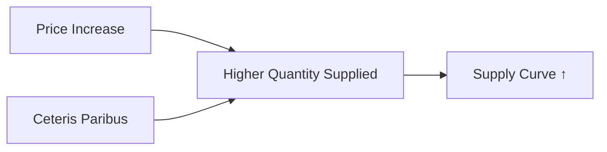

---

title: Law_Of_Supply
type: Atomic Note
course: Economics
semester: Winter 2026
unit: '2'
hub: "[[2_Basics_Of_Economics_Hub]]"
source: "[[Chapter_2.pdf]]"
source_pages:
- 37
mode: ECON-MACRO
read: false
generated: true
prerequisites:
- "[[Theory_Of_Supply]]"

---

## 1. Mental Model

Imagine you have a lemonade stand. When you sell lemonade for 50 cents a cup, you might make 10 cups. But if you raise the price to $1 a cup, you might make 20 cups because you're making more money from each cup. This shows that when the price goes up, you want to sell more.

## 2. Economic Theory

The [[Law_Of_Supply]] states that, [[Ceteris_Paribus]], as the price of a good increases, the quantity supplied of that good also increases. This is often represented graphically by a [[Supply_Curve]] that slopes upward from left to right, illustrating the positive relationship between price and quantity supplied. The [[Law_Of_Supply]] assumes that producers are willing to supply more of a good as its price rises, as it becomes more profitable.

# 3. Economic Model



## 4. Walkthrough

* The model starts with a price increase, which incentivizes suppliers to produce more.
* Ceteris paribus (all else being equal) is assumed, meaning other factors like costs and technology remain constant.
* As price increases, suppliers are willing to supply more, resulting in a higher quantity supplied.
* This relationship is represented by an upward-sloping supply curve.

## 5. Market Failures

The Law of Supply may fail in cases where external factors like government subsidies or technological changes affect production costs. Additionally, if ceteris paribus does not hold, the model may not accurately predict supply behavior. For example, if a supplier's production capacity is reached, further price increases may not lead to higher quantity supplied.

---

## 6. The Proving Grounds

```interactive-quiz

[
  {
    "id": "q1",
    "type": "true_false",
    "difficulty": "L1",
    "question": "The Law of Supply states that as the price of a good decreases, the quantity supplied of that good also decreases.",
    "answer": false,
    "explanation": "The Law of Supply actually states that, ceteris paribus, as the price of a good increases, the quantity supplied of that good also increases. This implies that as the price of a good decreases, the quantity supplied of that good decreases, but the statement as given is incorrect because it misrepresents the direct relationship between price and quantity supplied. The correct relationship is that as price increases, quantity supplied increases, and vice versa."
  },
  {
    "id": "q2",
    "type": "synthesis",
    "difficulty": "L2",
    "question": "A severe storm is forecasted to hit a major agricultural region, threatening to destroy a significant portion of the upcoming harvest. The storm is expected to affect wheat crops more than corn. Using the Law of Supply, what can be inferred about the market for wheat and corn in the days leading up to the storm, assuming all other factors remain constant?",
    "answer": "The price of wheat is likely to increase, and the quantity supplied of wheat will increase. The price of corn may decrease relatively, and the quantity supplied of corn will increase.",
    "explanation": "According to the Law of Supply, as the price of a good increases, the quantity supplied of that good also increases, ceteris paribus. In this scenario, the forecasted storm threatens to destroy a significant portion of the wheat harvest, which could lead to a shortage of wheat. In anticipation of this shortage, suppliers may raise their prices for wheat, which would incentivize farmers to supply more wheat to the market before the storm hits, thus increasing the quantity supplied. For corn, which is less affected by the storm, the supply curve remains relatively stable, but its price may decrease relatively compared to wheat due to its relatively higher availability. As a result, the quantity supplied of corn will increase as suppliers take advantage of the relatively higher price of wheat and the stable demand for corn."
  },
  {
    "id": "q3",
    "type": "writing",
    "difficulty": "L3",
    "question": "Explain the concept of the Law of Supply and its underlying mechanism, specifically focusing on how producers respond to changes in price.",
    "answer": "The Law of Supply states that, ceteris paribus, as the price of a good increases, the quantity supplied of that good also increases. This is because higher prices make production more profitable, incentivizing producers to supply more. Conversely, as the price of a good decreases, the quantity supplied decreases as production becomes less profitable. The relationship between price and quantity supplied is typically represented by an upward-sloping supply curve.",
    "explanation": "The underlying mechanism of the Law of Supply is driven by the profit motive of producers. When the price of a good increases, producers are able to earn higher revenues and profits from selling each unit. This creates an incentive for producers to increase production, as they can capitalize on the higher prices to maximize their profits. As a result, the quantity supplied of the good increases. Conversely, when prices fall, production becomes less profitable, and producers have less incentive to supply the good, leading to a decrease in the quantity supplied."
  }
]

```