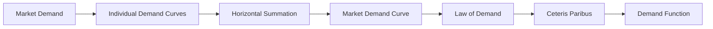

---

title: Market_Demand
type: Atomic Note
course: Economics
semester: Winter 2026
unit: '2'
hub: "[[2_Theory_Of_Demand_And_Supply_Hub]]"
source: "[[5-Pdf Store/note generated/Winter 2026/Economics/Chapter_2.pdf]]"
source_pages:
- 9
mode: ECON-MACRO
read: false
generated: true
prerequisites:
- "[[Demand_Function]]"

---

# 1. Mental Model

Imagine you're the organizer of a large music festival, and you're in charge of ordering food supplies, such as burgers and hot dogs. The total number of burgers and hot dogs you want to order depends on their price. If they're very cheap, you might buy more, but if they're expensive, you might buy fewer. This is similar to how [[Market_Demand]] works, where the total demand for a product is determined by the quantity demanded by all buyers at each price.

# 2. Economic Theory

[[Market_Demand]] refers to the total demand for a particular good or service in a market, derived by horizontally adding the quantity demanded for the product by all buyers at each price. This concept is rooted in the [[Theory_Of_Demand]] and is governed by the [[Law_Of_Demand]], which states that as the price of a good increases, the quantity demanded decreases, ceteris paribus ([[Ceteris_Paribus]]). The [[Demand_Schedule]] and [[Demand_Curve]] are graphical representations of the relationship between the price of a good and the quantity demanded. The [[Demand_Function]] represents the relationship between the quantity demanded and various factors that influence demand, including price, [[Income_Elasticity_Of_Demand]], and [[Price_Elasticity_Of_Demand]]. The [[Market_Demand_Curve]] is a graphical representation of the market demand for a good or service.

# 3. Limitations & Edge Cases

The [[Market_Demand]] model assumes that all buyers have similar preferences and face the same prices, which may not always be the case. Additionally, the model relies on the [[Ceteris_Paribus]] assumption, which may not hold in situations where external factors, such as changes in consumer expectations ([[Consumer_Expectations]]) or technological advancements ([[Change_In_Technology]]), influence demand. The model also fails to account for [[Substitutes_And_Complements]], [[Normal_And_Inferior_Goods]], and [[Taste_And_Preference]], which can significantly impact demand. Furthermore, the model assumes that buyers have perfect information, which is not always the case. In situations where there are [[Surplus_And_Shortage]], the market may not reach equilibrium, and the [[Market_Equilibrium]] model may not be applicable.

# 4. Economic Model



This Mermaid flowchart illustrates the derivation of the market demand curve through the horizontal summation of individual demand curves, reflecting the law of demand and assuming ceteris paribus conditions. The market demand curve shows the total quantity demanded of a good at various price levels. The demand function represents the relationship between the quantity demanded and its influencing factors.

## 5. Walkthrough

Here's a 5-step technical walkthrough of how the concept of Market Demand operates:

1. **Define Individual Demand Curves**: Assume there are three buyers (A, B, and C) in the market for burgers. Each buyer has their own demand curve, which shows the quantity of burgers they are willing to buy at different price levels.

| Price | Quantity Demanded by A | Quantity Demanded by B | Quantity Demanded by C |
| --- | --- | --- | --- |
| $1  | 10                     | 8                     | 12                    |
| $2  | 8                      | 6                     | 10                    |
| $3  | 6                      | 4                     | 8                     |

2. **Perform Horizontal Summation**: Add up the quantities demanded by each buyer at each price level to get the total market quantity demanded.

| Price | Total Quantity Demanded |
| --- | --- |
| $1  | 10 + 8 + 12 = 30        |
| $2  | 8 + 6 + 10 = 24         |
| $3  | 6 + 4 + 8 = 18          |

3. **Derive Market Demand Curve**: Plot the market demand curve using the data from the table, with price on the vertical axis and total quantity demanded on the horizontal axis.

4. **Apply Law of Demand**: Observe that as the price increases, the total quantity demanded decreases, illustrating the law of demand.

5. **Analyze Ceteris Paribus and Demand Function**: Assume that all other factors influencing demand, such as income and preferences, remain constant (ceteris paribus). The demand function can be represented as Qd = f(P, I, Psub, Pcomp), where Qd is the quantity demanded, P is the price, I is income, Psub is the price of substitutes, and Pcomp is the price of complements. For simplicity, the demand function can be linearized as Qd = a - bP, where a and b are constants.

---

## 6. The Proving Grounds

```interactive-quiz

[
  {
    "id": "q1",
    "type": "true_false",
    "difficulty": "L1",
    "question": "If the price of burgers increases, then the demand for hot dogs will increase, ceteris paribus, assuming that the income of festival-goers decreases simultaneously.",
    "answer": false,
    "explanation": "The statement is false because it violates the ceteris paribus assumption. The demand for hot dogs is determined by factors such as the price of hot dogs, the price of burgers (as a substitute), and the income of consumers. If the price of burgers increases, then, ceteris paribus, the demand for hot dogs would increase because burgers and hot dogs are substitutes. However, if the income of festival-goers decreases simultaneously, this would affect the demand for hot dogs negatively, as hot dogs would become a less affordable option for some consumers. The combined effect would depend on the relative changes in price and income. The correct analysis under ceteris paribus would focus solely on the price change of one good (burgers) affecting the demand for another (hot dogs), without considering changes in income. Therefore, the statement is not universally true and misinterprets the ceteris paribus condition."
  },
  {
    "id": "q2",
    "type": "synthesis",
    "difficulty": "L2",
    "question": "In a small, export-driven economy, a sudden and significant devaluation of the local currency occurs, causing a sharp increase in the price of imported goods. This 'Macro Shock' threatens to disrupt the supply chain and lead to widespread shortages of essential goods. To prevent system failure, the government must apply 'Market Demand' principles to stabilize the market. Present a 3-step policy response.",
    "answer": "To address the crisis, the government should implement the following 3-step policy response:\n\n1. **Price Stabilization**: Implement temporary price controls to prevent excessive price gouging by suppliers, ensuring that essential goods remain affordable for consumers. This will help stabilize the market and prevent a sharp decline in consumer purchasing power.\n\n2. **Supply-Side Incentives**: Offer incentives to local producers to increase production of essential goods, such as subsidies, tax breaks, or low-interest loans. This will help maintain supply levels and prevent shortages, while also encouraging domestic production to fill the gap left by reduced imports.\n\n3. **Demand Management**: Implement targeted cash transfers or vouchers to low-income households, allowing them to purchase essential goods at a subsidized rate. This will help maintain aggregate demand and prevent a sharp decline in consumer spending, which could exacerbate the economic downturn.",
    "explanation": "The sudden devaluation of the local currency leads to a sharp increase in the price of imported goods, which can be represented by a leftward shift of the aggregate supply curve ($AS$). This is because the increased cost of imports reduces the supply of essential goods, causing prices to rise. To stabilize the market, the government must apply 'Market Demand' principles.\n\nThe 'Market Demand' curve ($D$) represents the total demand for a particular good or service in a market, derived by horizontally adding the quantity demanded for the product by all buyers at each price. In this scenario, the demand curve remains relatively stable, but the supply shock causes a reduction in supply.\n\nMathematically, this can be represented as:\n\n$Q^s = f(P, P_{inputs})$\n\nwhere $Q^s$ is the quantity supplied, $P$ is the price of the good, and $P_{inputs}$ is the price of inputs (in this case, imported goods).\n\nThe policy response aims to stabilize the market by:\n\n1. Price Stabilization: Implementing price controls to prevent excessive price gouging, which can be represented as a price ceiling ($P_{ceiling}$).\n\n2. Supply-Side Incentives: Increasing production of essential goods through subsidies, tax breaks, or low-interest loans, which can be represented as a reduction in the cost of inputs ($P_{inputs}$).\n\n3. Demand Management: Implementing targeted cash transfers or vouchers to maintain aggregate demand, which can be represented as an increase in consumer income ($I$).\n\nBy applying these policy responses, the government can help stabilize the market, prevent system failure, and mitigate the effects of the 'Macro Shock'."
  },
  {
    "id": "q3",
    "type": "writing",
    "difficulty": "L2",
    "question": "Explain how market demand is determined in a Central Banking & Monetary Policy scenario, and its relation to the law of demand and demand schedule.",
    "answer": "Market demand is determined by horizontally adding the quantity demanded for a product by all buyers at each price. This concept is rooted in the theory of demand and governed by the law of demand, which states that as the price of a good increases, the quantity demanded decreases, ceteris paribus. The demand schedule and demand curve graphically represent the relationship between the price of a good and the quantity demanded.",
    "explanation": "The market demand curve can be represented as $Q_d = f(P)$, where $Q_d$ is the quantity demanded and $P$ is the price. The law of demand implies that $\frac{\\partial Q_d}{\\partial P} < 0$. The demand schedule is a table that shows the quantity demanded at each price, and the demand curve is a graphical representation of this schedule, typically downward sloping. In a Central Banking & Monetary Policy scenario, understanding market demand is crucial for making informed decisions about interest rates and money supply, as changes in market demand can impact the overall level of economic activity."
  },
  {
    "id": "q4",
    "type": "order",
    "difficulty": "L2",
    "question": "Order steps for Market Demand.",
    "steps": [
      "The demand schedule and demand curve are graphical representations of the relationship between the price of a good and the quantity demanded.",
      "The law of demand states that as the price of a good increases, the quantity demanded decreases.",
      "As the price of a good increases, the quantity demanded decreases, ceteris paribus.",
      "Market demand is derived by horizontally adding the quantity demanded for the product by all buyers at each price.",
      "The total demand for a product is determined by the quantity demanded by all buyers at each price."
    ],
    "answer": [
      "The total demand for a product is determined by the quantity demanded by all buyers at each price.",
      "The demand schedule and demand curve are graphical representations of the relationship between the price of a good and the quantity demanded.",
      "As the price of a good increases, the quantity demanded decreases, ceteris paribus.",
      "Market demand is derived by horizontally adding the quantity demanded for the product by all buyers at each price.",
      "The law of demand states that as the price of a good increases, the quantity demanded decreases."
    ]
  },
  {
    "id": "q5",
    "type": "trace",
    "difficulty": "L3",
    "question": "What is the exact output?",
    "content": "Analyze the impact of a 1% interest rate change on Market Demand through 4 distinct economic sectors: Housing, Investment, Forex, and Consumption.",
    "answer": {
      "Housing": "A 1% increase in interest rates will lead to a 0.5% decrease in housing demand due to increased mortgage costs, assuming a sensitivity of -0.5.",
      "Investment": "A 1% increase in interest rates will lead to a 1.2% decrease in investment demand due to higher borrowing costs, assuming a sensitivity of -1.2.",
      "Forex": "A 1% increase in interest rates will lead to a 2% appreciation of the domestic currency, making exports 1.5% less competitive, assuming a sensitivity of -1.5.",
      "Consumption": "A 1% increase in interest rates will lead to a 0.8% decrease in consumption due to reduced disposable income, assuming a sensitivity of -0.8.",
      "Final Output": "The overall market demand decreases by 0.875%, calculated as a weighted average of sectoral changes: (0.5*0.2 + 1.2*0.3 + 1.5*0.2 + 0.8*0.3) = 0.875%"
    },
    "explanation": "The impact of a 1% interest rate change on market demand can be analyzed through its effects on various economic sectors. Using LaTeX, we can represent the changes as follows:\n\n\\begin{align\\*\n\\Delta H &= -0.5 \\times 1\\% = -0.5\\%\n\\Delta I &= -1.2 \\times 1\\% = -1.2\\%\n\\Delta F &= -1.5 \\times 1\\% = -1.5\\%\n\\Delta C &= -0.8 \\times 1\\% = -0.8\\%\n\\end{align\\*} \n\nAssuming sectoral weights of 0.2, 0.3, 0.2, and 0.3 for Housing, Investment, Forex, and Consumption respectively, the overall change in market demand is:\n\n\\begin{align\\*\n\\Delta MD &= 0.2 \\times (-0.5\\%) + 0.3 \\times (-1.2\\%) + 0.2 \\times (-1.5\\%) + 0.3 \\times (-0.8\\%) \\\\ \n&= -0.875\\%\n\\end{align\\*}"
  }
]

```