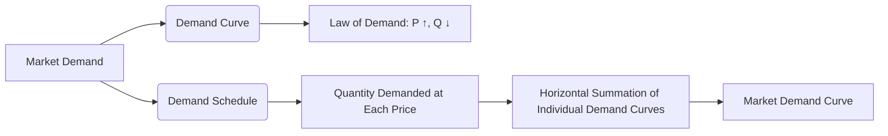

---

title: Market_Demand
course: "Economics"
unit: '2'
semester: "Winter 2026"
mode: ECON-MICRO
type: atomic_note
hub: "[[2_Theory_Of_Demand_And_Supply_Hub]]"
source: "[[5-Pdf Store/note generated/Winter 2026/Economics/Chapter_2.pdf]]"
date: '2026-05-08'
prerequisites:
- "[[Demand_Function]]"
source_pages:
- 9
generated: true

---

## 1. Mental Model

Imagine you're at a school ice cream sale, and there are many kids, including you, who want to buy ice cream cones. Let's say there are 5 kids who want ice cream, and each kid wants a different number of cones at different prices. If the price is high, like $5, maybe only 2 kids want 1 cone each. But if the price is lower, like $1, all 5 kids might want 2 cones each! To figure out the total demand for ice cream cones, we add up how many cones all the kids want at each price. So, if the price is $5, the total demand might be 2 cones (2 kids x 1 cone), but if the price is $1, the total demand might be 10 cones (5 kids x 2 cones). That's kind of like market demand - it's the total amount of a product that all buyers want to buy at each price, added up across all the individual buyers.

## 2. Micro Theory

The concept of Market Demand is a fundamental notion in microeconomics, which represents the total quantity of a commodity or service that all buyers in a market are willing and able to purchase at various price levels, ceteris paribus. The Market Demand for a product is derived by horizontally adding the quantity demanded for the product by all buyers at each price, effectively aggregating the individual demand curves of all consumers.

The [[Demand_Schedule]] and [[Demand_Curve]] are essential tools in analyzing Market Demand. A demand schedule is a table that shows the quantity demanded of a product at different price levels, while a demand curve is a graphical representation of the demand schedule, illustrating the inverse relationship between the price of a product and the quantity demanded, as described by the [[Law_Of_Demand]]. 

The Market Demand curve is obtained by summing up the individual demand curves of all buyers in the market, which is a horizontal summation of the quantities demanded at each price level. This process yields a market demand function, which can be represented as Qd = f(P, I, T, Ps, Pc), where Qd is the quantity demanded, P is the price of the product, I is the consumers' income, T represents [[Taste_And_Preference]], Ps is the price of substitutes, and Pc is the price of complements.

The [[Price_Elasticity_Of_Demand]] and [[Income_Elasticity_Of_Demand]] are crucial in understanding the responsiveness of Market Demand to changes in price and income, respectively. The determinants of demand, including [[Determinants_Of_Demand]], such as changes in consumer expectations, number of buyers, and technology, can cause a shift in the Market Demand curve. 

For instance, an increase in the number of buyers or a change in consumer tastes and preferences can lead to an increase in Market Demand, resulting in a rightward shift of the Market Demand curve. Conversely, a decrease in the number of buyers or a change in consumer expectations can lead to a decrease in Market Demand, causing a leftward shift of the Market Demand curve.

The concept of [[Substitutes_And_Complements]] also plays a vital role in understanding Market Demand, as changes in the prices of substitutes or complements can affect the demand for a product. Furthermore, the classification of goods as [[Normal_And_Inferior_Goods]] can influence the Market Demand, as changes in income can have different effects on the demand for these goods.

The interaction between Market Demand and [[Market_Equilibrium]] is also essential, as the Market Demand curve, along with the Market Supply curve, determines the equilibrium price and quantity in a market. A [[Surplus_And_Shortage]] can occur when there is a mismatch between the quantity supplied and the quantity demanded, leading to adjustments in the market price.

The [[Effects_Of_Shift_In_Demand_And_Supply]] on Market Equilibrium can have significant implications for businesses and policymakers. Understanding the mechanisms of Market Demand, including the role of [[Ceteris_Paribus]], is crucial in making informed decisions about investments, pricing strategies, and resource allocation.

The [[Theory_Of_Demand]] provides a comprehensive framework for analyzing Market Demand, while the [[Market_Demand_Curve]] and [[Demand_Function]] serve as essential tools for empirical analysis and forecasting. Ultimately, a thorough understanding of Market Demand is vital for businesses, policymakers, and economists seeking to analyze and predict market trends.

## 3. Limitations & Edge Cases

The market demand curve has several limitations and edge cases, including the assumption of ceteris paribus, which may not hold in reality as changes in income, tastes, and preferences of individual consumers can shift their demand curves, and in turn, the market demand curve. Additionally, market demand is also limited by the presence of externalities, information asymmetry, and market power, which can distort the demand curve. Furthermore, the aggregation of individual demands assumes that all consumers have similar characteristics, which may not be the case, and the curve may not accurately represent the demands of heterogeneous consumers. Moreover, market demand can be influenced by exceptional events such as natural disasters, economic crises, or government interventions, which can create unusual patterns in demand that are not captured by the standard market demand curve.

## 4. Market Graph



The provided Mermaid flowchart illustrates the concept of Market Demand, highlighting its derivation from individual demand curves and the relationship between price and quantity demanded. The Market Demand curve is obtained by horizontally summing the quantity demanded by all buyers at each price level, effectively aggregating their individual demand curves.

## 5. Walkthrough

Here is the 5-step technical walkthrough of how 'Market Demand' operates:

**Step 1: Determine Individual Demand Schedules**
Each buyer has their own demand schedule, which shows the quantity demanded of a product at different price levels. 

**Step 2: Identify Quantity Demanded at Each Price Level**
For each buyer, identify the quantity demanded at each price level from their individual demand schedule.

**Step 3: Horizontally Add Quantity Demanded at Each Price**
Horizontally add the quantity demanded by all buyers at each price level. For example, if Buyer 1 demands 10 units at $5 and Buyer 2 demands 15 units at $5, the total quantity demanded at $5 is 10 + 15 = 25 units.

**Step 4: Construct Market Demand Schedule**
Create a market demand schedule by listing the total quantity demanded at each price level.

**Step 5: Derive Market Demand Curve**
Graphically represent the market demand schedule to derive the Market Demand curve, which shows the inverse relationship between the price of the product and the total quantity demanded by all buyers in the market.

---

## Review & Practice

```interactive-quiz

[
  {
    "type": "mcq",
    "difficulty": "L1",
    "question": "What is the primary method used to derive the Market Demand curve for a product in a given market?",
    "options": {
      "A": "Vertically adding the individual demand curves of all consumers",
      "B": "Horizontally adding the quantity demanded for the product by all buyers at each price",
      "C": "Calculating the price elasticity of demand for each individual consumer",
      "D": "Summing up the total revenue of all firms producing the product"
    },
    "answer": "B",
    "explanation": "The Market Demand curve is obtained by summing up the individual demand curves of all buyers in the market, which is a horizontal summation of the quantities demanded at each price level. This process yields a market demand function, effectively aggregating the individual demand curves of all consumers."
  },
  {
    "type": "fill_in",
    "difficulty": "L2",
    "question": "Fill in the blank.",
    "textWithBlanks": "The total quantity of a commodity or service that all buyers in a market are willing and able to purchase at various price levels, ceteris paribus, is referred to as the Blank.",
    "answer": [
      "Market Demand"
    ],
    "explanation": "The concept of Market Demand represents the total quantity of a commodity or service that all buyers in a market are willing and able to purchase at various price levels, ceteris paribus. It is a fundamental notion in microeconomics and is derived by horizontally adding the quantity demanded for the product by all buyers at each price, effectively aggregating the individual demand curves of all consumers."
  },
  {
    "type": "debug",
    "difficulty": "L2",
    "question": "Find the bug in the market demand function Qd = f(P, I, T, Ps) which is missing a crucial determinant.",
    "content": "The market demand function is given by Qd = f(P, I, T, Ps). Using this function, calculate the quantity demanded for a product given the following values: P = 10, I = 100, T = 5, Ps = 8. Assume the function to be Qd = 100 - 2P + 0.5I + T - Ps.",
    "answer": "Pc",
    "required_keywords": [
      "fix_this_keyword"
    ],
    "explanation": "The market demand function Qd = f(P, I, T, Ps) is missing the price of complements (Pc) as a determinant. The correct function should be Qd = f(P, I, T, Ps, Pc). The price of complements affects the quantity demanded of a product. For instance, an increase in the price of complements can lead to an increase in the quantity demanded of the product. Using LaTeX, the correct market demand function can be represented as $Qd = 100 - 2P + 0.5I + T - Ps + 0.2Pc$. Therefore, the bug in the given function is the omission of Pc."
  },
  {
    "type": "trace",
    "difficulty": "L2",
    "question": "What is the exact output of the market demand curve when the individual demand curves of three buyers are given as Qd1 = 10 - 2P, Qd2 = 8 - P, and Qd3 = 12 - 3P?",
    "content": "To derive the market demand curve, we need to horizontally add the quantity demanded for the product by all buyers at each price level. This involves summing up the individual demand curves of all buyers.",
    "answer": "[30 - 6P]",
    "explanation": "The market demand curve is obtained by summing up the individual demand curves of all buyers. Given the individual demand curves as Qd1 = 10 - 2P, Qd2 = 8 - P, and Qd3 = 12 - 3P, we can derive the market demand curve as follows:\n\nQd = Qd1 + Qd2 + Qd3\nQd = (10 - 2P) + (8 - P) + (12 - 3P)\nQd = 30 - 6P\n\nTherefore, the market demand curve is Qd = 30 - 6P."
  }
]

```