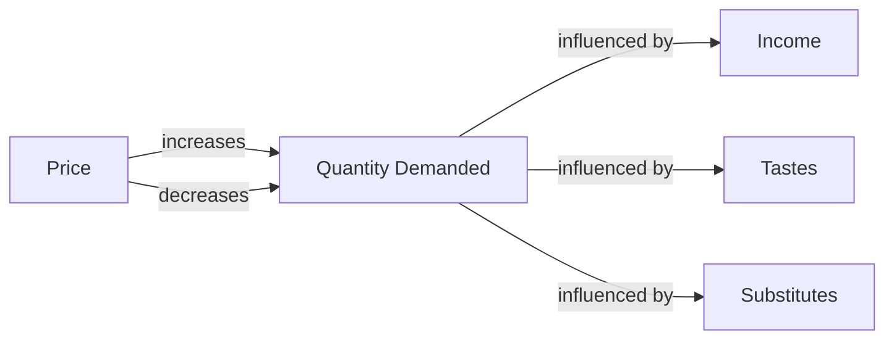

---

title: Market_Demand
type: Atomic Note
course: Economics
semester: Winter 2026
unit: '2'
hub: "[[2_Basics_Of_Economics_Hub]]"
source: "[[Chapter_2.pdf]]"
source_pages:
- 11
mode: ECON-MACRO
read: false
generated: true
prerequisites:
- "[[Demand_Function]]"

---

# 1. Mental Model

Imagine you're at a school bake sale, and lots of people are buying cookies. The total number of cookies that everyone wants to buy at a certain price is like the market demand. If the price goes up, maybe fewer people will want to buy cookies, so the total number of cookies demanded goes down.

# 2. Economic Theory

Market Demand refers to the total quantity of a good or service that all consumers are willing and able to buy at various price levels in a given market. It is represented by a [[Demand_Curve]] or a [[Demand_Function]], which shows the relationship between the price of a good and the quantity demanded, assuming [[Ceteris_Paribus]] (all other factors are constant). For example, a market demand function can be expressed as Qm = f(P), where Qm is the market demand and P is the price, such as Qm = 2000 - 200P.

# 3. Economic Model



## 4. Walkthrough

* The market demand model shows how the price of a good affects the quantity demanded by consumers.
* For example, if the price of cookies at the bake sale increases, the quantity demanded decreases as some buyers may no longer be willing to pay the higher price.
* Conversely, if the price decreases, the quantity demanded increases as more buyers become willing to buy cookies at the lower price.
* Other factors such as income, tastes, and availability of substitutes can also influence the quantity demanded.

## 5. Market Failures

This concept may fail when there are external factors that affect demand, such as changes in consumer preferences or unexpected events that impact income. Additionally, the model assumes that consumers have perfect information about the market, which may not always be the case. Edge cases to watch out for include non-price factors that influence demand, such as advertising or changes in population demographics.

---

## 6. The Proving Grounds

```interactive-quiz

[
  {
    "id": "q1",
    "type": "true_false",
    "difficulty": "L1",
    "question": "The market demand for a good or service is determined by the total quantity that all consumers are willing and able to buy at a single specific price level.",
    "answer": false,
    "explanation": "Market demand actually refers to the total quantity of a good or service that all consumers are willing and able to buy at various price levels, not at a single specific price level. This is represented by a demand curve or demand function, which shows the relationship between the price and the quantity demanded. The demand curve or function provides a range of quantities demanded at different price levels, highlighting how changes in price affect the total quantity demanded."
  },
  {
    "id": "q2",
    "type": "synthesis",
    "difficulty": "L2",
    "question": "The school bake sale is selling cookies at $2 each. Historically, at this price, 100 cookies are sold. However, a new student, Emma, just joined the school and she is willing to buy 20 cookies at $2.50 each but not at $2. If the bake sale owner decides to raise the price to $2.50, and assuming the other students' demand doesn't change, how will the market demand for cookies change, considering Emma's demand and the fact that at $2.50, one of the existing buyers will stop buying cookies because it's too expensive for them?",
    "answer": "A grading rubric: 4 points for correctly identifying the initial and final market demand quantities; 3 points for accurately describing the shift in market demand; 2 points for considering Emma's impact on market demand; and 1 point for noting the existing buyer's change in behavior.",
    "explanation": "The initial market demand at $2 is 100 cookies. When the price increases to $2.50, the existing buyers' demand decreases by 1 buyer (let's assume this buyer was purchasing 10 cookies, for simplicity), so 90 cookies from existing buyers. Emma enters the market at $2.50 with a demand for 20 cookies. Therefore, the new market demand at $2.50 is 90 (from existing buyers) + 20 (from Emma) = 110 cookies. The market demand increased from 100 to 110 cookies. This scenario demonstrates a movement along the demand curve rather than a shift of the entire curve, as the price change affects the quantity demanded. Emma's entry adds to the market demand at the new price point."
  },
  {
    "id": "q3",
    "type": "writing",
    "difficulty": "L3",
    "question": "Explain how a change in consumer income affects market demand.",
    "answer": "An increase in consumer income typically leads to an increase in market demand for normal goods, as consumers have more disposable income to spend. Conversely, a decrease in consumer income leads to a decrease in market demand for normal goods.",
    "explanation": "The underlying mechanism is rooted in the concept of the income effect, which states that as consumer income increases, the demand for normal goods and services also increases, as consumers are willing and able to purchase more. This is because the increased income provides consumers with more purchasing power, allowing them to buy more of the good or service. On the other hand, inferior goods experience a decrease in demand as consumer income increases, as consumers tend to substitute away from these goods towards more premium or higher-quality alternatives."
  }
]

```