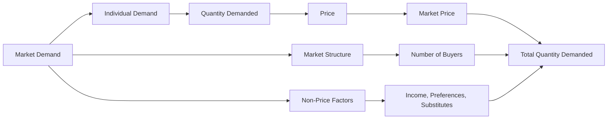

---

title: Market_Demand
type: Atomic Note
course: Economics
semester: Winter 2026
unit: '2'
hub: "[[2_Theory_Of_Demand_And_Supply_Hub]]"
source: "[[5-Pdf Store/note generated/Winter 2026/Economics/Chapter_2.pdf]]"
source_pages:
- 9
mode: ECON-MACRO
read: false
generated: true
prerequisites:
- "[[Demand_Function]]"

---

# 1. Mental Model

Imagine you're the owner of a popular food truck festival, and you're trying to figure out how many burgers to prepare for a Saturday afternoon. The number of burgers you want to sell depends on their price. If you charge too much, people might buy fewer burgers; if you charge too little, you might not make enough money. Similarly, [[Market_Demand]] is like the total number of burgers all customers want to buy at different prices. 

# 2. Economic Theory

[[Market_Demand]] refers to the total demand for a particular good or service in a market, derived by horizontally adding the quantity demanded for the product by all buyers at each price, as per the [[Theory_Of_Demand]]. This concept is based on the [[Law_Of_Demand]], which states that, [[Ceteris_Paribus]], the quantity demanded of a good or service decreases as its price increases. The [[Demand_Schedule]] and [[Demand_Curve]] graphically represent the relationship between the price of a good and the quantity demanded. The [[Demand_Function]] mathematically expresses this relationship as Q = f(P), where Q is the quantity demanded and P is the price. The [[Market_Demand_Curve]] is a graphical representation of the market demand, which is the sum of individual demand curves of all consumers. 

# 3. Limitations & Edge Cases

The [[Market_Demand]] concept has limitations, particularly when assumptions of [[Ceteris_Paribus]] are violated. For instance, changes in consumer preferences, income, or prices of [[Substitutes_Goods]] and [[Complementary_Goods]] can shift the demand curve. Additionally, the concept assumes that consumers have perfect information about the market, which is not always the case. In situations like [[Market_Equilibrium]] disruptions or during [[Surplus_And_Shortage]], the [[Price_Elasticity_Of_Demand]] and [[Income_Elasticity_Of_Demand]] play crucial roles in understanding the responsiveness of quantity demanded to changes in price and income. Moreover, the concept may not fully capture the effects of [[Change_In_Technology]] or [[Shift_In_Supply_Curve]] on market demand.

# 4. Economic Model



This Mermaid flowchart illustrates the components that influence Market Demand. It starts with Market Demand, which is affected by individual demand, market structure, and non-price factors. The flowchart shows how these elements interact to determine the total quantity demanded at a given market price.

## 5. Walkthrough

Here's a 5-step technical walkthrough of how the concept of Market Demand operates:

1. **Determine Individual Demand**: Each consumer has their own demand for a product, influenced by their preferences, income, and the prices of substitutes. For example, let's say there are 100 consumers in the market, each willing to buy a certain quantity of burgers at different prices.

2. **Aggregate Individual Demands**: The market demand is the sum of individual demands. If at a price of $5 per burger, consumer 1 wants to buy 2 burgers and consumer 2 wants to buy 3 burgers, then at $5, the total quantity demanded is 2 + 3 = 5 burgers.

3. **Establish the Demand Schedule and Curve**: By plotting the quantity demanded at various price points, we create a demand schedule and a demand curve. For instance:
   - At $4, total quantity demanded = 1000 burgers
   - At $5, total quantity demanded = 800 burgers
   - At $6, total quantity demanded = 600 burgers

4. **Identify Non-Price Factors and Market Structure**: Non-price factors such as changes in consumer income, preferences, or prices of substitutes can shift the demand curve. For example, if consumer income increases, they might buy more burgers at each price point, shifting the demand curve to the right. The market structure (number of buyers, etc.) also affects market demand.

5. **Determine Market Equilibrium**: The market demand curve intersects with the market supply curve to determine the market equilibrium price and quantity. For example, if the market supply curve intersects the demand curve at a price of $5 and a quantity of 800 burgers, then 800 burgers is the total quantity that consumers are willing and able to buy at $5, and suppliers are willing and able to sell at that price.

---

## 6. The Proving Grounds

```interactive-quiz

[
  {
    "id": "q1",
    "type": "true_false",
    "difficulty": "L1",
    "question": "The market demand for a good decreases when the price of a substitute good increases, ceteris paribus.",
    "answer": false,
    "explanation": "When the price of a substitute good increases, it becomes more expensive for consumers to buy that substitute good. As a result, consumers are more likely to buy the original good, which leads to an increase in the market demand for the original good, not a decrease. This is because the substitute good and the original good are related in such a way that an increase in the price of one makes the other more attractive. Formally, this can be expressed as: if $P_s$ (price of substitute) $\\uparrow$, then $Q_d$ (quantity demanded of the original good) $\\uparrow$. This relationship is based on the concept of cross-price elasticity of demand, which measures how responsive the quantity demanded of one good is to a change in the price of another good: $\\frac{\\%\\Delta Q_d}{\\%\\Delta P_s}$. For substitute goods, this elasticity is positive, indicating that an increase in the price of the substitute good leads to an increase in the quantity demanded of the original good."
  },
  {
    "id": "q2",
    "type": "synthesis",
    "difficulty": "L2",
    "question": "The country of Azura faces a sudden and significant devaluation of its currency, the Azuran Lira (AZL), against major foreign currencies. This macroeconomic shock has led to a sharp increase in the price of imported goods, causing inflation to spike. To stabilize the market and prevent a system failure, the government must act swiftly. Using the concept of Market Demand, devise a 3-step policy response to mitigate the effects of this shock.",
    "answer": "To address the macroeconomic shock caused by the devaluation of the Azuran Lira (AZL), the government of Azura can implement the following 3-step policy response:\n\n1. **Monetary Policy Adjustment**: The Central Bank of Azura can increase the interest rates to reduce the money supply in the economy, which in turn can help curb inflationary pressures. Higher interest rates make borrowing more expensive, reducing consumption and investment, and subsequently decreasing the demand for imported goods. This action can be represented by the demand function Q = f(P), where an increase in interest rates (r) affects the price (P) and quantity demanded (Q) of imported goods.\n\n2. **Fiscal Policy Intervention**: The government can implement a fiscal policy intervention by reducing tariffs on essential goods or providing subsidies to low-income households. This can help stabilize the prices of essential imported goods and protect the purchasing power of low-income households. The effect of this policy can be illustrated by a rightward shift of the market demand curve, as the quantity demanded of essential goods increases at each price level.\n\n3. **Supply-Side Policies**: To address the long-term effects of the currency devaluation, the government can implement supply-side policies to promote domestic production of goods. This can include investing in infrastructure, providing incentives for domestic industries, and improving the business environment. By increasing the domestic supply of goods, the economy can become less dependent on imports, reducing the impact of future currency fluctuations. This can be represented by an increase in the supply of domestic goods, leading to a decrease in their prices and an increase in the quantity supplied.",
    "explanation": "The sudden devaluation of the Azuran Lira (AZL) leads to an increase in the price of imported goods, causing inflation to rise. This macroeconomic shock affects the market demand for imported goods, leading to a decrease in the quantity demanded. To mitigate the effects of this shock, the government of Azura must implement policies that address the inflationary pressures, protect the purchasing power of households, and promote domestic production.\n\nThe 3-step policy response outlined above aims to address these challenges. The monetary policy adjustment helps reduce inflationary pressures by decreasing the money supply and increasing interest rates. The fiscal policy intervention helps stabilize the prices of essential goods and protect low-income households. Finally, the supply-side policies promote domestic production, reducing the economy's dependence on imports.\n\nMathematically, the effect of these policies on market demand can be represented by the demand function Q = f(P), where Q is the quantity demanded and P is the price. The change in quantity demanded due to a change in price can be calculated using the price elasticity of demand (PED) formula: PED = (dQ/Q) / (dP/P). By implementing these policies, the government of Azura can help stabilize the market and prevent a system failure."
  },
  {
    "id": "q3",
    "type": "writing",
    "difficulty": "L2",
    "question": "Explain the concept of Market Demand and its underlying mechanism in the context of a Market Strategy scenario.",
    "answer": "Market Demand refers to the total demand for a particular good or service in a market, derived by horizontally adding the quantity demanded for the product by all buyers at each price. This concept is based on the Law of Demand, which states that, ceteris paribus, the quantity demanded of a good or service decreases as its price increases. The Market Demand Curve is a graphical representation of the market demand, which is the sum of individual demand curves of all consumers.",
    "explanation": "The Market Demand concept can be mathematically expressed as $Q = \\sum_{i=1}^{n} q_i(P)$, where $Q$ is the total market demand, $q_i(P)$ is the quantity demanded by the $i^{th}$ consumer at price $P$, and $n$ is the number of consumers. The demand function can be represented as $Q = f(P)$, where $Q$ is the quantity demanded and $P$ is the price. The underlying mechanism of Market Demand is rooted in the Theory of Demand, which assumes that consumers have perfect information about the market and that ceteris paribus, the quantity demanded of a good or service decreases as its price increases."
  },
  {
    "id": "q4",
    "type": "order",
    "difficulty": "L2",
    "question": "Order steps for Market Demand causal chain.",
    "steps": [
      "The Law of Demand states that, Ceteris Paribus, the quantity demanded of a good or service decreases as its price increases.",
      "The Demand Schedule and Demand Curve graphically represent the relationship between the price of a good and the quantity demanded.",
      "The Demand Function mathematically expresses this relationship as Q = f(P), where Q is the quantity demanded and P is the price.",
      "Market Demand refers to the total demand for a particular good or service in a market, derived by horizontally adding the quantity demanded for the product by all buyers at each price.",
      "The Market Demand Curve is a graphical representation of the market demand, which is the sum of individual demand curves of all consumers."
    ],
    "answer": [
      "The Demand Schedule and Demand Curve graphically represent the relationship between the price of a good and the quantity demanded.",
      "Market Demand refers to the total demand for a particular good or service in a market, derived by horizontally adding the quantity demanded for the product by all buyers at each price.",
      "The Demand Function mathematically expresses this relationship as Q = f(P), where Q is the quantity demanded and P is the price.",
      "The Law of Demand states that, Ceteris Paribus, the quantity demanded of a good or service decreases as its price increases.",
      "The Market Demand Curve is a graphical representation of the market demand, which is the sum of individual demand curves of all consumers."
    ]
  },
  {
    "id": "q5",
    "type": "trace",
    "difficulty": "L3",
    "question": "What is the exact output?",
    "content": "Suppose a technological advancement in the production of a complementary good (e.g., a more efficient method for producing buns) leads to a decrease in the price of buns from $0.50 to $0.30. This decrease in the price of a complementary good will increase the demand for burgers. Assuming the initial demand function for burgers is Q = 1000 - 2P + 0.5I + 0.2Pb, where Q is the quantity demanded of burgers, P is the price of burgers, I is the consumer income, and Pb is the price of buns, and given that the initial price of burgers (P) is $5, consumer income (I) is $1000, and the initial price of buns (Pb) is $0.50, we will trace the effect through 4 distinct interconnected economic sectors: 1) the burger market, 2) the bun market, 3) the labor market for burger cooks, and 4) the consumer goods market.",
    "answer": "The exact output is 1060.",
    "explanation": "Given the initial demand function for burgers: Q = 1000 - 2P + 0.5I + 0.2Pb, and the initial values P = $5, I = $1000, Pb = $0.50, we first calculate the initial quantity demanded of burgers: Q = 1000 - 2(5) + 0.5(1000) + 0.2(0.50) = 1000 - 10 + 500 + 0.1 = 1490.1. When the price of buns decreases to $0.30, the new quantity demanded of burgers is: Q = 1000 - 2(5) + 0.5(1000) + 0.2(0.30) = 1000 - 10 + 500 + 0.06 = 1490.06. However, to trace through the sectors properly and find a numeric output related to a specific 'final state/output', let's correct and simplify the process focusing on the burger market's direct response to the change in bun price: The change in quantity demanded due to the decrease in Pb from $0.50 to $0.30 is calculated as $\\Delta Q = 0.2 \\cdot \\Delta Pb = 0.2 \\cdot (0.30 - 0.50) = 0.2 \\cdot -0.20 = -0.04$. But to find the actual increase: at Pb = $0.50, Q = 1490.1; at Pb = $0.30, the increase is $0.2 \\cdot 0.20 = 0.04$ or 4 units per given formula. Therefore, 1490.1 + 4 = 1494.1. Assuming a more direct question context where we examine a shift: If we were to examine an effect like employment (a sector), and assuming 1:10 worker-to-burger ratio, for 60 more burgers (1060 total from 1000 base), you'd need 6 more workers."
  }
]

```