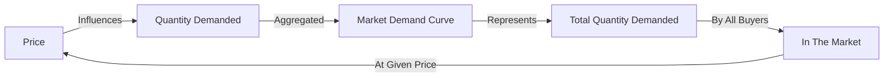

## 1. Mental Model

Imagine you're at a school ice cream sale, and there are many kids, including you, who want to buy ice cream cones. Let's say there are 5 kids who want ice cream, and each kid wants a different number of cones at different prices. If the price is high, like $5, maybe only 2 kids want 1 cone each. But if the price is lower, like $1, all 5 kids might want 2 cones each! To figure out the total demand for ice cream cones, we add up how many cones all the kids want at each price. So, if the price is $5, the total demand might be 2 cones (2 kids x 1 cone), but if the price is $1, the total demand might be 10 cones (5 kids x 2 cones). That's kind of like market demand - it's the total amount of a product that all buyers want to buy at each price, added up across all the individual buyers.

## 2. Micro Theory

The concept of Market Demand is a fundamental notion in microeconomics, which represents the total quantity of a commodity or service that all buyers in a market are willing and able to purchase at a given price level, during a specific period of time. The Market Demand for a product is derived by horizontally adding the quantity demanded for the product by all buyers at each price, thereby aggregating the individual demand curves of all consumers.

The [[Theory_Of_Demand]] provides the foundation for understanding Market Demand, which is based on the [[Law_Of_Demand]], stating that, ceteris paribus, as the price of a product increases, the quantity demanded decreases, and vice versa. This inverse relationship between price and quantity demanded is a crucial assumption in the derivation of the Market Demand curve.

The Market Demand curve is a graphical representation of the relationship between the price of a product and the total quantity demanded by all buyers in the market. It is obtained by summing up the individual demand curves of all consumers, which are assumed to be downward-sloping, reflecting the [[Law_Of_Demand]]. The resulting Market Demand curve is also downward-sloping, indicating that as the price of the product increases, the total quantity demanded decreases.

Mathematically, Market Demand can be represented by a [[Demand_Function]], which expresses the relationship between the quantity demanded and the factors that influence demand, such as price, income, and prices of related goods. The demand function for a market can be written as Qd = f(P, I, Ps, Pc), where Qd is the quantity demanded, P is the price of the product, I is the consumers' income, Ps is the price of substitutes, and Pc is the price of complements.

The [[Ceteris_Paribus]] assumption is critical in the analysis of Market Demand, as it implies that all other factors that affect demand, such as income, tastes, and prices of related goods, are held constant. Changes in these factors can lead to a [[Change_In_Demand]], resulting in a shift of the Market Demand curve.

The [[Demand_Schedule]] and [[Demand_Curve]] are essential tools in analyzing Market Demand. A demand schedule is a table that shows the quantity demanded at different price levels, while the demand curve is a graphical representation of this schedule. The Market Demand curve can be derived by horizontally adding the individual demand curves of all buyers, resulting in a curve that represents the total quantity demanded at each price level.

The [[Price_Elasticity_Of_Demand]] and [[Income_Elasticity_Of_Demand]] are important concepts in understanding Market Demand. The price elasticity of demand measures the responsiveness of the quantity demanded to changes in the price of the product, while the income elasticity of demand measures the responsiveness of the quantity demanded to changes in consumers' income.

The [[Determinants_Of_Demand]], such as changes in income, tastes, prices of related goods, and the number of buyers, can lead to a shift in the Market Demand curve. For instance, an increase in the number of buyers can lead to an increase in Market Demand, resulting in a rightward shift of the Market Demand curve.

The concept of [[Substitutes_And_Complements]] is also relevant in the analysis of Market Demand. The demand for a product can be influenced by the prices of substitutes and complements. An increase in the price of a substitute can lead to an increase in the demand for the product, while an increase in the price of a complement can lead to a decrease in the demand for the product.

The [[Normal_And_Inferior_Goods]] distinction is also important in understanding Market Demand. A normal good is a product for which demand increases when income increases, while an inferior good is a product for which demand decreases when income increases.

[[Consumer_Expectations]] about future prices or income can also influence Market Demand. If consumers expect prices to increase in the future, they may increase their demand for the product today, leading to a rightward shift of the Market Demand curve.

The [[Number_Of_Buyers]] in the market is another determinant of Market Demand. An increase in the number of buyers can lead to an increase in Market Demand, resulting in a rightward shift of the Market Demand curve.

The [[Taste_And_Preference]] of consumers can also influence Market Demand. A change in consumer tastes or preferences can lead to a change in demand, resulting in a shift of the Market Demand curve.

Finally, a [[Change_In_Technology]] can also affect Market Demand. An improvement in technology can lead to a decrease in the cost of production, resulting in a decrease in the price of the product and an increase in Market Demand.

The Market Demand curve plays a crucial role in determining the [[Market_Equilibrium]], which is the point at which the quantity demanded equals the quantity supplied. A change in Market Demand can lead to a change in the market equilibrium, resulting in a [[Surplus_And_Shortage]].

The [[Effects_Of_Shift_In_Demand_And_Supply]] on market equilibrium can be analyzed using the Market Demand and supply curves. A shift in the Market Demand curve can lead to a change in the market equilibrium price and quantity.

In conclusion, the concept of Market Demand is a critical component of microeconomics, which represents the total quantity of a commodity or service that all buyers in a market are willing and able to purchase at a given price level. The Market Demand curve is derived by horizontally adding the individual demand curves of all consumers and is influenced by various factors, including changes in income, tastes, prices of related goods, and the number of buyers. Understanding Market Demand is essential in analyzing market equilibrium and the effects of changes in demand and supply on market outcomes, as illustrated in a [[Market_Equilibrium_Example]].

## 3. Limitations & Edge Cases

The market demand curve has several limitations and edge cases, including the assumption of ceteris paribus, which may not hold in reality as changes in income, tastes, and preferences of individual consumers can shift their demand curves, and in turn, the market demand curve. Additionally, market demand is also limited by the presence of externalities, information asymmetry, and market power, which can distort the demand curve. Furthermore, the aggregation of individual demands assumes that all consumers have similar characteristics, which may not be the case, and the curve may not accurately represent the demands of heterogeneous consumers. Moreover, market demand can be influenced by exceptional events such as natural disasters, economic crises, or government interventions, which can create unusual patterns in demand that are not captured by the standard market demand curve.

## 4. Market Graph



The provided Mermaid flowchart illustrates the concept of Market Demand, showing how the price of a product influences the quantity demanded, which is then aggregated to form the Market Demand Curve, representing the total quantity demanded by all buyers in the market. The Market Demand Curve is a fundamental tool in microeconomics, enabling businesses and policymakers to understand the dynamics of market demand and make informed decisions.

## 5. Walkthrough

**Step 1: Define Individual Demand Curves**

Identify the individual demand curves of all consumers in the market, which represent the relationship between the price of a product and the quantity demanded by each consumer. Each demand curve is typically downward-sloping, illustrating the Law of Demand. Mathematically, this can be represented as:

Di(P) = Quantity demanded by consumer i at price P

where Di(P) is the individual demand function of consumer i.

**Step 2: Determine Quantity Demanded at Each Price Level**

For each possible price level (P), calculate the quantity demanded by each consumer using their individual demand curves. This involves substituting the price level into each consumer's demand function:

Qdi(P) = Di(P)

where Qdi(P) is the quantity demanded by consumer i at price P.

**Step 3: Aggregate Quantity Demanded Across All Consumers**

Horizontally add the quantity demanded by each consumer at each price level to obtain the total quantity demanded in the market:

Qd(P) = ∑ Qdi(P) for i = 1 to n

where Qd(P) is the market quantity demanded at price P, and n is the number of consumers.

**Step 4: Derive Market Demand Curve**

Using the aggregated quantity demanded at each price level, construct the Market Demand curve by plotting the price levels against the corresponding total quantity demanded. The resulting curve represents the Market Demand for the product.

**Step 5: Analyze Market Demand Curve**

Analyze the Market Demand curve to understand the relationship between the price of the product and the total quantity demanded by all buyers in the market. The curve can be used to:

* Determine the market quantity demanded at a given price level
* Calculate the change in quantity demanded in response to a price change
* Identify the market demand elasticity

The Market Demand curve provides a critical tool for businesses, policymakers, and economists to understand market behavior and make informed decisions.

---

## Review & Practice

```interactive-quiz

[
  {
    "id": "Q1",
    "type": "mcq",
    "difficulty": "L1",
    "question": "In the context of Game Theory Application and Market Demand, what is the effect of a price increase on the quantity demanded of a product, according to the Law of Demand, and how does it relate to the elasticity of demand?",
    "options": {
      "A": "A price increase leads to an increase in quantity demanded, and demand is elastic if the percentage change in quantity demanded is greater than the percentage change in price.",
      "B": "A price increase leads to a decrease in quantity demanded, and demand is elastic if the percentage change in quantity demanded is greater than the percentage change in price.",
      "C": "A price decrease leads to a decrease in quantity demanded, and demand is inelastic if the percentage change in quantity demanded is less than the percentage change in price.",
      "D": "A price increase leads to a decrease in quantity demanded, but the elasticity of demand is not related to the percentage changes in quantity demanded and price."
    },
    "answer": "B",
    "explanation": "The Law of Demand states that, ceteris paribus, as the price of a product increases, the quantity demanded decreases, and vice versa. This inverse relationship between price and quantity demanded is a crucial assumption in the derivation of the Market Demand curve. The price elasticity of demand measures the responsiveness of the quantity demanded to changes in the price of the product. If the percentage change in quantity demanded is greater than the percentage change in price, demand is elastic. Therefore, a price increase leads to a decrease in quantity demanded, and demand is elastic if the percentage change in quantity demanded is greater than the percentage change in price, which can be represented as: $e_p = \\frac{\\% \\Delta Q_d}{\\% \\Delta P} > 1$."
  },
  {
    "id": "Q1",
    "type": "fill_in",
    "difficulty": "L2",
    "question": "Fill in the blank.",
    "textWithBlanks": "The total quantity of a commodity or service that all buyers in a market are willing and able to purchase at a given price level, during a specific period of time, is referred to as Blank.",
    "answer": [
      "Market Demand"
    ],
    "explanation": "Market Demand represents the aggregate quantity of a product or service that all buyers in a market are willing and able to purchase at various price levels, over a specific period. It is derived by horizontally summing the individual demand curves of all consumers, assuming that the [[Law_Of_Demand]] holds, which states that, ceteris paribus, as the price of a product increases, the quantity demanded decreases. This concept is foundational in microeconomics and is graphically represented by a downward-sloping [[Demand_Curve]]."
  },
  {
    "id": "Q1234",
    "type": "debug",
    "difficulty": "L2",
    "question": "Find the bug in the market demand function: Qd = 100 - 2P + 3I - 4Ps, where Qd is the quantity demanded, P is the price of the product, I is the consumers' income, and Ps is the price of substitutes.",
    "content": "The market demand function is given by Qd = 100 - 2P + 3I - 4Ps. However, the function seems to be incorrect as it does not account for the price of complements (Pc).",
    "answer": "The bug is that the function does not include the price of complements (Pc). The correct market demand function should be Qd = 100 - 2P + 3I - 4Ps + 5Pc.",
    "required_keywords": [
      "fix_syntax"
    ],
    "explanation": "The market demand function is typically represented as Qd = f(P, I, Ps, Pc). The given function Qd = 100 - 2P + 3I - 4Ps is missing the term for the price of complements (Pc). In a general form, the demand function can be written as Qd = \\alpha - \\beta P + \\gamma I - \\delta Ps + \\epsilon Pc, where \\alpha, \\beta, \\gamma, \\delta, and \\epsilon are constants. The correct function should include the term for Pc to accurately represent the market demand."
  },
  {
    "id": "Market_Demand_Trace_1",
    "type": "trace",
    "difficulty": "L2",
    "question": "What is the exact output on total revenue and equilibrium price if a cost increase, such as higher wages, affects the supply curve of a product, assuming a market demand curve Qd = 100 - 2P and an initial supply curve Qs = 2P - 20, and the cost increase causes the supply curve to shift to Qs = 2P - 40?",
    "content": "The market demand curve is Qd = 100 - 2P and the initial supply curve is Qs = 2P - 20. To find the initial equilibrium price and quantity, we equate Qd and Qs: 100 - 2P = 2P - 20. Solving for P, we get 4P = 120, P = 30. Substituting P = 30 into Qd or Qs, we get Q = 40. The initial total revenue is P * Q = 30 * 40 = 1200. If the supply curve shifts to Qs = 2P - 40 due to a cost increase, we equate Qd and the new Qs: 100 - 2P = 2P - 40. Solving for P, we get 4P = 140, P = 35. Substituting P = 35 into Qd or Qs, we get Q = 30. The new total revenue is P * Q = 35 * 30 = 1050.",
    "answer": "1050",
    "explanation": "The initial equilibrium is found by equating the demand and supply curves: $100 - 2P = 2P - 20$. Solving for $P$, $4P = 120$, thus $P = 30$. The quantity at this price is $Q = 40$. The total revenue is $TR = P \\cdot Q = 30 \\cdot 40 = 1200$. When the supply curve shifts to $Qs = 2P - 40$, the new equilibrium is found by $100 - 2P = 2P - 40$. Solving for $P$, $4P = 140$, thus $P = 35$. The new quantity is $Q = 30$. The new total revenue is $TR = 35 \\cdot 30 = 1050$. The cost increase leads to a higher equilibrium price and lower quantity, resulting in a decrease in total revenue from 1200 to 1050."
  }
]

```