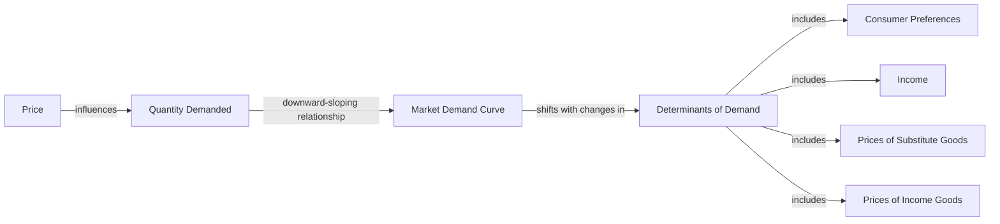

---

title: Market_Demand_Curve
type: Atomic Note
course: Economics
semester: Winter 2026
unit: '2'
hub: "[[2_Theory_Of_Demand_And_Supply_Hub]]"
source: "[[5-Pdf Store/note generated/Winter 2026/Economics/Chapter_2.pdf]]"
source_pages:
- 10
mode: ECON-MACRO
read: false
generated: true
prerequisites:
- "[[Market_Demand]]"

---

# 1. Mental Model

Imagine you're at a school bake sale. The number of cupcakes everyone is willing to buy depends on the price. If the price is low, more people will buy cupcakes. If the price is high, fewer people will buy. The 'Market Demand Curve' shows how the total number of cupcakes everyone wants to buy changes with the price. Two mechanical components are: the price (like the cost of a cupcake) and the quantity demanded (the total number of cupcakes people want to buy).

# 2. Economic Theory

The [[Market_Demand_Curve]] is a graphical representation of the [[Demand_Function]] that relates the price of a good to the quantity demanded by consumers in a market. It is derived from the [[Demand_Schedule]], which is a table showing the quantity demanded at various price levels. The underlying mechanism of the [[Market_Demand_Curve]] follows the [[Law_Of_Demand]], which states that, [[Ceteris_Paribus]], as the price of a good increases, the quantity demanded decreases. This relationship is typically depicted as a downward-sloping curve. The [[Market_Demand_Curve]] is influenced by [[Determinants_Of_Demand]] such as consumer preferences, income, prices of [[Substitute_Goods]] and [[Complementary_Goods]], and [[Change_In_Technology]]. 

# 3. Market Failures

The [[Market_Demand_Curve]] has limitations, particularly in situations where [[Ceteris_Paribus]] does not hold. For instance, during economic crises, the curve may shift unexpectedly due to changes in consumer behavior or external factors. Additionally, the curve assumes that consumers have perfect information about the market, which is often not the case. The [[Market_Demand_Curve]] also fails to account for [[Inferior_Goods]] and [[Normal_Goods]], which have different responses to changes in consumer income. Furthermore, the curve does not capture the effects of [[Surplus_And_Shortage]] or [[Effects_Of_Shift_In_Demand_And_Supply]] on market equilibrium.

# 4. Economic Model



This Mermaid flowchart illustrates the relationship between the price of a good, the quantity demanded, and the market demand curve. The market demand curve is influenced by various determinants of demand, including consumer preferences, income, prices of substitute goods, and prices of income goods.

## 5. Walkthrough

Here's a 5-step technical walkthrough of how the **Market Demand Curve** operates in a **Citywide Coffee Market**:

1. **Initial Baseline**: At a price of $4.00 per cup, the combined demand from all city cafés is 50,000 cups per day. This is point $A$ on the Market Demand Curve.

2. **Price Elasticity Observation**: A citywide shortage of beans forces prices up to $6.00. We observe a **movement along the curve** to point $B$, where total quantity demanded falls to 30,000 cups.

3. **Determinant Shift (Positive)**: A health study is released claiming coffee significantly boosts cognitive longevity. This is a change in **Consumer Preferences**.

4. **Graphical Transformation**: The entire Market Demand Curve **shifts to the right**. Now, even at the high $6.00 price, consumers are willing to buy 45,000 cups instead of 30,000.

5. **Market Recalibration**: Analysts use this new shifted curve to advise café owners on expanding their seating capacity to meet the sustained higher demand at every price level.

---

## 6. The Proving Grounds

```interactive-quiz
[
  {
    "id": "q1",
    "type": "mcq",
    "difficulty": "L1",
    "question": "A **movement along** the Market Demand Curve is caused specifically by a change in:",
    "options": {
      "A": "Consumer income.",
      "B": "The price of the good itself.",
      "C": "The number of buyers.",
      "D": "Future price expectations."
    },
    "answer": "B",
    "explanation": "Only a change in the price of the good itself results in a movement along the curve. Changes in all other factors (determinants) cause the curve to shift."
  },
  {
    "id": "q2",
    "type": "true_false",
    "difficulty": "L2",
    "question": "If the price of a 'Substitute Good' (e.g., Tea) increases, the Market Demand Curve for the primary good (e.g., Coffee) will shift to the left.",
    "answer": false,
    "explanation": "If a substitute becomes more expensive, people switch *to* the primary good, causing its demand curve to shift to the *right* (increase in demand)."
  },
  {
    "id": "q3",
    "type": "synthesis",
    "difficulty": "L3",
    "question": "Differentiate between an 'Increase in Demand' and an 'Increase in Quantity Demanded' using the Market Demand Curve model.",
    "answer": "An 'Increase in Demand' is a rightward shift of the entire curve caused by non-price factors. An 'Increase in Quantity Demanded' is a downward movement along a fixed curve caused by a decrease in the good's price.",
    "explanation": "Synthesis requires precise terminology to distinguish between a shift (Demand) and a movement (Quantity Demanded)."
  },
  {
    "id": "q4",
    "type": "trace",
    "difficulty": "L2",
    "question": "Trace the impact on the Market Demand Curve for 'Electric Vehicles' if the government provides a $5,000 subsidy to every buyer.",
    "answer": "1) The subsidy effectively increases consumers' disposable income or lowers their net cost. 2) This is a non-price determinant for the EV market. 3) The Market Demand Curve shifts to the right. 4) At every price level set by manufacturers, more EVs are now demanded.",
    "explanation": "Tracing requires identifying the type of change (Price vs Non-Price) and determining the direction of the curve's reaction."
  },
  {
    "id": "q5",
    "type": "order",
    "difficulty": "L2",
    "question": "Order the sequence of shifts for 'Umbrellas' starting from a sunny day.",
    "steps": [
      "A severe rainstorm is forecasted for the next week",
      "Consumer expectations shift toward needing protection",
      "The Market Demand Curve for umbrellas shifts to the right",
      "Umbrella retailers increase prices due to higher demand",
      "Quantity supplied increases as firms respond to higher prices"
    ],
    "answer": [
      "A severe rainstorm is forecasted for the next week",
      "Consumer expectations shift toward needing protection",
      "The Market Demand Curve for umbrellas shifts to the right",
      "Umbrella retailers increase prices due to higher demand",
      "Quantity supplied increases as firms respond to higher prices"
    ],
    "explanation": "The change in weather affects consumer preferences/expectations first, causing a demand shift, which then influences price and supply responses."
  }
]
```