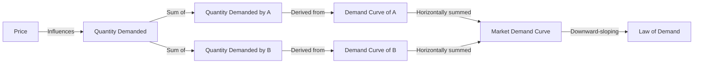

---

title: Market_Demand_Curve
course: "Economics"
unit: '2'
semester: "Winter 2026"
mode: ECON-MICRO
type: atomic_note
hub: "[[2_Theory_Of_Demand_And_Supply_Hub]]"
source: "[[5-Pdf Store/note generated/Winter 2026/Economics/Chapter_2.pdf]]"
date: '2026-05-08'
prerequisites:
- "[[Market_Demand]]"
source_pages:
- 10
generated: true

---

## 1. Mental Model

Imagine you're at a school ice cream shop, and they sell yummy cones for $3 each. You and your friends really love ice cream, and if it's $3, you each want to buy one. That means 5 friends, including you, want a cone, so 5 cones are sold. Now, imagine the price drops to $2. You and your friends get even more excited, and you each want to buy two cones! So, now 10 cones are sold. If the price drops to $1, you all go crazy and want 3 cones each, so 15 cones are sold! The market demand curve shows how many cones ALL the kids in school want to buy at different prices. When the price is high ($3), fewer kids want cones (5 cones), but when the price is low ($1), more kids want cones (15 cones). The curve slopes downward, showing that as the price decreases, the number of cones demanded increases!

## 2. Micro Theory

The market demand curve is a fundamental concept in microeconomics that represents the total quantity of a good or service that all consumers are willing and able to buy at various price levels, ceteris paribus [[Ceteris_Paribus]]. It is derived by horizontally summing the individual demand curves of all consumers in the market, assuming that the market consists of multiple buyers with different demand functions [[Demand_Function]].

The market demand curve can be expressed as a mathematical function, Qd = f(P), where Qd is the total quantity demanded and P is the price of the good. This function is typically downward-sloping, illustrating the [[Law_Of_Demand]], which states that as the price of a good increases, the quantity demanded decreases, ceteris paribus.

To construct a market demand curve, we first need to understand the individual demand curves of consumers. For instance, consider a market with two consumers, A and B. Their individual demand schedules [[Demand_Schedule]] and curves [[Demand_Curve]] show the quantity of a good they are willing to buy at different price levels. 

Suppose at a price equal to 3, consumer A demands 4 units and consumer B demands 6 units. The market demand at this price level would be 10 units (4 + 6). By aggregating the demands of all consumers at various price levels, we can derive the market demand schedule and subsequently plot the market demand curve.

The market demand curve is influenced by several factors, including changes in consumer [[Taste_And_Preference]], [[Income_Elasticity_Of_Demand]], [[Price_Elasticity_Of_Demand]], [[Substitutes_And_Complements]], [[Normal_And_Inferior_Goods]], and [[Consumer_Expectations]], among others [[Determinants_Of_Demand]]. A change in any of these factors can lead to a shift in the market demand curve [[Change_In_Demand]].

For example, an increase in the number of buyers [[Number_Of_Buyers]] in the market would lead to an outward shift of the market demand curve, indicating that more quantity is demanded at each price level. Conversely, a decrease in consumer income, if the good is a normal good, would lead to an inward shift of the market demand curve.

The market demand curve plays a crucial role in determining the [[Market_Equilibrium]], where the quantity demanded equals the quantity supplied. Changes in the market demand curve, along with changes in the Shift In Supply Curve|supply Curve, can lead to Surplus And Shortage|surpluses Or Shortages, which in turn affect the market price and quantity [[Effects_Of_Shift_In_Demand_And_Supply]].

Understanding the market demand curve and its underlying factors, such as [[Theory_Of_Demand]] and [[Market_Demand]], is essential for businesses and policymakers to make informed decisions about production, pricing, and resource allocation. 

The price and quantity relationship on the market demand curve can also provide insights into the [[Price_Elasticity_Of_Demand]] and [[Income_Elasticity_Of_Demand]] of a good, which are critical in assessing the impact of price changes on consumer behavior.

In conclusion, the market demand curve is a graphical representation of the total quantity of a good or service that all consumers are willing and able to buy at various price levels. Its derivation from individual demand curves and its responsiveness to changes in various factors make it a powerful tool in microeconomic analysis.

## 3. Limitations & Edge Cases

The market demand curve, a graphical representation of the total quantity of a good or service demanded by all consumers at various price levels, has specific limitations. For instance, when analyzing individual and market demand curves at a price equal to 3, it becomes apparent that the curve assumes a linear relationship between price and quantity demanded, which may not hold true in cases of non-linear demand or when consumers exhibit heterogeneous preferences. Moreover, the market demand curve also assumes that consumers have perfect information about market prices and their own preferences, which is often not the case in reality, leading to potential inaccuracies in predicting market demand; additionally, the curve does not account for external factors such as changes in consumer income, population demographics, or the presence of complementary or substitute goods, which can significantly impact market demand and render the curve less reliable for precise predictions.

## 4. Market Graph



The market demand curve represents the aggregate quantity of a good or service that all consumers are willing to buy at different price levels. By horizontally summing individual demand curves, we derive the market demand curve, which typically slopes downward, illustrating the law of demand.

## 5. Walkthrough

Here is the 5-step technical walkthrough of how the Market Demand Curve operates:

**Step 1: Define Individual Demand Schedules**
Given two consumers, A and B, with individual demand schedules:

| Price | Consumer A Quantity Demanded | Consumer B Quantity Demanded |
| --- | --- | --- |
| 3    | 6                          | 4                          |

**Step 2: Express Individual Demand Functions**
The individual demand functions for consumers A and B can be represented as:
Qd_A = f(P) and Qd_B = f(P), 
At P = 3, Qd_A = 6 and Qd_B = 4.

**Step 3: Derive Market Demand Schedule**
To derive the market demand schedule, we horizontally sum the individual demand schedules of consumers A and B:

| Price | Consumer A Quantity Demanded | Consumer B Quantity Demanded | Market Quantity Demanded |
| --- | --- | --- | --- |
| 3    | 6                          | 4                          | 10                       |

**Step 4: Construct Market Demand Curve**
The market demand curve can be expressed as a mathematical function: 
Qd = Qd_A + Qd_B = f(P). 
At P = 3, Qd = 10.

**Step 5: Apply the Law of Demand**
The market demand curve is downward-sloping, illustrating the Law of Demand: as the price increases, the quantity demanded decreases, ceteris paribus. For example, if the price increases from $3 to $4 (not shown), the quantity demanded will decrease, but the exact quantities are not provided.

---

## Review & Practice

```interactive-quiz

[
  {
    "type": "mcq",
    "difficulty": "L1",
    "question": "What happens to the market demand curve when there is an increase in the number of buyers in the market, ceteris paribus?",
    "options": {
      "A": "It shifts inward",
      "B": "It shifts outward",
      "C": "It becomes more elastic",
      "D": "It becomes less elastic"
    },
    "answer": "B",
    "explanation": "An increase in the number of buyers in the market leads to an outward shift of the market demand curve, indicating that more quantity is demanded at each price level, ceteris paribus. This is because with more buyers, the total demand for the good or service increases, assuming that the demand functions of the new buyers are similar to those of the existing buyers. Mathematically, this can be represented as $Q_d = f(P) \\rightarrow Q_d' = f(P) + \\Delta Q_d$, where $\\Delta Q_d$ is the increase in quantity demanded due to the increase in the number of buyers."
  },
  {
    "type": "fill_in",
    "difficulty": "L2",
    "question": "Fill in the blank.",
    "textWithBlanks": "The market demand curve is a graphical representation of the total quantity of a good or service that all consumers are willing and able to buy at various Blank levels, ceteris paribus.",
    "answer": [
      "price"
    ],
    "explanation": "The market demand curve is a fundamental concept in microeconomics that represents the total quantity of a good or service that all consumers are willing and able to buy at various price levels, ceteris paribus. It is derived by horizontally summing the individual demand curves of all consumers in the market. The curve typically shows that as the price of a good increases, the quantity demanded decreases, illustrating the law of demand. This relationship can be expressed mathematically as Qd = f(P), where Qd is the total quantity demanded and P is the price of the good."
  },
  {
    "type": "debug",
    "difficulty": "L2",
    "question": "Find the bug in the market demand curve formula: Qd = 100 - 2P + 0.5I, where Qd is the total quantity demanded, P is the price of the good, and I is the consumer income.",
    "content": "The market demand curve is given by Qd = 100 - 2P + 0.5I. However, this formula seems to be incorrect as it includes income (I) as a determinant of demand, which is correct, but the coefficient of income is not properly interpreted in the context of the question.",
    "answer": "The bug is in the interpretation of the income coefficient. The correct interpretation should be that the coefficient 0.5 represents the change in quantity demanded for a one-unit change in income, assuming all else is equal. However, the error lies in not specifying that this relationship assumes the good is a normal good and that the income effect is correctly captured. A more accurate representation would account for the specific type of good (normal or inferior) and ensure that the income effect is correctly applied.",
    "required_keywords": [
      "income effect",
      "market demand curve"
    ],
    "explanation": "The market demand curve is typically represented as Qd = f(P), but it can also be influenced by other factors such as consumer income (I). The given formula Qd = 100 - 2P + 0.5I illustrates how an increase in income can lead to an increase in quantity demanded for a normal good, as indicated by the positive coefficient of income (0.5). However, the subtle error lies in not acknowledging that this relationship assumes a normal good and that the income effect is positive. For an inferior good, the relationship would be negative. Mathematically, this can be represented as: $Qd = \\alpha - \\beta P + \\gamma I$, where $\\alpha$ is the intercept, $\\beta$ is the price coefficient, and $\\gamma$ is the income coefficient. For normal goods, $\\gamma > 0$, and for inferior goods, $\\gamma < 0$."
  },
  {
    "type": "trace",
    "difficulty": "L2",
    "question": "What is the exact output for the market demand curve when the price of a good increases from $2 to $4, given that consumer A demands 6 units and 4 units respectively, and consumer B demands 8 units and 6 units respectively?",
    "content": "To determine the exact output for the market demand curve, we first need to calculate the total quantity demanded at each price level. At a price of $2, consumer A demands 6 units and consumer B demands 8 units. Therefore, the total quantity demanded at $2 is 6 + 8 = 14 units. At a price of $4, consumer A demands 4 units and consumer B demands 6 units. Therefore, the total quantity demanded at $4 is 4 + 6 = 10 units.",
    "answer": "[14, 10]",
    "explanation": "The market demand curve is derived by horizontally summing the individual demand curves of all consumers in the market. Given that $Qd_A$ and $Qd_B$ represent the quantity demanded by consumers A and B respectively, the market demand $Qd_M$ can be expressed as $Qd_M = Qd_A + Qd_B$. Using the given information, we can write the market demand at $P = 2$ as $Qd_M(2) = 6 + 8 = 14$ and at $P = 4$ as $Qd_M(4) = 4 + 6 = 10$. Therefore, the exact output for the market demand curve at these price levels is [14, 10]. This illustrates how the market demand curve is downward-sloping, as the quantity demanded decreases from 14 units to 10 units when the price increases from $2 to $4."
  }
]

```