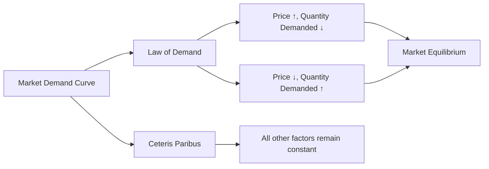

---

title: Market_Demand_Curve
type: Atomic Note
course: Economics
semester: Winter 2026
unit: '2'
hub: "[[2_Theory_Of_Demand_And_Supply_Hub]]"
source: "[[5-Pdf Store/note generated/Winter 2026/Economics/Chapter_2.pdf]]"
source_pages:
- 10
mode: ECON-MACRO
read: false
generated: true
prerequisites:
- "[[Market_Demand]]"

---

# 1. Mental Model

Imagine you're a curator of a popular botanical garden, and you're planning to host a flower festival. The total number of flower bouquets you want to order for the festival depends on their price. If the bouquets are very expensive, you might order fewer of them, but if they're reasonably priced, you might order more. This situation is similar to how the market demand curve works, where the price of a product affects the total quantity demanded by all buyers in the market. The quantity demanded (number of bouquets) and the price (cost per bouquet) are the two mechanical components that relate to the concept.

# 2. Economic Theory

The [[Market_Demand_Curve]] is a graphical representation of the [[Market_Demand]] for a product, which is the sum of the individual [[Demand_Schedule]]s of all buyers in the market. It shows the relationship between the price of a product and the total quantity demanded, assuming [[Ceteris_Paribus]] (all other factors remain constant). The underlying mechanism of the [[Market_Demand_Curve]] follows the [[Law_Of_Demand]], which states that as the price of a product increases, the quantity demanded decreases, and vice versa. This is typically represented by a downward-sloping curve. The [[Demand_Function]] represents the relationship between the quantity demanded and the price, and it is influenced by various [[Determinants_Of_Demand]], such as [[Taste_And_Preference]], [[Number_Of_Buyers]], [[Income_Elasticity_Of_Demand]], and [[Price_Elasticity_Of_Demand]].

# 3. Limitations & Edge Cases

The [[Market_Demand_Curve]] has several limitations and edge cases. For instance, it assumes that [[Ceteris_Paribus]] holds, which is rarely the case in reality. Changes in [[Consumer_Expectations]], [[Substitutes_And_Complements]], and [[Normal_And_Inferior_Goods]] can shift the demand curve. Additionally, the curve may not accurately represent the demand for products with [[Price_Elasticity_Of_Demand]] that is not constant over different price ranges. The [[Market_Demand_Curve]] also fails to account for [[Change_In_Technology]] and [[Shift_In_Supply_Curve]], which can impact the market equilibrium and the quantity demanded. Furthermore, in situations like [[Surplus_And_Shortage]], the curve may not accurately predict the market outcome.

# 4. Economic Model



This Mermaid flowchart illustrates the Market Demand Curve concept, showing how the Law of Demand influences the relationship between price and quantity demanded, assuming ceteris paribus.

## 5. Walkthrough

Here's a 5-step technical walkthrough of how the Market Demand Curve operates:

1. **Initial State**: The market for a product, say flower bouquets, has a demand schedule with various price points and corresponding quantities demanded. For example, at a price of $10, the quantity demanded is 100 bouquets.

| Price | Quantity Demanded |
| --- | --- |
| $10 | 100 |
| $8 | 120 |
| $6 | 150 |

2. **Price Change**: The price of the flower bouquets decreases from $10 to $8. According to the Law of Demand, a decrease in price leads to an increase in quantity demanded.

3. **Quantity Demanded Update**: The quantity demanded increases from 100 bouquets to 120 bouquets as the price decreases to $8.

| Price | Quantity Demanded |
| --- | --- |
| $10 | 100 |
| $8 | 120 |
| $6 | ? |

4. **New Price Point**: The price decreases further to $6. Following the Law of Demand, the quantity demanded increases again.

5. **Market Demand Curve Shift**: If other factors, such as consumer income or preferences, change, the entire demand schedule shifts. For instance, if consumer income increases, the demand schedule might shift to the right, indicating a higher quantity demanded at each price point.

The Market Demand Curve illustrates the inverse relationship between price and quantity demanded, assuming ceteris paribus. It is a fundamental concept in economics, helping businesses and policymakers understand how changes in price affect the quantity demanded of a product.

---

## 6. The Proving Grounds

```interactive-quiz

[
  {
    "id": "q1",
    "type": "true_false",
    "difficulty": "L1",
    "question": "The market demand curve for a product remains unchanged if consumer incomes increase, assuming ceteris paribus.",
    "answer": false,
    "explanation": "The market demand curve is derived under the assumption of ceteris paribus, which means all other factors are held constant. One of the key factors that influence the demand curve is consumer income. If consumer incomes increase, the demand curve for a normal good will shift to the right, indicating that consumers are willing to buy more of the product at each price level. This change violates the ceteris paribus assumption, which states that consumer incomes, among other factors, should remain constant. Therefore, an increase in consumer incomes would lead to a shift in the demand curve, not a remaining unchanged curve. In mathematical terms, the demand function is $Q_d = f(P, I, P_s, T)$, where $Q_d$ is the quantity demanded, $P$ is the price of the product, $I$ is consumer income, $P_s$ is the price of substitutes, and $T$ is taste and preferences. If $I$ increases, the demand curve $Q_d = f(P)$ shifts, because $f(P)$ is no longer the same function."
  },
  {
    "id": "q2",
    "type": "synthesis",
    "difficulty": "L2",
    "question": "The country is facing a sudden and significant devaluation of its currency, leading to a sharp increase in the price of imported goods. The government needs to act quickly to prevent a decline in the standard of living. Using the Market Demand Curve concept, design a 3-step fiscal policy response to mitigate the effects of this macro shock.",
    "answer": "To address the sudden currency devaluation and prevent a system failure, the government can implement the following 3-step policy response:\n\n1. **Adjust Import Tariffs**: Immediately reduce import tariffs on essential goods to decrease their prices and maintain affordability for the general population. This action will shift the Market Demand Curve for these goods to the right, as consumers will be willing to buy more at the lower prices.\n\n2. **Increase Subsidies for Low-Income Households**: Provide targeted subsidies to low-income households to help them cope with the increased prices of imported goods. This will effectively increase their disposable income, allowing them to continue purchasing essential goods without a significant reduction in their standard of living.\n\n3. **Implement Price Controls and Monitor Inflation**: Establish temporary price controls on essential goods to prevent excessive price gouging by suppliers. The government should also closely monitor inflation rates and adjust its policies as needed to ensure that the economy remains stable and the standard of living is protected.",
    "explanation": "The sudden currency devaluation leads to a sharp increase in the price of imported goods, which can be represented as a leftward shift of the Market Demand Curve. This is because the increased prices reduce the quantity demanded of these goods. By applying the Market Demand Curve concept, the government can design a policy response to mitigate the effects of this macro shock.\n\nMathematically, the Market Demand Curve can be represented as:\n\n$$Q_d = f(P, I, P_s, T, N)$$\n\nwhere $Q_d$ is the quantity demanded, $P$ is the price of the good, $I$ is the consumer's income, $P_s$ is the price of substitutes, $T$ is the consumer's taste and preferences, and $N$ is the number of consumers.\n\nIn this scenario, the sudden currency devaluation affects the price of imported goods ($P$), which in turn affects the quantity demanded ($Q_d$). By adjusting import tariffs, increasing subsidies for low-income households, and implementing price controls, the government can influence the price mechanism and help maintain the standard of living."
  },
  {
    "id": "q3",
    "type": "writing",
    "difficulty": "L2",
    "question": "Explain how a market demand curve is affected by a change in the price of a product in a Central Banking & Monetary Policy scenario.",
    "answer": "The market demand curve is a downward-sloping curve that shows the relationship between the price of a product and the total quantity demanded by all buyers in the market. When the price of a product increases, the quantity demanded decreases, and vice versa, as consumers substitute away from the more expensive product. In a Central Banking & Monetary Policy scenario, a change in interest rates can influence the price of products, thereby affecting the market demand curve. For instance, an expansionary monetary policy can lower interest rates, increase borrowing, and boost aggregate demand, leading to an increase in the quantity demanded at each price level.",
    "explanation": "The market demand curve can be represented by the equation $Q_d = f(P)$, where $Q_d$ is the quantity demanded and $P$ is the price of the product. A change in the price of the product leads to a movement along the demand curve, while a change in other factors, such as income or preferences, leads to a shift of the demand curve. In the context of Central Banking & Monetary Policy, the market demand curve can be affected by changes in interest rates, which influence the price of products and, in turn, affect the quantity demanded. This can be represented by the equation $Q_d = f(P, r)$, where $r$ is the interest rate. LaTeX representation of the demand curve: $Q_d = \\alpha - \\beta P + \\gamma r$, where $\\alpha$, $\\beta$, and $\\gamma$ are parameters."
  },
  {
    "id": "q4",
    "type": "order",
    "difficulty": "L2",
    "question": "Order steps for Market Demand Curve",
    "steps": [
      "The market equilibrium price is determined where the market demand curve intersects with the market supply curve",
      "The quantity demanded and price are inversely related, as described by the law of demand",
      "As the price of a product decreases, the quantity demanded increases, leading to a downward-sloping market demand curve",
      "The market demand curve is a graphical representation of the sum of individual demand schedules of all buyers in the market",
      "Ceteris paribus, or all other factors remaining constant, is a crucial assumption for the market demand curve analysis"
    ],
    "answer": [
      "The market equilibrium price is determined where the market demand curve intersects with the market supply curve",
      "As the price of a product decreases, the quantity demanded increases, leading to a downward-sloping market demand curve",
      "The market demand curve is a graphical representation of the sum of individual demand schedules of all buyers in the market",
      "The quantity demanded and price are inversely related, as described by the law of demand",
      "Ceteris paribus, or all other factors remaining constant, is a crucial assumption for the market demand curve analysis"
    ]
  },
  {
    "id": "q5",
    "type": "trace",
    "difficulty": "L3",
    "question": "What is the exact output of the impact of a 1% interest rate change through 4 distinct economic sectors (Housing, Investment, Forex, Consumption) on the Market Demand Curve?",
    "content": "To analyze the impact of a 1% interest rate change on the Market Demand Curve through the Housing, Investment, Forex, and Consumption sectors, we use the following mechanisms and formulas:\n\n1. **Housing Sector**: The demand for housing is influenced by interest rates through mortgage rates. A 1% increase in interest rates increases mortgage rates, making borrowing more expensive. This can be represented by the formula:\n   \\[\n   Q_d^H = \beta_0 - \beta_1 \\cdot (r + 1\\%)\n   \\]\n   where \\(Q_d^H\\) is the quantity demanded of housing, \\(\beta_0\\) and \\(\beta_1\\) are constants, and \\(r\\) is the interest rate.\n\n2. **Investment Sector**: The investment demand is negatively related to interest rates because higher interest rates increase the cost of borrowing for investment projects. This relationship can be expressed as:\n   \\[\n   I = I_0 - I_1 \\cdot (r + 1\\%)\n   \\]\n   where \\(I\\) is the investment, \\(I_0\\) and \\(I_1\\) are constants.\n\n3. **Forex Sector**: A 1% increase in interest rates in a country can attract foreign investors, causing the currency to appreciate. This affects exports and imports. The impact on the quantity demanded in the forex market can be complex and is often represented by the interest rate parity condition:\n   \\[\n   r = r^* + E(e) - e\n   \\]\n   where \\(r\\) is the domestic interest rate, \\(r^*\\) is the foreign interest rate, \\(E(e)\\) is the expected exchange rate, and \\(e\\) is the current exchange rate.\n\n4. **Consumption Sector**: Consumption is less directly affected by interest rates but can be influenced through the wealth effect and inter-temporal substitution. A simplified consumption function can be:\n   \\[\n   C = C_0 + C_1 \\cdot (Y - T) - C_2 \\cdot (r + 1\\%)\n   \\]\n   where \\(C\\) is consumption, \\(C_0\\), \\(C_1\\), and \\(C_2\\) are constants, \\(Y\\) is income, and \\(T\\) is taxes.\n\nAssuming specific values for these parameters and initial conditions:\n- Housing: \\(\beta_0 = 1000\\), \\(\beta_1 = 500\\), initial \\(r = 2\\%\\)\n- Investment: \\(I_0 = 2000\\), \\(I_1 = 1000\\), initial \\(r = 2\\%\\)\n- Forex: For simplicity, assume a direct relationship where a 1% increase in \\(r\\) leads to a 0.5% appreciation of the currency, affecting net exports \\(NX\\).\n- Consumption: \\(C_0 = 500\\), \\(C_1 = 0.8\\), \\(C_2 = 20\\), \\(Y = 10000\\), \\(T = 2000\\), initial \\(r = 2\\%\\)\n\n## Execution Trace:\n\n### Initial Conditions\n- Interest Rate \\(r = 2\\%\\)\n\n### 1% Increase in Interest Rate\n- New \\(r = 3\\%\\)\n\n### Housing Sector\n- Initial \\(Q_d^H = 1000 - 500 \\cdot 2\\% = 990\\)\n- New \\(Q_d^H = 1000 - 500 \\cdot 3\\% = 985\\)\n- Change: \\(-5\\)\n\n### Investment Sector\n- Initial \\(I = 2000 - 1000 \\cdot 2\\% = 1980\\)\n- New \\(I = 2000 - 1000 \\cdot 3\\% = 1970\\)\n- Change: \\(-10\\)\n\n### Forex Sector\n- Assume initial \\(NX = 100\\), 1% increase in \\(r\\) leads to 0.5% appreciation, reducing \\(NX\\) by 1.\n- New \\(NX = 99\\)\n\n### Consumption Sector\n- Initial \\(C = 500 + 0.8 \\cdot (10000 - 2000) - 20 \\cdot 2\\% = 500 + 6400 - 40 = 6860\\)\n- New \\(C = 500 + 0.8 \\cdot (10000 - 2000) - 20 \\cdot 3\\% = 500 + 6400 - 60 = 6840\\)\n- Change: \\(-20\\)\n\n## Aggregated Impact on Market Demand Curve\nThe aggregated impact is a decrease in quantity demanded across sectors. For simplicity, assume the market demand curve is:\n\\[\nQ_d = Q_d^H + I + NX + C\n\\]\n\nInitial \\(Q_d = 990 + 1980 + 100 + 6860 = 9930\\)\n\nNew \\(Q_d = 985 + 1970 + 99 + 6840 = 9894\\)\n\nChange in \\(Q_d = -36\n\n",
    "answer": "-36",
    "explanation": "The impact of a 1% interest rate change through the Housing, Investment, Forex, and Consumption sectors on the Market Demand Curve results in a decrease of 36 units in the quantity demanded."
  }
]

```