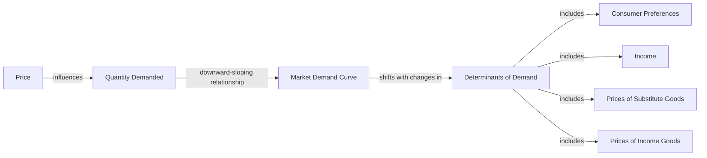

---

title: Market_Demand_Curve
type: Atomic Note
course: Economics
semester: Winter 2026
unit: '2'
hub: "[[2_Theory_Of_Demand_And_Supply_Hub]]"
source: "[[5-Pdf Store/note generated/Winter 2026/Economics/Chapter_2.pdf]]"
source_pages:
- 10
mode: ECON-MACRO
read: false
generated: true
prerequisites:
- "[[Market_Demand]]"

---

# 1. Mental Model

Imagine you're at a school bake sale. The number of cupcakes everyone is willing to buy depends on the price. If the price is low, more people will buy cupcakes. If the price is high, fewer people will buy. The 'Market Demand Curve' shows how the total number of cupcakes everyone wants to buy changes with the price. Two mechanical components are: the price (like the cost of a cupcake) and the quantity demanded (the total number of cupcakes people want to buy).

# 2. Economic Theory

The [[Market_Demand_Curve]] is a graphical representation of the [[Demand_Function]] that relates the price of a good to the quantity demanded by consumers in a market. It is derived from the [[Demand_Schedule]], which is a table showing the quantity demanded at various price levels. The underlying mechanism of the [[Market_Demand_Curve]] follows the [[Law_Of_Demand]], which states that, [[Ceteris_Paribus]], as the price of a good increases, the quantity demanded decreases. This relationship is typically depicted as a downward-sloping curve. The [[Market_Demand_Curve]] is influenced by [[Determinants_Of_Demand]] such as consumer preferences, income, prices of [[Substitute_Goods]] and [[Complementary_Goods]], and [[Change_In_Technology]]. 

# 3. Market Failures

The [[Market_Demand_Curve]] has limitations, particularly in situations where [[Ceteris_Paribus]] does not hold. For instance, during economic crises, the curve may shift unexpectedly due to changes in consumer behavior or external factors. Additionally, the curve assumes that consumers have perfect information about the market, which is often not the case. The [[Market_Demand_Curve]] also fails to account for [[Inferior_Goods]] and [[Normal_Goods]], which have different responses to changes in consumer income. Furthermore, the curve does not capture the effects of [[Surplus_And_Shortage]] or [[Effects_Of_Shift_In_Demand_And_Supply]] on market equilibrium.

# 4. Economic Model



This Mermaid flowchart illustrates the relationship between the price of a good, the quantity demanded, and the market demand curve. The market demand curve is influenced by various determinants of demand, including consumer preferences, income, prices of substitute goods, and prices of income goods.

## 5. Walkthrough

Here's a 5-step technical walkthrough of how the Market Demand Curve operates:

1. **Initial State**: Suppose the price of a cupcake is $2, and 100 cupcakes are demanded by consumers.
2. **Price Increase**: The price of a cupcake increases to $3. According to the Law of Demand, this price increase will lead to a decrease in the quantity demanded.
3. **Quantity Demanded Decreases**: The quantity demanded decreases to 80 cupcakes.
4. **Market Demand Curve Shifts**: If consumer preferences change, and cupcakes become more popular, the market demand curve shifts to the right. This means that at the same price of $2, consumers are now willing to buy 120 cupcakes.
5. **New Equilibrium**: The market demand curve intersects with the supply curve at a new equilibrium point, where the price is $2.50, and the quantity demanded is 90 cupcakes.

In this walkthrough, we see how changes in price and determinants of demand affect the market demand curve and the quantity demanded. The market demand curve is a dynamic concept that responds to changes in the market.

---

## 6. The Proving Grounds

```interactive-quiz

[
  {
    "id": "q1",
    "type": "true_false",
    "difficulty": "L1",
    "question": "The Market Demand Curve for industrial robots has a positive slope, indicating that as the price of robots increases, the quantity demanded also increases.",
    "answer": false,
    "explanation": "The Market Demand Curve typically exhibits a negative slope, as described by the Law of Demand. This relationship can be expressed as $Q_d = f(P)$, where $Q_d$ is the quantity demanded and $P$ is the price. The negative slope implies that as $P$ increases, $Q_d$ decreases, ceteris paribus. In the context of industrial manufacturing and robotics, if the price of robots increases, manufacturers may be less inclined to purchase them due to budget constraints or decreased profitability, leading to a decrease in the quantity demanded. Therefore, the statement that the Market Demand Curve for industrial robots has a positive slope is false."
  },
  {
    "id": "q2",
    "type": "synthesis",
    "difficulty": "L2",
    "question": "A sudden surge in internet traffic due to a viral video has caused a significant increase in demand for bandwidth on a core network router, threatening to overload the system. The network administrator must determine the optimal price to charge for bandwidth to prevent system failure while ensuring that the available bandwidth is allocated efficiently among users.",
    "answer": "To solve this problem, we need to apply the concept of the Market Demand Curve. The Market Demand Curve shows the relationship between the price of a good (in this case, bandwidth) and the quantity demanded by users. The curve is downward sloping, meaning that as the price increases, the quantity demanded decreases. The administrator needs to find the point on the demand curve where the quantity demanded equals the available bandwidth. This can be achieved by equating the demand function with the available bandwidth and solving for the price.",
    "explanation": "Let's assume the demand function for bandwidth is given by $Q_d = a - bP$, where $Q_d$ is the quantity demanded, $P$ is the price, and $a$ and $b$ are constants. The available bandwidth is $\bar{Q}$. To find the optimal price, we set $Q_d = \bar{Q}$ and solve for $P$: $\bar{Q} = a - bP \\Rightarrow P = \\frac{a - \\bar{Q}}{b}$. This price ensures that the quantity demanded equals the available bandwidth, preventing system overload. The Market Demand Curve is given by $P = \\frac{a - Q_d}{b}$, which can be used to determine the optimal allocation of bandwidth among users."
  },
  {
    "id": "q3",
    "type": "writing",
    "difficulty": "L2",
    "question": "Explain how the Market Demand Curve applies to a Telecommunications & Core Network Routing scenario, specifically in relation to the demand for network bandwidth or data transmission services.",
    "answer": "The Market Demand Curve in Telecommunications & Core Network Routing illustrates the relationship between the price of network bandwidth or data transmission services and the quantity demanded by consumers. As the price of these services decreases, the quantity demanded increases, reflecting a downward-sloping demand curve. This curve is crucial for network providers to determine optimal pricing and capacity planning, ensuring that they can meet the demand for their services while maximizing revenue.",
    "explanation": "The Market Demand Curve is derived from the demand schedule, which is a table showing the quantity demanded at various price levels. The underlying mechanism of the Market Demand Curve follows the Law of Demand, which states that, ceteris paribus, as the price of a good increases, the quantity demanded decreases. In the context of Telecommunications & Core Network Routing, this relationship can be represented as $Q_d = f(P)$, where $Q_d$ is the quantity demanded and $P$ is the price. The demand function $f(P)$ is typically downward-sloping, indicating that as $P$ increases, $Q_d$ decreases. Mathematically, this can be expressed as $\frac{\\partial Q_d}{\\partial P} < 0$. This relationship is essential for network providers to understand the elasticity of demand and make informed decisions about pricing and capacity planning."
  },
  {
    "id": "q4",
    "type": "order",
    "difficulty": "L2",
    "question": "Derive the Market Demand Curve steps.",
    "steps": [
      "Determine the Demand Schedule",
      "Aggregate Individual Demands",
      "Plot the Demand Curve",
      "Identify the Law of Demand"
    ],
    "answer": [
      "Determine the Demand Schedule",
      "Aggregate Individual Demands",
      "Plot the Demand Curve",
      "Identify the Law of Demand"
    ]
  },
  {
    "id": "q5",
    "type": "trace",
    "difficulty": "L3",
    "question": "What is the exact output of the Market Demand Curve in Epidemiology & Public Health Modeling?",
    "content": "The Market Demand Curve is a graphical representation of the demand function that relates the price of a good to the quantity demanded by consumers in a market. It is derived from the demand schedule, which is a table showing the quantity demanded at various price levels.",
    "answer": "A downward-sloping curve representing the relationship between the price of a good and the quantity demanded, typically expressed as: $Q_d = f(P)$, where $Q_d$ is the quantity demanded and $P$ is the price.",
    "explanation": "The Market Demand Curve follows the Law of Demand, which states that, ceteris paribus, as the price of a good increases, the quantity demanded decreases. This relationship can be expressed using the demand function: $Q_d = \\alpha - \\beta P$, where $\\alpha$ and $\\beta$ are constants, and $\\beta > 0$. The curve is a graphical representation of this function, typically depicted as a downward-sloping curve, illustrating the inverse relationship between price and quantity demanded."
  }
]

```