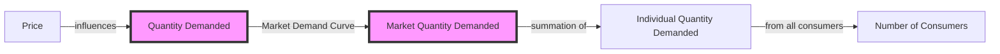

## 1. Mental Model

Imagine you're at a school ice cream shop, and they sell yummy cones for $3 each. You and your friends really love ice cream, and if it's $3, you might buy 2 cones. Your friend Emma might buy 3 cones at that price, and your friend Max might buy 1 cone. If we add all those up, the shop sells 2 + 3 + 1 = 4 cones. Now, if the price goes up to $4, you might only buy 1 cone, Emma might buy 2, and Max might not buy any. So, the shop sells 1 + 2 + 0 = 2 cones. The market demand curve shows how many cones the whole school (all the customers) will buy at different prices. When the price is low, like $3, people buy more cones (6 cones), and when the price is high, like $4, people buy fewer cones (3 cones). The curve slopes downward, meaning as the price goes up, the number of cones people want to buy goes down!

## 2. Micro Theory

The market demand curve is a fundamental concept in microeconomics that represents the total quantity of a good or service that all consumers are willing and able to buy at various price levels, ceteris paribus. It is a graphical representation of the market demand schedule, which is a table that shows the quantity demanded at different prices. The market demand curve is derived by horizontally summing the individual demand curves of all consumers in the market.

The market demand curve is typically downward-sloping, illustrating the [[Law_Of_Demand]], which states that as the price of a good increases, the quantity demanded decreases, [[Ceteris_Paribus]]. This is because as the price rises, some consumers become less willing or able to buy the good, leading to a decrease in the overall quantity demanded.

The market demand curve can be expressed as a [[Demand_Function]], which represents the relationship between the quantity demanded and the price of the good, as well as other factors that influence demand, such as consumer income, tastes, and preferences. The demand function can be written as Qd = f(P, I, T, Psub, Pcom), where Qd is the quantity demanded, P is the price of the good, I is consumer income, T is a measure of consumer tastes and preferences, Psub is the price of substitutes, and Pcom is the price of complements.

Changes in the market demand curve can occur due to various factors, including changes in consumer income, [[Taste_And_Preference]], [[Number_Of_Buyers]], [[Substitutes_And_Complements]], and [[Consumer_Expectations]]. For example, an increase in consumer income can lead to an increase in the quantity demanded at each price level, resulting in a rightward shift of the market demand curve. Similarly, an increase in the price of substitutes can also lead to an increase in the quantity demanded, as consumers switch to the good from the more expensive substitute.

The market demand curve is also related to the concept of [[Price_Elasticity_Of_Demand]], which measures the responsiveness of the quantity demanded to changes in the price of the good. The price elasticity of demand can be calculated using the formula: Ed = (dQd / dP) \* (P / Qd), where Ed is the price elasticity of demand, dQd is the change in quantity demanded, dP is the change in price, P is the initial price, and Qd is the initial quantity demanded.

The market demand curve plays a crucial role in determining the [[Market_Equilibrium]], which occurs when the quantity demanded equals the quantity supplied. The market equilibrium price and quantity can be found by solving the system of equations formed by the market demand curve and the [[Market_Demand_Curve]] and the supply curve.

To illustrate, consider a market with two consumers, A and B, with individual demand curves QdA = 10 - 2P and QdB = 5 - P. The market demand curve can be derived by horizontally summing the individual demand curves: Qd = QdA + QdB = (10 - 2P) + (5 - P) = 15 - 3P. At a price equal to 3, the quantity demanded is Qd = 15 - 3(3) = 6. This point (P=3, Qd=6) lies on the market demand curve.

In conclusion, the market demand curve is a graphical representation of the total quantity of a good or service that all consumers are willing and able to buy at various price levels, ceteris paribus. It is a fundamental concept in microeconomics that helps to understand the behavior of consumers and the determination of market equilibrium. The market demand curve can shift due to various factors, including changes in consumer income, tastes, and preferences, and is related to the concept of price elasticity of demand.

## 3. Limitations & Edge Cases

The market demand curve, a graphical representation of the total quantity of a good or service demanded by all consumers at various price levels, has specific limitations. For instance, when analyzing individual and market demand curves at a price equal to 3, it becomes apparent that the curve assumes a linear relationship between price and quantity demanded, which may not hold true in cases of non-linear demand or when consumers exhibit heterogeneous preferences. Moreover, the market demand curve also assumes that consumers' purchasing decisions are independent of one another, which may not account for social influences, bandwagon effects, or other externalities that can impact demand; furthermore, it relies on the ceteris paribus assumption, which may not accurately reflect real-world scenarios where multiple factors influencing demand often change simultaneously, and lastly, the curve's construction also hinges on the availability of perfect information about consumer preferences and market conditions, which rarely exists in reality.

## 4. Market Graph



The market demand curve illustrates the total quantity of a good or service that all consumers are willing and able to buy at various price levels, assuming all other factors remain constant. The curve is typically downward-sloping, reflecting the law of demand, which states that as the price of a good increases, the quantity demanded decreases, ceteris paribus.

## 5. Walkthrough

**Step 1: Define Individual Demand Curves**

* Each consumer's demand curve is a graphical representation of their willingness to pay for a good or service at various price levels.
* The individual demand curve is typically downward-sloping, showing that as the price increases, the quantity demanded decreases.
* Mathematically, the individual demand curve can be represented as: Q<sub>i</sub> = f(P<sub>i</sub>, Y<sub>i</sub>, P<sub>j</sub>, T<sub>i</sub>), where Q<sub>i</sub> is the quantity demanded by consumer i, P<sub>i</sub> is the price of the good, Y<sub>i</sub> is consumer i's income, P<sub>j</sub> is the price of related goods, and T<sub>i</sub> is consumer i's tastes and preferences.

**Step 2: Derive Market Demand Schedule**

* Create a table that shows the quantity demanded by each consumer at different prices.
* For each price level, sum up the quantities demanded by all consumers to obtain the total market quantity demanded.
* The market demand schedule is a table that shows the quantity demanded at different prices.

**Step 3: Construct Market Demand Curve**

* Plot the market demand schedule on a graph, with the price on the vertical axis and the quantity demanded on the horizontal axis.
* The resulting curve is the market demand curve, which represents the total quantity of the good or service that all consumers are willing and able to buy at various price levels.
* The market demand curve is typically downward-sloping, illustrating the Law of Demand.

**Step 4: Express Market Demand Curve as Demand Function**

* The market demand curve can be expressed as a demand function, which represents the relationship between the quantity demanded and the price of the good, as well as other factors.
* Mathematically, the market demand function can be represented as: Q<sub>D</sub> = f(P, Y, P<sub>j</sub>, T), where Q<sub>D</sub> is the total quantity demanded, P is the price of the good, Y is aggregate income, P<sub>j</sub> is the price of related goods, and T is aggregate tastes and preferences.

**Step 5: Analyze Shifts in Market Demand Curve**

* Changes in factors other than price, such as income, prices of related goods, and tastes and preferences, can cause the market demand curve to shift.
* An increase in income, for example, can lead to an increase in the quantity demanded at each price level, causing the market demand curve to shift to the right.
* A decrease in the price of a related good can also lead to an increase in the quantity demanded, causing the market demand curve to shift to the right.

---

## Review & Practice

```interactive-quiz

[
  {
    "id": "generate_unique_id",
    "type": "mcq",
    "difficulty": "L1",
    "question": "What is the effect on the market demand curve for a good when the price of its complement decreases, according to the Law of Demand and elasticity calculations in Environmental Economics?",
    "options": {
      "A": "The market demand curve shifts to the left because the good becomes less attractive.",
      "B": "The market demand curve shifts to the right because the good becomes more attractive.",
      "C": "The market demand curve remains unchanged as the decrease in the complement's price does not affect the good's demand.",
      "D": "The market demand curve becomes less elastic, leading to a decrease in the quantity demanded."
    },
    "answer": "B",
    "explanation": "When the price of a complement decreases, it becomes cheaper for consumers to buy the complement along with the good in question. This decrease in the price of the complement increases the overall utility or satisfaction consumers derive from consuming the good, making the good more attractive. Mathematically, if $Q_d = f(P, P_c)$, where $P_c$ is the price of the complement, a decrease in $P_c$ leads to an increase in $Q_d$ for any given $P$, or $\frac{\\partial Q_d}{\\partial P_c} < 0$. Therefore, a decrease in the price of the complement leads to a rightward shift of the market demand curve."
  },
  {
    "id": "Q1",
    "type": "fill_in",
    "difficulty": "L2",
    "question": "Fill in the blank.",
    "textWithBlanks": "The market demand curve is typically downward-sloping, illustrating the Blank , which states that as the price of a good increases, the quantity demanded decreases, ceteris paribus.",
    "answer": [
      "Law of Demand"
    ],
    "explanation": "The Law of Demand is a fundamental principle in economics that describes the inverse relationship between the price of a good and the quantity demanded. It is often represented graphically as a downward-sloping demand curve. The mathematical representation of this relationship can be expressed as $Q_d = f(P)$, where $Q_d$ is the quantity demanded and $P$ is the price of the good. The Law of Demand is based on the ceteris paribus assumption, which means that all other factors that affect demand are held constant. This can be represented as $Q_d = \\alpha - \\beta P$, where $\\alpha$ and $\\beta$ are constants, and $\\beta > 0$. The downward slope of the demand curve indicates that as the price of the good increases, the quantity demanded decreases, and vice versa."
  },
  {
    "id": "Q1234",
    "type": "debug",
    "difficulty": "L2",
    "question": "Find the bug in the market demand curve derivation for a specific industry.",
    "content": "Consider a market with two consumers, A and B, with individual demand curves QdA = 10 - 2P and QdB = 5 - P. The market demand curve can be derived by horizontally summing the individual demand curves: Qd = QdA + QdB = (10 - 2P) + (5 - P) = 15 - 3P. At a price equal to 3, what is the total quantity demanded?",
    "answer": "The total quantity demanded at a price equal to 3 is 6.",
    "required_keywords": [
      "fix_syntax"
    ],
    "explanation": "The market demand curve is derived by horizontally summing the individual demand curves of all consumers in the market. Given QdA = 10 - 2P and QdB = 5 - P, the market demand curve is Qd = (10 - 2P) + (5 - P) = 15 - 3P. At P = 3, Qd = 15 - 3(3) = 15 - 9 = 6. However, a subtle error can occur if the demand curves are not properly defined for the specific industry context. For instance, if consumer A's demand curve is incorrectly specified as QdA = 10 - P (instead of QdA = 10 - 2P), the market demand curve would be incorrectly derived as Qd = (10 - P) + (5 - P) = 15 - 2P, leading to an incorrect quantity demanded at P = 3, which would be Qd = 15 - 2(3) = 15 - 6 = 9. The bug is in the coefficient of P in consumer A's demand curve.",
    "fix_syntax": [
      "Correct the coefficient of P in QdA to -2."
    ]
  },
  {
    "id": "generate_unique_id",
    "type": "trace",
    "difficulty": "L2",
    "question": "What is the exact output for the total revenue and new equilibrium price if a cost increase, such as higher wages, leads to a supply curve shift for a good with an initial demand curve of Qd = 100 - 2P and an initial supply curve of Qs = 2P - 20, assuming a cost increase causes the supply curve to shift to Qs = 2P - 40?",
    "content": "The initial demand curve is Qd = 100 - 2P and the initial supply curve is Qs = 2P - 20. To find the initial equilibrium price and quantity, we equate Qd and Qs: 100 - 2P = 2P - 20. Solving for P, we get 4P = 120, P = 30. Substituting P back into either equation, we find Q = 40. The total revenue (TR) is given by TR = P * Q = 30 * 40 = 1200. If the supply curve shifts to Qs = 2P - 40 due to increased costs, we equate this with Qd: 100 - 2P = 2P - 40. Solving for P, we get 4P = 140, P = 35. Substituting P back into either equation, we find Q = 30. The new total revenue (TR) is TR = P * Q = 35 * 30 = 1050.",
    "answer": "1050",
    "explanation": "The initial equilibrium is found where $Q_d = Q_s$. Given $Q_d = 100 - 2P$ and $Q_s = 2P - 20$, setting them equal yields $100 - 2P = 2P - 20$. Solving for $P$ gives $4P = 120 \\Rightarrow P = 30$. Substituting $P = 30$ into $Q_d$ or $Q_s$ gives $Q = 40$. The total revenue $TR = P \\cdot Q = 30 \\cdot 40 = 1200$. With a supply curve shift to $Q_s = 2P - 40$, setting $Q_d = Q_s$ gives $100 - 2P = 2P - 40$. Solving for $P$ yields $4P = 140 \\Rightarrow P = 35$. Substituting $P = 35$ into $Q_d$ or $Q_s$ gives $Q = 30$. The new total revenue $TR = 35 \\cdot 30 = 1050$."
  }
]

```