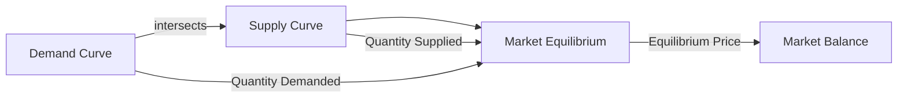

---

title: Market_Equilibrium
type: Atomic Note
course: Economics
semester: Winter 2026
unit: '2'
hub: '[[2_Theory_Of_Demand_And_Supply_Hub]]'
source: '[[5-Pdf Store/note generated/Winter 2026/Economics/Chapter_2.pdf]]'
source_pages:
- 51
- 52
mode: ECON-MACRO
read: false
generated: true
prerequisites:
- '[[Market_Demand]]'
- '[[Theory_Of_Supply]]'
- '[[Surplus_And_Shortage]]'
- '[[Demand_Curve]]'
- '[[Supply_Schedule]]'

---


# 1. Mental Model

Imagine you're at a school bake sale. The people running the sale want to sell as many cupcakes as possible, and the students want to buy them at a good price. When the price is just right, and the number of cupcakes for sale equals the number of cupcakes students want to buy, that's like a perfect balance - that's market equilibrium.

# 2. Economic Theory

Market equilibrium occurs when the [[Market_Demand]] for a good or service equals its [[Theory_Of_Supply]] at a specific price, resulting in no [[Surplus_And_Shortage]]. This equilibrium price is where the [[Demand_Curve]] and [[Supply_Schedule]] intersect, assuming [[Ceteris_Paribus]]. At this point, the quantity of the good or service that suppliers are willing to sell equals the quantity that buyers are willing to buy.

# 3. Economic Model



## 4. Walkthrough

* The demand curve shows the quantity of a good that consumers are willing to buy at different prices.
* The supply curve shows the quantity of a good that producers are willing to sell at different prices.
* At the point where the demand and supply curves intersect, the quantity demanded equals the quantity supplied, resulting in market equilibrium.
* The equilibrium price is the price at which the market is in balance, and there is no surplus or shortage.

## 5. Market Failures

Market equilibrium can fail when there are externalities, such as negative externalities like pollution, or positive externalities like network effects. Additionally, market equilibrium may not be achievable in cases of imperfect information, where buyers or sellers do not have complete knowledge of the market. Other pitfalls include government interventions, such as price ceilings or floors, which can disrupt market equilibrium.

---

## 6. The Proving Grounds

```interactive-quiz

[
  {
    "id": "q1",
    "type": "true_false",
    "difficulty": "L1",
    "question": "Market equilibrium is achieved when the demand for a good or service is greater than its supply.",
    "answer": false,
    "explanation": "Market equilibrium occurs when the demand for a good or service equals its supply at a specific price. This is the point where the quantity of the good or service that suppliers are willing to sell (supply) equals the quantity that buyers are willing to buy (demand). If demand is greater than supply, it creates a shortage, not equilibrium. The equilibrium price is where the demand curve and supply curve intersect, resulting in no surplus or shortage."
  },
  {
    "id": "q2",
    "type": "synthesis",
    "difficulty": "L2",
    "question": "The school is planning a bake sale with a limited number of cupcakes. The students' demand for cupcakes is high, but the school wants to ensure that all cupcakes are sold at a fair price. If the school sets a price of $2 per cupcake, 100 cupcakes are supplied, but only 80 are demanded. If the school sets a price of $1.50 per cupcake, 90 cupcakes are supplied, and 90 cupcakes are demanded. What should the school do to achieve market equilibrium, and at what price should they sell the cupcakes?",
    "answer": "The school should sell the cupcakes at $1.50 to achieve market equilibrium.",
    "explanation": "Market equilibrium occurs when the quantity supplied equals the quantity demanded. At a price of $2, there is a surplus of 20 cupcakes (100 supplied - 80 demanded). At a price of $1.50, the quantity supplied (90) equals the quantity demanded (90), resulting in no surplus or shortage. Therefore, the school should sell the cupcakes at $1.50 to achieve market equilibrium."
  },
  {
    "id": "q3",
    "type": "writing",
    "difficulty": "L3",
    "question": "Explain how a change in consumer preferences affects market equilibrium.",
    "answer": "A change in consumer preferences that increases demand for a product will shift the demand curve to the right, leading to a higher equilibrium price and quantity. Conversely, a decrease in demand will shift the demand curve to the left, resulting in a lower equilibrium price and quantity.",
    "explanation": "When consumer preferences change in favor of a product, the demand for that product increases. This increase in demand is represented by a rightward shift of the demand curve. As the demand curve shifts to the right, it intersects the supply curve at a new point, resulting in a higher equilibrium price and quantity. The increased demand signals to producers that they can sell more units at a higher price, incentivizing them to produce more. On the other hand, if consumer preferences change against a product, the demand curve shifts to the left, leading to a lower equilibrium price and quantity. This process of adjusting to a new equilibrium ensures that market forces are always moving towards balancing supply and demand."
  }
]

```