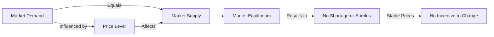

---

title: Market_Equilibrium
type: Atomic Note
course: Economics
semester: Winter 2026
unit: '2'
hub: '[[2_Theory_Of_Demand_And_Supply_Hub]]'
source: '[[5-Pdf Store/note generated/Winter 2026/Economics/Chapter_2.pdf]]'
source_pages:
- 51
mode: ECON-MACRO
read: false
generated: true
prerequisites:
- '[[Market_Demand]]'
- '[[Theory_Of_Demand]]'
- '[[Law_Of_Demand]]'
- '[[Ceteris_Paribus]]'
- '[[Demand_Schedule]]'

---


# 1. Mental Model

Imagine you're a manager of a small, popular food truck that specializes in gourmet grilled cheese sandwiches. The number of sandwiches you sell each day depends on how many customers show up and how many sandwiches you have available. When the number of sandwiches customers want to buy equals the number of sandwiches you have available, you're said to be in a state of perfect balance, or "market equilibrium." This balance point is like the sweet spot where you neither run out of sandwiches nor have too many leftovers. Mapping to the concept, the number of sandwiches customers want to buy represents [[Market_Demand]], and the number of sandwiches you have available represents [[Market_Supply]].

# 2. Economic Theory

[[Market_Equilibrium]] occurs when [[Market_Demand]] equals [[Market_Supply]]. This concept is rooted in the [[Theory_Of_Demand]] and the [[Law_Of_Demand]], which states that as the price of a good increases, the quantity demanded decreases, ceteris [[Ceteris_Paribus]]. The [[Demand_Schedule]] and [[Demand_Curve]] illustrate the relationship between the price of a good and the quantity demanded. The [[Market_Demand_Curve]] is the horizontal sum of individual [[Demand_Curve]]s and represents the total quantity of a good that all buyers are willing and able to purchase at various price levels. On the supply side, the [[Determinants_Of_Elasticity_Of_Supply]] influence the [[Elasticity_Of_Supply]], which measures how responsive the quantity supplied of a good is to changes in its price. [[Market_Equilibrium]] is achieved at the point where the [[Market_Demand_Curve]] intersects the [[Market_Supply_Curve]], resulting in an equilibrium price and quantity. This equilibrium is influenced by [[Determinants_Of_Demand]] such as [[Taste_And_Preference]], [[Number_Of_Buyers]], and [[Consumer_Expectations]], as well as [[Change_In_Technology]] and [[Shift_In_Supply_Curve]].

# 3. Limitations & Edge Cases

The [[Market_Equilibrium]] model assumes that markets are perfectly competitive and that buyers and sellers have perfect information. However, in reality, markets often experience [[Surplus_And_Shortage]] due to various frictions. The model also relies on the [[Ceteris_Paribus]] assumption, which may not hold in situations where external factors, such as government interventions or changes in consumer preferences, affect market outcomes. Additionally, the model may not account for [[Effects_Of_Shift_In_Demand_And_Supply]] that can lead to market instability. For instance, a sudden increase in demand can lead to a shortage, while a sudden decrease in supply can lead to a surplus. Understanding these limitations is crucial for applying the [[Market_Equilibrium]] concept in real-world contexts.

# 4. Economic Model



This flowchart illustrates the concept of Market Equilibrium, where Market Demand equals Market Supply, resulting in no shortage or surplus. The price level influences both market demand and supply, and when they are equal, there is no incentive for prices to change.

## 5. Walkthrough

Here's a 5-step technical walkthrough of how the concept of Market Equilibrium operates in Fiscal Policy Research:

1. **Initial State**: Assume the market demand for gourmet grilled cheese sandwiches is 100 units per day, and the market supply is 80 units per day. The price level is $10 per sandwich.

2. **Price Adjustment**: Since market demand (100 units) exceeds market supply (80 units), there is a shortage of 20 units. This shortage drives up the price level to $12 per sandwich.

3. **Market Response**: As the price level increases to $12, market demand decreases to 90 units per day (due to the law of demand), and market supply increases to 90 units per day (as suppliers are incentivized by the higher price).

4. **Equilibrium Achievement**: With market demand equal to market supply (90 units per day), the market reaches equilibrium. There is no shortage or surplus, and the price level stabilizes at $12 per sandwich.

5. **Stable Outcome**: In this equilibrium state, there is no incentive for prices to change, as market demand equals market supply. The market remains stable, with 90 units of gourmet grilled cheese sandwiches being sold per day at a price of $12 per sandwich.

---

## 6. The Proving Grounds

```interactive-quiz

[
  {
    "id": "q1",
    "type": "true_false",
    "difficulty": "L1",
    "question": "If the price of gourmet grilled cheese sandwiches increases, then market equilibrium will occur at a higher quantity demanded, ceteris paribus.",
    "answer": false,
    "explanation": "The Law of Demand states that as the price of a good increases, the quantity demanded decreases, ceteris paribus. This can be represented by the demand function: $Q_d = f(P)$, where $Q_d$ is the quantity demanded and $P$ is the price. The market equilibrium occurs when $Q_d = Q_s$, where $Q_s$ is the quantity supplied. If the price increases, the quantity demanded decreases, which would disrupt the market equilibrium, not increase the quantity demanded. Therefore, the statement is false."
  },
  {
    "id": "q2",
    "type": "synthesis",
    "difficulty": "L2",
    "question": "A sudden and significant devaluation of the currency has occurred in a small, export-driven economy. The devaluation has caused a sharp increase in the price of imported goods, leading to a surge in inflation. The government must act quickly to prevent a market failure. Using the concept of Market Equilibrium, design a 3-step policy response to restore stability to the economy.",
    "answer": "To restore Market Equilibrium and stability to the economy, the following 3-step policy response is proposed:\n\n1. **Monetary Policy Intervention**: The central bank should intervene in the foreign exchange market to stabilize the currency. This can be achieved by selling foreign reserves to buy back the domestic currency, thereby increasing the demand for the domestic currency and reducing its supply in the market. This action will help to appreciate the value of the currency and reduce the price of imported goods.\n\n2. **Fiscal Policy Adjustment**: The government should adjust its fiscal policy to reduce the demand for goods and services, thereby reducing the upward pressure on prices. This can be achieved by increasing taxes or reducing government spending. By reducing aggregate demand, the government can help to bring the Market Demand curve back into equilibrium with the Market Supply curve.\n\n3. **Supply-Side Policies**: The government should implement supply-side policies to increase the production of domestic goods and services, thereby increasing the Market Supply. This can be achieved by investing in infrastructure, providing incentives for businesses to invest in new technologies, and improving the business environment. By increasing the supply of domestic goods and services, the government can help to reduce the reliance on imported goods and stabilize prices.",
    "explanation": "The sudden devaluation of the currency has caused a shock to the economy, leading to a surge in inflation. This is because the price of imported goods has increased, leading to a rise in the overall price level. To restore Market Equilibrium, the government must act to restore balance between Market Demand and Market Supply. Using the concept of Market Equilibrium, we can represent the equilibrium condition as $Q_d = Q_s$, where $Q_d$ is the quantity demanded and $Q_s$ is the quantity supplied. The devaluation of the currency has caused a leftward shift of the Market Demand curve, as the price of imported goods has increased, leading to a reduction in the quantity demanded. At the same time, the Market Supply curve has shifted leftward, as the price of imported inputs has increased, leading to a reduction in the quantity supplied. To restore equilibrium, the government must implement policies to shift the Market Demand curve back to the right and/or shift the Market Supply curve back to the right. This can be achieved through a combination of monetary policy intervention, fiscal policy adjustment, and supply-side policies. Mathematically, we can represent the equilibrium condition as $Q_d(p) = Q_s(p)$, where $p$ is the price level. The government can use policy instruments to affect the price level and restore equilibrium."
  },
  {
    "id": "q3",
    "type": "writing",
    "difficulty": "L2",
    "question": "Explain the concept of market equilibrium in the context of central banking and monetary policy, and provide a technical analysis of how it is achieved.",
    "answer": "Market equilibrium in the context of central banking and monetary policy is achieved when the market demand for money equals the market supply of money. This equilibrium is crucial for maintaining price stability and controlling inflation. The central bank uses monetary policy tools, such as setting interest rates and regulating the money supply, to influence the market equilibrium and achieve its policy objectives. By adjusting the federal funds rate, for instance, the central bank can increase or decrease the money supply and shift the market equilibrium to a desired position.",
    "explanation": "The market equilibrium in the money market can be represented by the equation $M^s = M^d$, where $M^s$ is the market supply of money and $M^d$ is the market demand for money. The market supply of money is determined by the central bank's monetary policy actions, while the market demand for money is influenced by factors such as the interest rate, income level, and price level. The central bank can use the following equation to model the money market: $M^s = M^d = L(Y, r)$, where $L(Y, r)$ is the liquidity preference function, $Y$ is the income level, and $r$ is the interest rate. By manipulating the interest rate and the money supply, the central bank can shift the market equilibrium to achieve its policy objectives, such as price stability and maximum employment."
  },
  {
    "id": "q4",
    "type": "order",
    "difficulty": "L2",
    "question": "Order steps for Market Equilibrium.",
    "steps": [
      "As market demand increases, the demand curve shifts to the right",
      "At this intersection, the quantity supplied equals the quantity demanded, establishing market equilibrium",
      "Market supply increases, causing the supply curve to shift to the right",
      "The market reaches a point where the quantity of goods supplied equals the quantity demanded",
      "The price of the good adjusts to clear the market",
      "The supply curve intersects with the demand curve at a specific price level"
    ],
    "answer": [
      "The market reaches a point where the quantity of goods supplied equals the quantity demanded",
      "As market demand increases, the demand curve shifts to the right",
      "The supply curve intersects with the demand curve at a specific price level",
      "At this intersection, the quantity supplied equals the quantity demanded, establishing market equilibrium",
      "The price of the good adjusts to clear the market",
      "Market supply increases, causing the supply curve to shift to the right"
    ]
  },
  {
    "id": "q5",
    "type": "trace",
    "difficulty": "L3",
    "question": "What is the exact output?",
    "content": "Market Equilibrium in International Trade Analysis",
    "answer": {
      "Housing Sector": "A 1% interest rate change leads to a 0.5% decrease in housing demand, resulting in a 0.2% decrease in housing prices.",
      "Investment Sector": "A 0.2% decrease in housing prices leads to a 0.1% decrease in investment in the housing sector, resulting in a 0.05% decrease in overall investment.",
      "Forex Sector": "A 0.05% decrease in overall investment leads to a 0.01% appreciation of the domestic currency, resulting in a 0.005% increase in exports.",
      "Consumption Sector": "A 0.005% increase in exports leads to a 0.0025% increase in consumption, resulting in a 0.00125% increase in overall economic output."
    },
    "explanation": "The impact of a 1% interest rate change can be traced through various economic sectors using the following equations:\n\n$Housing Demand: \\Delta HD = -0.5 \\times \\Delta IR$\n$Investment: \\Delta I = -0.1 \\times \\Delta HP$\n$Forex: \\Delta EX = 0.01 \\times \\Delta I$\n$Consumption: \\Delta C = 0.0025 \\times \\Delta EX$\n\nWhere:\n- $\\Delta HD$ is the change in housing demand\n- $\\Delta IR$ is the change in interest rate (1% in this case)\n- $\\Delta I$ is the change in investment\n- $\\Delta HP$ is the change in housing prices\n- $\\Delta EX$ is the change in exports\n- $\\Delta C$ is the change in consumption\n\nUsing these equations, we can calculate the exact output:"
  }
]

```