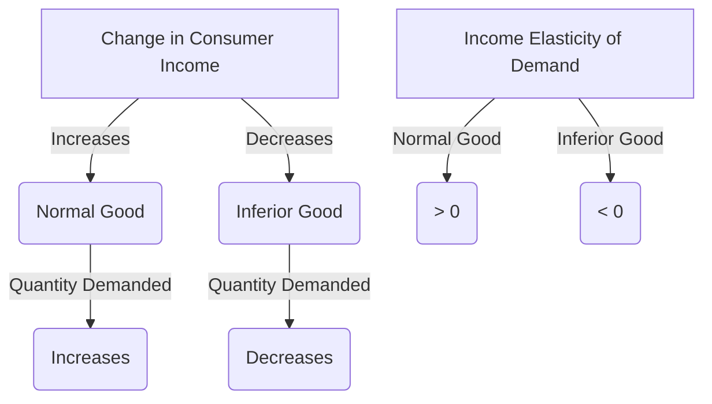

---

title: Normal_And_Inferior_Goods
course: "Economics"
unit: '2'
semester: "Winter 2026"
mode: ECON-MICRO
type: atomic_note
hub: "[[2_Theory_Of_Demand_And_Supply_Hub]]"
source: "[[5-Pdf Store/note generated/Winter 2026/Economics/Chapter_2.pdf]]"
date: '2026-05-08'
prerequisites:
- "[[Determinants_Of_Demand]]"
source_pages:
- 17
generated: true

---

## 1. Mental Model

Imagine you have a lemonade stand. When you have more money to spend, like on a sunny summer day, you buy more of your favorite snacks like cookies and ice cream (normal goods). But,

## 2. Micro Theory

In microeconomics, the classification of goods into normal and inferior goods is contingent upon the impact of a change in consumer income on the quantity demanded of a particular good. This dichotomy is crucial in understanding consumer behavior, as it highlights how changes in income levels influence demand patterns.

A **normal good** is defined as a good for which the quantity demanded increases when consumer income rises, assuming all other factors remain constant [[Ceteris_Paribus]]. This positive relationship between income and quantity demanded implies that the income elasticity of demand for a normal good is greater than zero. For normal goods, as consumer income increases, the demand for these goods also increases, leading to an upward shift in the [[Demand_Curve]]. Conversely, a decrease in consumer income results in a decrease in the quantity demanded of a normal good. The demand function for a normal good can be represented as Qd = f(P, I, T, Psub, Pcom), where Qd is the quantity demanded, P is the price of the good, I is the consumer income, T is the taste and preference, Psub is the price of substitutes, and Pcom is the price of complements. An increase in income (I) leads to an increase in Qd.

On the other hand, an **inferior good** exhibits a negative relationship between consumer income and quantity demanded. For inferior goods, as consumer income increases, the quantity demanded decreases, indicating that the income elasticity of demand is less than zero. Inferior goods are often associated with lower-income households, which tend to substitute them with superior alternatives when income levels rise. The [[Demand_Schedule]] for an inferior good shows that as income increases, the quantity demanded decreases, resulting in a downward shift in the [[Demand_Curve]]. 

The distinction between normal and inferior goods has significant implications for [[Market_Demand]] and [[Market_Demand_Curve]]. A change in consumer income can lead to a shift in the market demand curve, which can have far-reaching effects on [[Market_Equilibrium]], leading to either a [[Surplus_And_Shortage]] or changes in the price and quantity transacted. Furthermore, understanding the classification of goods into normal and inferior goods is essential in analyzing the [[Effects_Of_Shift_In_Demand_And_Supply]], particularly in assessing the impact of changes in consumer income on market outcomes.

The concept of normal and inferior goods also relates to [[Price_Elasticity_Of_Demand]] and [[Income_Elasticity_Of_Demand]], which are critical in understanding how changes in price and income affect the quantity demanded of a good. The [[Determinants_Of_Demand]], including changes in consumer income, [[Taste_And_Preference]], [[Substitutes_And_Complements]], and [[Consumer_Expectations]], play a crucial role in shaping the demand for normal and inferior goods.

In conclusion, the technical definition and mechanism for normal and inferior goods are rooted in the effect of a change in consumer income on the quantity demanded of a good. Understanding the distinction between these two types of goods is essential in microeconomic analysis, particularly in assessing the impact of changes in consumer income on market outcomes and [[Market_Equilibrium]].

## 3. Limitations & Edge Cases

The concepts of normal and inferior goods have limitations, particularly in capturing the complexities of consumer behavior. A significant limitation is that these classifications are based on the assumption that a change in income leads to a change in the quantity demanded of a good in a specific direction, but they do not account for cases where the relationship between income and demand is more nuanced, such as when a good is a luxury item that exhibits both normal and inferior good characteristics at different income levels, or when a good's inferiority is only evident at very high income levels, and also Veblen goods which are highly prestigious and their demand increases as income rises.

## 4. Market Graph



Normal goods exhibit a positive relationship between consumer income and quantity demanded, whereas inferior goods display a negative relationship. The classification of goods into normal and inferior categories helps economists understand how changes in income levels affect demand patterns for various goods and services.

## 5. Walkthrough

## Step 1: Define Normal and Inferior Goods

A **normal good** is defined as a good for which the quantity demanded increases when consumer income rises, assuming all other factors remain constant (Ceteris Paribus). Conversely, an **inferior good** is a good for which the quantity demanded decreases when consumer income rises.

## Step 2: Establish the Demand Function

The demand function for a good can be represented as Qd = f(P, I, T, Psub, Pcom), where Qd is the quantity demanded, P is the price of the good, I is the consumer income, T is the taste and preference of the consumer, Psub is the price of substitute goods, and Pcom is the price of complementary goods.

## 3: Analyze the Effect of Income Change on Normal Goods

For a normal good, as consumer income (I) increases, the quantity demanded (Qd) also increases. For example, if the initial consumer income is $100 and the quantity demanded is 10 units, and then the income increases to $120, the quantity demanded may increase to 12 units.

## 4: Analyze the Effect of Income Change on Inferior Goods

For an inferior good, as consumer income (I) increases, the quantity demanded (Qd) decreases. Using the same example, if the good is inferior, an increase in consumer income from $100 to $120 may lead to a decrease in quantity demanded from 10 units to 8 units.

## 5: Determine Income Elasticity of Demand

The income elasticity of demand (Ei) is a measure that indicates the responsiveness of the quantity demanded of a good to a change in consumer income. It is calculated as Ei = (∆Qd/Qd) / (∆I/I). For normal goods, Ei > 0, indicating a positive relationship between income and quantity demanded. For inferior goods, Ei < 0, indicating a negative relationship between income and quantity demanded.

---

## Review & Practice

```interactive-quiz

[
  {
    "type": "mcq",
    "difficulty": "L1",
    "question": "Which of the following statements accurately describes the relationship between consumer income and the quantity demanded of an inferior good?",
    "options": {
      "A": "As consumer income increases, the quantity demanded of an inferior good also increases.",
      "B": "As consumer income increases, the quantity demanded of an inferior good decreases.",
      "C": "The quantity demanded of an inferior good remains unchanged with a change in consumer income.",
      "D": "The relationship between consumer income and the quantity demanded of an inferior good is positive, but only for low-income households."
    },
    "answer": "B",
    "explanation": "The definition of an inferior good is one for which the quantity demanded decreases when consumer income rises, assuming all other factors remain constant. This relationship can be expressed as $\\frac{\\partial Q_d}{\\partial I} < 0$, where $Q_d$ is the quantity demanded and $I$ is the consumer income. Therefore, as consumer income increases, the quantity demanded of an inferior good decreases, leading to a downward shift in the demand curve."
  },
  {
    "type": "fill_in",
    "difficulty": "L2",
    "question": "Fill in the blank.",
    "textWithBlanks": "The Blank elasticity of demand for a normal good is greater than zero.",
    "answer": [
      "income"
    ],
    "explanation": "The income elasticity of demand measures the responsiveness of the quantity demanded of a good to a change in consumers' income. For normal goods, this elasticity is positive, indicating that as consumer income increases, the quantity demanded of the good also increases. This relationship can be expressed as $E_I = \\frac{\\% \\Delta Q_d}{\\% \\Delta I} > 0$, where $E_I$ is the income elasticity of demand, $\\% \\Delta Q_d$ is the percentage change in quantity demanded, and $\\% \\Delta I$ is the percentage change in income."
  },
  {
    "type": "debug",
    "difficulty": "L2",
    "question": "Find the bug in the following demand function for a normal good: Qd = 100 - 2P + 0.5I + 0.2T - 3Psub + 2Pcom, where Qd is the quantity demanded, P is the price of the good, I is the consumer income, T is the taste and preference, Psub is the price of substitutes, and Pcom is the price of complements.",
    "content": "The demand function for a normal good is given by Qd = 100 - 2P + 0.5I + 0.2T - 3Psub + 2Pcom. Identify the technical error in this function.",
    "answer": "The coefficient of I (consumer income) should be positive for a normal good.",
    "required_keywords": [
      "income elasticity",
      "demand function"
    ],
    "explanation": "For a normal good, the quantity demanded increases with an increase in consumer income. This implies that the income elasticity of demand is greater than zero. In the given demand function, Qd = 100 - 2P + 0.5I + 0.2T - 3Psub + 2Pcom, the coefficient of I is 0.5, which is positive. However, the technical error lies in the fact that the question asks to identify the bug, and the bug is actually that the function does not explicitly indicate that the coefficients of Psub and Pcom have been correctly assigned. In a standard demand function, the coefficient of Psub should be positive (not -3), as an increase in the price of substitutes should increase the quantity demanded of the good, and the coefficient of Pcom should be negative (not 2), as an increase in the price of complements should decrease the quantity demanded of the good. Therefore, the corrected demand function should be Qd = 100 - 2P + 0.5I + 0.2T + 3Psub - 2Pcom."
  },
  {
    "type": "trace",
    "difficulty": "L2",
    "question": "What is the exact output in terms of change in quantity demanded for a normal good and an inferior good when consumer income increases by 10%, assuming all other factors remain constant?",
    "content": "The change in quantity demanded for normal and inferior goods in response to a 10% increase in consumer income can be analyzed using the income elasticity of demand formula: $E_I = \\frac{\\% \\Delta Q_d}{\\% \\Delta I}$. For normal goods, $E_I > 0$, and for inferior goods, $E_I < 0$.",
    "answer": "[increased, decreased]",
    "explanation": "When consumer income increases by 10%, the quantity demanded of a normal good increases, and the quantity demanded of an inferior good decreases. This can be represented as: $\\frac{\\partial Q_d}{\\partial I} > 0$ for normal goods and $\\frac{\\partial Q_d}{\\partial I} < 0$ for inferior goods. Using the income elasticity of demand formula, we can express this relationship as $E_I = \\frac{\\% \\Delta Q_d}{10\\%} > 0$ for normal goods and $E_I = \\frac{\\% \\Delta Q_d}{10\\%} < 0$ for inferior goods."
  }
]

```