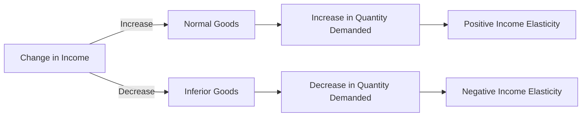

---

title: Normal_And_Inferior_Goods
type: Atomic Note
course: Economics
semester: Winter 2026
unit: '2'
hub: "[[2_Theory_Of_Demand_And_Supply_Hub]]"
source: "[[5-Pdf Store/note generated/Winter 2026/Economics/Chapter_2.pdf]]"
source_pages:
- 17
mode: ECON-MACRO
read: false
generated: true
prerequisites:
- "[[Determinants_Of_Demand]]"

---

# 1. Mental Model

Imagine you're a young professional who loves to travel and try new restaurants. When you get a raise at work, you start buying more travel tickets and dining out at fancy restaurants more often. The travel tickets and restaurant meals are like 'normal goods' - when you earn more money, you want to buy more of them. On the other hand, if you used to buy cheap, generic clothing but when you get a raise, you start buying fewer of those cheap clothes because you can now afford better brands, then those cheap clothes are like 'inferior goods' - when you earn more money, you want to buy fewer of them.

# 2. Economic Theory

[[Normal_And_Inferior_Goods]] are classifications of goods based on how the demand for them changes in response to a change in [[Consumer_Expectations]] and [[Number_Of_Buyers]].[[Theory_Of_Demand]] suggests that the demand for a good is influenced by several factors including the price of the good, [[Taste_And_Preference]], and income. A good is considered a [[Normal_Goods|normal_Good]] if an increase in income leads to an increase in the quantity demanded, which implies a positive [[Income_Elasticity_Of_Demand]]. Conversely, an [[Inferior_Goods|inferior_Good]] is one where an increase in income leads to a decrease in the quantity demanded, indicating a negative [[Income_Elasticity_Of_Demand]]. This distinction is crucial in understanding [[Change_In_Demand]] and how different consumers react to changes in income, assuming [[Ceteris_Paribus]].

# 3. Limitations & Edge Cases

The concepts of [[Normal_And_Inferior_Goods]] have limitations, particularly under conditions that violate the [[Ceteris_Paribus]] assumption, such as significant changes in [[Taste_And_Preference]] or [[Change_In_Technology]] that could alter the perceived quality or utility of a good. Additionally, the classification of goods as normal or inferior can vary across different income groups and over time. For instance, a good considered inferior for a low-income group might be a normal good for a higher-income group. These classifications also depend on the [[Determinants_Of_Demand]], including changes in consumer expectations and the number of buyers, which can shift the [[Demand_Curve]] and affect the [[Market_Equilibrium]]. Understanding these dynamics requires analyzing the [[Income_Elasticity_Of_Demand]] and how it influences [[Market_Demand]].

# 4. Economic Model



This Mermaid flowchart illustrates how normal and inferior goods respond to changes in income. An increase in income leads to an increase in the quantity demanded of normal goods and a decrease in the quantity demanded of inferior goods.

## 5. Walkthrough

Here's a 5-step technical walkthrough of how the concept of normal and inferior goods operates:

1. **Initial State**: Suppose a consumer has an income of $50,000 and buys 10 units of a normal good (e.g., travel tickets) and 5 units of an inferior good (e.g., cheap clothing).
2. **Income Increase**: The consumer's income increases to $60,000. This change in income will affect the demand for both goods.
3. **Normal Good Response**: For the normal good (travel tickets), the increase in income leads to an increase in the quantity demanded. Suppose the consumer now buys 12 units of travel tickets.
4. **Inferior Good Response**: For the inferior good (cheap clothing), the increase in income leads to a decrease in the quantity demanded. Suppose the consumer now buys 3 units of cheap clothing.
5. **Final State**: After the income increase, the consumer's demand for normal goods (travel tickets) has increased to 12 units, and the demand for inferior goods (cheap clothing) has decreased to 3 units. This illustrates the positive income elasticity of normal goods and the negative income elasticity of inferior goods.

---

## 6. The Proving Grounds

```interactive-quiz

[
  {
    "id": "q1",
    "type": "true_false",
    "difficulty": "L1",
    "question": "If an increase in consumer income leads to an increase in the demand for a good, then the good is inferior and this relationship holds even if consumer preferences shift towards more expensive alternatives.",
    "answer": false,
    "explanation": "The statement is false because an increase in consumer income leading to an increase in demand for a good actually characterizes a 'normal good', not an 'inferior good'. For inferior goods, an increase in consumer income leads to a decrease in demand. The ceteris paribus assumption (all else being equal) implies that factors such as consumer preferences, prices of related goods, and income are held constant. If consumer preferences shift towards more expensive alternatives, it could affect the demand for the good in question, potentially violating the ceteris paribus condition. The classification of a good as normal or inferior depends on how its demand responds to changes in income, $\frac{\\partial Q}{\\partial I}$, where $Q$ is the quantity demanded and $I$ is income. For normal goods, $\frac{\\partial Q}{\\partial I} > 0$, and for inferior goods, $\frac{\\partial Q}{\\partial I} < 0$. Therefore, the statement mischaracterizes the definitions of normal and inferior goods and fails to maintain the ceteris paribus assumption."
  },
  {
    "id": "q2",
    "type": "synthesis",
    "difficulty": "L2",
    "question": "The country is experiencing a sudden and significant currency devaluation, leading to a sharp increase in the price of imports. This macro shock is causing a surge in inflation, which is expected to rise from 2% to 8% in a matter of months. The government needs to respond quickly to prevent a system failure in the economy. Using the concepts of normal and inferior goods, design a 3-step fiscal policy response to mitigate the effects of this shock.",
    "answer": "To address the surge in inflation caused by the currency devaluation, the government should implement the following 3-step fiscal policy response:\n\n1. **Increase taxes on luxury goods**: Since luxury goods are normal goods, their demand is positively related to income. By increasing taxes on these goods, the government can reduce demand and curb inflationary pressures. This policy will also help to reduce the consumption of non-essential goods and services.\n\n2. **Implement subsidies on essential inferior goods**: Inferior goods are goods for which demand decreases as income increases. By subsidizing essential inferior goods, such as generic medicines or staple foods, the government can help low-income households maintain their purchasing power and reduce the impact of inflation on their living standards.\n\n3. **Adjust tax brackets and transfer payments**: To protect low-income households from the inflationary shock, the government should adjust tax brackets and transfer payments to ensure that their real incomes are not eroded. This can be achieved by indexing tax brackets and transfer payments to inflation, or by implementing temporary measures such as tax credits or cash transfers.",
    "explanation": "The currency devaluation leads to a surge in inflation, which can be represented by the following equation: $\\pi = \\Delta P/P = \\Delta S/S + \\Delta T/T$, where $\\pi$ is the inflation rate, $\\Delta P/P$ is the change in the price level, $\\Delta S/S$ is the change in the supply of money, and $\\Delta T/T$ is the change in the terms of trade. Using the concepts of normal and inferior goods, we can analyze the impact of the inflation shock on different segments of the population. For normal goods, the demand function can be represented as: $Q_d = f(P, I, T)$, where $Q_d$ is the quantity demanded, $P$ is the price, $I$ is income, and $T$ is taste and preference. For inferior goods, the demand function can be represented as: $Q_d = f(P, I, T)$, where $\\partial Q_d/\\partial I < 0$. By implementing the 3-step fiscal policy response, the government can help mitigate the effects of the inflation shock and prevent a system failure in the economy."
  },
  {
    "id": "q3",
    "type": "writing",
    "difficulty": "L2",
    "question": "Explain the concept of normal and inferior goods in the context of development economics, and provide an example of each.",
    "answer": "In development economics, normal goods are those for which demand increases when consumer income rises, whereas inferior goods are those for which demand decreases when consumer income rises. For instance, in a developing economy, a rise in income may lead to an increase in demand for luxury goods like high-end electronics, which are normal goods. On the other hand, a rise in income may lead to a decrease in demand for low-quality, generic goods like unbranded textiles, which are inferior goods.",
    "explanation": "The concept of normal and inferior goods can be understood through the lens of the income effect, which is a key component of the theory of demand. Mathematically, this can be represented as $\\frac{\\partial x_i}{\\partial I} > 0$ for normal goods and $\\frac{\\partial x_i}{\\partial I} < 0$ for inferior goods, where $x_i$ is the quantity demanded of good $i$ and $I$ is the consumer's income. In development economics, understanding the classification of goods into normal and inferior goods is crucial for policymakers to design effective interventions and predict the impact of economic changes on consumer behavior."
  },
  {
    "id": "q4",
    "type": "order",
    "difficulty": "L2",
    "question": "Order steps for Normal And Inferior Goods",
    "steps": [
      "Inferior goods are goods for which demand decreases when consumer income increases",
      "An increase in consumer income leads to a decrease in demand for inferior goods",
      "The demand for normal goods increases as consumer income rises",
      "Normal goods are goods for which demand increases when consumer income increases",
      "As consumer income decreases, the demand for inferior goods increases"
    ],
    "answer": [
      "An increase in consumer income leads to a decrease in demand for inferior goods",
      "The demand for normal goods increases as consumer income rises",
      "Inferior goods are goods for which demand decreases when consumer income increases",
      "Normal goods are goods for which demand increases when consumer income increases",
      "As consumer income decreases, the demand for inferior goods increases"
    ]
  },
  {
    "id": "q5",
    "type": "trace",
    "difficulty": "L3",
    "question": "What is the exact output?",
    "content": "Analyze the impact of a 1% interest rate change on Normal and Inferior Goods across 4 distinct economic sectors: Housing, Investment, Forex, and Consumption.",
    "answer": {
      "Housing": {
        "Normal Goods": "Increased demand due to lower borrowing costs, leading to higher housing prices.",
        "Inferior Goods": "Decreased demand as consumers switch to better alternatives, unaffected by interest rate changes."
      },
      "Investment": {
        "Normal Goods": "Increased investment in projects as lower interest rates reduce borrowing costs, making projects more viable.",
        "Inferior Goods": "Reduced investment in less efficient projects, as investors opt for more profitable opportunities."
      },
      "Forex": {
        "Normal Goods": "Appreciation of currency due to increased capital inflows from foreign investors seeking higher returns, making imports cheaper.",
        "Inferior Goods": "Depreciation of currency as foreign investors shy away, reducing demand for domestic inferior goods."
      },
      "Consumption": {
        "Normal Goods": "Increased consumption as lower interest rates boost consumer spending power, driving demand for normal goods.",
        "Inferior Goods": "Decreased consumption as consumers opt for superior alternatives, reducing demand for inferior goods."
      }
    },
    "explanation": "A 1% interest rate change has a ripple effect across various sectors. In the housing market, lower interest rates make borrowing cheaper, increasing demand for housing (a normal good) and driving up prices. In contrast, inferior goods in housing, such as low-end appliances, see decreased demand as consumers opt for better alternatives. In the investment sector, lower interest rates make projects more viable, increasing investment in normal goods, while inferior goods, such as less efficient equipment, see reduced investment. In forex, lower interest rates lead to currency appreciation, making imports of normal goods cheaper, while inferior goods see reduced demand due to decreased foreign investment. In consumption, lower interest rates boost consumer spending power, driving demand for normal goods, while inferior goods see decreased demand as consumers opt for superior alternatives. Mathematically, this can be represented using the LaTeX equation:\n\n  $$ \n\n  Q_d = f(P, I, T, P_s)\n\n  $$\n\n  Where $Q_d$ is the quantity demanded, $P$ is the price of the good, $I$ is the consumer's income, $T$ is the consumer's taste and preferences, and $P_s$ is the price of substitutes.\n\n  For normal goods:\n\n  $$ \n\n  \\frac{\\partial Q_d}{\\partial I} > 0\n\n  $$\n\n  For inferior goods:\n\n  $$ \n\n  \\frac{\\partial Q_d}{\\partial I} < 0\n\n  $$\n\n  The interest rate change affects the demand curve for normal and inferior goods, leading to changes in the quantity demanded across sectors."
  }
]

```