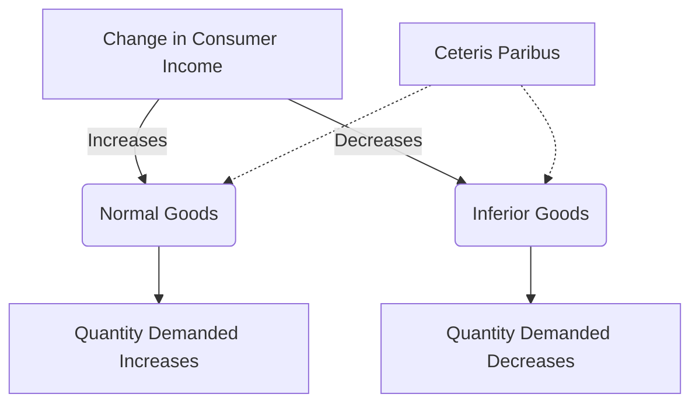

## 1. Mental Model

Imagine you have a lemonade stand. When you have more money to spend, like on a sunny summer day, you buy more of your favorite snacks like cookies and ice cream (normal goods). But,

## 2. Micro Theory

In microeconomics, the classification of goods into normal and inferior goods is contingent upon the impact of a change in consumer income on the quantity demanded of a particular good. This dichotomy is crucial in understanding consumer behavior, especially when analyzing the [[Theory_Of_Demand]] and the [[Law_Of_Demand]], which describe how consumers respond to changes in prices and income.

A Normal Goods|normal Good is one for which the quantity demanded increases when consumer income rises, assuming [[Ceteris_Paribus]] (all other factors remain constant). This positive relationship between income and quantity demanded is a defining characteristic of normal goods. The demand for normal goods is typically represented by a demand function that exhibits a positive income elasticity of demand. For a normal good, if consumer income increases, the demand Demand Schedule|schedule shifts to the right, indicating that consumers are willing to buy more of the good at each price level. Graphically, this is represented by a shift to the right of the [[Demand_Curve]], signifying an increase in demand.

On the other hand, an Inferior Goods|inferior Good exhibits a negative relationship between consumer income and the quantity demanded. When consumer income increases, the quantity demanded of an inferior good decreases, again assuming [[Ceteris_Paribus]]. Inferior goods have a negative income elasticity of demand. An increase in consumer income leads to a leftward shift of the Demand Curve|demand Curve for an inferior good, indicating that consumers are willing to buy less of the good at each price level.

The distinction between normal and inferior goods is not absolute and can vary depending on the consumer's Taste And Preference|tastes And Preferences, Consumer Expectations|expectations, and the overall Market Demand|market Demand conditions. Moreover, the classification of a good as normal or inferior can change over time as consumer preferences and income levels evolve.

The concept of normal and inferior goods also intersects with the Determinants Of Demand|determinants Of Demand, which include factors such as changes in consumer income, Number Of Buyers|number Of Buyers, Substitutes And Complements|availability Of Substitutes And Complements, and Change In Technology|changes In Technology. Understanding these determinants is crucial for analyzing how changes in market conditions affect the demand for normal and inferior goods.

The income elasticity of demand is a key metric in distinguishing between normal and inferior goods. It measures the responsiveness of the quantity demanded of a good to a change in consumers' income, with the Income Elasticity Of Demand|formula being the percentage change in quantity demanded divided by the percentage change in income. A positive income elasticity indicates a normal good, while a negative income elasticity indicates an inferior good.

In conclusion, the classification of goods into normal and inferior goods provides valuable insights into consumer behavior and market dynamics. By understanding how changes in consumer income affect the quantity demanded of different goods, businesses and policymakers can make more informed decisions regarding production, pricing, and policy interventions. This analysis is integral to the broader study of Market Equilibrium|market Equilibrium, Surplus And Shortage|surplus And Shortage, and the Effects Of Shift In Demand And Supply|effects Of Shifts In Demand And Supply, ultimately contributing to a deeper understanding of Market Equilibrium Example|market Equilibrium Examples.

## 3. Limitations & Edge Cases

The concepts of normal and inferior goods have limitations, particularly in capturing the complexities of consumer behavior. A significant limitation is that these classifications are based on the assumption that a change in income leads to a change in the quantity demanded of a good in a specific direction, but they do not account for cases where the relationship between income and demand is more nuanced, such as when a good is a luxury item that exhibits both normal and inferior good characteristics at different income levels, or when a good's inferiority is only evident at very high income levels, and also Veblen goods which are highly prestigious and their demand increases as income rises.

## 4. Market Graph



Normal goods exhibit a positive relationship between consumer income and quantity demanded, whereas inferior goods exhibit a negative relationship. Understanding the distinction between normal and inferior goods is essential in environmental economics, as it helps policymakers anticipate how changes in income might affect the demand for goods with environmental implications.

## 5. Walkthrough

**Step 1: Define Income Elasticity of Demand**

Income elasticity of demand (YED) is calculated as the percentage change in quantity demanded in response to a 1% change in consumer income. It is expressed as:

YED = (∆Q/Q) / (∆Y/Y)

where Q is the quantity demanded, and Y is the consumer income.

**Step 2: Identify Normal Goods**

For a normal good, YED > 0. This means that as consumer income (Y) increases, the quantity demanded (Q) also increases. The demand function for a normal good can be represented as:

Q = f(P, Y)

where P is the price of the good, and Y is the consumer income. For a normal good, an increase in Y leads to an increase in Q.

**Step 3: Define Inferior Goods**

An inferior good is one for which the quantity demanded decreases when consumer income rises, assuming ceteris paribus. This negative relationship between income and quantity demanded is a defining characteristic of inferior goods. The demand for inferior goods is typically represented by a demand function that exhibits a negative income elasticity of demand.

**Step 4: Analyze Impact of Income Change on Demand Schedule**

For a normal good:

* If consumer income increases (Y ↑), the demand schedule shifts to the right (D → D'), indicating that consumers are willing to buy more of the good at each price level.
* If consumer income decreases (Y ↓), the demand schedule shifts to the left (D → D''), indicating that consumers are willing to buy less of the good at each price level.

For an inferior good:

* If consumer income increases (Y ↑), the demand schedule shifts to the left (D → D''), indicating that consumers are willing to buy less of the good at each price level.
* If consumer income decreases (Y ↓), the demand schedule shifts to the right (D → D'), indicating that consumers are willing to buy more of the good at each price level.

**Step 5: Determine Classification of Goods**

Based on the income elasticity of demand, classify a good as:

* Normal good: YED > 0
* Inferior good: YED < 0

This classification helps policymakers and businesses understand how changes in consumer income may affect the demand for a particular good, which is essential in environmental economics when analyzing the impact of policies on consumer behavior and the environment.

---

## Review & Practice

```interactive-quiz

[
  {
    "id": "generate_unique_id",
    "type": "mcq",
    "difficulty": "L1",
    "question": "What is the effect of an increase in consumer income on the demand for an inferior good, and how does it relate to the law of demand and elasticity calculations in environmental economics?",
    "options": {
      "A": "The demand for an inferior good increases, and its income elasticity of demand is positive.",
      "B": "The demand for an inferior good decreases, and its income elasticity of demand is negative.",
      "C": "The demand for an inferior good remains unchanged, and its income elasticity of demand is zero.",
      "D": "The demand for an inferior good increases, but its income elasticity of demand is negative."
    },
    "answer": "B",
    "explanation": "When consumer income increases, the quantity demanded of an inferior good decreases. This is because inferior goods have a negative relationship between consumer income and quantity demanded. The income elasticity of demand for an inferior good is negative, calculated as the percentage change in quantity demanded divided by the percentage change in income ($\\frac{\\% \\Delta Q_d}{\\% \\Delta I}$). For example, if $\\% \\Delta Q_d = -10\\%$ and $\\% \\Delta I = 20\\%$, then the income elasticity of demand is $\\frac{-10\\%}{20\\%} = -0.5$. This negative elasticity indicates that an increase in income leads to a decrease in the quantity demanded of an inferior good, which is a crucial concept in understanding consumer behavior and demand responses in environmental economics."
  },
  {
    "id": "generate_unique_id",
    "type": "fill_in",
    "difficulty": "L2",
    "question": "Fill in the blank.",
    "textWithBlanks": "The Blank elasticity of demand measures the responsiveness of the quantity demanded of a good to a change in consumers' income.",
    "answer": [
      "income"
    ],
    "explanation": "The income elasticity of demand is a key metric in distinguishing between normal and inferior goods. It measures the responsiveness of the quantity demanded of a good to a change in consumers' income, with the formula being the percentage change in quantity demanded divided by the percentage change in income. A positive income elasticity indicates a normal good, while a negative income elasticity indicates an inferior good. This can be represented as: $E_I = \\frac{\\% \\Delta Q_d}{\\% \\Delta I}$, where $E_I$ is the income elasticity of demand, $\\% \\Delta Q_d$ is the percentage change in quantity demanded, and $\\% \\Delta I$ is the percentage change in income."
  },
  {
    "id": "Q1234",
    "type": "debug",
    "difficulty": "L2",
    "question": "Find the bug in the income elasticity of demand formula for normal and inferior goods.",
    "content": "The income elasticity of demand formula is given by $E_I = \\frac{\\% \\Delta Q_d}{\\% \\Delta I}$. A normal good has a positive $E_I$, while an inferior good has a negative $E_I$. However, consider the following scenario: A researcher calculates the income elasticity of demand for a good using the formula $E_I = \\frac{\\Delta Q_d}{\\Delta I} \\times \\frac{P}{Q_d}$, where $P$ is the price of the good and $Q_d$ is the quantity demanded. Identify the technical error in this formula.",
    "answer": "The incorrect inclusion of price (P) in the formula.",
    "required_keywords": [
      "fix_syntax",
      "income_elasticity"
    ],
    "explanation": "The correct formula for income elasticity of demand is $E_I = \\frac{\\% \\Delta Q_d}{\\% \\Delta I} = \\frac{\\Delta Q_d / Q_d}{\\Delta I / I}$. The provided formula incorrectly includes the price of the good ($P$) and does not accurately represent the percentage change in quantity demanded over the percentage change in income."
  },
  {
    "id": "generate_unique_id",
    "type": "trace",
    "difficulty": "L2",
    "question": "What is the exact output on total revenue and equilibrium price when a cost increase, such as higher wages, affects the supply curve of normal and inferior goods in Environmental Economics?",
    "content": "Assuming a cost increase, such as higher wages, affects the supply curve of both normal and inferior goods. For a normal good, the initial demand curve is $D_1$ and the initial supply curve is $S_1$. The equilibrium price is $P_1$ and the equilibrium quantity is $Q_1$. When the cost increases, the supply curve shifts to $S_2$. For a normal good, the demand curve is elastic; hence, the shift in supply results in a new equilibrium at $P_2$ and $Q_2$. The total revenue before the cost increase is $TR_1 = P_1 \\times Q_1$. After the cost increase, the total revenue is $TR_2 = P_2 \\times Q_2$.",
    "answer": "[New Equilibrium Price, New Total Revenue]",
    "explanation": "$$\\begin{aligned}\nTR_1 &amp;= P_1Q_1 \\\\ \nTR_2 &amp;= P_2Q_2\n\\end{aligned}$$"
  }
]

```