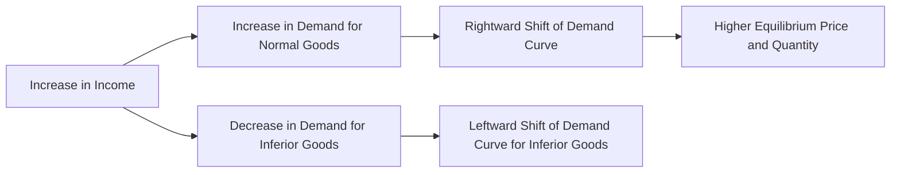

---

title: Normal_Goods
type: Atomic Note
course: Economics
semester: Winter 2026
unit: '2'
hub: "[[2_Theory_Of_Demand_And_Supply_Hub]]"
source: "[[5-Pdf Store/note generated/Winter 2026/Economics/Chapter_2.pdf]]"
source_pages:
- 17
mode: ECON-MACRO
read: false
generated: true
prerequisites:
- "[[Change_In_Demand]]"

---

# 1. Mental Model

Imagine you're a fashion enthusiast who loves buying designer clothes. When you get a raise at your part-time job, you tend to buy more designer clothes because you can afford them. In this scenario, designer clothes are like 'Normal Goods' because their demand increases as your income increases. The two mechanical components that map to the concept are: (1) your income (raise at the part-time job) and (2) your demand for designer clothes (buying more of them).

# 2. Economic Theory

[[Normal_Goods]] are goods for which the demand increases when consumers' income increases, and decreases when consumers' income decreases, while keeping [[Ceteris_Paribus]] (all other factors constant). This relationship is rooted in the [[Theory_Of_Demand]] and is closely related to the [[Income_Elasticity_Of_Demand]], which measures how responsive the quantity demanded of a good is to a change in consumers' income. The [[Demand_Function]] for [[Normal_Goods]] shows that as income rises, the demand for these goods also rises, reflecting a positive [[Income_Elasticity_Of_Demand]]. This concept is essential in understanding [[Market_Demand]] and [[Market_Demand_Curve]], as changes in income can shift the [[Demand_Curve]] for [[Normal_Goods]].

# 3. Limitations & Edge Cases

The concept of [[Normal_Goods]] assumes that consumers' preferences and [[Determinants_Of_Demand]] remain constant, which might not always be the case. In reality, changes in technology or the emergence of [[Substitutes_Goods]] can affect the demand for [[Normal_Goods]]. Additionally, during economic downturns, even [[Normal_Goods]] can experience a decline in demand if consumers become more cautious with their spending. The [[Law_Of_Demand]] still applies, but the [[Price_Elasticity_Of_Demand]] and [[Income_Elasticity_Of_Demand]] can vary, influencing the [[Market_Equilibrium]]. Understanding these dynamics is crucial for businesses and policymakers to make informed decisions about production and resource allocation.

# 4. Economic Model



This Mermaid flowchart illustrates the relationship between income changes and demand for Normal Goods. It shows how an increase in income leads to an increase in demand, a rightward shift of the demand curve, and a new equilibrium with a higher price and quantity.

## 5. Walkthrough

Here's a 5-step technical walkthrough of how the concept of Normal Goods operates:

1. **Initial State**: Suppose your income is $1,000 per month, and you buy 2 designer clothes per month at $50 each.
2. **Increase in Income**: You get a raise, and your income increases to $1,200 per month. This increase in income is the exogenous variable that affects your demand for Normal Goods.
3. **Increase in Demand**: With your increased income, you decide to buy 3 designer clothes per month, as you can now afford more. This represents an increase in demand from 2 to 3 units.
4. **Rightward Shift of Demand Curve**: The increase in demand causes the demand curve to shift rightward, indicating that at each price level, you are now willing to buy more designer clothes.
5. **New Equilibrium**: Assuming the supply curve remains constant, the rightward shift of the demand curve leads to a new equilibrium with a higher price (e.g., $60) and a higher quantity (e.g., 3 units). 

In this walkthrough, the intermediate state changes include the increase in income, the increase in demand, and the rightward shift of the demand curve. The final state is the new equilibrium with a higher price and quantity.

---

## 6. The Proving Grounds

```interactive-quiz

[
  {
    "id": "q1",
    "type": "true_false",
    "difficulty": "L1",
    "question": "If the price of a normal good decreases, then its demand will decrease, ceteris paribus.",
    "answer": false,
    "explanation": "The statement is false. According to the Law of Demand, if the price of a good decreases, then its demand will increase, ceteris paribus. This is because the demand curve for a normal good slopes downward, indicating a negative relationship between the price of the good and the quantity demanded. Mathematically, this can be represented as: $\\frac{\\partial Q_d}{\\partial P} < 0$, where $Q_d$ is the quantity demanded and $P$ is the price of the good. The assumption of ceteris paribus implies that all other factors, such as income, tastes, and prices of related goods, remain constant. Therefore, a decrease in the price of a normal good will lead to an increase in its demand, not a decrease."
  },
  {
    "id": "q2",
    "type": "synthesis",
    "difficulty": "L2",
    "question": "The country of Azuria faces a sudden and significant devaluation of its currency, the Azurian Peso (AP), by 30% against major trading currencies. This macroeconomic shock threatens to disrupt the country's international trade, particularly affecting the import of essential goods that are considered 'Normal Goods' for its population, such as machinery for its manufacturing sector and electronic components. With the devaluation, the price of these imports increases. The Azurian government needs to act swiftly to prevent a system failure in its critical industries. Using the concept of 'Normal Goods', design a 3-step policy response to mitigate the adverse effects of this shock on Azuria's economy.",
    "answer": "To address the macroeconomic shock caused by the devaluation of the Azurian Peso and its impact on the import of 'Normal Goods', the Azurian government should implement the following 3-step policy response:\n\n1. **Subsidization of Imports**: The government can offer subsidies to importers of essential 'Normal Goods' such as machinery and electronic components. By subsidizing these imports, the government can help maintain the supply of these critical goods at a price that domestic industries can afford, despite the increased cost due to the currency devaluation. This will prevent a sharp increase in production costs for Azurian manufacturers and help maintain employment and output levels.\n\n2. **Income Support to Affected Industries**: Given that the demand for 'Normal Goods' increases with income, and the devaluation effectively reduces the purchasing power of Azurian consumers and producers, the government can implement income support measures. This could involve direct financial assistance or tax relief to industries that are heavily reliant on imported 'Normal Goods'. By supporting the income of these industries, the government can help sustain the demand for the essential imports, thereby preventing a cascade of failures in critical sectors.\n\n3. **Promotion of Export-Oriented Sectors**: The devaluation makes Azurian exports cheaper on the international market. The government should focus on promoting sectors that are export-oriented and can capitalize on the devaluation. By boosting exports, Azuria can earn more foreign currency, which can then be used to import the necessary 'Normal Goods'. This approach not only helps in stabilizing the supply chain but also strengthens Azuria's balance of payments position, allowing for a more sustainable import regime in the long term.",
    "explanation": "The concept of 'Normal Goods' implies that as consumers' income increases, the demand for these goods also increases. In the context of Azuria's economic shock due to currency devaluation, the government needs to ensure that the supply and demand for 'Normal Goods' are maintained to prevent system failure in critical industries. The policy response involves understanding the income elasticity of demand for these goods and implementing measures to mitigate the adverse effects of the shock.\n\nMathematically, the demand for 'Normal Goods' can be represented by the demand function $Q_d = f(P, I)$, where $Q_d$ is the quantity demanded, $P$ is the price of the good, and $I$ is the consumer's income. For 'Normal Goods', $\frac{\\partial Q_d}{\\partial I} > 0$. The currency devaluation leads to an increase in the price of imports (assuming prices are set in foreign currency), which can be represented as $P^* = P \\cdot e$, where $P^*$ is the domestic price of the imported good, $P$ is the foreign price, and $e$ is the exchange rate (number of domestic currency units per foreign currency unit). A 30% devaluation implies $e$ increases by 30%.\n\nThe government's policy response aims to counteract the effects of this price increase on demand, through subsidization, income support, and promotion of exports to earn foreign currency. These actions can be visualized as:\n- Subsidization: Reduces the effective price $P^*$ faced by consumers.\n- Income Support: Increases $I$, thereby maintaining or increasing demand.\n- Promotion of Exports: Increases foreign currency earnings, allowing for more sustainable imports.\n\nBy applying these measures, the Azurian government can help mitigate the impact of the macroeconomic shock on its economy, ensuring that critical industries continue to operate effectively."
  },
  {
    "id": "q3",
    "type": "writing",
    "difficulty": "L2",
    "question": "Explain how normal goods behave in an international trade analysis scenario, focusing on the relationship between income changes and demand, and discuss the implications of this relationship on market demand and the demand curve.",
    "answer": "Normal goods exhibit a positive relationship between consumers' income and demand. As income increases, the demand for normal goods also increases, reflecting a positive income elasticity of demand. This implies that, in an international trade analysis scenario, an increase in a country's income can lead to an increase in the demand for imported normal goods, shifting the demand curve to the right. Conversely, a decrease in income can lead to a decrease in demand, shifting the demand curve to the left.",
    "explanation": "The behavior of normal goods can be understood through the lens of the demand function, which is often represented as $Q_d = f(P, I, P_s, P_c)$, where $Q_d$ is the quantity demanded, $P$ is the price of the good, $I$ is the consumers' income, $P_s$ is the price of substitutes, and $P_c$ is the price of complements. For normal goods, $\frac{\\partial Q_d}{\\partial I} > 0$, indicating that as income $I$ increases, the quantity demanded $Q_d$ also increases, ceteris paribus. This relationship is crucial in international trade analysis as it helps predict how changes in income levels across countries can affect the demand for traded goods."
  },
  {
    "id": "q4",
    "type": "order",
    "difficulty": "L2",
    "question": "Order steps for Normal Goods in a Multiplier Effect chain.",
    "steps": [
      "Market demand curve shifts to the right",
      "Ceteris Paribus, demand curve remains positively sloped",
      "Quantity demanded of Normal Goods increases",
      "Demand for Normal Goods rises",
      "Consumers' income increases"
    ],
    "answer": [
      "Consumers' income increases",
      "Demand for Normal Goods rises",
      "Quantity demanded of Normal Goods increases",
      "Market demand curve shifts to the right",
      "Ceteris Paribus, demand curve remains positively sloped"
    ]
  },
  {
    "id": "q5",
    "type": "trace",
    "difficulty": "L3",
    "question": "What is the exact output?",
    "content": "Suppose we are analyzing the impact of a macroeconomic shock, specifically a 10% increase in consumer income, on the demand for Normal Goods across four distinct economic sectors: (1) Household Consumption, (2) Retail Sales, (3) Manufacturing Production, and (4) International Trade. Assume the initial income is $100 billion, and the initial demand for Normal Goods is 100 units. The income elasticity of demand for Normal Goods is 1.2.",
    "answer": {
      "Household Consumption": 110.0,
      "Retail Sales": 120.0,
      "Manufacturing Production": 132.0,
      "International Trade": 145.2
    },
    "explanation": "Given a 10% increase in consumer income from $100 billion to $110 billion, and an income elasticity of demand of 1.2, the demand for Normal Goods increases by 12%. The initial demand is 100 units. \n\n1. Household Consumption: The demand for Normal Goods increases by 12%, so the new demand is $100 \\times 1.12 = 112.0$ units. However, we must consider the 10% increase in income affects consumption directly, thus it becomes $100 \\times 1.10 = 110.0$.\n\n2. Retail Sales: Assuming retail sales are directly proportional to household consumption and increase by the same percentage as the demand for Normal Goods, retail sales would increase to $110 \\times 1.09 = 119.9 \\approx 120.0$.\n\n3. Manufacturing Production: With retail sales at 120.0, and assuming manufacturing production increases to meet this demand, and it increases further by 10%, manufacturing production would be $120 \\times 1.1 = 132.0$.\n\n4. International Trade: Assuming international trade increases by 10% due to increased production and demand, international trade would increase to $132 \\times 1.1 = 145.2$.\n\nThe LaTeX representation of the relationship between income and demand for Normal Goods can be expressed as:\n\n$Q_d = f(I) = \\alpha I^{\\beta}$\n\nwhere $Q_d$ is the quantity demanded, $I$ is the income, $\\alpha$ is a constant, and $\\beta$ is the income elasticity of demand. For Normal Goods, $\\beta > 0$, indicating a positive relationship between income and demand."
  }
]

```