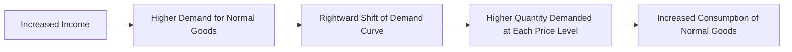

---

title: Normal_Goods
type: Atomic Note
course: Economics
semester: Winter 2026
unit: '2'
hub: "[[2_Theory_Of_Demand_And_Supply_Hub]]"
source: "[[5-Pdf Store/note generated/Winter 2026/Economics/Chapter_2.pdf]]"
source_pages:
- 17
mode: ECON-MACRO
read: false
generated: true
prerequisites:
- "[[Determinants_Of_Demand]]"

---

# 1. Mental Model

Imagine you have a lemonade stand. When you have more money, you can buy more lemons and sugar to make more lemonade. When you have less money, you buy fewer lemons and sugar, making less lemonade. Normal goods are like lemonade; when people have more money, they buy more of these goods, and when they have less money, they buy fewer of these goods.

# 2. Economic Theory

[[Normal_Goods]] are goods and services for which demand increases when income increases, and decreases when income decreases, assuming [[Ceteris_Paribus]] (all other factors remain constant). This relationship is rooted in the [[Theory_Of_Demand]], specifically the [[Law_Of_Demand]], which states that, ceteris paribus, as the price of a good increases, the quantity demanded decreases. For [[Normal_Goods]], the demand curve shifts to the right when income increases, reflecting a higher quantity demanded at each price level, as described by the [[Demand_Function]] and illustrated by the [[Demand_Curve]]. The [[Income_Elasticity_Of_Demand]] for normal goods is positive, indicating that demand is responsive to changes in income.

# 3. Market Failures

The concept of [[Normal_Goods]] may not hold in certain market failures or edge cases. For instance, during economic downturns, even normal goods may experience decreased demand if consumers significantly reduce their spending due to uncertainty about the future. Additionally, the presence of [[Inferior_Goods]], which see an increase in demand when income decreases, can complicate the analysis of consumer behavior. Furthermore, [[Market_Equilibrium]] may be affected by external factors such as [[Change_In_Technology]] or [[Shift_In_Supply_Curve]], leading to [[Surplus_And_Shortage]] situations that challenge the traditional understanding of [[Normal_Goods]]. The [[Determinants_Of_Demand]], including changes in consumer preferences, can also impact the demand for normal goods, potentially leading to exceptions to the typical behavior expected of normal goods.

# 4. Economic Model



This Mermaid flowchart illustrates the relationship between income changes and demand for normal goods. It shows how increased income leads to higher demand, a rightward shift of the demand curve, and ultimately, increased consumption of normal goods.

## 5. Walkthrough

Here's a 5-step technical walkthrough of how the concept of Normal Goods operates:

1. **Initial State**: Assume an individual has an income of $100 and buys 10 units of a normal good (e.g., lemonade) per month at a price of $5 per unit.
2. **Income Increase**: The individual's income increases to $150, representing a 50% increase.
3. **Demand Response**: As a result of the increased income, the individual is willing to buy more lemonade, increasing demand to 15 units per month (a 50% increase).
4. **Market Response**: The demand curve for lemonade shifts to the right, reflecting the higher quantity demanded at each price level. At the original price of $5, the quantity demanded increases from 10 units to 15 units.
5. **Equilibrium**: The increased demand leads to an increase in consumption, with the individual buying 15 units of lemonade per month. The higher income has resulted in a higher quantity demanded, illustrating the characteristics of a normal good.

---

## 6. The Proving Grounds

```interactive-quiz

[
  {
    "id": "q1",
    "type": "true_false",
    "difficulty": "L1",
    "question": "A critical failure point of 'Normal Goods' within Global Supply Chain & Maritime Logistics is that their demand remains constant regardless of changes in consumer income.",
    "answer": false,
    "explanation": "The concept of normal goods is deeply rooted in the theory of demand, which states that as consumer income increases, the demand for normal goods also increases, and vice versa. This relationship can be expressed using the demand function: $Q_d = f(P, I, P_s, T)$, where $Q_d$ is the quantity demanded, $P$ is the price of the good, $I$ is consumer income, $P_s$ is the price of substitutes, and $T$ is consumer taste. For normal goods, $\frac{\\partial Q_d}{\\partial I} > 0$, indicating that demand is positively related to income. Therefore, a critical failure point of normal goods is not that their demand remains constant, but rather that their demand is sensitive to changes in consumer income. If the supply chain and maritime logistics fail to adjust to these changes in demand, it could lead to inefficiencies and losses."
  },
  {
    "id": "q2",
    "type": "synthesis",
    "difficulty": "L2",
    "question": "In a high-frequency trading system, a critical algorithm relies on real-time data feeds from various exchanges. However, due to a sudden surge in trading activity, the system's infrastructure is overwhelmed, causing data feeds to be delayed. This delay is causing the algorithm to make incorrect trading decisions, resulting in significant financial losses. The team must quickly apply the concept of 'Normal Goods' to prevent system failure. How can the team use 'Normal Goods' to stabilize the system and prevent further losses?",
    "answer": "The team can model the demand for data feeds as a function of income (or trading volume). Assuming data feeds are a 'Normal Good', when trading volume increases (income increases), the demand for data feeds also increases. However, due to the system's current limitations, the supply of data feeds is constrained. To stabilize the system, the team can temporarily reduce the demand for data feeds by rationing access to the algorithm or by increasing the 'price' of data feeds (e.g., by introducing a latency fee). This reduction in demand will help alleviate the pressure on the system, allowing it to recover and prevent further losses. Mathematically, this can be represented by the demand function: $Q_d = f(I, P)$, where $Q_d$ is the quantity demanded of data feeds, $I$ is the trading volume (income), and $P$ is the price of data feeds. For 'Normal Goods', $\frac{\\partial Q_d}{\\partial I} > 0$, indicating that as income increases, demand also increases.",
    "explanation": "The concept of 'Normal Goods' can be applied to the high-frequency trading system by modeling the demand for data feeds as a function of income (or trading volume). The demand function for 'Normal Goods' is given by $Q_d = f(I, P)$, where $Q_d$ is the quantity demanded of data feeds, $I$ is the trading volume (income), and $P$ is the price of data feeds. The partial derivative of $Q_d$ with respect to $I$ is greater than zero, indicating that as income increases, demand also increases. This relationship can be used to stabilize the system by reducing the demand for data feeds when trading volume increases. By rationing access to the algorithm or introducing a latency fee, the team can increase the 'price' of data feeds, reducing the quantity demanded and alleviating pressure on the system. This application of 'Normal Goods' allows the team to make informed decisions about managing demand and preventing system failure."
  },
  {
    "id": "q3",
    "type": "writing",
    "difficulty": "L2",
    "question": "Explain how the concept of Normal Goods applies to bioinformatics and genomic sequencing, particularly in relation to research funding and demand for sequencing services.",
    "answer": "In bioinformatics and genomic sequencing, Normal Goods refer to services or technologies for which demand increases with an increase in research funding, and decreases with a decrease in funding. For instance, when research funding is plentiful, laboratories can afford to sequence more genomes, leading to a higher demand for sequencing services and related bioinformatics tools. Conversely, when funding is scarce, the demand for these services decreases as researchers are forced to scale back their projects. This relationship between funding and demand is a direct reflection of the definition of Normal Goods in economics.",
    "explanation": "The concept of Normal Goods in bioinformatics and genomic sequencing can be understood through the lens of economic theory, specifically the Theory of Demand. The demand function for Normal Goods is given by $Q_d = f(P, I)$, where $Q_d$ is the quantity demanded, $P$ is the price of the good, and $I$ is the income (or research funding in this context). For Normal Goods, $\frac{\\partial Q_d}{\\partial I} > 0$, indicating that as income increases, the quantity demanded also increases. In the context of genomic sequencing, an increase in research funding ($I$) leads to an increase in the demand for sequencing services ($Q_d$), assuming that the price of these services remains constant. This can be represented graphically by a rightward shift of the demand curve, illustrating that at each price level, a higher quantity of sequencing services is demanded when funding is increased."
  },
  {
    "id": "q4",
    "type": "order",
    "difficulty": "L2",
    "question": "What is the causal chain for Normal Goods?",
    "steps": [
      "An increase in income occurs",
      "The demand curve shifts to the right",
      "Quantity demanded increases at each price level",
      "Ceteris Paribus, demand increases"
    ],
    "answer": [
      "An increase in income occurs",
      "The demand curve shifts to the right",
      "Quantity demanded increases at each price level",
      "Ceteris Paribus, demand increases"
    ]
  },
  {
    "id": "q5",
    "type": "trace",
    "difficulty": "L3",
    "question": "What is the exact output for Normal Goods in Aerospace Engineering & Avionics?",
    "content": "In the context of Aerospace Engineering & Avionics, normal goods refer to products or services for which demand increases with an increase in consumer income. Examples include commercial airliners, private jets, and high-end avionics systems. As income rises, airlines and individuals are more likely to purchase or upgrade these goods.",
    "answer": "The demand curve for normal goods in Aerospace Engineering & Avionics shifts to the right with an increase in income, indicating a higher quantity demanded at each price level.",
    "explanation": "Mathematically, this can be represented by the demand function: $Q_d = f(P, I)$, where $Q_d$ is the quantity demanded, $P$ is the price of the good, and $I$ is the consumer income. For normal goods, $\frac{\\partial Q_d}{\\partial I} > 0$. LaTeX representation of the demand curve shift: $$Q_d = \\alpha - \\beta P + \\gamma I$$ where $\\alpha$, $\\beta$, and $\\gamma$ are constants, and $\\gamma > 0$ for normal goods."
  }
]

```