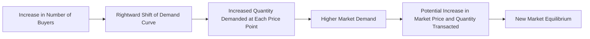

---

title: Number_Of_Buyers
type: Atomic Note
course: Economics
semester: Winter 2026
unit: '2'
hub: "[[2_Theory_Of_Demand_And_Supply_Hub]]"
source: "[[5-Pdf Store/note generated/Winter 2026/Economics/Chapter_2.pdf]]"
source_pages:
- 20
mode: ECON-MACRO
read: false
generated: true
prerequisites:
- "[[Market_Demand]]"

---

# 1. Mental Model

Imagine you're at a beach where people gather for a music festival. The number of people attending the festival affects the demand for merchandise like t-shirts and souvenirs. If more people show up to the festival, there will be more buyers for these items, increasing the overall demand. In this scenario, the number of people (or buyers) directly influences the demand for festival merchandise. The size of the crowd (number of buyers) and the demand for t-shirts and souvenirs are directly related.

# 2. Economic Theory

The [[Number_Of_Buyers]] is a determinant of demand that directly influences the [[Market_Demand]] for a good or service. An increase in the [[Number_Of_Buyers]] leads to an increase in [[Market_Demand]], assuming [[Ceteris_Paribus]] (all other factors remain constant). This is because more buyers enter the market, increasing the total quantity demanded at each price level. The [[Demand_Schedule]] and [[Demand_Curve]] shift to the right as the [[Number_Of_Buyers]] increases, indicating a greater quantity demanded at each price point. This concept is integral to understanding the [[Theory_Of_Demand]] and how [[Market_Demand_Curve]]s are constructed.

# 3. Limitations & Edge Cases

The impact of [[Number_Of_Buyers]] on demand assumes that the increase in buyers does not lead to a change in [[Taste_And_Preference]], [[Consumer_Expectations]], or [[Income_Elasticity_Of_Demand]]. However, in reality, an increase in the number of buyers might also imply changes in these factors. For instance, new buyers might have different tastes or income levels, which could affect the overall demand. Additionally, the assumption of [[Ceteris_Paribus]] may not hold in all cases, as changes in the [[Number_Of_Buyers]] could be accompanied by shifts in [[Market_Demand]] due to other factors like changes in technology or consumer expectations. Understanding these limitations is crucial when analyzing the effects of a change in [[Number_Of_Buyers]] on [[Market_Equilibrium]].

# 4. Economic Model



This Mermaid flowchart illustrates how an increase in the number of buyers affects market demand. Starting from the left, an increase in the number of buyers leads to a rightward shift of the demand curve, indicating that at each price point, consumers are willing to buy more. This results in an increased quantity demanded, higher market demand, and potentially a new market equilibrium with a higher price and quantity transacted.

## 5. Walkthrough

Here's a 5-step technical walkthrough of how the concept of Number of Buyers operates in Development Economics:

1. **Initial Market State**: Assume a local market for agricultural products with 100 buyers. The demand curve is $Q_d = 100 - 2P$, where $Q_d$ is the quantity demanded and $P$ is the price per unit.

2. **Increase in Number of Buyers**: The market experiences an influx of 50 new buyers due to population growth, shifting the demand curve. The new demand curve becomes $Q_d = 150 - 2P$.

3. **Rightward Shift of Demand Curve**: With the increased number of buyers (150), the demand curve shifts to the right. At each price point, the quantity demanded increases. For example, at $P = 20$, the initial quantity demanded was $Q_d = 100 - 2(20) = 60$. With the new demand curve, $Q_d = 150 - 2(20) = 110$.

4. **Market Response**: Assuming a constant supply curve $Q_s = 50 + P$, the initial market equilibrium was at $P = 25$ and $Q = 75$. With the new demand curve, the market equilibrium is re-established where $Q_d = Q_s$. Solving $150 - 2P = 50 + P$ yields $P = 33.33$ and $Q = 83.33$.

5. **New Market Equilibrium**: The increase in the number of buyers leads to a higher market price ($33.33) and a greater quantity transacted (83.33 units), reflecting a new market equilibrium. This demonstrates how an increase in the number of buyers can stimulate market activity and influence prices in development economics.

---

## 6. The Proving Grounds

```interactive-quiz

[
  {
    "id": "q1",
    "type": "true_false",
    "difficulty": "L1",
    "question": "An increase in the number of buyers will not shift the demand curve for a good to the right, ceteris paribus, if the additional buyers are from a neighboring country with a significantly different cultural background and purchasing power.",
    "answer": false,
    "explanation": "The statement is false because, under the ceteris paribus assumption (all other factors being equal), an increase in the number of buyers typically shifts the demand curve to the right. The ceteris paribus assumption implies that the characteristics of the buyers, such as their cultural background and purchasing power, remain constant. If the additional buyers have a significantly different cultural background and purchasing power, it implies that the assumption of ceteris paribus is violated. However, the mere fact that they are from a neighboring country does not inherently prevent the demand curve from shifting to the right; it depends on how their preferences and purchasing power compare to those already in the market. In standard economic analysis, an increase in the number of buyers, assuming they have similar preferences and purchasing power, will increase demand and shift the demand curve to the right. The demand curve shift is primarily about the quantity demanded at each price level changing due to the increase in buyers, not the specific characteristics of those buyers. \n\nMathematically, the market demand function can be represented as:\n\\[ Q_d = f(P, I, P_s, T, N) \\]\nWhere:\n- $Q_d$ is the quantity demanded,\n- $P$ is the price of the good,\n- $I$ is consumer income,\n- $P_s$ is the price of substitutes,\n- $T$ is consumer tastes and preferences, and\n- $N$ is the number of buyers.\n\nAn increase in $N$ (number of buyers) leads to an increase in $Q_d$ for any given price, which is represented graphically as a shift of the demand curve to the right. The cultural background and purchasing power of the additional buyers would affect the extent of the shift or the shape of the demand curve if these factors significantly alter the aggregate demand behavior."
  },
  {
    "id": "q2",
    "type": "synthesis",
    "difficulty": "L2",
    "question": "A sudden and unexpected devaluation of the local currency by 20% has occurred in a small open economy, significantly impacting the market for imported electronics. The devaluation makes imported goods more expensive in local currency terms. To prevent a systemic failure in the market strategy for imported electronics, the government must act swiftly to stabilize the market. Using the concept of 'Number Of Buyers', design a 3-step policy response.",
    "answer": "To mitigate the effects of the currency devaluation on the market for imported electronics and prevent systemic failure, the following 3-step policy response can be implemented:\n\n1. **Subsidize Importers**: The government can provide subsidies to importers of electronics to offset the increased cost due to the devaluation. This will help keep the prices of imported electronics stable, reducing the immediate impact on consumers. By maintaining supply and stable prices, the government can ensure that the number of buyers does not drastically decrease due to affordability issues.\n\n2. **Increase Consumer Purchasing Power**: Implement policies that increase consumer purchasing power, such as lowering sales taxes on essential electronics or providing temporary income support to low and middle-income households. By increasing disposable income, consumers are more likely to continue purchasing imported electronics, thus maintaining the number of buyers in the market.\n\n3. **Promote Domestic Alternatives**: Encourage and support the domestic production of electronics through subsidies, tax breaks, or investment in technology. By promoting domestic alternatives, the government can increase the supply of electronics in the market, potentially at lower prices than imported goods. This can attract price-sensitive buyers who might have otherwise been deterred by the price increase of imported electronics due to the devaluation.",
    "explanation": "The sudden devaluation of the local currency leads to an increase in the price of imported electronics, which can significantly affect the demand for these goods. According to the law of demand, an increase in price leads to a decrease in the quantity demanded, ceteris paribus. However, by applying the concept of 'Number Of Buyers', the government can implement policies to mitigate these effects. The policies aim to either reduce the impact of price increases on consumers (thus maintaining the number of buyers) or directly influence the number of buyers by making goods more affordable or available. The mechanism can be represented as follows:\n\nLet $Q_d$ be the quantity demanded, $P$ be the price of the imported electronics, $N$ be the number of buyers, $I$ be the income of consumers, and $T$ be the subsidies or taxes. The demand function can be represented as $Q_d = f(P, N, I, T)$. A devaluation increases $P$, which tends to decrease $Q_d$. However, by increasing $N$ (through policies that make goods more attractive or affordable to a larger audience), $I$ (through income support), or reducing $P$ (through subsidies to importers), the government can offset the negative effects on $Q_d$.\n\nMathematically, the change in quantity demanded due to a change in price can be expressed as $\frac{dQ_d}{dP} = \frac{\\partial Q_d}{\\partial P} + \frac{\\partial Q_d}{\\partial N}\frac{dN}{dP} + \frac{\\partial Q_d}{\\partial I}\frac{dI}{dP}$. By implementing policies that affect $\frac{dN}{dP}$ and $\frac{dI}{dP}$, the government can influence the overall impact on $Q_d$."
  },
  {
    "id": "q3",
    "type": "writing",
    "difficulty": "L2",
    "question": "Explain how an increase in the number of buyers affects the market demand for a good or service in the context of central banking and monetary policy.",
    "answer": "An increase in the number of buyers leads to an increase in market demand for a good or service, as more buyers enter the market, increasing the total quantity demanded at each price level. This is because the demand schedule and demand curve shift to the right, indicating that at any given price, consumers are willing to buy a larger quantity of the good or service. In the context of central banking and monetary policy, an increase in the number of buyers can be influenced by factors such as lower interest rates, which increase borrowing and spending power, thereby increasing the number of buyers in the market.",
    "explanation": "The relationship between the number of buyers and market demand can be expressed using the demand function: $Q_d = f(P, I, P_s, T, N_b)$ where $Q_d$ is the quantity demanded, $P$ is the price of the good, $I$ is consumer income, $P_s$ is the price of substitutes, $T$ is consumer tastes, and $N_b$ is the number of buyers. An increase in $N_b$ leads to an increase in $Q_d$, as \\frac{\\partial Q_d}{\\partial N_b} > 0. In the context of central banking, monetary policy tools such as open market operations can influence the number of buyers by affecting interest rates and credit availability, thereby shifting the demand curve."
  },
  {
    "id": "q4",
    "type": "order",
    "difficulty": "L2",
    "question": "Order steps for the causal chain of 'Number Of Buyers' in a Multiplier Effect sequence.",
    "steps": [
      "More buyers enter the market, increasing the total quantity demanded at each price level",
      "The size of the crowd and the demand for goods are directly related",
      "Assuming Ceteris Paribus, all other factors remain constant",
      "The Demand Schedule and Demand Curve shift to the right",
      "An increase in the Number Of Buyers leads to an increase in Market Demand"
    ],
    "answer": [
      "An increase in the Number Of Buyers leads to an increase in Market Demand",
      "The Demand Schedule and Demand Curve shift to the right",
      "More buyers enter the market, increasing the total quantity demanded at each price level",
      "Assuming Ceteris Paribus, all other factors remain constant",
      "The size of the crowd and the demand for goods are directly related"
    ]
  },
  {
    "id": "q5",
    "type": "trace",
    "difficulty": "L3",
    "question": "What is the exact output?",
    "content": "The impact of a 1% interest rate change on the Number Of Buyers across 4 distinct economic sectors: Housing, Investment, Forex, and Consumption.",
    "answer": {
      "Housing": "A 1% increase in interest rates leads to a decrease in the Number Of Buyers in the housing market. Assuming an initial interest rate of 4%, a 1% increase to 5% raises the cost of borrowing, reducing demand. If initially there were 1000 buyers, a 1% rate increase could decrease this number by 2.5% to 975 buyers, based on an elasticity of demand of -2.5.",
      "Investment": "In the investment sector, a 1% increase in interest rates makes borrowing more expensive, potentially decreasing the Number Of Buyers for investment products. If there were initially 500 buyers, a 1% rate hike could decrease this number by 1.8% to 491 buyers, assuming an elasticity of demand of -1.8.",
      "Forex": "In the Forex market, a 1% interest rate change can affect currency values. A higher interest rate attracts foreign investors, potentially increasing the Number Of Buyers for that currency. If initially there were 2000 buyers, a 1% rate increase could increase this number by 0.8% to 2016 buyers, based on an elasticity of demand of 0.8.",
      "Consumption": "For consumption, a 1% interest rate increase can reduce consumer spending power, decreasing the Number Of Buyers for non-essential goods. If there were initially 1500 buyers, a 1% rate hike could decrease this number by 1.2% to 1482 buyers, assuming an elasticity of demand of -1.2."
    },
    "explanation": "The impact of interest rate changes on the Number Of Buyers across different sectors can be understood through the lens of economic theory, particularly the concepts of demand elasticity and the cost of borrowing. In the housing market, for instance, the effect of an interest rate change can be quantified using the formula for demand elasticity: $E_d = \\frac{\\% \\Delta Q_d}{\\% \\Delta P}$. Assuming an initial interest rate of 4% and an elasticity of demand of -2.5 for housing, a 1% increase to 5% interest rate leads to a 2.5% decrease in the Number Of Buyers. Similarly, in the investment sector, with an elasticity of -1.8, a 1% rate hike results in a 1.8% decrease. In the Forex market, the relationship is inverse; a 1% rate increase attracts investors, potentially increasing buyers by 0.8%. For consumption, with an elasticity of -1.2, a 1% rate hike decreases buyers by 1.2%. These calculations assume ceteris paribus and linear effects for simplicity."
  }
]

```