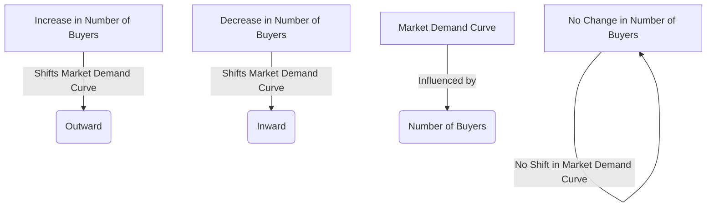

---

title: Number_Of_Buyers
course: "Economics"
unit: '2'
semester: "Winter 2026"
mode: ECON-MICRO
type: atomic_note
hub: "[[2_Theory_Of_Demand_And_Supply_Hub]]"
source: "[[5-Pdf Store/note generated/Winter 2026/Economics/Chapter_2.pdf]]"
date: '2026-05-08'
prerequisites:
- "[[Market_Demand]]"
source_pages:
- 20
generated: true

---

## 1. Mental Model

Imagine you're selling lemonade at a school fair. If only a few kids from your class come to buy lemonade, you might sell 10 cups. But, if all 5 classes in your school come to buy lemonade, you'll sell 50 cups! That's because more people are buying from you. In economics, this is like what happens when t

## 2. Micro Theory

The concept of 'Number Of Buyers' is a crucial determinant of market demand, which can be defined as the total number of individuals or entities willing and able to purchase a particular good or service at a given price level. From a microeconomic perspective, the number of buyers is a key factor that influences the demand for a product, as it directly affects the overall market demand.

The [[Market_Demand]] curve, which represents the total demand for a product in a market, is essentially the horizontal summation of individual [[Demand_Curve]]s. An increase in the [[Number_Of_Buyers]] leads to an outward shift in the market demand curve, indicating that at each price level, a larger quantity of the good or service is demanded. Conversely, a decrease in the number of buyers results in an inward shift of the market demand curve, signifying that at each price level, a smaller quantity of the good or service is demanded.

The relationship between the number of buyers and market demand can be understood through the [[Demand_Function]], which represents the quantity demanded of a good or service as a function of its price, among other factors. The demand function can be expressed as Qd = f(P, Y, T, P_s, P_c, N), where Qd is the quantity demanded, P is the price of the good, Y is the consumer's income, T is the [[Taste_And_Preference]] of consumers, P_s and P_c are the prices of substitutes and complements, respectively, and N is the [[Number_Of_Buyers]]. An increase in N, ceteris paribus, or [[Ceteris_Paribus]], leads to an increase in the quantity demanded.

The impact of a change in the number of buyers on market demand can also be illustrated using the [[Demand_Schedule]], which shows the quantity demanded of a good or service at different price levels. An increase in the number of buyers will lead to an increase in the quantity demanded at each price level, resulting in a new demand schedule. This, in turn, affects the [[Market_Equilibrium]], as the increased demand may lead to a higher equilibrium price and quantity.

The [[Law_Of_Demand]] states that, ceteris paribus, an increase in the price of a good or service leads to a decrease in the quantity demanded. However, when the number of buyers increases, the demand curve shifts outward, and the quantity demanded increases at each price level. This highlights the importance of considering the [[Determinants_Of_Demand]], including the number of buyers, in analyzing market demand.

The [[Price_Elasticity_Of_Demand]] and [[Income_Elasticity_Of_Demand]] can also be influenced by a change in the number of buyers. For instance, if the number of buyers increases, the market demand becomes more elastic, as a given price change leads to a larger change in the quantity demanded.

In conclusion, the number of buyers plays a vital role in determining market demand. A change in the number of buyers leads to a shift in the market demand curve, affecting the equilibrium price and quantity. Understanding the impact of the number of buyers on market demand is essential in analyzing the [[Effects_Of_Shift_In_Demand_And_Supply]] and making informed decisions in the field of microeconomics, particularly in the context of [[Theory_Of_Demand]].

## 3. Limitations & Edge Cases

The 'Number of Buyers' concept assumes that each additional buyer has a positive demand for the good or service, and that their demand is not offset by an equal decrease in demand from existing buyers; however, this may not hold in cases where new buyers enter the market with zero or negative demand, or where existing buyers decrease their consumption due to market saturation, changing consumer preferences, or external factors such as economic downturns.

## 4. Market Graph



The provided Mermaid flowchart illustrates the relationship between the number of buyers and the market demand curve, showing that an increase in the number of buyers shifts the market demand curve outward, while a decrease in the number of buyers shifts it inward. The number of buyers is a key determinant of market demand, and changes in the number of buyers can have a direct impact on the overall demand for a product.

## 5. Walkthrough

Here is the 5-step technical walkthrough of how 'Number Of Buyers' operates:

**Step 1: Define Market Demand**
Market demand is the horizontal sum of individual demand.

**Step 2: Establish Initial Condition**
Assume an initial market demand curve, which is the sum of individual demand curves.

**Step 3: Increase Number of Buyers**
An increase in the number of buyers occurs. According to the source text, this will increase demand.

**Step 4: Analyze Effect on Market Demand Curve**
As a result of the increase in the number of buyers, the market demand curve will shift outward. This means that at each price level, a larger quantity of the good or service is demanded.

**Step 5: Confirm Direction of Change**
Conversely, a decrease in the number of buyers will decrease demand, resulting in an inward shift of the market demand curve, signifying that at each price level, a smaller quantity of the good or service is demanded.

---

## Review & Practice

```interactive-quiz

[
  {
    "type": "mcq",
    "difficulty": "L1",
    "question": "What is the effect of an increase in the number of buyers on the market demand curve for a good or service?",
    "options": {
      "A": "Inward shift of the demand curve",
      "B": "Outward shift of the demand curve",
      "C": "Movement up along the demand curve",
      "D": "Movement down along the demand curve"
    },
    "answer": "B",
    "explanation": "An increase in the number of buyers leads to an outward shift in the market demand curve, indicating that at each price level, a larger quantity of the good or service is demanded. This can be represented as $Qd = f(P, Y, T, P_s, P_c, N)$, where an increase in $N$ (number of buyers) results in an increase in $Qd$ (quantity demanded), ceteris paribus."
  },
  {
    "type": "fill_in",
    "difficulty": "L2",
    "question": "Fill in the blank.",
    "textWithBlanks": "The Blank is a crucial determinant of market demand, which can be defined as the total number of individuals or entities willing and able to purchase a particular good or service at a given price level.",
    "answer": [
      "Number Of Buyers"
    ],
    "explanation": "The concept of 'Number Of Buyers' is a crucial determinant of market demand, which can be defined as the total number of individuals or entities willing and able to purchase a particular good or service at a given price level. From a microeconomic perspective, the number of buyers is a key factor that influences the demand for a product, as it directly affects the overall market demand. This relationship can be expressed using the demand function Qd = f(P, Y, T, P_s, P_c, N), where N represents the [[Number_Of_Buyers]]."
  },
  {
    "type": "debug",
    "difficulty": "L2",
    "question": "Find the bug in the formula for the demand function: Qd = f(P, Y, T, P_s, P_c) where Qd is the quantity demanded, P is the price of the good, Y is the consumer's income, T is the taste and preference of consumers, P_s and P_c are the prices of substitutes and complements, respectively.",
    "content": "The demand function is often expressed as Qd = f(P, Y, T, P_s, P_c, N) but in this case, the number of buyers (N) has been omitted.",
    "answer": "The number of buyers (N) is missing",
    "required_keywords": [
      "fix_this_keyword"
    ],
    "explanation": "The demand function should include the number of buyers (N) as one of its determinants. The correct demand function should be Qd = f(P, Y, T, P_s, P_c, N). The LaTeX representation of the demand function can be expressed as: $Q_d = f(P, Y, T, P_s, P_c, N)$. The number of buyers (N) is a crucial determinant of market demand, as it directly affects the overall market demand. By omitting N, the formula is misspecified."
  },
  {
    "type": "trace",
    "difficulty": "L2",
    "question": "What is the exact output of the change in the number of buyers on the market demand for a specific type of pollution permit in the Environmental Economics context of the European Union's Emissions Trading System (EU ETS)?",
    "content": "The European Union's Emissions Trading System (EU ETS) is a market-based mechanism designed to reduce greenhouse gas emissions from certain sectors. One of the key factors influencing the demand for pollution permits in the EU ETS is the number of buyers, which includes power plants, industrial processes, and airlines. An increase in the number of buyers in the EU ETS market for pollution permits would lead to an outward shift in the market demand curve for permits. This is because more entities are now willing and able to purchase permits at each price level, thus increasing the overall demand.",
    "answer": "An outward shift in the market demand curve for pollution permits",
    "explanation": "The impact of an increase in the number of buyers on the market demand curve for pollution permits in the EU ETS can be represented using the demand function: $Q_d = f(P, Y, T, P_s, P_c, N)$, where $Q_d$ is the quantity demanded of pollution permits, $P$ is the price of a permit, $Y$ is the income of the buyers (which could be influenced by the allowance price), $T$ represents tastes and preferences, $P_s$ and $P_c$ are the prices of substitutes and complements, respectively, and $N$ is the number of buyers. An increase in $N$, ceteris paribus, leads to an increase in $Q_d$. This can be expressed as $\frac{\\partial Q_d}{\\partial N} > 0$. Therefore, the demand curve shifts outward, indicating that at each price level, a larger quantity of pollution permits is demanded."
  }
]

```