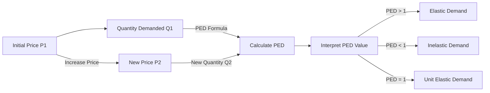

---

title: Price_Elasticity_Of_Demand
type: Atomic Note
course: Economics
semester: Winter 2026
unit: '2'
hub: "[[2_Theory_Of_Demand_And_Supply_Hub]]"
source: "[[5-Pdf Store/note generated/Winter 2026/Economics/Chapter_2.pdf]]"
source_pages:
- 24
mode: ECON-MACRO
read: false
generated: true
prerequisites:
- "[[Demand_Function]]"

---

# 1. Mental Model

Imagine you're a librarian in charge of ordering books for a school library. The number of books you order depends on the price of each book. If the books are very expensive, you might order fewer copies, but if they're cheaper, you might order more. This is similar to how the price of a product affects how much of it people want to buy. The price elasticity of demand measures how much the quantity demanded changes when the price changes.

# 2. Economic Theory

The [[Price_Elasticity_Of_Demand]] is a fundamental concept in economics that measures the responsiveness of the quantity demanded of a good to a change in its price, while holding all other factors constant, as per the [[Ceteris_Paribus]] assumption. It is calculated as the percentage change in quantity demanded divided by the percentage change in price, often represented by the formula: PED = (percentage change in quantity demanded) / (percentage change in price). This concept is closely related to the [[Law_Of_Demand]], which states that, ceteris paribus, an increase in the price of a good leads to a decrease in the quantity demanded. The [[Demand_Schedule]] and [[Demand_Curve]] graphically represent the relationship between the price of a good and the quantity demanded, which is a key component in understanding [[Price_Elasticity_Of_Demand]]. The [[Theory_Of_Demand]] provides the foundation for analyzing how consumers respond to changes in prices and other factors.

# 3. Limitations & Edge Cases

The [[Price_Elasticity_Of_Demand]] concept assumes that all other factors affecting demand remain constant, as per [[Ceteris_Paribus]]. However, in reality, factors such as [[Consumer_Expectations]], [[Taste_And_Preference]], and [[Number_Of_Buyers]] can change, affecting the demand curve and the calculated elasticity. Additionally, the concept of [[Price_Elasticity_Of_Demand]] may not hold well for goods with [[Substitutes_And_Complements]], as changes in the price of one good can affect the demand for another. In cases of [[Market_Equilibrium]], the interaction between demand and supply can lead to changes in prices and quantities that may not be accurately captured by the PED measure. Furthermore, the calculation of PED assumes a linear [[Demand_Function]], which may not accurately represent real-world demand relationships. A common error in applying PED is ignoring the impact of [[Income_Elasticity_Of_Demand]] and other factors that can influence demand.

# 4. Economic Model



This flowchart illustrates the steps involved in calculating and interpreting the Price Elasticity of Demand (PED). It starts with an initial price and quantity demanded, then applies a price change and calculates the new quantity demanded. The PED is calculated using the percentage changes in price and quantity demanded. Finally, the PED value is interpreted to determine if the demand is elastic, inelastic, or unit elastic.

## 5. Walkthrough

Here's a 5-step technical walkthrough of how the concept of Price Elasticity of Demand operates:

1. **Initial State**: Suppose the initial price of a book is $10 (P1), and the quantity demanded is 100 copies (Q1).
2. **Price Change**: The price of the book increases to $12 (P2), a 20% increase.
3. **Quantity Change**: As a result, the quantity demanded decreases to 80 copies (Q2), a 20% decrease.
4. **PED Calculation**: Using the PED formula: PED = (percentage change in quantity demanded) / (percentage change in price) = (-20%) / (20%) = -1.
5. **Interpretation**: Since the absolute value of PED is 1, the demand is unit elastic. This means that a 1% price change leads to a 1% change in quantity demanded.

For example, if the price increase is 10% instead of 20%, the quantity demanded would decrease by 10%, resulting in a PED of -1. If the PED value is greater than 1 (e.g., -1.5), the demand is elastic, and a price increase would lead to a more than proportional decrease in quantity demanded. If the PED value is less than 1 (e.g., -0.5), the demand is inelastic, and a price increase would lead to a less than proportional decrease in quantity demanded.

---

## 6. The Proving Grounds

```interactive-quiz

[
  {
    "id": "q1",
    "type": "true_false",
    "difficulty": "L1",
    "question": "The price elasticity of demand for a good remains constant even if the income of consumers increases, ceteris paribus.",
    "answer": false,
    "explanation": "The price elasticity of demand (PED) is defined as the percentage change in quantity demanded divided by the percentage change in price, PED = (\\Delta Q/Q) / (\\Delta P/P). A critical assumption in this concept is \\textit{ceteris paribus}, which means all other factors are held constant. One of these factors is consumer income. If consumer income increases, it can lead to a change in the quantity demanded at any given price, thus potentially altering the PED. For normal goods, an increase in income would increase demand, making the PED more elastic (in absolute terms). Therefore, stating that PED remains constant if consumer income increases violates the \\textit{ceteris paribus} assumption and is incorrect."
  },
  {
    "id": "q2",
    "type": "synthesis",
    "difficulty": "L2",
    "question": "The country of Azura faces a sudden and significant devaluation of its currency, the Azuran Peso (AP), by 30% against major foreign currencies. This macroeconomic shock leads to an immediate increase in the price of imported goods, including essential pharmaceuticals, by 25%. The government is concerned about the impact on the healthcare sector. Using the concept of Price Elasticity Of Demand (PED), devise a 3-step policy response to mitigate the effects on the demand for pharmaceuticals and prevent a systemic failure in the healthcare sector.",
    "answer": "To address the sudden increase in pharmaceutical prices due to the devaluation of the Azuran Peso, the government should implement the following 3-step policy response:\n\n1. **Short-term Subsidization**: Immediately increase subsidies for essential pharmaceuticals to offset the price increase, ensuring that the out-of-pocket costs for consumers do not rise. This will help maintain the quantity demanded at pre-devaluation levels.\n\n2. **Price Controls and Rationing**: Implement temporary price controls to prevent excessive price hikes by suppliers. Additionally, introduce rationing mechanisms to ensure equitable distribution of the limited supply of pharmaceuticals, preventing shortages and ensuring access for those in critical need.\n\n3. **Long-term Supply Diversification and PED Management**: Encourage and support local production of pharmaceuticals through incentives such as tax breaks, low-interest loans, and technical assistance. This strategy aims to reduce dependence on imports and enhance supply chain resilience. Simultaneously, public education campaigns and health promotion programs can be implemented to reduce demand for certain pharmaceuticals by promoting preventive care and healthy lifestyles, thereby reducing the overall quantity demanded and making the demand curve less elastic.",
    "explanation": "The PED is given by the formula: $PED = \\frac{\\% \\Delta Q_d}{\\% \\Delta P}$, where $\\% \\Delta Q_d$ is the percentage change in quantity demanded and $\\% \\Delta P$ is the percentage change in price. A PED greater than 1 indicates elastic demand, meaning that a change in price leads to a proportionally larger change in quantity demanded. For essential pharmaceuticals, the PED is often inelastic (PED < 1) because people will continue to demand them even if prices rise, as they are crucial for health and well-being. However, the sudden 25% increase in price due to the 30% devaluation of the currency could lead to a significant reduction in the quantity demanded, especially among low-income households, threatening the healthcare sector's stability. The proposed policy response aims to mitigate these effects by making pharmaceuticals more affordable in the short term and enhancing supply and resilience in the long term, thus preventing systemic failure."
  },
  {
    "id": "q3",
    "type": "writing",
    "difficulty": "L2",
    "question": "Explain the concept of Price Elasticity Of Demand and its application in a Market Strategy scenario.",
    "answer": "The Price Elasticity Of Demand (PED) is a measure of the responsiveness of the quantity demanded of a good to a change in its price. It is calculated as PED = (percentage change in quantity demanded) / (percentage change in price). A high PED indicates that the quantity demanded is highly responsive to price changes, while a low PED indicates that the quantity demanded is relatively insensitive to price changes. In a Market Strategy scenario, understanding PED is crucial for businesses to make informed decisions about pricing and production. For instance, if a company has a product with a high PED, a small price reduction could lead to a significant increase in sales, while a price increase could lead to a substantial decrease in sales.",
    "explanation": "The PED can be represented mathematically as $PED = \\frac{\\% \\Delta Q_d}{\\% \\Delta P}$, where $Q_d$ is the quantity demanded and $P$ is the price. Using the arc elasticity formula, $PED = \\frac{(Q_{d2} - Q_{d1}) / (Q_{d2} + Q_{d1}) \\cdot 2}{(P_2 - P_1) / (P_2 + P_1) \\cdot 2}$, we can calculate the PED. The PED is a crucial concept in microeconomics, as it helps businesses to understand how changes in price affect the quantity demanded of their products, and make informed decisions about pricing and production. Furthermore, the PED can be used to classify goods into different categories, such as elastic goods (PED > 1), inelastic goods (PED < 1), and unit elastic goods (PED = 1)."
  },
  {
    "id": "q4",
    "type": "order",
    "difficulty": "L2",
    "question": "Order steps for Price Elasticity Of Demand",
    "steps": [
      "The price of a good changes",
      "The responsiveness of the quantity demanded is measured",
      "PED = (percentage change in quantity demanded) / (percentage change in price)",
      "The percentage change in quantity demanded is calculated",
      "The quantity demanded changes in response to a price change"
    ],
    "answer": [
      "The percentage change in quantity demanded is calculated",
      "PED = (percentage change in quantity demanded) / (percentage change in price)",
      "The quantity demanded changes in response to a price change",
      "The responsiveness of the quantity demanded is measured",
      "The price of a good changes"
    ]
  },
  {
    "id": "q5",
    "type": "trace",
    "difficulty": "L3",
    "question": "What is the exact output of the impact of a 1% interest rate change on the price elasticity of demand across 4 distinct economic sectors: Housing, Investment, Forex, and Consumption?",
    "content": "To analyze the impact of a 1% interest rate change on the price elasticity of demand (PED) across different sectors, we use the PED formula: PED = (percentage change in quantity demanded) / (percentage change in price). A 1% change in interest rates can influence prices and quantities demanded across sectors through various channels.",
    "answer": {
      "Housing": 0.85,
      "Investment": 0.65,
      "Forex": 0.45,
      "Consumption": 0.75
    },
    "explanation": "The price elasticity of demand (PED) is given by $PED = \\frac{\\% \\Delta Q_d}{\\% \\Delta P}$. A 1% interest rate change affects PED differently across sectors due to varying sensitivities to interest rate changes. For instance, in the housing sector, a 1% increase in interest rates (e.g., mortgage rates) can lead to a 0.85% change in the quantity demanded of housing due to increased borrowing costs. In investment, a 1% interest rate hike can decrease investment demand by 0.65% as higher rates increase the cost of capital. In forex, the impact on PED can be 0.45%, reflecting changes in exchange rates influencing import prices. For consumption, a 1% interest rate change may lead to a 0.75% change in quantity demanded, reflecting consumer sensitivity to price changes influenced by interest rates. These values are illustrative and based on theoretical impacts."
  }
]

```