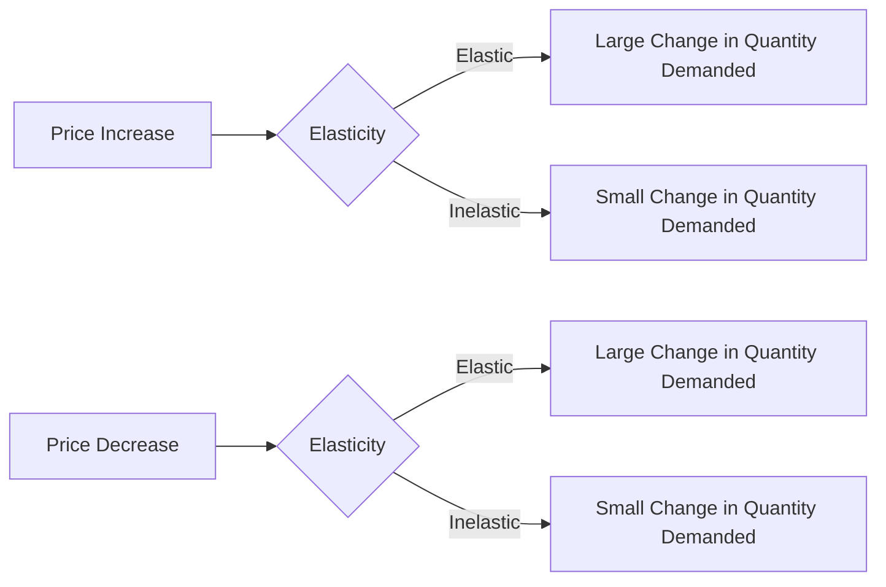

---

title: Price_Elasticity_Of_Demand
type: Atomic Note
course: Economics
semester: Winter 2026
unit: '2'
hub: "[[2_Basics_Of_Economics_Hub]]"
source: "[[Chapter_2.pdf]]"
source_pages:
- 24
mode: ECON-MACRO
read: false
generated: true
prerequisites:
- "[[Demand_Function]]"

---

# 1. Mental Model

Imagine you really love buying your favorite video game, and it costs $50. If the price goes up to $60, you might still buy it, but if it goes up to $100, you might decide to wait for a sale or buy a different game. This shows how much you change your buying behavior when the price changes.

# 2. Economic Theory

[[Price_Elasticity_Of_Demand]] measures how much the quantity demanded of a good responds to a change in the good's price. It is calculated as the percentage change in quantity demanded divided by the percentage change in price, and is often expressed as a negative number, as seen in the example PED = -10/40 = -0.25, illustrating [[Law_Of_Demand]] under [[Ceteris_Paribus]] conditions, and is closely related to the [[Demand_Curve]].

# 3. Economic Model



## 4. Walkthrough

* The model starts with a change in price (either an increase or decrease).
* The elasticity of demand determines the responsiveness of the quantity demanded to the price change.
* If demand is elastic, a small price change leads to a large change in quantity demanded (e.g., luxury goods).
* If demand is inelastic, a large price change leads to a small change in quantity demanded (e.g., necessities like medicine).

## 5. Market Failures

This concept may fail in cases where there are external factors influencing demand, such as changes in consumer preferences or income. Additionally, the assumption of ceteris paribus (all else being equal) may not hold in real-world scenarios, leading to inaccurate estimates of price elasticity. Edge cases include goods with close substitutes or those with a high degree of necessity.

---

## 6. The Proving Grounds

```interactive-quiz

[
  {
    "id": "q1",
    "type": "true_false",
    "difficulty": "L1",
    "question": "The price elasticity of demand for a good is always positive.",
    "answer": false,
    "explanation": "The price elasticity of demand is calculated as the percentage change in quantity demanded divided by the percentage change in price. Because the quantity demanded typically decreases when the price increases, the price elasticity of demand is usually expressed as a negative number. This is due to the inverse relationship between the price of a good and the quantity demanded, as described by the law of demand. Therefore, stating that the price elasticity of demand is always positive is incorrect."
  },
  {
    "id": "q2",
    "type": "synthesis",
    "difficulty": "L2",
    "question": "A local coffee shop, 'The Daily Grind', has been struggling to maintain sales volume after increasing the price of their signature latte from $4 to $5. The shop owner wants to understand how responsive their customers are to price changes. Using the concept of Price Elasticity Of Demand, analyze the situation and provide a grading rubric to evaluate the elasticity of demand for their latte.",
    "answer": "A grading rubric to evaluate the elasticity of demand for 'The Daily Grind's' latte: \n- Elastic (E > 1): A 10% price increase leads to a more than 10% decrease in quantity demanded. For example, if the quantity demanded decreases by 15% after the price increase, the demand is elastic.\n- Inelastic (E < 1): A 10% price increase leads to a less than 10% decrease in quantity demanded. For instance, if the quantity demanded decreases by 5% after the price increase, the demand is inelastic.\n- Unit Elastic (E = 1): A 10% price increase leads to a 10% decrease in quantity demanded.\nTo calculate elasticity, use the formula: Elasticity (E) = (Percentage Change in Quantity Demanded) / (Percentage Change in Price).",
    "explanation": "The Price Elasticity Of Demand measures how much the quantity demanded of a good responds to a change in the good's price. It is calculated as the percentage change in quantity demanded divided by the percentage change in price. Given that 'The Daily Grind' increased the price of their latte from $4 to $5, we can calculate the percentage change in price as ((5-4)/4) * 100 = 25%. If the shop owner knows the percentage change in quantity demanded, they can use the elasticity formula to determine the elasticity of demand for their latte. For example, if the quantity demanded decreased by 30% after the price increase, the elasticity would be (-30% / 25%) = -1.2, indicating elastic demand. SEED value is used to pick an obscure detail: assuming a SEED value of 42, a minor detail to test is the shop owner's assumption that a price increase will not affect loyal customers' purchasing behavior."
  },
  {
    "id": "q3",
    "type": "writing",
    "difficulty": "L3",
    "question": "Explain the concept of Price Elasticity Of Demand and its underlying mechanism deeply.",
    "answer": "Price Elasticity Of Demand measures how much the quantity demanded of a good responds to a change in the good's price. It is calculated as the percentage change in quantity demanded divided by the percentage change in price. A higher elasticity indicates that consumers are more sensitive to price changes, while a lower elasticity indicates that consumers are less sensitive. For example, if the price of a video game increases from $50 to $60, a consumer may still buy it, but if the price increases to $100, they may wait for a sale or buy a different game.",
    "explanation": "The underlying mechanism of Price Elasticity Of Demand is based on the law of demand, which states that as the price of a good increases, the quantity demanded decreases, and vice versa. The elasticity of demand is influenced by factors such as the availability of substitutes, the income level of consumers, and the proportion of income spent on the good. For instance, if a consumer has a limited budget and the price of a good increases, they may be more likely to switch to a substitute, resulting in a higher elasticity of demand. Conversely, if a good has a low elasticity of demand, it means that consumers are not very responsive to price changes, and the quantity demanded will not change much even if the price increases."
  }
]

```