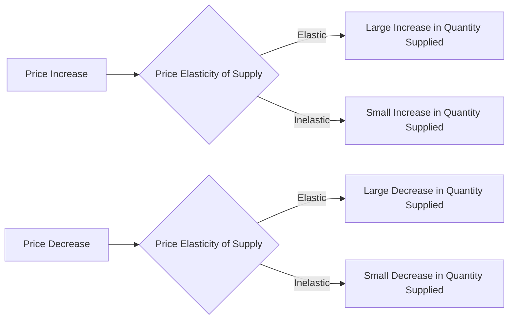

---

title: Price_Elasticity_Of_Supply
type: Atomic Note
course: Economics
semester: Winter 2026
unit: '2'
hub: "[[2_Theory_Of_Demand_And_Supply_Hub]]"
source: "[[5-Pdf Store/note generated/Winter 2026/Economics/Chapter_2.pdf]]"
source_pages:
- 47
- 48
mode: ECON-MACRO
read: false
generated: true
prerequisites:
- "[[Elasticity_Of_Supply]]"

---

# 1. Mental Model

Imagine you have a lemonade stand. The number of cups of lemonade you can make and sell depends on how much time you have and how much money you can spend on lemons and sugar. If the price of lemonade goes up, you might be willing to make more cups because you can earn more money. But if it's really hard to make more lemonade, like if you only have a small pitcher, you might not be able to make much more even if the price goes up. This is like the idea of [[Price_Elasticity_Of_Supply]], which measures how much more or less of something suppliers are willing to sell when the price changes.

# 2. Economic Theory

[[Price_Elasticity_Of_Supply]] is defined as the responsiveness of the quantity supplied of a good to a change in the price of the good, measured as the percentage change in quantity supplied divided by the percentage change in price. This concept is closely related to the [[Theory_Of_Demand]] and [[Law_Of_Demand]], but focuses on the supply side. The [[Price_Elasticity_Of_Supply]] formula is: $PES = \frac{\% \Delta Qs}{\% \Delta P}$. The underlying mechanism follows the [[Ceteris_Paribus]] assumption, which means that all other factors that affect supply, such as [[Change_In_Technology]] and [[Shift_In_Supply_Curve]], are held constant. [[Price_Elasticity_Of_Supply]] is influenced by factors such as the [[Determinants_Of_Elasticity_Of_Supply]], including the ease of production and the availability of inputs.

# 3. Market Failures

The [[Price_Elasticity_Of_Supply]] concept has limitations, particularly in situations where [[Market_Equilibrium]] is not achieved, such as in cases of [[Surplus_And_Shortage]]. Additionally, [[Price_Elasticity_Of_Supply]] assumes that suppliers have perfect knowledge of market conditions, which is not always the case. Furthermore, the concept ignores the [[Effects_Of_Shift_In_Demand_And_Supply]] on the overall market, which can lead to inefficiencies. In certain situations, such as when there are [[Substitute_Goods]] or [[Complementary_Goods]], [[Price_Elasticity_Of_Supply]] may not accurately capture the responsiveness of suppliers to price changes.

# 4. Economic Model



This flowchart illustrates how the price elasticity of supply affects the quantity supplied in response to changes in price. The diagram shows that if the supply is elastic, a price increase leads to a large increase in quantity supplied, while a price decrease leads to a large decrease in quantity supplied. If the supply is inelastic, changes in price lead to relatively small changes in quantity supplied.

## 5. Walkthrough

Here's a 5-step technical walkthrough of how the concept of Price Elasticity Of Supply operates:

1. **Initial State**: Suppose we have a lemonade stand with a initial price of $1 per cup and an initial quantity supplied of 100 cups per day. The price elasticity of supply is assumed to be 1.5, indicating an elastic supply.

2. **Price Increase**: The price of lemonade increases to $1.50 per cup. Using the price elasticity of supply formula, $PES = \frac{\% \Delta Qs}{\% \Delta P}$, we can calculate the percentage change in quantity supplied.

3. **Calculate Percentage Change in Price**: The percentage change in price is $\% \Delta P = \frac{1.50 - 1}{1} \times 100\% = 50\%$.

4. **Calculate Percentage Change in Quantity Supplied**: Given that $PES = 1.5$, we can rearrange the formula to solve for $\% \Delta Qs = PES \times \% \Delta P = 1.5 \times 50\% = 75\%$. This means the quantity supplied increases by 75%.

5. **New Quantity Supplied**: The new quantity supplied is $100 + (100 \times 75\%) = 175$ cups per day. This walkthrough demonstrates how a price increase leads to a large increase in quantity supplied when the supply is elastic.

---

## 6. The Proving Grounds

```interactive-quiz

[
  {
    "id": "q1",
    "type": "true_false",
    "difficulty": "L1",
    "question": "A critical failure point of 'Price Elasticity Of Supply' in Industrial Manufacturing & Robotics is that a small increase in price will always lead to a large increase in the quantity supplied of robotic parts.",
    "answer": false,
    "explanation": "The concept of Price Elasticity Of Supply (PES) is given by the formula: $PES = \\frac{\\% \\Delta Q_s}{\\% \\Delta P}$, where $Q_s$ is the quantity supplied and $P$ is the price. A critical failure point occurs when the PES is inelastic, meaning that a large increase in price leads to a small increase in quantity supplied. This can happen in Industrial Manufacturing & Robotics when production capacity is limited, or when there are supply chain constraints. Therefore, the statement that a small increase in price will always lead to a large increase in the quantity supplied of robotic parts is false, as it ignores the possibility of inelastic supply."
  },
  {
    "id": "q2",
    "type": "synthesis",
    "difficulty": "L2",
    "question": "The manufacturing plant of a leading robotics firm, Robotic Automation Inc., is facing a critical supply chain disruption. A key component, the 'Advanced Servo Motor' (ASM), used in the production of their flagship robot model, 'Automator X', has suddenly increased in price by 30% due to a supplier's production halt. The plant's production capacity is highly dependent on the timely delivery and cost of ASMs. The current production level is 1000 units of 'Automator X' per month. The management needs to decide whether to absorb the increased cost or pass it on to consumers by raising the price of 'Automator X'. If the price elasticity of supply for ASMs is 0.5, and assuming the plant's production function is highly inelastic in the short run, how should the management adjust the production level and price of 'Automator X' to minimize losses and maintain supply chain stability?",
    "answer": "To minimize losses and maintain supply chain stability, Robotic Automation Inc. should consider the following strategy:\n\nGiven the price elasticity of supply for ASMs is 0.5, this indicates that for every 1% increase in price, the quantity supplied of ASMs increases by 0.5%. With a 30% increase in the price of ASMs, the quantity supplied would increase by 15% (0.5 * 30%). However, the plant's production function is highly inelastic in the short run, meaning that it cannot quickly adjust its production level of 'Automator X' in response to changes in the price of ASMs.\n\nThe management should first attempt to negotiate with the supplier to mitigate the price increase or secure alternative suppliers to reduce dependence on a single supplier. In the short term, given the inelasticity of their production function, the firm might consider absorbing the increased cost of ASMs to maintain current production levels and avoid losing market share. Passing the increased cost on to consumers by raising the price of 'Automator X' could lead to a significant decline in demand, given that the demand for 'Automator X' is likely to be elastic.\n\nMathematically, the impact of the price increase on the quantity supplied can be represented as:\n\n$E_s = \\frac{\\% \\Delta Q_s}{\\% \\Delta P}$\n\nWhere:\n- $E_s = 0.5$\n- $\\% \\Delta P = 30%$\n\nSolving for $\\% \\Delta Q_s$:\n\n$0.5 = \\frac{\\% \\Delta Q_s}{30}$\n\n$\\% \\Delta Q_s = 0.5 \\times 30 = 15%$\n\nThus, the quantity supplied of ASMs increases by 15%, but due to the production function's inelasticity, the immediate impact on 'Automator X' production is limited.\n\nThe management should focus on long-term strategies such as diversifying suppliers, investing in inventory management, and potentially redesigning 'Automator X' to use alternative components that are less prone to supply chain disruptions.",
    "explanation": "The concept of Price Elasticity of Supply (PES) is crucial in understanding how the supply of a good responds to changes in its price. PES is defined as the ratio of the percentage change in quantity supplied to the percentage change in price, given by the formula:\n\n$PES = \\frac{\\% \\Delta Q_s}{\\% \\Delta P}$\n\nIn this scenario, the PES for ASMs is given as 0.5. This means that for every percentage point increase in the price of ASMs, the quantity supplied increases by 0.5 percentage points. When the price of ASMs increases by 30%, the quantity supplied increases by 15%, as calculated above.\n\nThe inelasticity of the plant's production function in the short run implies that the firm cannot quickly respond to changes in the price of inputs like ASMs by adjusting its output level. This situation can lead to supply chain instability if not managed properly.\n\nThe LaTeX representation of the PES formula highlights the direct relationship between the percentage changes in quantity supplied and price:\n\n$PES = \\frac{\\frac{Q_{s2} - Q_{s1}}{Q_{s1}}}{\\frac{P_2 - P_1}{P_1}}$\n\nWhere:\n- $Q_{s1}$ and $Q_{s2}$ are the initial and final quantity supplied,\n- $P_1$ and $P_2$ are the initial and final price.\n\nGiven the PES of 0.5, Robotic Automation Inc. must strategically manage its production and pricing to mitigate the effects of the ASM price increase, focusing on both short-term absorption of costs and long-term supply chain diversification and risk management."
  },
  {
    "id": "q3",
    "type": "writing",
    "difficulty": "L2",
    "question": "Explain the concept of Price Elasticity Of Supply in the context of Global Supply Chain & Maritime Logistics, and provide a scenario where it can be applied.",
    "answer": "Price Elasticity Of Supply measures the responsiveness of the quantity supplied of a good to a change in its price, calculated as the percentage change in quantity supplied divided by the percentage change in price. In Global Supply Chain & Maritime Logistics, this concept is crucial for understanding how changes in shipping rates or transportation costs affect the supply of goods. For instance, if the price of shipping a container from Asia to Europe increases, a supplier may choose to supply fewer containers if they can easily redirect their goods to other markets or if they have limited capacity. However, if the supplier has a high degree of flexibility in their logistics operations, they might be more willing to absorb the increased cost and maintain supply levels.",
    "explanation": "The price elasticity of supply can be expressed mathematically as $E_s = \\frac{\\% \\Delta Q_s}{\\% \\Delta P}$, where $E_s$ is the elasticity of supply, $\\% \\Delta Q_s$ is the percentage change in quantity supplied, and $\\% \\Delta P$ is the percentage change in price. In the context of global supply chain and maritime logistics, the elasticity of supply is influenced by factors such as the availability of shipping capacity, the lead time for transportation, and the supplier's ability to adjust production levels. A key concept related to price elasticity of supply is the idea of a supply curve, which can be represented as $Q_s = f(P)$, where $Q_s$ is the quantity supplied and $P$ is the price. The shape and position of the supply curve determine the price elasticity of supply, with steeper curves indicating lower elasticity and flatter curves indicating higher elasticity."
  },
  {
    "id": "q4",
    "type": "order",
    "difficulty": "L2",
    "question": "Order steps for calculating Price Elasticity Of Supply.",
    "steps": [
      "Calculate the percentage change in quantity supplied",
      "Calculate the percentage change in price",
      "Divide the percentage change in quantity supplied by the percentage change in price"
    ],
    "answer": [
      "Calculate the percentage change in quantity supplied",
      "Calculate the percentage change in price",
      "Divide the percentage change in quantity supplied by the percentage change in price"
    ]
  },
  {
    "id": "q5",
    "type": "trace",
    "difficulty": "L3",
    "question": "Error generating question.",
    "answer": "N/A"
  }
]

```