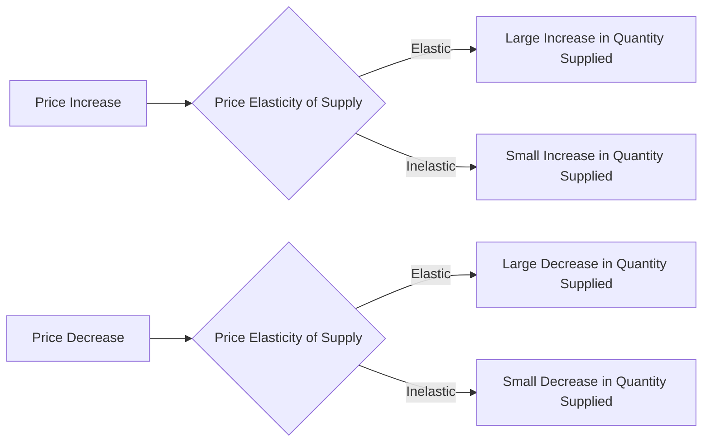

---

title: Price_Elasticity_Of_Supply
type: Atomic Note
course: Economics
semester: Winter 2026
unit: '2'
hub: "[[2_Theory_Of_Demand_And_Supply_Hub]]"
source: "[[5-Pdf Store/note generated/Winter 2026/Economics/Chapter_2.pdf]]"
source_pages:
- 47
- 48
mode: ECON-MACRO
read: false
generated: true
prerequisites:
- "[[Elasticity_Of_Supply]]"

---

# 1. Mental Model

Imagine you have a lemonade stand. The number of cups of lemonade you can make and sell depends on how much time you have and how much money you can spend on lemons and sugar. If the price of lemonade goes up, you might be willing to make more cups because you can earn more money. But if it's really hard to make more lemonade, like if you only have a small pitcher, you might not be able to make much more even if the price goes up. This is like the idea of [[Price_Elasticity_Of_Supply]], which measures how much more or less of something suppliers are willing to sell when the price changes.

# 2. Economic Theory

[[Price_Elasticity_Of_Supply]] is defined as the responsiveness of the quantity supplied of a good to a change in the price of the good, measured as the percentage change in quantity supplied divided by the percentage change in price. This concept is closely related to the [[Theory_Of_Demand]] and [[Law_Of_Demand]], but focuses on the supply side. The [[Price_Elasticity_Of_Supply]] formula is: $PES = \frac{\% \Delta Qs}{\% \Delta P}$. The underlying mechanism follows the [[Ceteris_Paribus]] assumption, which means that all other factors that affect supply, such as [[Change_In_Technology]] and [[Shift_In_Supply_Curve]], are held constant. [[Price_Elasticity_Of_Supply]] is influenced by factors such as the [[Determinants_Of_Elasticity_Of_Supply]], including the ease of production and the availability of inputs.

# 3. Market Failures

The [[Price_Elasticity_Of_Supply]] concept has limitations, particularly in situations where [[Market_Equilibrium]] is not achieved, such as in cases of [[Surplus_And_Shortage]]. Additionally, [[Price_Elasticity_Of_Supply]] assumes that suppliers have perfect knowledge of market conditions, which is not always the case. Furthermore, the concept ignores the [[Effects_Of_Shift_In_Demand_And_Supply]] on the overall market, which can lead to inefficiencies. In certain situations, such as when there are [[Substitute_Goods]] or [[Complementary_Goods]], [[Price_Elasticity_Of_Supply]] may not accurately capture the responsiveness of suppliers to price changes.

# 4. Economic Model



This flowchart illustrates how the price elasticity of supply affects the quantity supplied in response to changes in price. The diagram shows that if the supply is elastic, a price increase leads to a large increase in quantity supplied, while a price decrease leads to a large decrease in quantity supplied. If the supply is inelastic, changes in price lead to relatively small changes in quantity supplied.

## 5. Walkthrough

Here's a 5-step technical walkthrough of how **Price Elasticity of Supply** (PES) operates in the **Agricultural Market (Fresh Berries)**:

1. **Equilibrium State**: In a local market, organic berries are priced at $5.00 per basket. Farmers supply 1,000 baskets per week.

2. **Price Variable Change**: Due to a sudden surge in health-trend popularity, the market price jumps to $10.00 (a 100% increase).

3. **Short-Run Constraint**: Farmers want to supply more, but the berries are already planted and ripening. They can only increase supply slightly by harvesting more intensively. The weekly quantity supplied rises to only 1,100 baskets (a 10% increase).

4. **Coefficient Calculation**: 
   - $\% \Delta Q_s = +10\%$
   - $\% \Delta P = +100\%$
   - $PES = 10\% / 100\% = 0.1$

5. **Analytical Interpretation**: Since $PES < 1.0$, the supply is **Inelastic** in the short run. Even a doubling of price results in only a marginal increase in supply due to biological and time-bound production constraints.

---

## 6. The Proving Grounds

```interactive-quiz
[
  {
    "id": "q1",
    "type": "mcq",
    "difficulty": "L1",
    "question": "Which of the following is the most likely $PES$ coefficient for a product that is highly automated and can be scaled instantly?",
    "options": {
      "A": "$0.2$ (Inelastic).",
      "B": "$0.5$ (Inelastic).",
      "C": "$1.0$ (Unit Elastic).",
      "D": "$4.5$ (Highly Elastic)."
    },
    "answer": "D",
    "explanation": "Supply is highly elastic ($PES > 1$) when firms can easily and quickly adjust their production levels in response to price changes."
  },
  {
    "id": "q2",
    "type": "true_false",
    "difficulty": "L2",
    "question": "The Price Elasticity of Supply is typically more elastic in the 'Long Run' than in the 'Short Run'.",
    "answer": true,
    "explanation": "In the long run, firms have more time to expand factory capacity, hire more labor, and overcome fixed production constraints, making them more responsive to price signals."
  },
  {
    "id": "q3",
    "type": "synthesis",
    "difficulty": "L3",
    "question": "Explain how the 'Availability of Input Substitutes' affects a firm's $PES$.",
    "answer": "If a firm can easily switch between raw materials or labor types (high input substitutability), it can pivot its production process faster when prices rise. This increased flexibility leads to a higher (more elastic) $PES$ compared to a firm dependent on a single, rare resource.",
    "explanation": "Synthesis requires linking production flexibility (inputs) to the resulting responsiveness of the supply curve."
  },
  {
    "id": "q4",
    "type": "trace",
    "difficulty": "L2",
    "question": "Trace the impact on the quantity supplied of 'Solar Panels' if the market price rises by 30% and the industry has a $PES$ of 2.0.",
    "answer": "1) Market price increases by 30%. 2) The industry recognizes the price signal. 3) Given $PES = 2.0$, the percentage change in quantity is twice the price change. 4) Quantity supplied increases by 60% (30% * 2). 5) Producers likely add extra shifts or open mothballed facilities.",
    "explanation": "Tracing requires using the $PES$ coefficient as a multiplier for the price signal to determine the output response."
  },
  {
    "id": "q5",
    "type": "order",
    "difficulty": "L2",
    "question": "Order these goods from **Most Inelastic Supply** to **Most Elastic Supply**.",
    "steps": [
      "Residential Real Estate in a crowded city (Land is fixed)",
      "Digital Software Licenses (Zero marginal cost to produce more)",
      "Custom-built Luxury Yachts (Long production time)"
    ],
    "answer": [
      "Residential Real Estate in a crowded city (Land is fixed)",
      "Custom-built Luxury Yachts (Long production time)",
      "Digital Software Licenses (Zero marginal cost to produce more)"
    ],
    "explanation": "Inelasticity is driven by physical or time constraints. Real estate is limited by land; yachts by labor-intensive time; software has virtually infinite elasticity."
  }
]
```