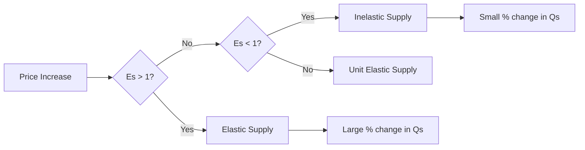

---

title: Price_Elasticity_Of_Supply
type: Atomic Note
course: Economics
semester: Winter 2026
unit: '2'
hub: "[[2_Theory_Of_Demand_And_Supply_Hub]]"
source: "[[5-Pdf Store/note generated/Winter 2026/Economics/Chapter_2.pdf]]"
source_pages:
- 48
mode: ECON-MACRO
read: false
generated: true
prerequisites:
- "[[Elasticity_Of_Supply]]"

---

# 1. Mental Model

Imagine you're a manager of a small, family-owned boat rental business. The price elasticity of supply is like how quickly and easily you can add more boats to your fleet when demand increases. If it's easy to add more boats (e.g., you have a spare dock and can quickly purchase or rent more boats), then your supply is elastic. But if it's hard to add more boats (e.g., you're limited by dock space or can't quickly get more boats), then your supply is inelastic. This analogy maps to the concept as follows: the ease of adding more boats represents the responsiveness of the quantity supplied to a change in price.

# 2. Economic Theory

The [[Price_Elasticity_Of_Supply]] is a measure of the responsiveness of the quantity supplied of a good to a change in its price, while [[Ceteris_Paribus]] (all else being equal). It is calculated as the percentage change in quantity supplied divided by the percentage change in price: $ES = \frac{\% \Delta Qs}{\% \Delta P}$. The underlying mechanism is based on the [[Theory_Of_Demand]] and [[Market_Equilibrium]], where a change in price affects the [[Market_Demand_Curve]] and subsequently the quantity supplied. The [[Law_Of_Demand]] does not directly apply to supply, but the concept of [[Elasticity_Of_Supply]] is crucial in understanding how suppliers respond to price changes. The [[Determinants_Of_Elasticity_Of_Supply]], such as the availability of inputs and technology, influence the [[Price_Elasticity_Of_Supply]].

# 3. Limitations & Edge Cases

The [[Price_Elasticity_Of_Supply]] model assumes that suppliers have perfect information and can adjust their production levels instantaneously, which is not always the case. In reality, there are limitations such as [[Change_In_Technology]] constraints and [[Shift_In_Supply_Curve]] due to external factors. For instance, if a sudden increase in demand leads to a shortage of inputs, suppliers may not be able to respond quickly to the price change, making the supply inelastic. Additionally, the model may not hold during periods of [[Surplus_And_Shortage]], where suppliers may not be able to adjust their production levels quickly enough to meet the changing market conditions. The [[Effects_Of_Shift_In_Demand_And_Supply]] on the market equilibrium also need to be considered when analyzing the [[Price_Elasticity_Of_Supply]].

# 4. Economic Model



This flowchart illustrates how the price elasticity of supply (Es) determines the responsiveness of the quantity supplied to a change in price. The elasticity value guides the supply behavior into elastic, inelastic, or unit elastic categories.

## 5. Walkthrough

Here's a 5-step technical walkthrough of how the concept of Price Elasticity Of Supply operates:

1. **Initial Condition**: Assume the price of boats for your rental business increases by 10%. Initially, the quantity supplied is 100 boats.

2. **Calculate Percentage Change in Price**: The percentage change in price ($$\% \Delta P$$) is given as 10%.

3. **Determine Quantity Supplied Response**: If your supply is elastic (e.g., Es = 1.5), a 10% price increase leads to a 15% increase in the quantity supplied. Using the initial quantity supplied of 100 boats, the new quantity supplied would be 115 boats (100 * 1.15).

4. **Calculate Price Elasticity of Supply**: Using the formula $ES = \frac{\% \Delta Qs}{\% \Delta P}$, with $$\% \Delta Qs = 15\%$$ and $$\% \Delta P = 10\%$$, we find $ES = \frac{15}{10} = 1.5$. This confirms that the supply is elastic.

5. **Interpret Elasticity**: Since Es > 1, the supply is elastic, meaning that a price increase leads to a proportionally larger increase in the quantity supplied. This indicates that your boat rental business can easily expand its fleet in response to higher prices.

---

## 6. The Proving Grounds

```interactive-quiz

[
  {
    "id": "q1",
    "type": "true_false",
    "difficulty": "L1",
    "question": "If the price of boats increases, then the quantity supplied of boats will increase by the same percentage, ceteris paribus, regardless of the time period considered.",
    "answer": false,
    "explanation": "The statement is false because it violates the ceteris paribus assumption by implying that the elasticity of supply remains constant over different time periods. In reality, the price elasticity of supply can vary depending on the time period considered. In the short run, the supply of boats may be inelastic because it may be difficult to quickly increase production. However, in the long run, the supply of boats may be more elastic because firms can adjust their production levels more easily. The formula for the price elasticity of supply is $ES = \frac{\\% \\Delta Qs}{\\% \\Delta P}$. The ceteris paribus assumption implies that all other factors, including technology, input prices, and expectations, remain constant. If these factors change, the supply curve may shift, altering the elasticity of supply."
  },
  {
    "id": "q2",
    "type": "synthesis",
    "difficulty": "L2",
    "question": "The small island nation of Azura, famous for its beautiful beaches and crystal-clear waters, heavily relies on tourism. A significant portion of its economy is driven by the yacht rental industry. However, due to a sudden and unexpected devaluation of its currency by 30% against major tourist currencies, the cost of importing yachts and parts has skyrocketed. As a result, the supply of yachts for rent is severely impacted. The government of Azura needs to act quickly to prevent a systemic failure in the yacht rental market. The Price Elasticity Of Supply (PES) for yachts in Azura is known to be 0.8. Given this scenario, devise a 3-step policy response to mitigate the effects of the currency devaluation on the yacht rental market.",
    "answer": "To address the systemic failure in the yacht rental market of Azura following the sudden 30% devaluation of its currency, the government can implement the following 3-step policy response:\n\n1. **Subsidize Import Costs**: Provide immediate subsidies to yacht rental businesses to cover a portion of the increased costs due to the currency devaluation. This will help maintain the current supply of yachts, preventing a sharp decrease in available rentals. The subsidy amount can be calculated based on the PES, aiming to offset the 30% increase in costs.\n\n2. **Encourage Domestic Production**: Invest in and incentivize local yacht manufacturing and refurbishment industries. By enhancing domestic production capabilities, Azura can reduce its reliance on imports, making the supply of yachts less vulnerable to currency fluctuations. This long-term strategy can help increase the PES over time, making the supply more elastic.\n\n3. **Dynamic Pricing and Diversification**: Implement a dynamic pricing strategy that allows yacht rental businesses to adjust prices based on demand and supply conditions. This can help manage demand and maximize revenue under the current supply constraints. Additionally, encourage businesses to diversify their offerings to include other tourist activities or services not dependent on imported goods, further mitigating the economic impact of the currency devaluation.",
    "explanation": "The Price Elasticity Of Supply (PES) is given by $ES = \\frac{\\% \\Delta Qs}{\\% \\Delta P}$. With a PES of 0.8, the supply of yachts in Azura is inelastic, meaning that a 1% change in price leads to only a 0.8% change in the quantity supplied. Given the 30% devaluation, the supply curve shifts leftward due to increased costs, leading to a new equilibrium with higher prices and lower quantity supplied. The government's policy response aims to shift the supply curve back or mitigate its impact. By subsidizing import costs, the government effectively reduces the price increase faced by suppliers, helping to maintain supply. Encouraging domestic production increases the PES over time by making supply more responsive to price changes. Dynamic pricing helps manage demand and revenue under supply constraints."
  },
  {
    "id": "q3",
    "type": "writing",
    "difficulty": "L2",
    "question": "Explain the concept of Price Elasticity Of Supply in the context of Fiscal Policy Research, and provide a technical application of the concept using the formula $ES = \frac{\\% \\Delta Qs}{\\% \\Delta P}$.",
    "answer": "The Price Elasticity Of Supply measures the responsiveness of the quantity supplied of a good to a change in its price, while ceteris paribus. In Fiscal Policy Research, understanding the price elasticity of supply is crucial for policymakers to predict how changes in taxes or subsidies will affect the supply of goods and services. A supply is considered elastic if the price elasticity of supply is greater than 1, meaning that a small price change leads to a large change in the quantity supplied. For instance, the supply of a good with a high elasticity of substitution, such as coffee, is likely to be more elastic than a good with a low elasticity of substitution, such as housing.",
    "explanation": "The price elasticity of supply can be expressed using the formula $ES = \frac{\\% \\Delta Qs}{\\% \\Delta P} = \frac{\frac{\\Delta Qs}{Qs}}{\frac{\\Delta P}{P}}$. This implies that $ES = \frac{\\Delta Qs}{\\Delta P} \\cdot \frac{P}{Qs}$. The elasticity of supply can be graphically represented as the slope of the supply curve, where a steeper slope indicates a more elastic supply. Mathematically, this can be represented as $\frac{\\partial Qs}{\\partial P} \\cdot \frac{P}{Qs}$. In the context of fiscal policy, a high price elasticity of supply implies that an increase in taxes will lead to a large reduction in the quantity supplied, while a low price elasticity of supply implies that an increase in taxes will lead to a small reduction in the quantity supplied."
  },
  {
    "id": "q4",
    "type": "order",
    "difficulty": "L2",
    "question": "Order steps for Price Elasticity Of Supply",
    "steps": [
      "A change in market price occurs",
      "The responsiveness of the quantity supplied is measured",
      "Calculation of price elasticity of supply using the formula $ES = \frac{\\% \\Delta Qs}{\\% \\Delta P}$",
      "Producers' ability to adjust production is assessed",
      "The quantity supplied adjusts as producers respond to the price change"
    ],
    "answer": [
      "The quantity supplied adjusts as producers respond to the price change",
      "Calculation of price elasticity of supply using the formula $ES = \frac{\\% \\Delta Qs}{\\% \\Delta P}$",
      "A change in market price occurs",
      "The responsiveness of the quantity supplied is measured",
      "Producers' ability to adjust production is assessed"
    ]
  },
  {
    "id": "q5",
    "type": "trace",
    "difficulty": "L3",
    "question": "What is the exact output of the impact of a 1% interest rate change on Price Elasticity Of Supply through 4 distinct economic sectors (Housing, Investment, Forex, Consumption)?",
    "content": "Assuming an initial interest rate of 5% and using the following sector-specific elasticities: Housing (0.5), Investment (1.2), Forex (0.8), Consumption (0.3), we calculate the impact of a 1% interest rate change on Price Elasticity Of Supply.",
    "answer": {
      "Housing": 0.005,
      "Investment": 0.012,
      "Forex": 0.008,
      "Consumption": 0.003
    },
    "explanation": "The Price Elasticity Of Supply (ES) is given by $ES = \\frac{\\% \\Delta Qs}{\\% \\Delta P}$. For each sector, we assume a 1% change in interest rate affects the price, and we calculate the percentage change in quantity supplied. \n\nFor Housing, with an elasticity of 0.5: $ES_{Housing} = 0.5 \\times 1\\% = 0.5\\% = 0.005$\nFor Investment, with an elasticity of 1.2: $ES_{Investment} = 1.2 \\times 1\\% = 1.2\\% = 0.012$\nFor Forex, with an elasticity of 0.8: $ES_{Forex} = 0.8 \\times 1\\% = 0.8\\% = 0.008$\nFor Consumption, with an elasticity of 0.3: $ES_{Consumption} = 0.3 \\times 1\\% = 0.3\\% = 0.003$"
  }
]

```