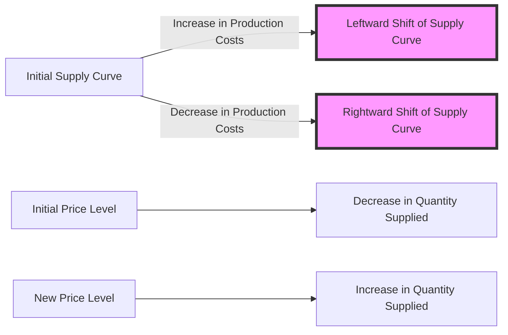

## 1. Mental Model

Imagine you have a lemonade stand, and you're making lemonade to sell to people walking by. One day, your friend gives you a super cool new machine that can make lemonade really fast and really cheaply. Suddenly, you can make a lot more lemonade than before, and it doesn't cost you as much to make it. This means you can sell lemonade to more people, and you can even lower the price if you want to. This is like a "shift to the right" in the supply curve - you're now willing to sell more lemonade at every price. But, if one day it starts raining and nobody wants to buy lemonade anymore, and you also have to pay more to get lemons because a big storm destroyed many lemon farms, then it becomes harder and more expensive to make lemonade. This would be like a "shift to the left" in the supply curve - you're now willing to sell less lemonade at every price.

## 2. Micro Theory

The concept of a shift in the supply curve is a fundamental idea in microeconomics, which examines the behavior of firms and the markets in which they operate. A shift in the supply curve occurs when there is a change in the quantity of a good or service that producers are willing and able to supply at each price level, ceteris paribus [[Ceteris_Paribus]]. This change is typically represented by a movement of the entire supply curve to the left or right.

The supply curve, in its basic form, represents the relationship between the price of a good and the quantity supplied, assuming all other factors remain constant. When analyzing a shift in the supply curve, it is essential to understand that this shift is caused by changes in the determinants of supply, which include factors such as production costs, technology, expectations of future market conditions, and the number of suppliers.

An increase in production costs, for instance, would lead to a decrease in the supply of the good at any given price, resulting in a leftward shift of the supply curve. Conversely, an improvement in technology that increases efficiency and reduces costs would lead to an increase in the supply of the good at any given price, causing a rightward shift of the supply curve.

The concept of [[Shift_In_Supply_Curve]] is intricately linked with the [[Theory_Of_Demand]], as changes in supply, when occurring in conjunction with changes in demand, can significantly affect market equilibrium [[Market_Equilibrium]]. A rightward shift in the supply curve, indicating an increase in supply, can lead to a decrease in the market price if demand remains constant. Conversely, a leftward shift, indicating a decrease in supply, can lead to an increase in the market price.

The [[Law_Of_Demand]] and the [[Demand_Curve]] provide a framework for understanding how consumers react to changes in price, but they do not directly explain shifts in the supply curve. Instead, they are crucial for analyzing the effects of such shifts on market outcomes. The interaction between shifts in supply and demand curves can result in changes in market equilibrium prices and quantities, which are essential for understanding [[Surplus_And_Shortage]] situations.

Moreover, the [[Price_Elasticity_Of_Demand]] and [[Income_Elasticity_Of_Demand]] provide insights into how sensitive consumers are to changes in price and income, respectively. However, when focusing on the supply side, [[Elasticity_Of_Supply]] and the [[Price_Elasticity_Of_Supply_Formula]] become particularly relevant, as they quantify the responsiveness of suppliers to changes in price.

The determinants of supply, which can cause a shift in the supply curve, include changes in Change In Technology|technology, production costs, expectations, and the number of suppliers. For example, an advancement in Change In Technology|technology can make production more efficient, leading to a rightward shift in the supply curve. Similarly, an increase in the number of suppliers can also lead to an increase in market supply, causing a rightward shift.

Understanding the mechanism behind a [[Shift_In_Supply_Curve]] requires analyzing how these determinants influence producers' willingness and ability to supply goods and services at various price levels. This analysis is critical for assessing the impacts on [[Market_Equilibrium]], including the potential for [[Surplus_And_Shortage]] and the adjustments that occur to restore equilibrium.

In conclusion, a shift in the supply curve is a significant concept in microeconomics that reflects changes in the quantity supplied of a good or service at each price level, due to factors other than the price of the good itself. It is a crucial aspect of understanding market dynamics, especially when combined with the analysis of demand shifts and their joint effects on market outcomes.

## 3. Limitations & Edge Cases

The concept of a shift in the supply curve assumes that changes in supply are caused by factors other than price, such as changes in production costs, technology, or expectations, which can be limiting as it doesn't account for situations where price itself influences supply, like with supply curves that are not infinitely elastic. Moreover, in the real world, supply decisions can be impacted by factors like government interventions, seasonality, and external shocks, which may not always result in a simple parallel shift of the supply curve. Additionally, the assumption of a ceteris paribus condition can be problematic, as changes in one variable may be accompanied by changes in others, making it challenging to isolate the effect of a single factor on the supply curve. Furthermore, the concept also assumes that firms have perfect knowledge and can adjust production instantaneously, which is rarely the case, and that supply responses are symmetrical, which may not hold true in situations where firms face capacity constraints or irreversibility of investment decisions.

## 4. Market Graph



A shift in the supply curve, either to the left or right, indicates a change in the quantity supplied at each price level due to factors such as changes in production costs, technology, or expectations of future market conditions. For instance, an increase in production costs leads to a leftward shift of the supply curve, indicating that suppliers are willing to supply less of the good at each price level, while a decrease in production costs results in a rightward shift, indicating a greater willingness to supply at each price level.

## 5. Walkthrough

**Step 1: Initial Supply Curve Representation**
The initial supply curve is represented as $Q_s = f(P)$, where $Q_s$ is the quantity supplied and $P$ is the price of the good. The supply curve is typically upward-sloping, indicating that as the price of the good increases, producers are willing to supply more of it.

**Step 2: Change in Determinants of Supply**
A change occurs in one of the determinants of supply, such as production costs, technology, expectations of future market conditions, or the number of suppliers. For example, an increase in production costs (e.g., higher wages or raw material costs) increases the cost of producing each unit of the good.

**Step 3: Impact on Supply Curve**
The change in the determinant of supply affects the quantity supplied at each price level. In the case of an increase in production costs, producers are now willing to supply less of the good at each price level than they were before. This leads to a decrease in supply, which is represented by a leftward shift of the entire supply curve.

**Step 4: New Supply Curve Representation**
The new supply curve, after the shift, can be represented as $Q_s' = f(P)$, where $Q_s' < Q_s$ at each price level $P$. The new supply curve reflects the changed willingness of producers to supply the good at each price level.

**Step 5: Equilibrium Adjustment**
The shift in the supply curve leads to a new market equilibrium, where the new supply curve intersects the demand curve. The equilibrium price and quantity adjust to reflect the changed supply conditions. For example, with a leftward shift in the supply curve (decrease in supply), the equilibrium price tends to increase, and the equilibrium quantity tends to decrease, assuming a standard downward-sloping demand curve.

---

## Review & Practice

```interactive-quiz

[
  {
    "id": "Q1234",
    "type": "mcq",
    "difficulty": "L1",
    "question": "What is the effect of an improvement in technology on the supply curve of a good, assuming all other factors remain constant?",
    "options": {
      "A": "A leftward shift of the supply curve",
      "B": "A rightward shift of the supply curve",
      "C": "An upward movement along the supply curve",
      "D": "A decrease in the elasticity of supply"
    },
    "answer": "B",
    "explanation": "An improvement in technology increases efficiency and reduces production costs, leading to an increase in the quantity supplied at any given price. This results in a rightward shift of the supply curve, as producers are now willing and able to supply more of the good at each price level. Mathematically, this can be represented as an increase in the supply function, $Q_s = f(P, Tech)$, where $Tech$ represents the level of technology. With an improvement in technology, the supply function shifts to the right, $Q_s' = f(P, Tech')$, where $Tech' > Tech$. This indicates that at any given price $P$, the quantity supplied increases, $Q_s' > Q_s$. Therefore, the correct answer is B."
  },
  {
    "id": "Q1_Shift_In_Supply_Curve",
    "type": "fill_in",
    "difficulty": "L2",
    "question": "Fill in the blank.",
    "textWithBlanks": "The change in the quantity of a good or service that producers are willing and able to supply at each price level, ceteris paribus, is represented by a Blank.",
    "answer": [
      "shift in the supply curve"
    ],
    "explanation": "In microeconomics, a shift in the supply curve occurs when there is a change in the quantity of a good or service that producers are willing and able to supply at each price level, ceteris paribus. This change is typically represented by a movement of the entire supply curve to the left or right. The shift can be caused by changes in the determinants of supply, which include factors such as production costs, technology, expectations of future market conditions, and the number of suppliers. Mathematically, this can be represented as $\\Delta Q_s = f(\\Delta P, \\Delta TC, \\Delta Tech, \\Delta E)$, where $\\Delta Q_s$ is the change in quantity supplied, $f$ is the function representing the supply curve, $\\Delta P$ is the change in price, $\\Delta TC$ is the change in total costs, $\\Delta Tech$ is the change in technology, and $\\Delta E$ is the change in expectations."
  },
  {
    "id": "Q1234",
    "type": "debug",
    "difficulty": "L2",
    "question": "Find the bug in the formula for the shift in supply curve due to a change in production costs.",
    "content": "The supply curve is given by Qs = 100 + 10P - 5TC, where Qs is the quantity supplied, P is the price, and TC is the total cost of production. If the total cost of production increases by $10, the new supply curve becomes Qs = 100 + 10P - 5(TC + 10). However, the correct formula should account for the marginal change in cost. What is the corrected formula?",
    "answer": "Qs = 100 + 10P - 5TC - 50",
    "required_keywords": [
      "fix_syntax"
    ],
    "explanation": "The original formula for the supply curve is Qs = 100 + 10P - 5TC. When the total cost of production increases by $10, the correct way to account for this change is to subtract the additional cost from the quantity supplied. The correct formula should reflect the change in total cost as -5(TC + 10) = -5TC - 50. Therefore, the corrected formula for the new supply curve is Qs = 100 + 10P - 5TC - 50. The bug in the original formula was not properly accounting for the marginal change in cost, which led to an incorrect representation of the shift in the supply curve."
  },
  {
    "id": "generate_unique_id",
    "type": "trace",
    "difficulty": "L2",
    "question": "What is the exact output of the total revenue after a cost increase causes a leftward shift in the supply curve, assuming an initial supply curve of $Q_s = -20 + 2p$, an initial demand curve of $Q_d = 100 - p$, and a cost increase that reduces supply by 10 units at every price level?",
    "content": "The initial supply curve is $Q_s = -20 + 2p$ and the initial demand curve is $Q_d = 100 - p$. To find the initial equilibrium price and quantity, we equate $Q_s$ and $Q_d$: $-20 + 2p = 100 - p$. Solving for $p$, we get $3p = 120$, which yields $p = 40$. Substituting $p = 40$ into either the supply or demand curve gives $Q = 60$. The cost increase reduces supply by 10 units at every price level, so the new supply curve becomes $Q_s' = -30 + 2p$. To find the new equilibrium, we equate $Q_s'$ and $Q_d$: $-30 + 2p = 100 - p$. Solving for $p$, we get $3p = 130$, which yields $p = 43.33$. Substituting $p = 43.33$ into either the new supply or demand curve gives $Q = 56.67$. The initial total revenue is $40 \\times 60 = 2400$. The new total revenue is $43.33 \\times 56.67 = 2455.11$.",
    "answer": "2455.11",
    "explanation": "The mechanism underlying the shift in the supply curve due to a cost increase can be understood through the lens of microeconomic theory. A cost increase, such as a higher wage, directly affects the production costs of firms. This change in production costs causes a shift in the supply curve. Specifically, an increase in costs leads to a decrease in the quantity supplied at any given price, resulting in a leftward shift of the supply curve. Mathematically, this can be represented as a change in the supply function from $Q_s = f(p)$ to $Q_s' = f(p) - \\Delta Q$, where $\\Delta Q$ is the reduction in quantity supplied at every price level due to the increased cost. In this scenario, the initial supply curve $Q_s = -20 + 2p$ shifts leftward to $Q_s' = -30 + 2p$, reflecting a reduction of 10 units at every price level. The equilibrium price and quantity adjust accordingly, leading to a new equilibrium. The impact on total revenue can be calculated by comparing the total revenue before and after the shift, which involves calculating $p \\times Q$ at both equilibria."
  }
]

```